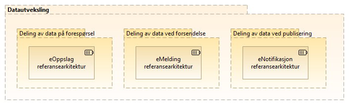

:lang: no
:doctitle: Nasjonale  referansearkitekturer
:keywords: TBD

:toclevels: 3

include::../plattform_felles/includes/commonincludes.adoc[]

[.lead]
Arbeid med prioriterte nasjonale referansearkitekturer er et pågående samarbeid mellom Difi og flere andre virksomheter innen offentlig og privat sektor.

:leveloffset: +1
= Introduksjon
Referansearkitekturer gir mønstre og veiledning til utforming av arkitekturer og løsninger innen avgrensede områder.

De nasjonale referansearkitekturene bygger på link:../nab_referanse_arkitekturer/grunnleggende-referansearkitekturer.adoc[Grunnleggende referansearkitekturer] fra EU og amdre kilder, men er tilpasset norske aktører og fellesløsninger.

Prioritering av arbeidet og utarbeidelsen av referansearkitekturer gjøres i samarbeid med aktører på tvers av offentlig og privat sektor nasjonalt og internasjonalt. 

Det legges vekt på å få fram nyttig veiledning, med alt fra gode eksempler til beste praksis og konkrete anbefalinger. 

Nasjonale referansearkitekturer identifiseres ut fra en link:../nab_arkitekturlandskap[nedbrytning av nasjonal arkitektur i temaområder og kapabiliteter i arkitekturlandskapet]. Både kapabilitetskart og prioriterte referansearkitekurer innen hvert område vil utvikles over tid, etterhvert som en går inn på nye områder. 

Relatert informasjon:

. link:../nab_overordnet-metode[Overordnet metode, bakgrunnsinformasjon]

. link:../nab_arkitekturlandskap[Arkitekturlandskap, temaområder og kapabiliteter]

. link:../nab_referanse_arkitekturer_grunnleggende/book-grunnleggende-referansearkitekturer.adoc[Grunnleggende referansearkitekturer]

= Aktuelle referansearkitekturer
Følgende figur viser en  oversikt over områder og referansearkitekturer som så langt dekkes.

// image:../plattform_felles/media/i-arbeid.png[width=45, height=45] _Denne oversikten er i arbeid (høst 2019)_

.Aktuelle referansearkitekturer

NOTE: Referansearkitekturer er også aktuelt for flere andre temaområder innen nasjonalarkitektur. Planer for dette er under utarbeidelse (høst 2019).

////
= Funksjonsområder for referansearkitekturer (kapabiliteter)
include::../nab_referanse_arkitekturer/kapabilitetsområder.adoc[]
////

= Aktuelle referansearkitekturer
//include::../nab_referanse_arkitekturer_datautveksling/book-ra-datautveksling.adoc[]

link:../nab_referanse_arkitekturer_datautveksling/[Referansearkitekturer for datautveksling]

//== Informasjonssikkerhet (felles)

//include::../nab_referanse_arkitekturer_informasjonssikkerhet/main.adoc[]

////
= Beskrivelse av referansearkitektur for deling av data på forespørsel 
include::deling_forespørsel.adoc[]
//// 

:leveloffset!:
:leveloffset: +1
= Tverrgående temaer
//include::../nab_referanse_arkitekturer_tverrgående_tema/book-tverrgående-tema.adoc[]

////
== Informasjonssikkerhet
:leveloffset: +1
include::../nab_referanse_arkitekturer/informasjonssikkerhet.adoc[]
////

////
= Veiledning til valg av referansearkitekturer

include::../nab_referanse_veiledning_valg-av-referansearkitekturer/book-valg-av-referansearkitektur.adoc[]
////

