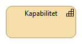

:lang: no
:doctitle: Funksjonsområder for referansearkitekturer (kapabilitetsområder) 
:keywords: Referansearkitekturer

include::../plattform_felles/includes/commonincludes.adoc[]

== Generelt

****
Kapabilitet - En evne en organisasjon, person eller et system innehar.
Kapabiliteter er typisk uttrykt med generelle termer og på
høyt nivå, og krever vanligvis en kombinasjon av
organisasjon, mennesker, prosesser og teknologi for å
oppnås.

****

== Informasjonsutveksling
=== Introduksjon

//Henrik: Fremheve behovet for tilgjengelighet til data/informasjon for å ta ut potensialet? Dreier referansearkitetkurer for informasjonsutveksling seg mest om tilgjengelighet?

Referansearkitekturene for _informasjonsutveksling_ er gruppert i fem områder som er satt sammen av utvalgte kapabiliteter. Dette er gjort for å dele opp informasjonsutveksling i områder som er håndterbare. De fem områdene er:

//Henrik: Skal vi skrive om til tre med bakgrunn i at vi endrer på dette med modellen under?
* Deling av data ved forsendelse
* Deling av data på forespørsel
* Hendelsesdrevet deling av data
* Oppdatere av data
* Tilbakemelding på data

I tillegg til de fem kapabilitetsområdene vil det være en del overgripende temaer blant annet tilknyttet informasjonssikkerhet. De fem områdene vil også bygge på hverandre hvor deling ved forsendelse og forespørsel er de to grunnleggende måtene å dele data og informasjon på.

Hvert av områdene vil støttes av en referansearkitektur og det er en overordnet metode for å identifisere hvilken referansearkitektur som passer til det respektive samhandlingsbehovet.

De tre første områdene omhandler ulike mønstre for deling av data:

image:./media/Referansearkitekturer deling av data.png[alt="Bilde mangler", width=750]

De to neste handler om oppdatering og tilbakemelding på data. Dette er foreløpig et mer umodent område:

image:./media/Referansearkitekturer oppdatering.png[alt="Bilde mangler", width=750]

=== Deling av data ved forsendelse
Dette er deling av informasjon og data initiert av avsender. Det vil normalt være behov og/eller forventning om oppfølging fra mottaker. 

Eksempler kan være å sende en faktura hvor det forventes at mottaker behandler denne, eller en henvisning i helsesektoren hvor det forventes at mottaker tar ansvar for videre oppfølging av pasienten det gjelder. 

Ved deling av data ved forsendelse må avsender ha visshet om at mottaker kan motta og behandle meldingen/informasjonen som sendes.

Deling av data ved forsendelse er foreløpig beskrevet i Nasjonal referansearkitektur og strategi for eMelding.

=== Deling av data på forespørsel
Deling av data initiert av databruker. Dette kan være å spørre om data gjennom en tjeneste/API eller å lese åpne publiserte data. Ved å lese publiserte data menes for eksempel åpne data på data.norge.no eller datasett som legges fritt tilgjengelig på nettet. Et eksempel på det siste er valutakurser fra Norges bank.

Data gjennom en tjeneste/API kan gi mer avanserte tilganger for spørring i datasett med ulike metoder og tilgangsnivåer. Dette vil være måten å dele data nært opp til sanntid for bruk i saksbehandlingsprosesser og liknende når tilgangskal gis etter hvilke rettigheter den enkelte bruker har til dataene. Et eksempel på dette er oppslag i folkeregisteret hvor ulike brukere kan ha ulike tilganger etter hva de har av hjemler og behov. 

Dette området jobbes det med gjennom prosjektet eOppslag.

=== Hendelsesdrevet deling av data
Med hendelsesdrevet deling av data menes det deling som er initiert av en tilstandsendring i dataene som deles. Databruker leser eller abonnerer på hendelseslister og dette trigger eventuell videre oppfølging. Databruker må vurdere om endringen skal følges opp og lese data på forespørsel. 

Et eksempel er modernisert folkeregister hvor brukere kan abonnere på endringer og således kun få vite at det har skjedd en endring på en person, og dersom dette kan være relevant for brukeren hentes detaljene om endringen som igjen kan sette i gang en handling hos bruker.

Det er foreløpig ikke startet arbeid med referansearkitektur for hendelsesdrevet deling av data.

=== Oppdatere data
Med oppdatere data menes det å oppdatere en datakilde på tvers av virksomhete eller fra en aktør som ikke er eier eller forvalter av dataene. 

Oppdatere data kan være å opprette, endre eller å slette data. 

Det er foreløpig ikke startet arbeid med referansearkitektur for å oppdatere data.

=== Tilbakemelding på data
Med tilbakemelding på data menes det å gi tilbakemelding på for eksempel kvalitet på data fra en konsument eller mottaker til den som er ansvarlig for dataene. 

Tilbakemeldinger vil være metadata relatert til bruk, og ikke endringer i selve datasettet.
Deling av data med formål om å gi tilbakemelding på f.eks. kvalitet. Tilbakemeldinger vil være metadata-relatert til bruk, og ikke endringer i selve datasettet.

Det er foreløpig ikke startet arbeid med referansearkitektur for tilbakemelding på data.

== Andre kapabilitetsområder

NOTE: Kommer.

