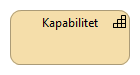
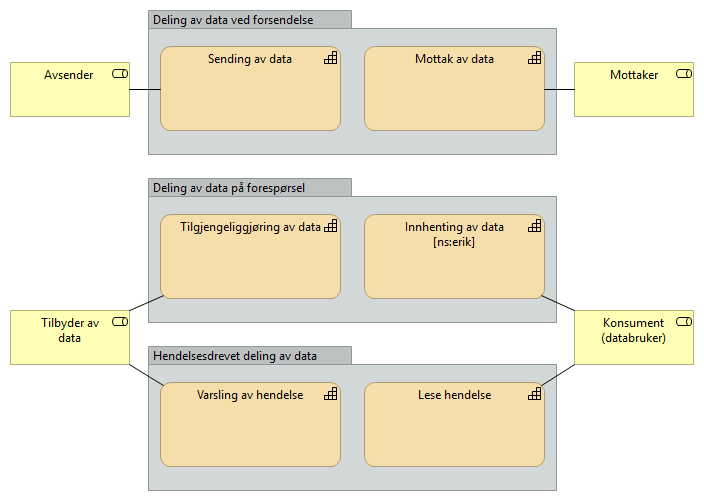
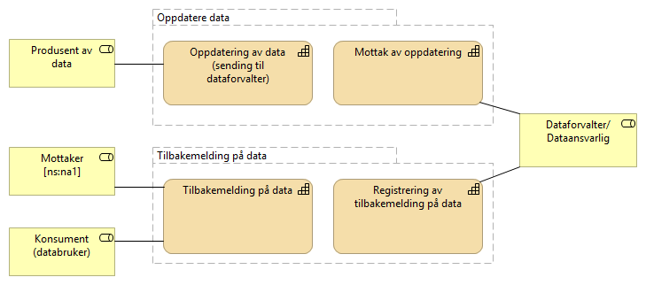

:lang: no
:doctitle: Om referansearkitekturer
:keywords: Referansearkitekturer

include::../plattform_felles/includes/commonincludes.adoc[]

== Hva er en referansearkitektur?
ifdef::Erik-kommentarer[] 
****
[white]##Erik-kommentar: Her kunne jeg tenke meg å skrive kapitlet noe om, samt ta med en illustrerende figur. Figuren i Steg 4 under Metode kunne ha passet, bortsett fra at jeg mener den ikke er korrekt. Saken er at referansearkitekturer, i tillegg til å være "løsningsmaler", også skal kunne være for arkitekturer. EIRA er et eksempel på dette. Det er mulig at det er det som er ment i teksten nedenfor om "grunnleggende referansearktekturer? La meg se en gang til på hvordan en kan få TOGAF og EIRA (om SAT) til å hnege sammen.
La meg så komme tilbake med et forslag til justert tekst og figur asap;) ##

Henrik svar: Usikker på hvilken figur du mener? Den med ref-ark på toppen og ABBer og SBBer?
Enig i at referansearkitektuerer også kan være løsningsmaler for arkitektur, men det blir veldig langt unna det som har med disse referansearkitekturene å gjøre.
Teksten er for øvrig tatt fra eMeldings-strategien
****
endif::[]

En referansearkitektur er en løsningsmal for hvordan virksomheter utvikler løsninger innenfor et avgrenset område. Referansearkitekturen beskriver forretningsmessige mål, fastlegger prinsipper og begreper som gjelder for området, hvilke standarder og eventuelt hvilke teknologier som bør benyttes, og hvordan virksomheten skal realiserer effekter både på forretningsnivå og teknisk nivå.

Det finnes ulike typer referansearkitekturer: 

* Grunnleggende referansearkitekturer, som beskriver generelle krav til for eksempel informasjonssikkerhet.

* Tekniske, som beskriver arkitekturen og peker på relevante teknologiske løsninger som skal utvikles og brukes, for eksempel krav til tegnsett når data skal utveksles mellom registre.

* Anvendelsesorienterte, som innen et spesifikt forretningsområde peker på prinsipper og retningslinjer til konkrete løsninger, f.eks. disse referansearkitekturer for informasjonsutveksling.

Referansearkitekturer kan beskrives på ulike abstraksjonsnivåer. Omfangsrike og altomfattende arkitekturer kan være hinder for innovasjon. Det viktig å finne rett balanse på omfang og detaljeringsnivå. Hvis ensartet samhandling er viktig, bør kravene som stilles være mer detaljert.

Referansearkitektur må ta utgangspunkt i brukerbehov, være basert på erfaring og peke på beste praksis.
Referansearkitekturene gir både offentlige og private virksomheter felles retning på nyutvikling, videreutvikling og anskaffelser av offentlige samhandlingsløsninger.

== Hvorfor bruke referansearkitekturer?

Referansearkitektur tilbyr harmonisering av samhandlingsarkitekturer gjennom felles begrepsbruk, gjenbrukbare løsninger og erfaring basert på beste praksis.

* *Økt fart*: Referansearkitekturer gir et modent startpunkt for arbeidet med arkitektur i et utviklingsprosjekt. Virksomheten trenger ikke finne opp hjulet på nytt.

* *Høyere kvalitet*: Referansearkitekturer baserer seg på erfaring og beste praksis.

* *Mer gjenbruk*: Referansearkitekturer peker på ressurser som kan gjenbrukes, og dermed enklere å finne.
Sterkere harmonisering og samhandling: Harmoniserer samhandlingen generelt og på tvers av sektorer og forvaltningsnivå. 

* *Effektivt samarbeid på tvers*: Det er enklere å samarbeide på tvers av sektorer og forvaltningsnivå ved bruk av felles begreper, modeller og arkitektur. Det blir enklere å utveksle erfaringer og virksomhetene modnes sammen.

* *I tråd med lover og regler*: Referansearkitekturer kan bygge inn juridiske krav og sikre at disse kravene følges.

== Målgruppe og omfang av referansearkitekturer for informasjonsutveksling

//Henrik: Fremheve behovet for tilgjengelighet til data/informasjon for å ta ut potensialet? Dreier referansearkitetkurer for informasjonsutveksling seg mest om tilgjengelighet?

ifdef::Erik-kommentarer[] 
****
[white]##Erik-kommentar: ##

* [white]##Ikke bare EN målgruppe##
* [white]##I tillegg til tjenestetilbydere (og deres leverandører), er også virksometer som er konsumenter/mottakere blant målgruppene. ##
* [white]##I tillegg til tjenestetilbydere (og deres leverandører), er også virksomheter som er konsumenter/mottakere blant målgruppene. ##

* [white]##Hvorfor blande sammen målgrupper og omfang i samme kapittel? ##

Svar Henrik: Forsøkt å innarbeide. Målgruppen/målgruppene - usikker på hva som blir riktig. 

"blandingen" av målgruppe og omfang - jeg tenker at det passer greit sammen.
****
endif::[]
Målgruppen for referansearkitekturene er offentlige tjenestetilbydere, mottakere og konsumenter av informasjon og data samt deres leverandører. Referansearkitekturene er relevant for, men ikke begrenset til, arkitekter, forretningsutviklere og prosjektledere som jobber med digitalisering av forretningsprosesser som involverer flere virksomheter.

ifdef::Erik-kommentarer[] 
****
[white]##Erik-kommentar:##

* [white]##Følgende avsnitt bør kanskje fikses litt på, ref. kommentar over om hva vi legger i begrepet "referansearkitekturer". ##

* [white]##Det er også litt "mystisk" formulert om "de ulike områdene"... selv om ordet "område" er brukt over, er det ikke uten videre greit å skjønne hva som menes med dette her... Det er et generelt begrep som her har en veldig spesifikk betydning... ##

* [white]##Hmmm... Dessuten er vel det følgende avsnittet mer om referansearkitekturer generelt enn om "omfang av referansearkitekturer for informasjonsutveksling"!?##

Svar Henrik: innarbeidet pkt 2
****
endif::[]

Detaljeringsnivået på beskrivelsene av referansearkitekturene vil ikke være på nivå med en implementasjonsguide, men gi veiledning i løsningsdesign og sette rammer for denne. Referansearkitekturene vil forvaltes og utvikles over tid, og det vil derfor være ulikt detaljerings og modenhetsnivå på de ulike referansearkitekturene. De overordnede beskrivelsene tas sikte på å være mer stabile, mens de mer løsningsspesifikke anbefalingene kan endre seg i noe større grad.

== Oversikt over referansearkitektuerer for informasjonsutveksling

ifdef::Erik-kommentarer[] 
****
[white]##Erik-kommentar: Overskriften om "status" er ikke gjenspeilet i teksten - her er det kun snakk om "omfang" (eller oversikt).##

Henrik svar: Innarbeidet
****
endif::[]

ifdef::Erik-kommentarer[] 
****
[white]##Erik-kommentar: Pirk... "Referansearkitekturen" i entall nedenfor - det skulle vel vært "Referansearkitekturene" i flertall? Som leser er det lett å bli forvirret... Her bør vi være mer spesifikke om hvilke referansearkitekturer det dreier seg om, spesielt når vi sier at det kommer "overgripende temaer" (områder eller referansearkitekturer?) i tillegg. Vurder å skrive "Referansearkitekturer for informasjonsutveksling (eller heter det nå datadeling?) er inndelt i flere kapabilitetsområder...##

Henrik svar: rettet skrivefeil og oppdatert tekst iht. kommentar.
Alternativer til områder/kapabilitetsområder kan være handlingsområde eller temaområde, jf. "subject area" som vi finner igjen i materialet om "reference architecture"
****
endif::[]

Referansearkitekturene for informasjonsutveksling har vi gruppert i fem områder som er satt sammen av utvalgte kapabiliteter. Dette er gjort for å dele opp informasjonsutveksling i områder som er håndterbare. De fem områdene er:

* Deling av data ved forsendelse
* Deling av data på forespørsel
* Hendelsesdrevet deling av data
* Oppdatere av data
* Tilbakemelding på data

I tillegg til de fem kapabilitetsområdene vil det være en del overgripende temaer blant annet tilknyttet informasjonssikkerhet. De fem områdene vil også bygge på hverandre hvor deling ved forsendelse og forespørsel er de to grunnleggende måtene å dele data og informasjon på.

Hvert av områdene vil støttes av en referansearkitektur og det er en overordnet metode for å identifisere hvilken referansearkitektur som passer til det respektive samhandlingsbehovet.

****
Kapabilitet - En evne en organisasjon, person eller et system innehar.
Kapabiliteter er typisk uttrykt med generelle termer og på
høyt nivå, og krever vanligvis en kombinasjon av
organisasjon, mennesker, prosesser og teknologi for å
oppnås.

****

De tre første områdene omhandler ulike mønstre for deling av data:

ifdef::Erik-kommentarer[] 
****
[white]##Erik-kommentar til Archi-figuren nedenfor (ikke meningen å kverulere, men jeg ønsker virkelig at navnene skal fortelle klarere hva det dreier seg om):##

* [white]##Vurder å renavne gruppe-boksene slik at de blir greie overskrifter, f.eks. "Utsending", "Forespørsel" og  "Varsling". Dette er ikke veldig viktig - bare at jeg personlig synes det klinger bedre - bortsett fra når det gjelder begrepet "Hendelsesdrevet", som jeg mener vi ikke bør bruke her. Det dreier seg her om varsling av endringer, mens "hendelsesdrevet deling av data" like godt kan skje gjennom /"Deling av data ved forsendelse"/"Sending av data".##

* [white]##Endre "Sende data" til "Sende adresserte data"? Det er mer spesifikt, uten at vi mister noe - ikke sant?##

* [white]##Endre "Mottak av data" til "Motta adresserte data"?##

* [white]##Endre "Varsling av hendelse" til "Varsling om endrede data"? Ref. beskrivelse i Archi: "Deling av data initiert av en tilstandsendring i dataene som deles." Eller kan det her dreie seg om vilkårlige hendelser, uten at det nødvendigvis finnes referanse til datasett eller dokumenter????##

* [white]##Endre "Tilgjengeliggjøring av data" til "Avgi data på forespørsel"? Merk: Tilgjengeliggjøring av data gjennom å etablere API osv. er kapabiliteter som kreves for å kunne avgi data data på forespørsel, men flere av disse, bakenforliggende kapabilitetene, vil være felles på tvers av "alle" de tre som er med i denne figuren..##

Henrik svar: Denne må vi diskutere. Noe kan vi kanskje håndtere gjennom beskrivelsene under?
****
endif::[]

ifdef::Erik-kommentarer[] 
****
[white]##Erik-kommentar til Archi-figuren nedenfor:##

* [white]##Vurder å renavne gruppe-boksene slik at de blir greie overskrifter, f.eks. fra "Oppdatere data" til "Oppdatering", "Tilbakemelding på data" til "Tilbakemelding".##

* [white]##Gjerne renavn kapabiliteten "Oppdatering av data (sending til dataforvalter)" til ?? (så jeg forstår hva som menes - er det faktisk å gjøre oppdatering eller bare å sende en melding?).##

* [white]##Renavne "Tilbakemelding på data" til "Gi tilbakemelding på datakvalitet"##

* [white]##Renavne "Registrering av tilbakemelding på data" til ?? (bare å registrere hjelper lite - må kunne behandle tilbakemeldinger inkl. feilretting og andre forbedringer) ##

Henrik svar: Denne må vi diskutere. Noe kan vi kanskje håndtere gjennom beskrivelsene under
****
endif::[]

De to neste handler om oppdatering og tilbakemelding på data. Dette er foreløpig et mer umodent område:

=== Beskrivelse av hvert kapabilitetsområde
ifdef::Erik-kommentarer[] 
****
[white]##Erik-kommentar: Er ordet "område" velvalgt? Kan vi spisse begrepet så det framgår hva som menes uten at en befinner seg helt inne i denne konteksten? F.eks. "kapabilitetsområde" (selv om noen misliker ordet kapabilitet)? Så kreves en tydelig definisjon av dette begrepet...  ##

Henrik svar: Prøver med kapabilitetsområde 
****
endif::[]
==== Deling av data ved forsendelse
Dette er deling av informasjon og data initiert av avsender. Det vil normalt være behov og/eller forventning om oppfølging fra mottaker. 

Eksempler kan være å sende en faktura hvor det forventes at mottaker behandler denne, eller en henvisning i helsesektoren hvor det forventes at mottaker tar ansvar for videre oppfølging av pasienten det gjelder. 

Ved deling av data ved forsendelse må avsender ha visshet om at mottaker kan motta og behandle meldingen/informasjonen som sendes.

Deling av data ved forsendelse er foreløpig beskrevet i Nasjonal referansearkitektur og strategi for eMelding.

==== Deling av data på forespørsel
Deling av data initiert av databruker. Dette kan være å spørre om data gjennom en tjeneste/API eller å lese åpne publiserte data. Ved å lese publiserte data menes for eksempel åpne data på data.norge.no eller datasett som legges fritt tilgjengelig på nettet. Et eksempel på det siste er valutakurser fra Norges bank.

Data gjennom en tjeneste/API kan gi mer avanserte tilganger for spørring i datasett med ulike metoder og tilgangsnivåer. Dette vil være måten å dele data nært opp til sanntid for bruk i saksbehandlingsprosesser og liknende når tilgangskal gis etter hvilke rettigheter den enkelte bruker har til dataene. Et eksempel på dette er oppslag i folkeregisteret hvor ulike brukere kan ha ulike tilganger etter hva de har av hjemler og behov. 

Dette området jobbes det med gjennom prosjektet eOppslag.

==== Hendelsesdrevet deling av data
Med hendelsesdrevet deling av data menes det deling som er initiert av en tilstandsendring i dataene som deles. Databruker leser eller abonnerer på hendelseslister og dette trigger eventuell videre oppfølging. Databruker må vurdere om endringen skal følges opp og lese data på forespørsel. 

Et eksempel er modernisert folkeregister hvor brukere kan abonnere på endringer og således kun få vite at det har skjedd en endring på en person, og dersom dette kan være relevant for brukeren hentes detaljene om endringen som igjen kan sette i gang en handling hos bruker.

Det er foreløpig ikke startet arbeid med referansearkitektur for hendelsesdrevet deling av data.

==== Oppdatere data
Med oppdatere data menes det å oppdatere en datakilde på tvers av virksomhete eller fra en aktør som ikke er eier eller forvalter av dataene. 

Oppdatere data kan være å opprette, endre eller å slette data. 

Det er foreløpig ikke startet arbeid med referansearkitektur for å oppdatere data.

==== Tilbakemelding på data
Med tilbakemelding på data menes det å gi tilbakemelding på for eksempel kvalitet på data fra en konsument eller mottaker til den som er ansvarlig for dataene. 

Tilbakemeldinger vil være metadata relatert til bruk, og ikke endringer i selve datasettet.
Deling av data med formål om å gi tilbakemelding på f.eks. kvalitet. Tilbakemeldinger vil være metadata-relatert til bruk, og ikke endringer i selve datasettet.

Det er foreløpig ikke startet arbeid med referansearkitektur for tilbakemelding på data.
