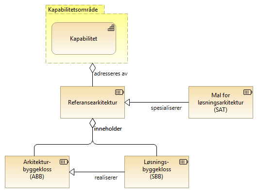
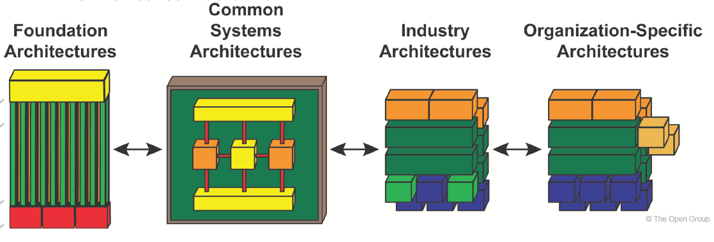

:lang: no
:doctitle: Generelt om referansearkitekturer
:keywords: Referansearkitekturer

include::../plattform_felles/includes/commonincludes.adoc[]

== Hva er en referansearkitektur?
////
ifdef::Erik-kommentarer[] 
****
[white]##Erik-kommentar: Her kunne jeg tenke meg å skrive kapitlet noe om, samt ta med en illustrerende figur. Figuren i Steg 4 under Metode kunne ha passet, bortsett fra at jeg mener den ikke er korrekt. Saken er at referansearkitekturer, i tillegg til å være "løsningsmaler", også skal kunne være for arkitekturer. EIRA er et eksempel på dette. Det er mulig at det er det som er ment i teksten nedenfor om "grunnleggende referansearktekturer? La meg se en gang til på hvordan en kan få TOGAF og EIRA (om SAT) til å henge sammen.
La meg så komme tilbake med et forslag til justert tekst og figur asap;) ##

[blue]## Henrik svar: Usikker på hvilken figur du mener? Den med ref-ark på toppen og ABBer og SBBer?
Enig i at referansearkitektuerer også kan være løsningsmaler for arkitektur, men det blir veldig langt unna det som har med disse referansearkitekturene å gjøre.
Teksten er for øvrig tatt fra eMeldings-strategien ##
****
endif::[]
////

*Referansearkitekturer gir maler og veiledning til  utforming av arkitekturer og løsninger innen  avgrensede områder.*

Valg av referansearkitekturer, omfang og detaljeringsgrad bør ta utgangspunkt i brukerbehov, være basert på erfaring og kan peke på alt fra gode eksempler til beste praksis og konkrete anbefalinger.

Følgende figur illustrerer begrepsapparatet rundt referansearkitekturer, slik dette  benyttes i tilknytning til arbeidet ned nasjonal arkitektur. 

Forklaring til denne figuren:

Inndeling i _kapabilitetsområder_ tilsvarer det som TOGAF 9.2 kaller _"subject areas"_ eller _segmenter_, og er generelt sett en gruppering av kapabiliteter som en ønsker å adressere samlet.

Hvert _kapabilitetsområde_ kan adresseres av en eller flere _referansearkitekturer_. Formålet med å ha flere referansearkitekturer for samme område, kan være å gi ulike visninger for ulike målgrupper eller å bryte opp et komplekst bilde i enklere deler.  

Hver enkelt referansearkitektur kan inneholde både _arkitekturbyggeklosser_ og __løsningsbygeklosser__, ut fra hva som er aktuelt. Helt generiske referansearkitekturer inneholder typisk bare generiske arkitekturbyggeklosser, mens mer løsningsorienterte referansearkitekturer gjerne også angir spesifikke løsningsbygeklosser. Det siste er f.eks. aktuelt for å angi anbefalt eller obligatorisk bruk av nasjonale fellesløsninger.

Begrepet __SAT (Solution Architecture Template)__, her oversatt til __Mal for løsningsarkitektur__, kommer fra arbeidet med en grunnleggende referansearkitektur i EU ved navn __EIRA (European Interoperability reference Architecture)__. En helt spesifikk definisjon av hva som ligger i begrepet SAT, samt veiledning til beskrivelse av slike maler, finnes i dokumenet link:https://joinup.ec.europa.eu/sites/default/files/document/2017-10/sat_design_guidelines_0_0.pdf[Solution Architecture Template (SAT) Design Guidelines].

NOTE: Bruk av EIRA og SAT-maler er inntil videre ikke et krav for referansearkitekturer i Nasjonal arkitektur. Se forøvrig link:../kunnskap_referansearkitektur_eu-eira/book-eira.adoc[egen omtale av EIRA]. 

Referansearkitekturer kan beskrives på ulike abstraksjonsnivåer. Omfangsrike og altomfattende arkitekturer kan være hinder for innovasjon. Hvis ensartet samhandling er viktig, bør kravene som stilles på den annen side være detaljerte nok til å sikre interoperabilitet. Det er viktig å finne en god balanse med tanke på dette.

Ulike referansearkitekturer kan også klassifiseres slik TOGAF-rammeverket beskriver rundt begrepet arkitektur-kontinuum.

.Klassifisering i grunnleggende, felles (nasjonale), industri- (sektorspesifikke) og organisasjonsspesifikke arkitekturer

NOTE: Se også link:../kunnskap_standard_togaf/arkitektur-kontinuum.adoc[egen omtale av TOGAF arkitektur-kontinuum].

//*Referansearkitekturer fungerer som maler for hvordan virksomheter utvikler løsningsarkitekturer innenfor et avgrenset område.*

//[red]**Beskrivelsene vil normalt ikke være på nivå med en implementasjonsguide, men gi veiledning i løsningsdesign og sette rammer for dette.**

//US DoD: Reference Architecture is an authoritative source of information about a specific subject area that guides and constrains the instantiations of multiple architectures and solutions

// US DoD: There may be multiple Reference Architectures within a subject area where each represents a different emphasis or viewpoint of that area. For each Reference Architecture, there may be any number of architectures and solutions corresponding to different aspects of the subject area viewpoint. 

////
Det finnes ulike typer referansearkitekturer: 

* Grunnleggende referansearkitekturer, som beskriver generelle krav til for eksempel informasjonssikkerhet.

* Tekniske, som beskriver arkitekturen og peker på relevante teknologiske løsninger som skal utvikles og brukes, for eksempel krav til tegnsett når data skal utveksles mellom registre.

* Anvendelsesorienterte, som innen et spesifikt forretningsområde peker på prinsipper og retningslinjer til konkrete løsninger, f.eks. disse referansearkitekturer for informasjonsutveksling.

////

== Hvorfor bruke referansearkitekturer?

Gjennom felles begrepsbruk, harmonisering, standardisering og gjenbrukbare løsninger, kan referansearkitekturer bidra til felles retning for nyutvikling, videreutvikling og anskaffelser for både offentlige og private virksomheter.

Viktige momenter er:

* *Økt fart*: Referansearkitekturer gir et modent startpunkt for arbeidet med arkitektur i et utviklingsprosjekt. Virksomheten trenger ikke finne opp hjulet på nytt.

* *Høyere kvalitet*: Referansearkitekturer baserer seg på erfaring og beste praksis.

* *Mer gjenbruk*: Referansearkitekturer peker på ressurser som kan gjenbrukes, og dermed enklere å finne.
Sterkere harmonisering og samhandling: Harmoniserer samhandlingen generelt og på tvers av sektorer og forvaltningsnivå. 

* *Effektivt samarbeid på tvers*: Det er enklere å samarbeide på tvers av sektorer og forvaltningsnivå ved bruk av felles begreper, modeller og arkitektur. Det blir enklere å utveksle erfaringer og virksomhetene modnes sammen.

* *I tråd med lover og regler*: Referansearkitekturer kan bygge inn juridiske krav og sikre at disse kravene følges.

== Hvem er referansearkitekturer for?

Målgrupper for referansearkitekturene er offentlige tjenestetilbydere, mottakere og konsumenter av informasjon og data samt deres leverandører. Referansearkitekturene er relevant for, men ikke begrenset til, arkitekter, forretningsutviklere og prosjektledere som jobber med digitalisering av forretningsprosesser som involverer flere virksomheter.

//== omfang av referansearkitekturer for informasjonsutveksling

== Hvordan beskrives referansearkitekturer?

Innhold og detaljnivå i beskrivelsen av en referansearkitektur vil kunne variere, avhengig av type, tematisk omfang, målgruppe, m.m. 

Det vil også kunne være ulik grad av modenhet på ulike referansearkitekturer, og detaljnivået vil kunne utvikles over tid. Grunnleggende referansearkitekturer og beskrivelser vil normalt være mer stabile, mens de mer løsningsspesifikke anbefalingene kan endre seg i takt med at landskapet endrer seg og en høster erfaring.

Beskrivelsene vil typisk dekke begreper, prinsipper, standarder og teknologier som gjelder for det aktuelle området. Strategisk informasjon om forretningsmessige mål og gevinstrealisering bør inngå der det er relevant.

NOTE: Difi arbeider med å utvikle felles maler for beskrivelse av referanseearkitekturer, både for tekstlige beskrivelser og arkitekturmodeller (Archimate). 
