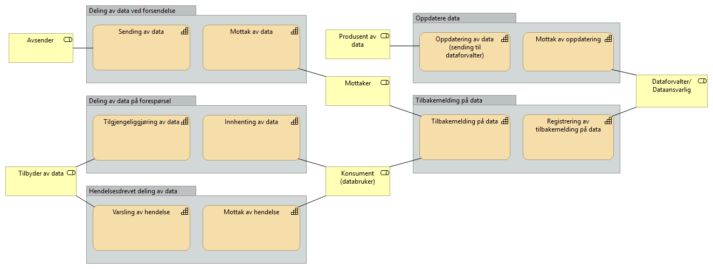

:lang: no
:doctitle: Om referanseartkitekturer
:keywords: Referansearkitekturer

include::../plattform_felles/includes/commonincludes.adoc[]

== Hva er en referansearkitektur?

En referansearkitektur er en løsningsmal for hvordan virksomheter utvikler løsninger innenfor et avgrenset område. Referansearkitekturen beskriver forretningsmessige mål, fastlegger prinsipper og begreper som gjelder for området, hvilke standarder og eventuelt hvilke teknologier som bør benyttes, og hvordan virksomheten skal realiserer effekter både på forretningsnivå og teknisk nivå.

Det finnes ulike typer referansearkitekturer: 

* Grunnleggende referansearkitekturer, som beskriver generelle krav til for eksempel informasjonssikkerhet.

* Tekniske, som beskriver arkitekturen og peker på relevante teknologiske løsninger som skal utvikles og brukes, for eksempel krav til tegnsett når data skal utveksles mellom registre.

* Anvendelsesorienterte, som innen et spesifikt forretningsområde peker på prinsipper og retningslinjer til konkrete løsninger, f.eks. disse referansearkitekturer for informasjonsutveksling.

Referansearkitekturer kan beskrives på ulike abstraksjonsnivåer. Omfangsrike og altomfattende arkitekturer kan være hinder for innovasjon. Det viktig å finne rett balanse på omfang og detaljeringsnivå. Hvis ensartet samhandling er viktig, bør kravene som stilles være mer detaljert.

Referansearkitektur må ta utgangspunkt i brukerbehov, være basert på erfaring og peke på beste praksis.
Referansearkitekturene gir både offentlige og private virksomheter felles retning på nyutvikling, videreutvikling og anskaffelser av offentlige samhandlingsløsninger.

== Hvorfor bruke referansearkitekturer?

Referansearkitektur tilbyr harmonisering av samhandlingsarkitekturer gjennom felles begrepsbruk, gjenbrukbare løsninger og erfaring basert på beste praksis.

* *Økt fart*: Referansearkitekturer gir et modent startpunkt for arbeidet med arkitektur i et utviklingsprosjekt. Virksomheten trenger ikke finne opp hjulet på nytt.

* *Høyere kvalitet*: Referansearkitekturer baserer seg på erfaring og beste praksis.

* *Mer Gjenbruk*: Referansearkitekturer peker på ressurser som kan gjenbrukes, og dermed enklere å finne.
Sterkere harmonisering og samhandling: Harmoniserer samhandlingen generelt og på tvers av sektorer og forvaltningsnivå. 

* *Effektivt samarbeid på tvers*: Det er enklere å samarbeide på tvers av sektorer og forvaltningsnivå ved bruk av felles begreper, modeller og arkitektur. Det blir enklere å utveksle erfaringer og virksomhetene modnes sammen.

* *I tråd med lover og regler*: Referansearkitekturer kan bygge inn juridiske krav og sikre at disse kravene følges.

== Målgruppe og omfang av referansearkitekturer for informasjonsutveksling

Målgruppen for referansearkitekturene er offentlige tjenestetilbydere og deres leverandører og er relevant for arkitekter, forretningsutviklere og prosjektledere som jobber med digitalisering av forretningsprosesser som involverer flere virksomheter.

Detaljeringsnivået på beskrivelse av referansearkitekturene vil ikke være på nivå med en implementasjonsguide, men gi veiledning i løsningsdesign og sette rammer for denne. Referansearkitekturene vil forvaltes og utvikles over tid, og vil derfor ha ulikt detaljeringsnivå for de ulike områdene. De overordnede beskrivelsene tas sikte på å være mer stabile, mens de mer løsningsspesifikke anbefalingene kan endres seg i noe større grad.

== Status referansearkitektuerer for informasjonsutveksling

Referansearkitekturen er delt inn i flere områder som vist i figuren under. I tillegg vil det være en del overgripende temaer bl.a. tilknyttet informasjonssikkerhet.

Hvert av områdene vil støttes av en referansearkitektur og det er en overordnet metode for å identifisere hvilken referansearkitektur som passer til det respektive samhandlingsbehovet.

//sett in figur her

== Beskrivelse av hvert område

=== Deling av data ved forsendelse
Dette er deling av informasjon og data initiert av avsender. Det vil normalt være behov og/eller forventning om oppfølging fra mottaker. Eksempler kan være å sende en faktura hvor det forventes at mottaker behandler denne eller en henvisning i helsesektoren hvor det forventes at mottaker tar ansvar for vider oppfølging av pasienten det gjelder. Ved deling av data ved forsendelse må avsender ha visshet om at mottaker kan motta og behandle meldingen/informasjonen som sendes.
Deling av data med melding er beskrevet i Nasjonal referansearkitektur og strategi for eMelding.

=== Deling av data på forespørsel
Deling av data initiert av databruker. Dette kan være å lese åpne publiserte data eller spørre om data gjennom en tjeneste/API. Ved å lese publiserte data menes f.eks. åpne data på f.eks. data.norge.no eller datasett som legges fritt tilgjengelig på nettet. Et eksempel på det siste er valutakurser fra Norges bank.

Data gjennom en tjeneste/API kan gi mer avanserte tilganger for spørring i datasett med ulike metoder og tilgangsnivåer. Dette vil være måten å dele data nært opp til sanntid for bruk i saksbehandlingsprosesser og liknende når tilgangen kun vil være etter hvilke rettigheter den enkelte bruker har til dataene. Et eksempel på dette er oppslag i folkeregisteret hvor ulike brukere kan ha ulike tilganger etter hva de har av hjemler og behov. 
Dette området jobbes det med gjennom prosjektet eOppslag.

=== Hendelsesdrevet deling av data
Deling av data initiert av en tilstandsendring i dataene som deles. Databruker leser eller abonnerer på hendelseslister og dette trigger eventuell videre oppfølging. Databruker må vurderer om endringen skal følges opp og lese data på forespørsel. Et eksempel er modernisert folkeregister hvor brukere kan abonnere på endringer og således kun få vite at det har skjedd en endring på en person og dersom dette kan være relevant for brukeren hentes detaljene om endringen som igjen kan sette i gang en handling hos bruker.
Det er foreløpig ikke startet arbeid med referansearkitektur for hendelsesdrevet deling av data.

=== Oppdatere data
Deling av data med formål om å oppdatere autoritativ datakilde fra en aktør som ikke er eier eller forvalter av dataene. Oppdatere data kan være å opprette, endre eller å slette data.

=====Tilbakemelding på data
=== Gi tilbakemelding på data
Deling av data med formål om å gi tilbakemelding på f.eks. kvalitet. Tilbakemeldinger vil være metadata relatert til bruk, og ikke endringer i selve datasettet.