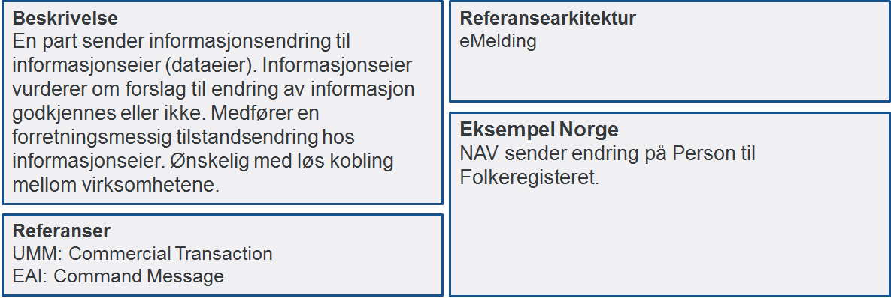
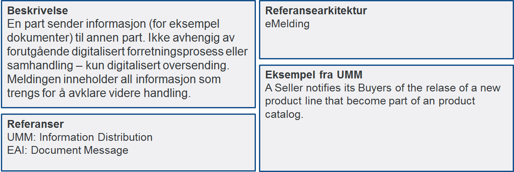
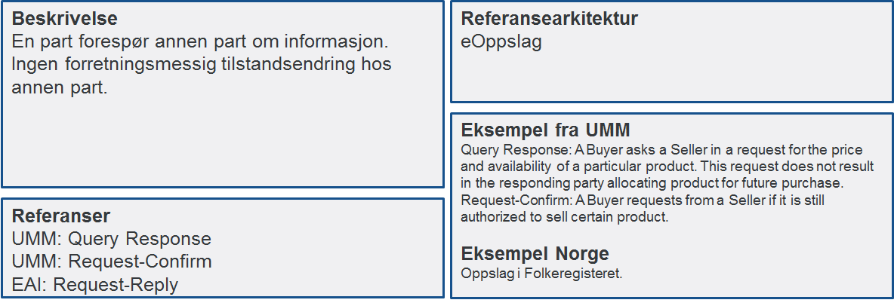
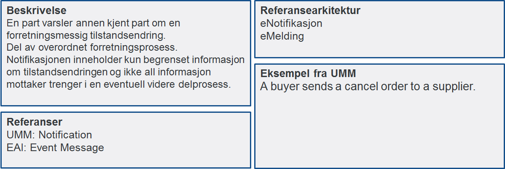
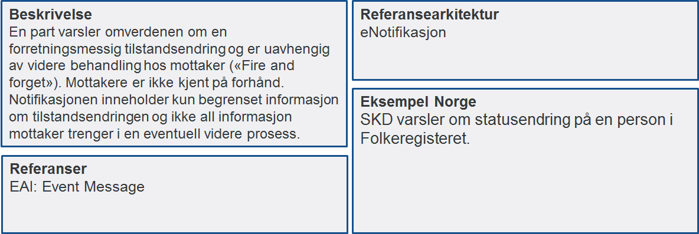

:lang: no
:doctitle: Samhandlingsmønstre
:keywords: samhandlingsmønstre

include::../plattform_felles/includes/commonincludes.adoc[]

//image:./media/Samhandlingsevne.png[alt="Samhandlingsevne", width=750]

== Generelt om samhandlingsmønstre

Digital samhandling mellom virksomheter kan utføres på et begrenset antall måter sett fra et forretningsståsted. Vi kaller dette samhandlingsmønstre. Samhandlingsmønstre sier ikke noe om hvilken teknologi som skal benyttes, men sier noe om hvilken egenskap samhandlingen skal ha. Det er til nå identifisert seks forskjellige samhandlingsmønstre.

//Henrik: Har skrevet inn de seks mønstrene Håkon presenterte i forrige møte

****
Garantert leveranse av informasjon til annen kjent part. Avsender skal være trygg på at mottager får informasjonen. Mottager behøver ikke informasjonen umiddelbart.
****

****
Forespørsel om informasjon mellom to parter med «ikke umiddelbar» respons (prosess hos en part er avhengig av informasjon fra annen part for å fortsette) 
****

****
Forespørsel om informasjon mellom to parter med «umiddelbar» respons (prosess hos en part er avhengig av informasjon fra annen part for å fortsette) 
****

****
Notifikasjon til identifisert part (trigger prosess på tidspunkt mottaker velger)
****

****
Notifikasjon til mange
****

****
Garantert leveranse av informasjon til annen kjent part. Avsender skal være trygg på at mottager får informasjonen. Mottager behøver informasjonen umiddelbart.
****

//image:./media/Mønstre samhandling.png[alt="alt="missing image", width=750]

Hvert enkelt samhandlingsmønster beskrives i mer detalj under og for hvert samhandlingsmønster pekes det på hvilken referansearkitektur som skal benyttes for samhandlingen.

== Beskrivelser av samhandlingsmønstre

//Henrik: Har laget en tabell av det Anne Lise beskrev i epost før sist møte

[cols ="1,1,1,1,1,1", options="header"]
.Oversikt samhandlingsbehov
|===
|
|En kjent kilde
|
|Flere kilder
|
|Store datamengder

|
|Høy oppetid
|Lav oppetid
|Høy oppetid
|Lav oppetid
|

|Sende informasjon
|API-kall
|Meldingsutveksling
|API-kall
|Meldingsutveksling
|

|Innhente informasjon
|API-kall
|Meldingsutveksling, Adressetjeneste
|API-kall
|Meldingsutveksling
|Fildelingstjeneste

|Publisere hendelse
|API-kall
|Hendelseliste
|API-kall
|Hendelsesliste
|

|===

=== Forretningstransaksjon mellom to parter

image:./media/Forretningstransaksjon_mellom_to_parter.png[alt="image:./media/Forretningstransaksjon mellom to parter", width=750]

=== Oversende informasjonsendring til informasjonseier

=== Oversende informasjon mellom to parter
 

=== Forespørsel om informasjon – "umiddelbar" respons

=== Notifikasjon til identifisert part
 

=== Notifikasjon til mange
 

=== Forespørsel om informasjon – ikke "umiddelbar" respons

image:./media/Forespørsel om informasjon uten umiddelbar respons.png[alt="bad!", width=750]
