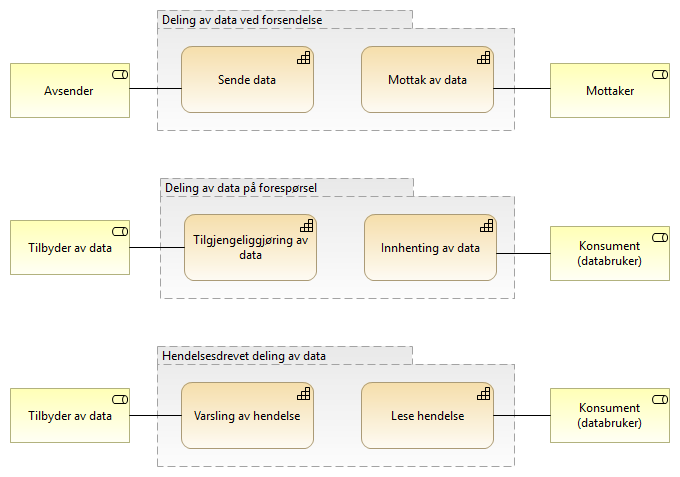

:lang: no
:doctitle: Strategi for arbeidet med referansearkitekturer
:keywords: Referansearkitekturer

:toclevels: 4

include::../plattform_felles/includes/commonincludes.adoc[]

== Generelt
Det vil til enhver tid arbeides med utvalgte referansearkitekturer i Nasjonal arkitektur, basert på prioriterte brukerbehov.

Oversikt over brukerbehov vedlikeholdes i et samlet kapabilitetskart, ordnet under et sett av kapabilitetsområder. Dette kartet vil utvikles over tid, etterhvert som en går inn på nye områder.

Tilsvarende vil det vedlikeholdes en oversikt over referansearkitekurer innen hvert kapabilitetsområde.

== Kapabilitetsområder

NOTE: Et mer komplett kapabilitestkart er under arbeid. Her er fokus på __datautveksling__ som del av __datadeling__.

Følgende figurer viser nedbrytningen fra _overordnede kapabilitetsområder_ innen Nasjonal arkitektur til _Datadeling_ og videre til _Datautveksling_ og __Deling på forespørsel__. 

.Figur: Kapabilitetsområder innen Nasjonal arkitektur (i arbeid)
image:../nab_referanse_arkitekturer\media/kapabilitetsområder-nasjonal-arkitektur.png[]

.Figur: Kapabilitetsområder innen datadeling (i arbeid)
image:../nab_referanse_arkitekturer\media/kapabilitetsområder-datadeling.png[]

.Figur: Kapabilitetsområder innen datautveksling (i arbeid)
image:../nab_referanse_arkitekturer\media/kapabilitetsområder-datautveksling.png[]

== Detaljering av kapabiliteter innen aktuelle områder

=== Kapabiliteter innen området datautveksling
.Figur: Kapabiliteter for deling av data innen underområder av kapabilitetsområdet for Datautveksling

image:../plattform_felles/media/i-arbeid.png[width=75, height=75] [red]#NB! Fiks navn på "områdene", så de stemmer med det foregående. Også vurder flytting?#

==== Deling av data ved forsendelse
Dette er deling av informasjon og data initiert av avsender. Det vil normalt være behov og/eller forventning om oppfølging fra mottaker. 

Eksempler kan være å sende en faktura hvor det forventes at mottaker behandler denne, eller en henvisning i helsesektoren hvor det forventes at mottaker tar ansvar for videre oppfølging av pasienten det gjelder. 

Ved deling av data ved forsendelse må avsender ha visshet om at mottaker kan motta og behandle meldingen/informasjonen som sendes.

Deling av data ved forsendelse er foreløpig beskrevet i Nasjonal referansearkitektur og strategi for eMelding.

==== Deling av data på forespørsel
Deling av data initiert av databruker. Dette kan være å spørre om data gjennom en tjeneste/API eller å lese åpne publiserte data. Ved å lese publiserte data menes for eksempel åpne data på data.norge.no eller datasett som legges fritt tilgjengelig på nettet. Et eksempel på det siste er valutakurser fra Norges bank.

Data gjennom en tjeneste/API kan gi mer avanserte tilganger for spørring i datasett med ulike metoder og tilgangsnivåer. Dette vil være måten å dele data nært opp til sanntid for bruk i saksbehandlingsprosesser og liknende når tilgangskal gis etter hvilke rettigheter den enkelte bruker har til dataene. Et eksempel på dette er oppslag i folkeregisteret hvor ulike brukere kan ha ulike tilganger etter hva de har av hjemler og behov. 

//Dette området jobbes det med gjennom #prosjektet# eOppslag.

==== Hendelsesdrevet deling av data
Med hendelsesdrevet deling av data menes det deling som er initiert av en tilstandsendring i dataene som deles. Databruker leser eller abonnerer på hendelseslister og dette trigger eventuell videre oppfølging. Databruker må vurdere om endringen skal følges opp og lese data på forespørsel. 

Et eksempel er modernisert folkeregister hvor brukere kan abonnere på endringer og således kun få vite at det har skjedd en endring på en person, og dersom dette kan være relevant for brukeren hentes detaljene om endringen som igjen kan sette i gang en handling hos bruker.

Det er foreløpig ikke startet arbeid med referansearkitektur for hendelsesdrevet deling av data.

== Identifiserte referansearkitekturer innen hvert kapabilitetsområde
Følgende figur viser en foreløpig oversikt over aktuelle referansearkitekturer innen respektive kapabilitetsområder.

.Figur: Katalog over referansearkitekturer innen aktuelle kapabilitetsområder i Nasjonal arkitektur (i arbeid)
image:../nab_referanse_arkitekturer\media/katalog-referansearkitekturer.png[]

== Pågående arbeid
Arbeidet har per 2018 og sbegynnelsen av 2019 fokusert på _datautveksling_  i samhandlingsløsninger som _kapabilitetsområde_, der en særlig har sett på referansearkitekturer for henholdsvis _eMelding_ (asynkron informasjonsforsendelse) og _eOppslag_ (synkront oppslag gjennom API). I tillegg til eMelding og eOppslag, har en også definert eNotifikasjon (hendelsesvarsling) som en prioritert referansearkitektur innen området _datautveksling_ (foreløpig ikke igangsatt arbeid).

////
.Figur: Skisse over prioriterte referansearkitekturer innen området __datautveksling__:
image:./media/Referansearkitekturer.png[alt="missing image (referansearkitekturer"]
////

