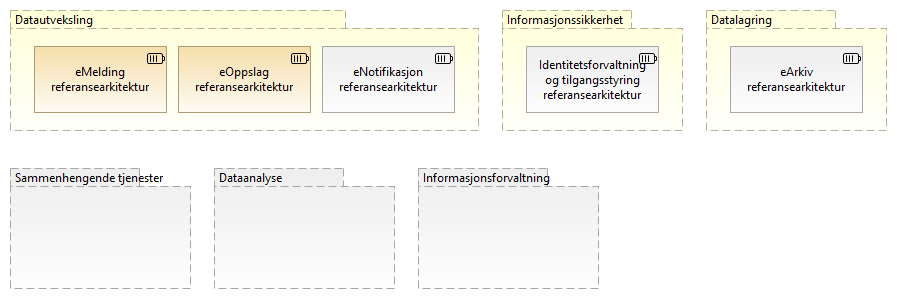

:lang: no
:doctitle: Strategi for arbeidet med referansearkitekturer
:keywords: Referansearkitekturer

:toclevels: 7

include::../plattform_felles/includes/commonincludes.adoc[]

== Generelt
Det vil til enhver tid arbeides med utvalgte referansearkitekturer i Nasjonal arkitektur, basert på prioriterte brukerbehov.

== Behov og kapabilitetsoversikt
Oversikt over brukerbehov vedlikeholdes i et samlet kapabilitetskart, ordnet under et sett av kapabilitetsområder. Dette kartet vil utvikles over tid, etterhvert som en går inn på nye områder. For mer om områder og nebryting til kapabiliter, se link:../nab_referanse_modeller_kapabiliteter/[her]. 

Tilsvarende vil det vedlikeholdes en oversikt over referansearkitekurer innen hvert kapabilitetsområde.

//== Prioriterte områder og kapabiliteter 
//image:../nab_referanse_arkitekturer/media/kapabilitetsområder-nasjonal-arkitektur-nivå-1-3.png[]

//NOTE: Et mer komplett kapabilitestkart er under arbeid. Her er fokus på __datautveksling__ som del av __datadeling__.

== Identifiserte referansearkitekturer
    
Følgende figur viser en foreløpig oversikt over aktuelle referansearkitekturer innen respektive områder.

image:../plattform_felles/media/i-arbeid.png[width=45, height=45] _Denne oversikten er i arbeid (vår 2019)_

.Figur: Katalog over referansearkitekturer innen aktuelle områder i Nasjonal arkitektur

== Pågående arbeid
Arbeidet har per 2018 og sbegynnelsen av 2019 fokusert på _datautveksling_  i samhandlingsløsninger som _kapabilitetsområde_, der en særlig har sett på referansearkitekturer for henholdsvis _eMelding_ (asynkron informasjonsforsendelse) og _eOppslag_ (synkront oppslag gjennom API). I tillegg til eMelding og eOppslag, har en også definert eNotifikasjon (hendelsesvarsling) som en prioritert referansearkitektur innen området _datautveksling_ (foreløpig ikke igangsatt arbeid).

////
.Figur: Skisse over prioriterte referansearkitekturer innen området __datautveksling__:

////

