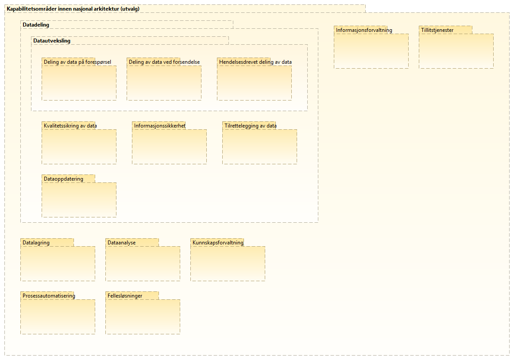

:lang: no
:doctitle: Tilnærming til  arbeidet med referansearkitekturer
:keywords: Referansearkitekturer

:toclevels: 2

include::../plattform_felles/includes/commonincludes.adoc[]

== Generelt

Prioritering av arbeidet med å ta fram referansearkitekturer på nasjonalt nivå styres av aktuelle behov, slik dette holdes rede på gjennom løpende kontakt med interessenter på tvers av offentlig og privat sektor.

Det legges vekt på å få fram nyttig veiledning, med alt fra gode eksempler til beste praksis og konkrete anbefalinger.

Oversikt over behovene vedlikeholdes i felles kapabilitetskart innen ulike områder. Kapabilitetskartene vil utvikles over tid, etterhvert som en går inn på nye områder. Tilsvarende vil det utvikles oversikter over referansearkitekurer innen hvert område.

Relatert informasjon:

1. link:../nab_overordnet-metode/grunnleggende-konsepter.adoc[Grunnleggende konsepter]
2. link:../nab_arkitekturlandskapr_strategisk-arkitektur_kapabilitetskart/main.adoc[Nedbrytning i områder og kapabiliteter]

//Se også link:../nab_referanse_modeller_kapabiliteter[videre informasjon om kapabilitetsområder og kapabiliter]. 

//== Prioriterte områder og kapabiliteter 
//

//NOTE: Et mer komplett kapabilitestkart er under arbeid. Her er fokus på __datautveksling__ som del av __datadeling__.

== Identifiserte referansearkitekturer
    
Følgende figur viser en foreløpig oversikt over aktuelle referansearkitekturer innen respektive områder.

image:../plattform_felles/media/i-arbeid.png[width=45, height=45] _Denne oversikten er i arbeid (vår 2019)_

.Figur: Katalog over referansearkitekturer innen aktuelle områder i Nasjonal arkitektur
image:../nab_referanse_arkitekturer/media/katalog-referansearkitekturer.png[]

