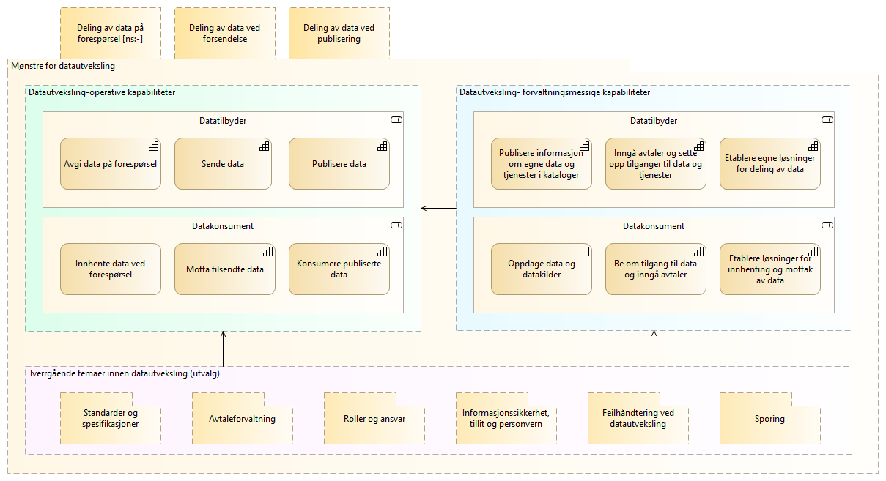

:lang: no
:doctitle: Referansearkitektur for datautveksling
:keywords: Referansearkitektur
:toclevels: 3
include::../plattform_felles/includes/commonincludes.adoc[]

:leveloffset: +1
= Introduksjon

== Generelt
_Referansearkitektur for datautveksling_ gir beste praksis for arkitekturer og løsninger innen _temaområdet datautveksling_.

Primære målgrupper er virksomhetsarkitekter, løsningsarkitekter og tech-leads i utviklingsteam.

Beskrivelsene kan leses som en sammenhengende "bok", men forutsetter en viss kjennskap til grunnleggende konsepter og metodikk.

Se også:

1. link:../nab_overordnet-metode-om-referansearkitekturer[Om referansearkitekturer]

2. link:../nab_arkitekturlandskap_segmentarkitektur_datadeling_datautveklsing\[Temaområde datautveksling] 

5. link:../nab_arkitekturlandskap_segmentarkitektur_datadeling_verdistrømmer/[Felles referansemodeller for datadeling]

3. link:../nab_arkitekturlandskap_segmentarkitektur_datadeling\[Temaområde datadeling].

4. link:../nab_referanse_arkitekturer[Nasjonale referansearkitekturer]

6. link:../nab_[Nasjonalt arkitekturbibliotek]

//4. link:../nab_referanse_arkitekturer_datautveksling/[Roller involvert i datautveksling]

// include::../nab_referanse_arkitekturer_datautveksling/intro-ra-datautveksling.adoc[]

//== Overordnet forretningmessig kontekst
//include::../nab_referanse_arkitekturer_datautveksling/overordnet-forretningsmessig-kontekst.adoc[]

== Omfang og avgrensing
//include::../nab_referanse_arkitekturer_datautveksling/brukstilfeller.adoc[]

Foreliggende _referansearkitektur for datautveksling_ omfatter områder og basismønstre som svarer på følgende grunnleggende samhandlingsbehov:

1. Spørring og oppslag: Enkeltvise oppslag i enkeltstående datakilder.

2. Forsendelse: Enkeltvise overføringer av data fra en avsender til en bestemt mottaker.

3. Publisering: Publisering av data og hendelser fra en til mange, med løs kopling mellom tilbydere og konsumenter. 

TIP: Basismønstrene gir grunnlag for sammensatte og mer avanserte samhandlingsmønstre.

_Referansearkitektur for datautveksling_ omfatter inntil videre følgende prioriterte arkitektur- og løsningsmønstre (**uthevet skrift** angir her avtalte leveranser i 2019):

1. Deling av data ved forespørsel: 
a. Generisk mønster for spørring og oppslag.
b. *eOppslag - et arkitekturmønster for oppslag i data gjennom synkrone API-kall*

2. Deling av data ved forsendelse:
a. Generisk mønster for meldingsforsendelse
b. *eMelding - et arkitekturmønster etter modell av CEF eDelivery*
c. Løsningsmønster for eMelding i PEPPOL-infrastrukturen

3. Deling av data ved publisering: 
a. Generisk mønster for publisering av data
b. *eNotifikasjon - arkitekturmønster for strømming av hendelsesdata*

Illustrasjon - prioriterte arkitektur- og løsningsmønstre:

.Prioriterte referansearkitekturer (høst 2019)
image::../nab_referanse_arkitekturer/media/Aktuelle referansearkitekturer.png[alt=Aktuelle referansearkitekturer image]

Her gjengis også en figur fra link:../nab_arkitekturlandskap_segmentarkitektur_datadeling_datautveklsing\[temaområde datautveksling] som viser en oversikt over de viktigste operative og forvaltningsmessige kapabilitetene for henholdsvis datatilbyder og  datakonsument. Nederst i figuren er det også listet tverrgående temaer som vurderes som særlig viktige i tilknytning til datautveksling.

//Videre nedbryting i detaljerte kapabiliteter og mønstre gjøres i tilknytning til beskrivelsene av referansearkitekturer for datautveksling.

// Her følger en overordnet oversikt over overordnede kapabiliteter og tverrgående temaer som sorterer under området datautveksling. 

//NOTE: Noen av de temaene som nevnes her er også aktuelle i andre sammenhenger, og beskrives ved behov i ulike kontekster.   

.Datautveksling - overordnet oversikt over kapabiliteter og temaer 

Videre beskrivelser av temaer og kapabiliteter gis i tilknytning til beskrivelse  er av de enkelte referansearkitekturene.

NOTE: _Virksomhetsarkitekturen kan inndeles i områder, eller temaområder, og videre i kapabiliteter. Dette kan gjøres i flere nivåer, til et hensiktsmessig detaljnivå. Med kapabilitet menes en evne som er forbundet med en rolle eller en aktør. Slike aktører kan være organisasjoner, personer eller tekniske systemer. Realiseringen av en kapabilitet gjøres igjen typisk gjennom organisasjoner, mennesker, prosesser og teknologier, gjerne i kombinasjon._

////
Videre behov og muligheter, som eventuelt vil dekkes etterhvert, omfatter blant annet:

* Spørringer på tvers av flere datakilder.

* Meldingsutveksling i tverrgående prosesser. __Merk: eMelding beskriver standardisert støtte for korrelering av meldinger, som en forutsetning for dette.__

* Abonnement på periodisk eller hendelsesbasert oppdatering om endringer eller status. 

* Mer detaljerte mønstre for strømming av data og hendelser til et ukjent antall ukjente mottakere.

* Mønstre for publisering av data gjennom felles datalager. 
////

== Leseveiledning

Det skilles mellom konseptuelle arkitekturbeskrivelser og mer løsningsnære beskrivelser. Løsningsmønstre gir konkret veiledning for løsningsarkitekter og utviklere, f.eks. ved å angi bruk av nasjonale felleskomponenter.

De generiske og konseptuelle beskrivelsene kommer først, og etterfølges eventuelt av alternative, mer spesifikke anvendelser (arkitektur- eller løsningsmønstre). 

Løsningsarkitekter som er ute etter praktiske tips, kan velge å gå rett på de mest konkrete beskrivelsene.

//image:../plattform_felles/media/i-arbeid.png[width=45, height=45] _I arbeid._

////

== Overgripende modell for datautveksling

=== Generisk prosess for klargjøring til databehandling

include::../nab_referanse_arkitekturer_datautveksling/generisk-prosess-for-klargjøring-til-databehandling.adoc[]

=== Generisk prosess for operativ databehandling
include::../nab_referanse_arkitekturer_datautveksling/generisk-prosess-for-operativ-databehandling.adoc[]
<<
////

// = Roller involvert i datautveksling
// include::../nab_referanse_arkitekturer_datautveksling/roller-ra-datautveksling.adoc[]

//= Aktuelle arkitekturprinsipper
// TBD. 

//NOTE: Prinsipper for datautveksling vil bygge på felles  nasjonale arkitekturprinsipper, som er under revidering høsten 2019.

Se link:../nab_referanse_arkitekturer_struktur_beskrivelse[leseveiledning].

Beskrivelsene finnes ellers både samlet og enkeltvis: 

a. link:../nab_referanse_arkitekturer_datautveksling_forespørsel-svar[Mønstre for spørring og oppslag]

b. link:../nab_referanse_arkitekturer_datautveksling_forsendelse[Mønstre for forsendelse]

c. link:../nab_referanse_arkitekturer_datautveksling_publisering[Mønstre for publisering av hendelsesdata]

////
a. link:../nab_referanse_arkitekturer_datautveksling_forespørsel-svar[Arkitekturnønstre for spørring og oppslag]

 * link:../nab_referanse_arkitekturer_eoppslag/[Synkront oppslag i datakilde (eOppslag)]

b. link:../nab_referanse_arkitekturer_datautveksling_forsendelse[Arkitekturmønstre for forsendelse]

 * link:../nab_referanse_arkitekturer_meldingsutveksling_generisk[Generisk meldingsforsendelse]
 * link:../nab_referanse_arkitekturer_emelding[eMelding]

c. link:../nab_referanse_arkitekturer_datautveksling_publisering[Arkitekturmønstre for publisering av hendelsesdata]
////

// * link:../nab_referanse_arkitekturer_epublisering[Publisering av hendelser (ePublisering)]

:leveloffset!:
:leveloffset: +1
= Mønstre for spørring og oppslag
include::../nab_referanse_arkitekturer_datautveksling_forespørsel-svar/book-ra-forespørsel-svar.adoc[]

:leveloffset!:
:leveloffset: +1
= Mønstre for meldingsforsendelse
include::../nab_referanse_arkitekturer_datautveksling_forsendelse/book-ra-forsendelse.adoc[]

:leveloffset!:
:leveloffset: +1
= Mønstre for publisering
include::../nab_referanse_arkitekturer_datautveksling_publisering/book-ra-publisering.adoc[]

:leveloffset!:
:leveloffset: +1
= Sammensatte arkitekturmønstre for datadeling og samhandling
include::../nab_referanse_arkitekturer_tverrgående-tema/book-tverrgående-tema.adoc[]

:leveloffset!: -1
