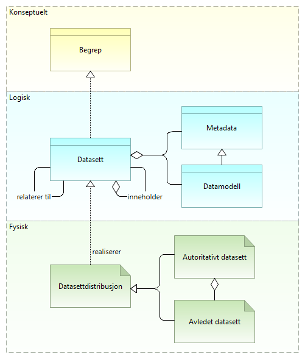

:lang: no
:doctitle: Referansearkitekturer for datautveksling
:keywords: Referansearkitektur
:toclevels: 3
include::../plattform_felles/includes/commonincludes.adoc[]

== Introduksjon

=== Formål
// include::../nab_referanse_arkitekturer_datautveksling/overordnet-forretningsmessig-kontekst.adoc[]

Godt fungerende datautveksling er en forutsetning for å nå målene i Regjeringens Digitaliseringsstrategi om sammenhengende tjenester og dataanalyse. Figuren under illusterer dette. Det overordnede målet er sammenhengende tjenester for personer og virksomheter. Datautveksling handler om å forsyne forretningsprosesser og dataanalyse med nødvendig datagrunnlag. 

.Datautveksling i kontekst
image::../nab_referanse_arkitekturer_datautveksling/media/Overordet forretningsmessig kontekst.png[alt=Overordet forretningsmessig kontekst image]

=== Hva menes med datautveksling?
I sammenheng med nasjonale referansearkitekturer for datautveksling omfatter begrepet datautveksling alle former for dataflyt mellom tilbydere og konsumenter, enten det er internt i en virksomhet, mellom virksomheter eller mellom virksomheter og personer.

Referansearkitekturene dekker både den operative datautvekslingen og det som skal til rundt klargjøring og forvaltning.

=== Hva menes med data?

Se figuren under.

.Hva er data - overordnet konsept

Det er vanlig å skille mellom konseptuelle, logiske og fysiske data. 

I tilknytning til nasjonale referansearkitekturer for datautveksling benyttes begrepet _data_ heller enn _informasjon_, så langt det gir mening. Det skilles likevel mellom data og informasjon i visse sammenhenger. Det gir f.eks. mening å si _informasjonssikkerhet_, mens en snakker om _sikring av data_ for å oppnå _informasjonssikkerhet_.

Data kan finnes med større eller mindre grad av struktur, og det er en flytende overgang mellom ustrukturerte, semistrukturerte og strukturerte data. Med nyere teknologier innen maskinlæring kan en også tolke og gi struktur og mening til data som en tidligere har definert som ustrukturerte.

Data kan samles i _datasett_. Dette kan f.eks. være dokumenter i et arkiv eller tabeller i en database.

Det er den fysiske forekomsten av data i ulike systemer som vi må sikre og ha oversikt over, enten det dreier seg om data som er lagret over tid eller data som finnes midlertidig mellom systemer i en datautveksling. Begrepet _datadistrubusjon_ tilsvarer begrepet _distribution_ i DCAT-standarden.  

=== Avgrensing
Referansearkitekturer og mønstre for datautveksling dekker i hovedsak selve utvekslingen av data og dokumenter, men da både den operative datautvekslingen og det som skal til rundt klargjøring og forvaltning.
 
Bruken av data i forretningsprosesser og dataanalyse dekkes i utangspunktet ikke, med mindre det er relevant for måten datautvekslingen gjøres på. I forbindelse med datavirtualisering, er det f.eks. mulig å gjøre dataanalyse der dataene ligger, og så innhente analyseresultater i stedet for rådata.

Det finnes en rekke temaer og forutsetninger for at datautveksling skal fungere. Noen av disse temaene er store og dekkes ikke generelt som del av denne referansearkitekturen, slik som informasjonsforvaltning og datakvalitet, informasjonssikkerhet og identitetsforvaltning . Det er likevel elementer innen disse temaene som er spesielt relevante og derfor omhandles, enten som tverrgående temaer under generiske mønstre eller i tilknytning til mer spesifikke løsningsmønstre.

En introduksjon til aktuelle temaer er gitt under kap. x. Nærmere informasjon om utvalgte temaer er også gitt i...

//== Hva er data?
//include::../nab_referanse_arkitekturer_datautveksling/hva-er-data.adoc[]

//== Overordnet forretningmessig kontekst
//include::../nab_referanse_arkitekturer_datautveksling/overordnet-forretningsmessig-kontekst.adoc[]

//== Strategi
//TBD.

//== Brukstilfeller
//include::../nab_referanse_arkitekturer_datautveksling/brukstilfeller.adoc[]

== Overgripende modell for datautveksling

=== Generisk prosess for klargjøring til databehandling

include::../nab_referanse_arkitekturer_datautveksling/generisk-prosess-for-klargjøring-til-databehandling.adoc[]

=== Generisk prosess for operativ databehandling
include::../nab_referanse_arkitekturer_datautveksling/generisk-prosess-for-operativ-databehandling.adoc[]
<<

== Prinsipper
TBD. (Ta inn referanser til nasjonale pribsipper; under revidering. Husk TOOP!)

== Introduksjon til tverrgående temaer
include::../nab_referanse_arkitekturer_tverrgående-tema/book-tverrgående-tema.adoc[]
////
Foreløpg liste over temaer:

Merk: Dette er i arbeid. Beskrives som kapabiliteter.

* Logging

* Tidsstempling

* Fellesskapsforvaltning

* Informasjonssikkerhet

* Identitetsforvaltning

* Tilgangsstyring

* Tillitstjenester

* Informasjonsforvaltning

* Avtalehåndtering

* Lover og regler

* Semantikk

* Feilhåndtering (rollback, kompenasasjonstransaksjoner)

* Transaksjonsstøtte

* Protokoller og formater

////
