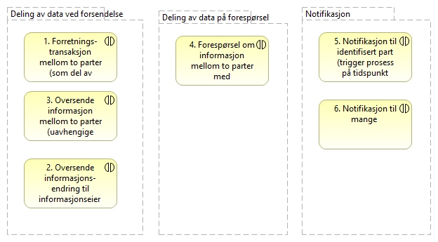

:lang: no
:doctitle: Brukstilfeller for datautveksling
:keywords: 

include::../plattform_felles/includes/commonincludes.adoc[]

Figuren nedenfor viser en foreløpig oversikt over brukstilfeller. 

.Brukstilfeller for datautveksling

[cols ="1,1,3", options="header"]
.Elementer i view for Brukstilfeller for datautveksling
|===

| Element
| Type
| Beskrivelse

| Deling av data på forespørsel
| grouping
| Deling av data initiert av databruker. Dette kan være å spørre om data gjennom en tjeneste/API eller å lese åpne publiserte data. Ved å lese publiserte data menes for eksempel åpne data på data.norge.no eller datasett som legges fritt tilgjengelig på nettet. Et eksempel på det siste er valutakurser fra Norges bank.

Data gjennom en tjeneste/API kan gi mer avanserte tilganger for spørring i datasett med ulike metoder og tilgangsnivåer. Dette vil være måten å dele data nært opp til sanntid for bruk i saksbehandlingsprosesser og liknende når tilgangskal gis etter hvilke rettigheter den enkelte bruker har til dataene. Et eksempel på dette er oppslag i folkeregisteret hvor ulike brukere kan ha ulike tilganger etter hva de har av hjemler og behov.

| 4. Forespørsel om informasjon mellom to parter med «umiddelbar» respons (prosess hos en part er avhengig av informasjon fra annen part for å fortsette)  
| business-interaction
| 

| Deling av data ved forsendelse
| grouping
| 

| 3. Oversende informasjon mellom to parter (uavhengige prosesser) 
| business-interaction
| 

| 1. Forretnings-transaksjon mellom to parter (som del av tverrgående prosess) 
| business-interaction
| 

| 2. Oversende informasjons-endring til informasjonseier 
| business-interaction
| 

| Notifikasjon
| grouping
| 

| 6. Notifikasjon til mange 
| business-interaction
| 

| 5. Notifikasjon til identifisert part (trigger prosess på tidspunkt mottaker velger) 
| business-interaction
| 

|===