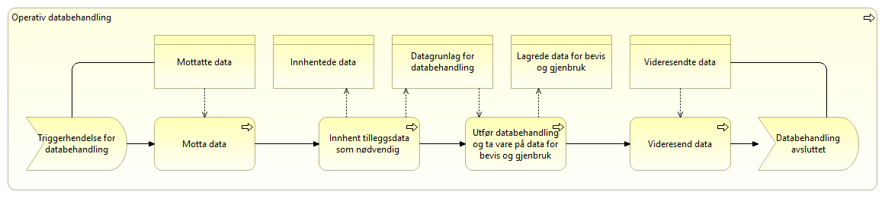

:lang: no
:doctitle:  Generisk prosess for operativ databehandling
:keywords: 

include::../plattform_felles/includes/commonincludes.adoc[]

Figuren nedenfor viser en generisk prosess for operativ databehandling, der datautveksling inngår. 

Oppsummering:

* Enhver databehandling krever data som input og vil resultere i output av data. 

* Input kan være alt fra en notifikasjon uten videre innhold til komplette meldinger. Om tilleggsdata må innhentes, gjøres dette f.eks. ved å forespørre  aktuelle datakilde eller ved å vente på ytterligere input initiert av andre.

* Output vil være lagrede data for bevis og gjenbruk, samt videresendte data til påfølgende ledd i behandlingskjeden, der det er aktuelt. 

* Det er ikke direkte vist i dette enkle prosessdiagrammet, men videresendte data kan her inkludere svar til avsender av mottatte data, i tillegg til en eller flere andre samhandlingsaktører.

* For behandling av personopplysninger må det finnes et dokumentert behandlingsgrunnlag, enten i form av hjemmel eller samtykke. Dette vil være del av det totale datagrunnlaget for databehandlingen. 

De viktigste kapabilitetene som behøves er indikert for hvert prosessteg. TBD?

.Generisk prosess for operativ databehandling

[cols ="1,1,3", options="header"]
.Elementer i view for Generisk prosess for operativ databehandling
|===

| Element
| Type
| Beskrivelse

| Operativ databehandling
| business-process
| 

| Innhent tilleggsdata som nødvendig 
| business-process
| 

| Lagrede data for bevis og gjenbruk
| business-object
| 

| Videresendte data
| business-object
| 

| Motta data
| business-process
| 

| Videresend data
| business-process
| 

| Innhentede data
| business-object
| 

| Mottatte data
| business-object
| 

| Datagrunlag for databehandling
| business-object
| 

| Databehandling avsluttet
| business-event
| 

| Utfør databehandling og ta vare på data for bevis og gjenbruk
| business-process
| 

| Triggerhendelse for databehandling
| business-event
| Med triggerhendelse menes 

Eksempler på triggerhendelser:

* mottak av melding fra annen samhandlingsaktør, som ledd i en tverrgående 
* 

|===