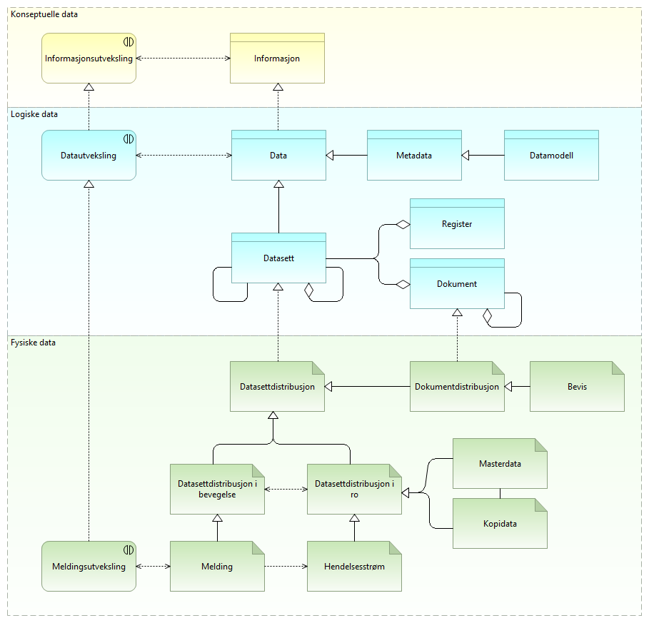

:lang: no
:doctitle: Hva er data?
:keywords: 

include::../plattform_felles/includes/commonincludes.adoc[]

Hva er _data_? 

Hva er _data_ i forhold til _informasjon_? Hva er forholdet mellom data og dokumenter? Hva er _datasett_? Hva menes med _bevis_ og _eBevis_?

Disse begrepene benyttes på ulike måter og kan lett misforstås. Her gjøres noen presiseringer i tilknytning til nasjonale referansearkitekurer (Norge). 

Iflg. https://en.wikipedia.org/wiki/Data: Data and information or knowledge are often used interchangeably; however data becomes information when it is viewed in context or in post-analysis.

Iflg. https://no.wikipedia.org/wiki/Data: Data er det materielle (eller fysiske) grunnlaget for å tilføre mennesker informasjon. Data er dermed det materielle grunnlaget for å overføre informasjon og kunnskap mellom mennesker ved kommunikasjon. Data kan registreres, lagres, behandles og flyttes av menneskeskapte innretninger som kalles datasystemer.

NOTE: Vi benytter Archimate-standarden for grafiske modeller. Archimate skiller, i likhet med en rekke andre standarder og rammeverk, mellom konseptuelle data (Business Object), logiske data (Data Object)  og fysiske data  (Artifact). Et slikt skille kan være nyttig.   

I tilknytning til nasjonale referansearkitekturer for datautveksling benyttes begrepet _data_ heller enn _informasjon_, så langt det gir mening. Det skilles likevel mellom data og informasjon i visse sammenhenger. Det gir f.eks. mening å si _informasjonssikkerhet_, mens en snakker om _sikring av data_ for å oppnå _informasjonssikkerhet_.

Data kan finnes med større eller mindre grad av struktur, og det er en flytende overgang mellom ustrukturerte, semistrukturerte og strukturerte data. Med nyere teknologier innen maskinlæring kan en også tolke og gi struktur og mening til data som en tidligere har definert som ustrukturerte. 

Data kan samles i _datasett_. Vi skiller mellom logiske  _datasett_ og den fysiske representasjonen i form av _datasettdistrubusjoner_ (ut fra begrepet _distribution_ i DCAT-standarden).  Det er den fysiske forekomsten av data i ulike systemer som vi må sikre og ha oversikt over, enten det dreier seg om data som er lagret over tid eller data som er i bevegelse mellom systemer i form av _meldinger_.

Begrepet _dokument_ benyttes tilsvarende om "logiske dokumenter", mens den fysiske representasjonen kan variere i ulike _dokumentdistribusjoner_.

En fysisk dokumentdistribusjon kan fungere som _bevis_, gitt at innholdet er tilstrekkelig sikret (integritet, ikkebenektelse). 

Meldingsutveksling er en grunnleggende mekanisme for  datautveksling.

Meldinger er i utgangspunktet i bevegelse og på vei i kommunikasjonssytemer, men kan mellomlagres og logges. 

Lagring av data skjer tradisjonelt ved å lagre hele datasett, men kan også gjøres ved at en lagrer inkrementelle endringer etterhvert som endringene mottas i en strøm av meldinger (eller hendelser)..

NOTE: Meldinger kan også vises på logisk og konseptuelt nivå (som meldingsspesifikasjon eller som begrep). Dette er ikke vist her.

.Hva er data

[cols ="1,1,3", options="header"]
.Elementer i view for Hva er data
|===

| Element
| Type
| Beskrivelse

| Konseptuelle data
| grouping
| 

| Informasjon
| business-object
| 

| Informasjonsutveksling
| business-interaction
| 

| Logiske data
| grouping
| 

| Metadata
| data-object
| 

| Data
| data-object
| DESCRIPTION:
Data is a reinterpretable representation of information in a formalized manner suitable for communication, interpretation, or processing 
This ABB is a key interoperability enabler (*) enabling for sharing/PROVISIONING and reusing/CONSUMING Data.

Source: ISO-IEC-2382-1 * 1993 * 
https://www.iso.org/obp/ui/#iso:std:iso-iec:2382:ed-1:v1:en

(*)DECISION (EU) 2015/2240 OF THE EUROPEAN PARLIAMENT AND OF THE COUNCIL of 25 November 2015  establishing a programme on interoperability solutions and common frameworks for European public administrations, businesses and citizens (ISA2 programme) as a means for modernising the public sector

Syn. Information

INTEROPERABILITY SALIENCY:
The Data ABB is salient for semantic interoperability because it represents the most important mean of interaction between ICT systems of organisations in order to ensure interoperability as stated in the EIF recommendation n° 30: "Perceive data and information as a public asset that should be appropriately generated, collected, managed, shared, protected and preserved."

EXAMPLES:
The following implementation is an example on how this specific Architecture Building Block (ABB) can be instantiated as a Solution Building Block (SBB):

ETS - Aggregated data
The EU ETS data viewer provides an easy access to emission trading data contained in the European Union Transaction Log (EUTL). The EUTL is a central transaction log, run by the European Commission, which checks and records all transactions taking place within the trading system. The EU ETS data viewer provides aggregated data by country, by main activity type and by year on the verified emissions, allowances and surrendered units of the more than 12 000 stationary installations reporting under the EU emission trading system, as well as 1400 aircraft operators.
https://www.eea.europa.eu/data-and-maps/dashboards/emissions-trading-viewer-1 

| Datamodell
| data-object
| 

| Datasett
| data-object
| Iflg. https://w3c.github.io/dxwg/dcat/#Class:Dataset : A collection of data, published or curated by a single agent, and available for access or download in one or more representations.

Et datasett kan inneholde eller lenkes til andre datasett. 

Oppbyggingen av datasett, samt relasjoner melom datasett, uttrykkes i datamodeller.

| Dokument
| data-object
| 

| Register
| data-object
| 

| Datautveksling
| application-interaction
| 

| Fysiske data
| grouping
| 

| Melding
| artifact
| Foreløpig tekst:  Meldinger består grovt sett av _meldingshode_ og _nyttelast_. Nyttelasten kan krypteres og sikres ende-til-ende mellom kommunikasjonspartene, mens meldingshodet inneholder adresseinformasjon og annet som må kunne inspiseres i kommunikasjonssystemene underveis. . 

| Datasettdistribusjon i ro
| artifact
| 

| Datasettdistribusjon i bevegelse
| artifact
| 

| Datasettdistribusjon
| artifact
| Synomym to dcat:Distribution ref.  https://w3c.github.io/dxwg/dcat/#Class:Distribution

Definition: A specific representation of a dataset. A dataset might be available in multiple serializations that may differ in various ways, including natural language, media-type or format, schematic organization, temporal and spatial resolution, level of detail or profiles (which might specify any or all of the above)

| Dokumentdistribusjon
| artifact
| 

| Bevis
| artifact
| 

| Meldingsutveksling
| technology-interaction
| 

| Masterdata
| artifact
| 

| Kopidata
| artifact
| 

| Hendelsesstrøm
| artifact
| 

|===
