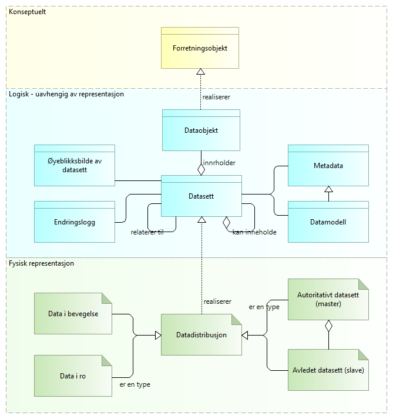

:lang: no
:doctitle: Introduksjon til referansearkitekturer for datautveksling
:keywords: Referansearkitektur
:toclevels: 3
include::../plattform_felles/includes/commonincludes.adoc[]

== Hva menes med datautveksling?
I sammenheng med nasjonale referansearkitekturer for datautveksling omfatter begrepet datautveksling alle former for dataflyt mellom tilbydere og konsumenter, enten det er internt i en virksomhet, mellom virksomheter eller mellom virksomheter og personer. Begrepet omfatter også  

== Hva er _data_ for _datautveksling_?

Det finnes ulike definisjoner av data i forhold til informasjon. 

//I utbredte modelleringsstandarder skilles det også mellom forretningsobjekter og dataobjekter - og det kan videre skilles mellom informasjon og begreper som kunnskap og visdom. Dette kan være forvirrende for mange (også arkitekter).  

I tilknytning til nasjonale referansearkitekturer for datautveksling er ikke alle distinksjonene nødvendigvis relevante. Så langt det gir mening,   benyttes begrepet _data_ heller enn _informasjon_.

Figuren nedenfor introduserer noen  begreper som anses som nyttige og nødvendige i sammenheng med aktuelle  referansearkitekturer for datautveksling.

// .Hva er data - overordnet konsept
// image::../nab_referanse_arkitekturer_datautveksling/media/Hva er data - overordnet konsept.png[alt=Hva er data - overordnet konsept image]

.Hva er data - grunnleggende konsepter ifm. datautveksling

At det gjøres en forskjell på _Forretningsobjekt_ og _Dataobjekt_ følger av aktuelle modlleringsstandarder, men kan ses som mindre viktig her. Spesielt interesserte kan finne mer om temaet under #[underline]##Modelleringskonvensjoner##.#

Data kan samles i _datasett_, som beskrives i form av metadata og datamodeller. 

Data og datasett er å oppfatte som "logiske" definisjoner, uten binding til  representasjon, teknisk løsning eller fysiske forekomster.

Innholdet i datasett ("selve dataene") kan redegjøres for i form av tidsstemplede _øyeblikksbilder_ eller ved  _endringslogger_ ut fra gitte øyeblikksbilder.

Begrepet _datadistrubusjon_ tilsvarer begrepet https://www.w3.org/TR/vocab-dcat/#Class:_Distribution[_distribution_] i DCAT-standarden. Dette kan f.eks. være dokumenter i et dokumentarkiv eller tabeller i en database.

Det er den fysiske forekomsten av data i ulike systemer som må sikres, enten det dreier seg om data som er lagret over tid (data at rest) eller data som finnes midlertidig mellom systemer i en datautveksling (data in motion).

Datautveksling kan skje gjennom felles datalager, men vil uansett omfatte en form for meldingsutveksling (synkront eller asynkront).

Det skilles videre mellom autoritative datasett (masterdata) og avledete data (slavedata). 

NOTE: Det er vanlig å skille mellom mellom data, informasjon og kunnskap. Det gir f.eks. mening å si _informasjonssikkerhet_, mens en snakker om _sikring av data_ for å oppnå _informasjonssikkerhet_. En skiller også gjerne mellom konseptuelle, logiske og fysiske data.

NOTE: Data kan finnes med større eller mindre grad av struktur, og det er en flytende overgang mellom ustrukturerte, semistrukturerte og strukturerte data. Med nyere teknologier innen maskinlæring kan en også tolke og gi struktur og mening til data som en tidligere har definert som ustrukturerte.

NOTE: Det finnes ulik praksis for bruk av begrepet _dokument_. Dette begrepet brukes derfor ikke her, dvs. i sammenheng med referansearkitekturer for datautveksling.  

== Omfang og avgrensing

Referansearkitekturene beskriver realisering av kapabiliteter, både for den operative datautvekslingen og for det som skal til rundt klargjøring og forvaltning på tvers av tilbydere, konsumenter og mellomledd. 

Det finnes en rekke tilstøtende og tverrgående temaer. Utvalgte slike temaer adresseres i kontekst, men noen av temaene er for store til å dekkes fullt ut her. 

Følgende figur gir en oversikt over kapabiliteter og temaer som adresseres i referansearkitektur for datautveksling. Videre nedbryting og forklaring gis i #...#

.Overordnede kapabilitetskart for datautveksling
image::../nab_referanse_arkitekturer_datautveksling\media\Overordnede kapabilitetskart for datautveksling, med mellomledd.png[alt="Overordnede kapabilitetskart for datautveksling, med mellomledd"]

