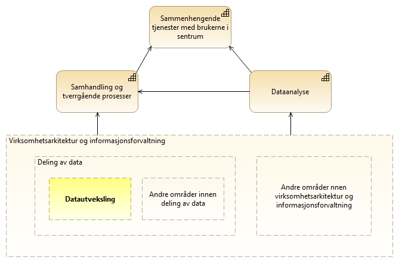

:lang: no
:doctitle: Introduksjon til referansearkitekturer for datautveksling
:keywords: Referansearkitektur
:toclevels: 3
include::../plattform_felles/includes/commonincludes.adoc[]

== Hva menes med datautveksling?
I sammenheng med nasjonale referansearkitekturer for datautveksling omfatter begrepet datautveksling alle former for dataflyt mellom tilbydere og konsumenter, enten det er internt i en virksomhet, mellom virksomheter eller mellom virksomheter og personer. Begrepet omfatter også  

== Forretningsmessig kontekst
Godt fungerende datautveksling inngår som et viktig element i for å nå målene i regjeringens digitaliseringsstrategi. Et overordnet mål er sammenhengende tjenester for personer og virksomheter. Datautveksling handler om å forsyne forretningsprosesser og dataanalyse med nødvendig datagrunnlag. Figuren under illustrerer dette.  

.Datautveksling i kontekst

== Hva er _data_ for datautveksling?

Se figuren nedenfor.

// .Hva er data - overordnet konsept
// image::../nab_referanse_arkitekturer_datautveksling/media/Hva er data - overordnet konsept.png[alt=Hva er data - overordnet konsept image]

.Hva er data - grunnleggende konsepter ifm. datautveksling
image::../nab_referanse_arkitekturer_datautveksling/media/Hva er data for datautveksling.png[alt=Hva er data for datautveksling]

I tilknytning til nasjonale referansearkitekturer for datautveksling benyttes begrepet _data_ og _datasett_ heller enn _informasjon_, så langt det gir mening. 

Data kan samles i _datasett_, som beskrives i form av metadata og datamodeller. 

Data og datasett er å oppfatte som "logiske" definisjoner, uten binding til  representasjon, teknisk løsning eller fysiske forekomster.

Begrepet _datadistrubusjon_ tilsvarer begrepet https://www.w3.org/TR/vocab-dcat/#Class:_Distribution[_distribution_] i DCAT-standarden. Dette kan f.eks. være dokumenter i et dokumentarkiv eller tabeller i en database.

Det er den fysiske forekomsten av data i ulike systemer som må sikres, enten det dreier seg om data som er lagret over tid eller data som finnes midlertidig mellom systemer i en datautveksling. #datalager... melding...#

Det skilles videre mellom autoritative datasett (masterdata) og avledete data (slavedata). 

NOTE: Det er vanlig å skille mellom mellom data, informasjon og kunnskap. Det gir f.eks. mening å si _informasjonssikkerhet_, mens en snakker om _sikring av data_ for å oppnå _informasjonssikkerhet_. En skiller også gjerne mellom konseptuelle, logiske og fysiske data.

NOTE: Data kan finnes med større eller mindre grad av struktur, og det er en flytende overgang mellom ustrukturerte, semistrukturerte og strukturerte data. Med nyere teknologier innen maskinlæring kan en også tolke og gi struktur og mening til data som en tidligere har definert som ustrukturerte.

NOTE: Det finnes ulik praksis for bruk av begrepet _dokument_. 

== Omfang og avgrensing

Referansearkitekturene beskriver realisering av kapabiliteter, både for den operative datautvekslingen og for det som skal til rundt klargjøring og forvaltning på tvers av tilbydere, konsumenter og mellomledd. 

Det finnes en rekke tilstøtende og tverrgående temaer. Utvalgte slike temaer adresseres i kontekst, men noen av temaene er for store til å dekkes fullt ut her. 

Følgende figur gir en oversikt over kapabiliteter og temaer som adresseres i referansearkitektur for datautveksling. Videre nedbryting og forklaring gis i #...#

.Overordnede kapabilitetskart for datautveksling
image::../nab_referanse_arkitekturer_datautveksling\media\Overordnede kapabilitetskart for datautveksling, med mellomledd.png[alt="Overordnede kapabilitetskart for datautveksling, med mellomledd"]

