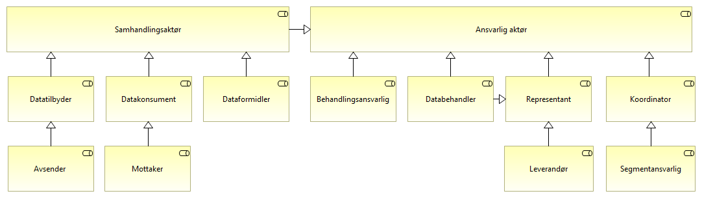
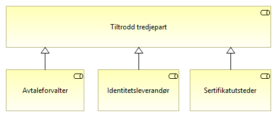

:lang: no
:doctitle: Roller invovert i datautveksling
:keywords: 
:toclevels: 3
include::../plattform_felles/includes/commonincludes.adoc[]

Se figuren under.

== Samhandlingsaktører

.Samhandlingsaktører

[cols ="1,3", options="header"]
.Elementer i view for Samhandlingsaktører
|===

| Element
| Beskrivelse

| Datatilbyder
| Tilbyder av data til andre aktører.

| Datakonsument
| Den som innhenter eller mottar data fra andre aktører.

| Dataformidler
| En aktør som formidler data mellom tilbyder og konsument.

F.eks. tilbyder av meldingsinfrastruktur, aksesspunkt, mellomliggende lagringsløsninger etc.

| Samhandlingsaktør
| Den som inngår i en samhandlingsprosess og samhandler med en annen samhandlingsaktør. Kan være en tilbyder, konsument, avsender, mottaker, leverandør etc.

| Avsender 
| Den som sender en elektronisk melding eller tilsvarende.

| Mottaker
| Den som mottar en elektronisk melding eller tilsvarende.

| Databehandler
| Den som behandler personopplysninger på oppdrag fra den behandlingsansvarlige. Dette er vanligvis en virksomhet. Ref. https://www.datatilsynet.no/rettigheter-og-plikter/virksomhetenes-plikter/databehandleravtale/behandlingsansvarlig-og-databehandler/

| Representant
| Den som representerer en samhandlingsaktør enten gjennom hjemmel, fullmakt eller samtykke. Fullmakt omfatter her delegert rettighet gitt til leverandør av ansvarlig samhandlingsaktør.

Representant kan også være f.eks. verge, fullmektig eller annen bemyndiget person.

En annen type representant er databehandler i betydningen representant for behandlingsansvarlig (personvern).

| Behandlingsansvarlig
| Den som bestemmer formålet med behandlingen av personopplysninger og hvilke hjelpemidler som skal brukes. Dette er vanligvis en virksomhet.  Se også https://www.datatilsynet.no/rettigheter-og-plikter/virksomhetenes-plikter/databehandleravtale/behandlingsansvarlig-og-databehandler/?id=11274

| Ansvarlig aktør
| Den som har eller er delegert et ansvar i forbindelse med databehandling.

|===

== Tiltrodde tredjeparter

.Tiltrodde tredjeparter

[cols ="1,3", options="header"]
.Elementer i view for Tiltrodde tredjeparter
|===

| Element
| Beskrivelse

| Identitetsleverandør
| 

| Avtaleforvalter
| Felleskapsforvalter

| Tiltrodd tredjepart
| 

| Sertifikatutsteder
| 

|===

