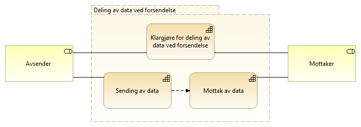
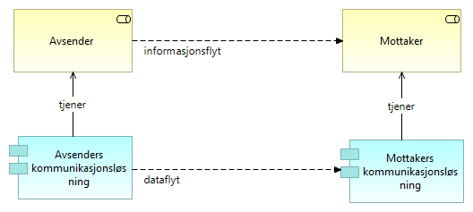

:lang: no
:doctitle: Mønstre for _forsendelse_
:keywords: TBD
:toclevels: 3
include::../plattform_felles/includes/commonincludes.adoc[]

:leveloffset: +1

////
= Brukstilfeller
Området _Deling av data ved forsendelse_ omfatter i hovedsak meldingsforsendelse.

Aktuelle brukstilfeller er:

* melding om hendelser og data mellom to kjente parter i tverrgående forretningsprosesser, f.eks. saksbehandlingsprosesser.

* melding om hendelser og data  til mellomliggende løsninger for dataformidling

* melding om  hendelser og data til datalagringsløsninger

////

////
= Generisk mønster for dataforsendelse

.Kapabiliteter for deling av data ved forsendelse

.Generisk dataforsendelse - operativt

////

_Dette er en del  link:../nab_referanse_arkitekturer_datautveksling/[Referansearkitektur for datautveksling]_.

= Generisk mønster for meldingsforsendelse

include::../nab_referanse_arkitekturer_meldingsutveksling_generisk/book-ra-generisk-meldingsutveksling.adoc[]

= eMelding -  en modell for forsendelse mellom ulike løsninger  
include::../nab_referanse_arkitekturer_emelding/book-ra-emelding.adoc[]