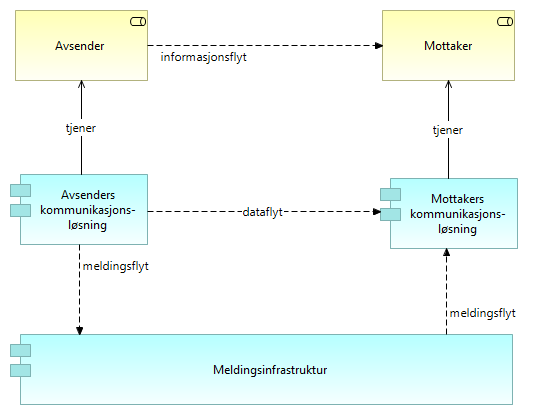

:lang: no
:doctitle: Forsendelse arkitekturmønstre 
:keywords: TBD
:toclevels: 3
include::../plattform_felles/includes/commonincludes.adoc[]

:leveloffset: +1
= Introduksjon
Området _Deling av data ved forsendelse_ omfatter i hovedsak meldingsforsendelse.

Eksempler på bruk er:

* melding om hendelser og data mellom to kjente parter i tverrgående forretningsprosesser, f.eks. saksbehandlingsprosesser.

* melding om  hendelser og data til datalagringsløsninger

* melding om hendelser og data  til mellomliggende løsninger for dataformidling

////
= Generisk mønster for dataforsendelse

.Kapabiliteter for deling av data ved forsendelse
image::../nab_referanse_arkitekturer_datautveksling_forsendelse/media/Kapabiliteter for deling av data ved forsendelse.png[alt=Kapabiliteter for deling av data ved forsendelse image]

.Generisk dataforsendelse - operativt
image::../nab_referanse_arkitekturer_datautveksling_forsendelse/media/Generisk dataforsendelse - operativt.png[alt=Generisk dataforsendelse - operativt image]
////

= Grunnleggende mønstre og konsepter for meldingsutveksling

== Generisk meldingsforsendelse

I sin enkleste form handler dette om realisering av informasjonsflyt nellom avsender og mottaker som dataflyt mellom kommunikasjonsløsningene på hver side, i form av meldingsflyt gjennom underliggende infrastruktur for meldingssutveksling. Dette er illustrert i følgende figur.  

.Generisk meldingsforsendelse

Det finnes flere mer detaljerte mønstre som bygger på dette.

== Firehjørnersmodellen
Begrepet "firehjørnersmodell", eller “4-corner model”, stammer fra  link:../kunnskap_referansearkitektur_eu-edelivery[CEF eDelivery]. 

Følgende figur illustrerer grunnleggende konsepter: 

// .Firehjørnersmodellen - operativt
// image::../nab_referanse_arkitekturer_datautveksling_forsendelse/media/Firehjørnersmodellen - operativt.png[alt=Firehjørnersmodellen - operativt image]

.Firehjørnersmodellen - forvaltningsmessig
image::../nab_referanse_arkitekturer_datautveksling_forsendelse/media/Firehjørnersmodellen - forvaltningsmessig.png[alt=Firehjørnersmodellen - forvaltningsmessig image]

NOTE: Denne modellen kan minne om en "tjenestebuss" (ESB), der det også finnes tilsvarende løs kopling mellom avsender og mottaker. Den grunnleggende forskjellen er at dette mønsteret er fullstendig distribuert og skalerer "uendelig"  over www på global basis.

I firehjørnersmodellen kommuniserer avsenders og mottakers systemer via hver sine _aksesspunktløsninger_. Aksesspunktene konverterer mellom applikasjonsspesifikke protokoller og en standardisert, sikker meldingsprotokoll over internett.

#Fleksibilitet... runtine.... avtalemessig... både design tine og runtime!!!!!!!!!!!!!!!!!#

I denne modellen In this model, the back-end systems of the users don’t exchange data directly with each other but do this through Access Points. These Access Points are conformant to the same technical specifications and therefore capable of communicating with each other.

As a result of this, users adopting CEF eDelivery can easily and safely exchange data even if their IT systems were developed independently from each other.

4-hjørnersmodellen er basert på en distribuert modell som tillater kommunikasjon mellom samhandlingsaktører uten behov for bilaterale avtaler ved at man baserer seg på innmelding i et fellesskap.

4-hjørnersmodellen med adresse- og kapabilitetsoppslag sikrer fleksibilitet og skalerbarhet hvor

////
Firehjørnersmodellen for meldingsforsendelse

.Firehjørnersmodellen - operativt
image::../nab_referanse_arkitekturer_datautveksling_forsendelse/media/Firehjørnersmodellen - operativt.png[alt=Firehjørnersmodellen - operativt image]

Tekst...

.Firehjørnersmodellen - forvaltningsmessig
image::../nab_referanse_arkitekturer_datautveksling_forsendelse/media/Firehjørnersmodellen - forvaltningsmessig.png[alt=Firehjørnersmodellen - forvaltningsmessig image]
////

= eMelding
include::../nab_referanse_arkitekturer_emelding/book-ra-emelding.adoc[]