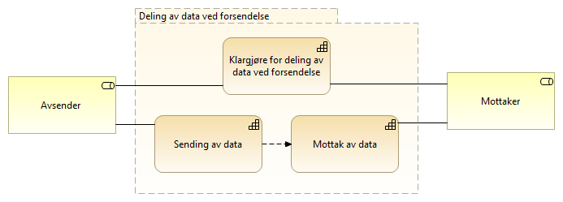

:lang: no
:doctitle: Forsendelse arkitekturmønstre 
:keywords: TBD
:toclevels: 3
include::../plattform_felles/includes/commonincludes.adoc[]

:leveloffset: +1
= Introduksjon
Området _Deling av data ved forsendelse_ omfatter i hovedsak meldingsforsendelse.

Eksempler på bruk er:

* melding om hendelser og data mellom to kjente parter i tverrgående forretningsprosesser, f.eks. saksbehandlingsprosesser.

* melding om  hendelser og data til datalagringsløsninger

* melding om hendelser og data  til mellomliggende løsninger for dataformidling

////
= Generisk mønster for dataforsendelse

.Kapabiliteter for deling av data ved forsendelse
image::../nab_referanse_arkitekturer_datautveksling_forsendelse/media/Kapabiliteter for deling av data ved forsendelse.png[alt=Kapabiliteter for deling av data ved forsendelse image]

.Generisk dataforsendelse - operativt
image::../nab_referanse_arkitekturer_datautveksling_forsendelse/media/Generisk dataforsendelse - operativt.png[alt=Generisk dataforsendelse - operativt image]
////

= Kapabilitetskart for deling av data ved forsendelse

[cols ="1,3", options="header"]
.Elementer i view for Kapabiliteter eMelding
|===

| Element
| Beskrivelse

| Sending av data
| Evnen til å sende data til en mottaker.

| Mottak av data
| Evnene til å motta en melding eller forsendelse fra en avsender.

| Klargjøre for deling av data ved forsendelse
| Evne til å klargjøre for meldingsutveksling med eksterne parter.

| Mottaker
| Den som mottar en melding.

| Avsender 
| Den som sender et brev, en pakke, en e-post, en elektronisk melding, en SMS eller lignende.

|===

= Generisk mønster for meldingsforsendelse

I sin enkleste form handler dette om realisering av informasjonsflyt nellom avsender og mottaker som dataflyt mellom kommunikasjonsløsningene på hver side, i form av meldingsflyt gjennom underliggende infrastruktur for meldingssutveksling. Dette er illustrert i følgende figur.  

.Generisk meldingsforsendelse
image::../nab_referanse_arkitekturer_datautveksling_forsendelse/media/Generisk meldingsforsendelse.png[alt=Generisk meldingsforsendelse image]

Det finnes flere mer detaljerte mønstre som bygger på dette.

////
Firehjørnersmodellen for meldingsforsendelse

.Firehjørnersmodellen - operativt
image::../nab_referanse_arkitekturer_datautveksling_forsendelse/media/Firehjørnersmodellen - operativt.png[alt=Firehjørnersmodellen - operativt image]

Tekst...

.Firehjørnersmodellen - forvaltningsmessig
image::../nab_referanse_arkitekturer_datautveksling_forsendelse/media/Firehjørnersmodellen - forvaltningsmessig.png[alt=Firehjørnersmodellen - forvaltningsmessig image]
////

= eMelding
include::../nab_referanse_arkitekturer_emelding/book-ra-emelding.adoc[]