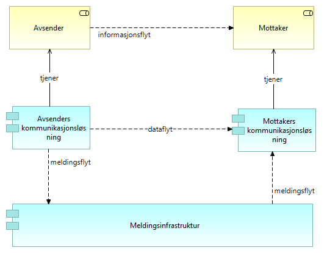

:lang: no
:doctitle: Forsendelse arkitekturmønstre 
:keywords: TBD
:toclevels: 3
include::../plattform_felles/includes/commonincludes.adoc[]

:leveloffset: +1
= Introduksjon
Området _Deling av data ved forsendelse_ omfatter i hovedsak meldingsforsendelse.

Eksempler på bruk er:

* melding om hendelser og data mellom to kjente parter i tverrgående forretningsprosesser, f.eks. saksbehandlingsprosesser.

* melding om  hendelser og data til datalagringsløsninger

* melding om hendelser og data  til mellomliggende løsninger for dataformidling

////
= Generisk mønster for dataforsendelse

.Kapabiliteter for deling av data ved forsendelse
image::../nab_referanse_arkitekturer_datautveksling_forsendelse/media/Kapabiliteter for deling av data ved forsendelse.png[alt=Kapabiliteter for deling av data ved forsendelse image]

.Generisk dataforsendelse - operativt

////

= Generisk mønster for meldingsforsendelse

.Kapabiliteter for deling av data ved forsendelse
image::../nab_referanse_arkitekturer_datautveksling_forsendelse/media/Kapabiliteter for deling av data ved forsendelse.png[alt=Kapabiliteter for deling av data ved forsendelse image]

.Generisk meldingsforsendelse

= Firehjørnersmodellen for meldingsforsendelse
Tekst...

.Firehjørnersmodellen - operativt
image::../nab_referanse_arkitekturer_datautveksling_forsendelse/media/Firehjørnersmodellen - operativt.png[alt=Firehjørnersmodellen - operativt image]

Tekst...

.Firehjørnersmodellen - forvaltningsmessig
image::../nab_referanse_arkitekturer_datautveksling_forsendelse/media/Firehjørnersmodellen - forvaltningsmessig.png[alt=Firehjørnersmodellen - forvaltningsmessig image]

= eMelding
include::../nab_referanse_arkitekturer_emelding/book-ra-emelding.adoc[]