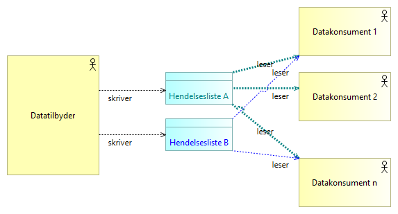
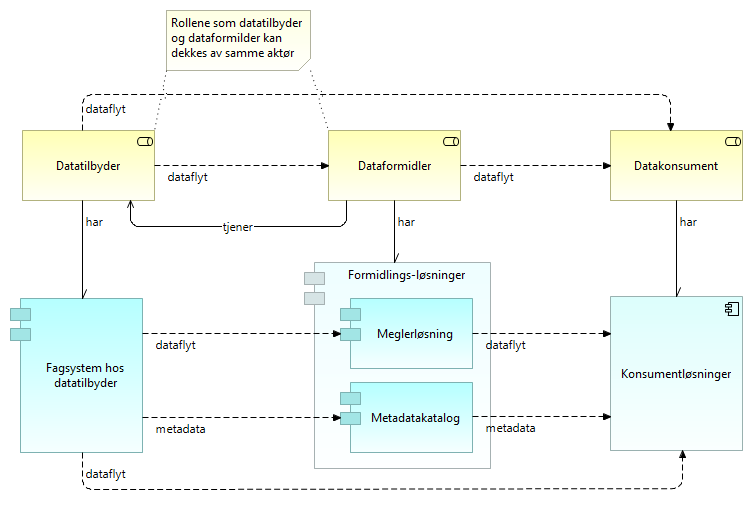

:lang: no
:doctitle: Mønstre for publisering 
:keywords: TBD
:toclevels: 3
include::../plattform_felles/includes/commonincludes.adoc[]

:leveloffset: +1

:leveloffset: +1
_Dette er en del av link:../nab_referanse_arkitekturer_datautveksling/[Referansearkitektur for datautveksling]_

= Introduksjon

image:../plattform_felles/media/i-arbeid.png[width=45, height=45] _UNDER OPPDATERING, 2020-04-23_

Mønstre for publisering handler om hendelsesbasert deling av data med  løs kopling mellom tilbyder og konsument. 

Eksempler på anvendelse:  

* Strømming av forretningsmessige hendelsesdata, f.eks. i tilknytning til vedtak i offentlig saksbehandling.
* Hendelsesbasert oppdatering av kopier og avledede datasett.
* Strømming av IoT-data, enten periodisk (tidshendelse) eller ved terskeloverskridende endringer i måleverdier.

//_Generisk mønster for publisering_ beskriver det som er felles for ulike måter å publisere data om hendelser på.

= Grunnleggende konsepter for publisering

Følgende figur illustrerer grunnleggende konsepter for publisering.    

.Publisering - enkel illustrasjon

Ved publisering etableres en løs kopling mellom datatilbyder og datakonsument, der 

Dette kan gjøres på flere måter. Noen eksempler:

a. Data tilgjengeliggjøres helt åpent, slik at hvem som vil kan konsumere data. Ulike tekniske løsninger for dette finnes. Referansearkitektur for eOppslag beskriver hvordan dette  dette kan gjøres gjennom API-er.

b. Metadata publiseres åpent, men data kan kun konsumeres av aktører med nødvendige rettigheter. Referansearkitektur for eOppslag beskriver hvordan dette  dette kan gjøres gjennom oppsett av rettigheter til API-er.

c. Datakonsument abonnerer på å få tilsendt oppdaterte data, med utgangspunkt i abonnementsavtale som spesifiserer hvilke data som ønskes.

d. Datakonsument abonnerer på notifikasjoner ved gitte hendelser.

e. Datakonsumenter henter selv inn notifikasjoner om hendelser ved å gjøre spørringer mot åpent tilgjengelige hendelseslister. 

////

men en grunnleggende egenskap er behovet for et mellomledd, eller en _datafordeler_, slik at datatilbyder ikke behøver å vite om datakonsumentene ved selve publiseringen. 

En helt annen sak er at det kreves tilgangsstyring ved lesing av data, og det kan være  behov for oppsett av avtaler og abonnementer mot _datafordeler_ for lesing av publiserte data. Det kan tilsvarende være behov for avtaler og tilgangsstyring mot datatilbyder, om det legges opp til  å kunne berike publiserte data med tillegginformasjon direkte fra datatilbyder. Det siste er typisk tilfelle ved publisering hendelsesdata, der det normalt vil gis en notifikasjon om hva som har skjedd, uten at alle detaljene gis straks.

Legg merke til at konseptet med en mellomliggende _datafordeler_ ikke utelukker at dette dekkes av datatilbyder selv. Dette er å oppfatte som en konseptuell arkitekturbyggekloss, og kan realiseres på ulike måter. Om det benyttes en ekstern tjeneste eller leverandør for _datafordeler_, introduseres imidlertid behov for avtaler mellom datatilbyder og _datafordeler_, i tillegg til tilsvarende mot datakonsument.
////

//Henrik: Figuren under er tatt ut. Erstattes med ny figur uten "Dataformidler"

////

Figuren nedenfor illustrerer grunnleggende konsepter.

.Publisering av data og hendelser - grunnleggende konsepoter

Kommentarer til denne figuren:

* Figuren viser logiske flyten data og metadata. I en ren push-basert løsning vil dette tilsvare meldingsflyt, men i en pull-basert løsning er det datakonsumentene som tar initiativ til innhenting. 

* Rollen som _dataformidler_ kan være ivaretatt av datatilbyder selv, uten et eksternt mellomledd. 

* _Meglerløsning_ er her en konseptuell arkitekturbyggekloss, og kan være integrert i _fagsystem hos datatilbyder_.

* _Metadatakatalog_ benyttes for å finne fram til aktuelle datakilder, enten runtime eller designtime. Eksempel på løsning: Felles datakatalog.  

////

////
== Videre beskrivelser av generisk mønster for publisering 
image:../plattform_felles/media/i-arbeid.png[width=45, height=45] _I arbeid (høst 2019)_
////

= Begrepsapparat 

Grunnleggende begreper og sammenhenger er vist i følgende modell. 

.eNotifikasjon - grunnleggende begreper
image::../nab_referanse_arkitekturer_enotifikasjon/media/eNotifikasjon - grunnleggende begreper.png[alt=eNotifikasjon - grunnleggende begreper image]

_Hendelser_ er det som skjer i den virkelige i verden, i en strøm av hendelser, eller __hendelsesstrømmer__. 

_Notifikasjoner_ gir informasjon om hendelser, og kan distribueres via _hendelseslister_ (på engelsk brukes begrepet __topics__) til den som måtte være interessert.

I tilknytning til hver hendelse finnes _Hendelsesdata_. Dette kan være små eller store _Datasett_, enten lagret samlet eller lagret distribuert i flere ulike lagringsløsninger (polyglot persistence).

Notifikasjoner kan inneholde _komplette hendelsesdata_,  men dette er i mange tilfeller ikke hensiktsmessig. Alternativet er å la konsumentene komme tilbake og be om _supplerende data_. Det er f.eks. uproblematisk å sende med en ny måleverdi for et termometer, mens det kan være mindre ønskelig å distribuere komplette kopier av større og distribuerte datasett. Hensynet til dataminimering spiller også en rolle i slike vurderinger.

= eNotifikasjon - strømming av hendelser
include::../nab_referanse_arkitekturer_enotifikasjon/book-ra-enotifikasjon.adoc[]

:leveloffset: -1
