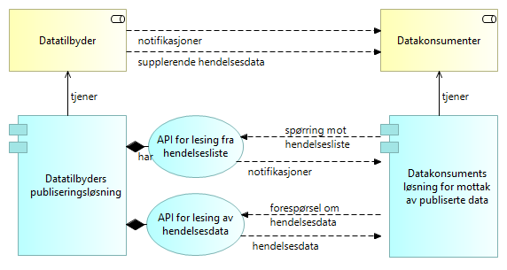
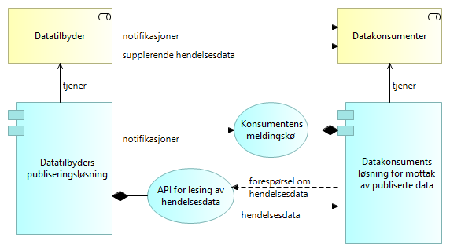
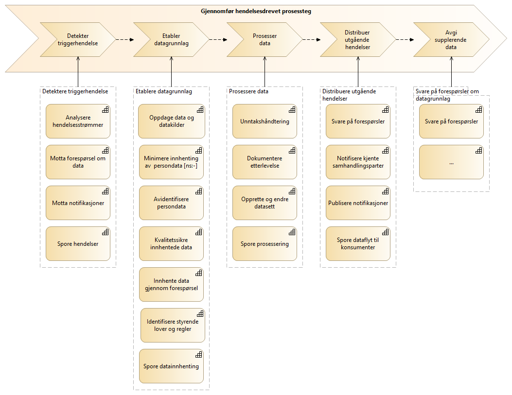

:lang: no
:doctitle: Mønstre for publisering 
:keywords: TBD
:toclevels: 3
include::../plattform_felles/includes/commonincludes.adoc[]

:leveloffset: +1

:leveloffset: +1
_Dette er en del av link:../nab_referanse_arkitekturer_datautveksling/[Referansearkitektur for datautveksling]_

image:../plattform_felles/media/i-arbeid.png[width=45, height=45] _UNDER OPPDATERING, 2020-04-24_

= Introduksjon

Mønstre for publisering handler om hendelsesbasert deling av data med  løs kopling mellom tilbyder og konsument. 

Eksempler på anvendelse:  

* Strømming av forretningsmessige hendelsesdata, f.eks. i tilknytning til vedtak i offentlig saksbehandling.
* Hendelsesbasert oppdatering av kopier og avledede datasett.
* Strømming av IoT-data, enten periodisk (tidshendelse) eller ved terskeloverskridende endringer i måleverdier.

//_Generisk mønster for publisering_ beskriver det som er felles for ulike måter å publisere data om hendelser på.

= Grunnleggende konsepter for publisering

== Generelt
Her introduseres noen begreper og konsepter. Videre detaljering av dette gis i påfølgende avsnitt, samt i tilknytning til spesifikke arkitekturmønstre.   

Det helt  grunnleggende konseptet er at datatilbyder publiserer _notifikasjoner_ om hendelser uten å nødvendigvis vite hvem som er interessert og vil konsumere notifikasjonene.

Selve notifikasjonene kan inneholde alle aktuelle hendelsesdata, eller det vil være nødvendig for konsumenten å innhente supplerende hendelsesdata. Dette er vist i følgende figur.   

.Publisering - grunnleggende konsept

Måten notifikasjoner publiseres og distribueres på kan variere, men konseptuelt sett brukes begrepet _hendelsesliste_ om en strøm av hendelser i form av notifikasjoner. 

Datatilbyder skriver notifikasjoner til hendelseslister (engelsk begrep: topics) etterhvert som hendelser skjer, mens konsumentene kan lese ut informasjon om hendelsene når det passer. 

.Publisering - enkel illustrasjon

Noen eksempler på ulike måter og tekniske løsninger å gjøre publisering på:

a. Data tilgjengeliggjøres helt åpent, slik at hvem som vil kan konsumere data. 
+
NOTE: Arkitekturmønsteret _eOppslag_ beskriver hvordan dette  dette kan gjøres gjennom API-er.

b. Metadata publiseres åpent, men data kan kun konsumeres av aktører med nødvendige rettigheter. Referansearkitektur for eOppslag beskriver hvordan dette  dette kan gjøres gjennom oppsett av rettigheter til API-er.

c. Datakonsument abonnerer på å få tilsendt oppdaterte data ved gitte hendelser (eventuelt periodisk), med utgangspunkt i abonnementsavtale som spesifiserer hvilke data som ønskes m.m. 
+
NOTE: Begrepet publish-subscriber henspeiler på dette.

e. Datakonsumenter henter selv inn notifikasjoner om hendelser ved å gjøre spørringer mot åpent tilgjengelige hendelseslister. 
+
NOTE: Dette er utgangspunktet for det mønsteret som her kalles _eNotifikasjon_.

////

men en grunnleggende egenskap er behovet for et mellomledd, eller en _datafordeler_, slik at datatilbyder ikke behøver å vite om datakonsumentene ved selve publiseringen. 

En helt annen sak er at det kreves tilgangsstyring ved lesing av data, og det kan være  behov for oppsett av avtaler og abonnementer mot _datafordeler_ for lesing av publiserte data. Det kan tilsvarende være behov for avtaler og tilgangsstyring mot datatilbyder, om det legges opp til  å kunne berike publiserte data med tillegginformasjon direkte fra datatilbyder. Det siste er typisk tilfelle ved publisering hendelsesdata, der det normalt vil gis en notifikasjon om hva som har skjedd, uten at alle detaljene gis straks.

Legg merke til at konseptet med en mellomliggende _datafordeler_ ikke utelukker at dette dekkes av datatilbyder selv. Dette er å oppfatte som en konseptuell arkitekturbyggekloss, og kan realiseres på ulike måter. Om det benyttes en ekstern tjeneste eller leverandør for _datafordeler_, introduseres imidlertid behov for avtaler mellom datatilbyder og _datafordeler_, i tillegg til tilsvarende mot datakonsument.
////

//Henrik: Figuren under er tatt ut. Erstattes med ny figur uten "Dataformidler"

////

Figuren nedenfor illustrerer grunnleggende konsepter.

.Publisering av data og hendelser - grunnleggende konsepoter
image::../nab_referanse_arkitekturer_datautveksling_publisering/media/Publisering av data og hendelser - grunnleggende konsepoter.png[alt=Publisering av data og hendelser - grunnleggende konsepter image]

Kommentarer til denne figuren:

* Figuren viser logiske flyten data og metadata. I en ren push-basert løsning vil dette tilsvare meldingsflyt, men i en pull-basert løsning er det datakonsumentene som tar initiativ til innhenting. 

* Rollen som _dataformidler_ kan være ivaretatt av datatilbyder selv, uten et eksternt mellomledd. 

* _Meglerløsning_ er her en konseptuell arkitekturbyggekloss, og kan være integrert i _fagsystem hos datatilbyder_.

* _Metadatakatalog_ benyttes for å finne fram til aktuelle datakilder, enten runtime eller designtime. Eksempel på løsning: Felles datakatalog.  

////

////
== Videre beskrivelser av generisk mønster for publisering 
image:../plattform_felles/media/i-arbeid.png[width=45, height=45] _I arbeid (høst 2019)_
////

== Pull-basert og push-basert distribusjon av notifikasjoner

Når konsumentene uten videre kan kople seg på aktuelle hendelseslister og lese ut de notifikasjonene som ønskes, fås størst mulig grad av fri kopling mellom datatilbyder og datakonsumenter.

Som vist i følgende figur, gjøres dette typisk gjennom ulike API-er: 

1. API for oppslag/spørring mot hendelseslister.
2. API for oppslag/innhenting av supplerende hendelsesdata (ved behov).

NOTE: Begge disse måtene å gjøre oppslag på dekkes av _eOppslag_ arkitekturmønster. API-er for oppslag i hendelseslister kan f.eks. også finnes gjennom Felles datakatalog,  

.Pull-basert publisering av notifikasjoner

NOTE: Dette konseptet er det som ligger til grunn for mønsteret _eNotifikasjon_.  

Notifikasjoner kan også sendes direkte til mottakers egen løsning, typisk med asynkrone meldinger til en meldingskø ut fra abonnementsavtale.

.Push-basert publisering av notifikasjoner

NOTE: Om push-basert distribusjon er å oppfatte som "publisering", kan diskuteres. Figuren viser ikke alle detaljer, men en kan tenke seg en løs kopling mellom tilbyder og konsumenter også med dette mønsteret.     

== Forholdet til hendelsesdrevet arkitektur

image:../plattform_felles/media/i-arbeid.png[width=45, height=45] #_Dette kapitlet er til vurdering inn/ut?_#

.Hendelsesdrevet prosessteg  (med utkast til kapabiliteter)

= Begrepsapparat 

Grunnleggende begreper og sammenhenger er vist i følgende modell. 

.eNotifikasjon - grunnleggende begreper
image::../nab_referanse_arkitekturer_enotifikasjon/media/eNotifikasjon - grunnleggende begreper.png[alt=eNotifikasjon - grunnleggende begreper image]

_Hendelser_ er det som skjer i den virkelige i verden, i en strøm av hendelser, eller __hendelsesstrømmer__. 

_Notifikasjoner_ gir informasjon om hendelser, og kan distribueres via _hendelseslister_ (på engelsk brukes begrepet __topics__) til den som måtte være interessert.

I tilknytning til hver hendelse finnes _Hendelsesdata_. Dette kan være små eller store _Datasett_, enten lagret samlet eller lagret distribuert i flere ulike lagringsløsninger (polyglot persistence).

Notifikasjoner kan inneholde _komplette hendelsesdata_,  men dette er i mange tilfeller ikke hensiktsmessig. Alternativet er å la konsumentene komme tilbake og be om _supplerende data_. Det er f.eks. uproblematisk å sende med en ny måleverdi for et termometer, mens det kan være mindre ønskelig å distribuere komplette kopier av større og distribuerte datasett. Hensynet til dataminimering spiller også en rolle i slike vurderinger.

Begrepet _klassifisering_ benyttes her om ulike typer metadata om datasettet som kan gi grunnlag for dataminimering, f.eks. at det inneholder persondata. Dette gjelder både for hendelsesdata og det _øyeblikksbildet_ (eller instansen av datasettet) som forelå da hendelsen inntraff og som forbindes med notifikasjonen.

For notifikasjoner som ikke gir det komplette _øyeblikksbildet_, må datakonsumenten avgjøre om det behøves supplerende data, og selv ta initiativ til å innhente de dataene det er behov for.

Hvordan konsumenten identifiserer aktuelle supplerende hendelsesdata, kan variere. En mulighet er at notifikasjonen inneholder en peker til det aktuelle datasettet, dvs. øyeblikksbildet, og at dette gjøres gjennom en _identifikator for øyeblikksbilde av datasett_. Selve datasettet, og instansen av datasettet, kan eventuelt være sammensatt og ligge distribuert. Det vil også kunne lenke til relaterte datasett som ikke ses på som en direkte del av det aktuelle datasettet (og der det kan være vanskelig å garantere at det finnes et konsistent øyeblikksbilde).

TIP: En globalt unik identifikator kan fungere som en direkte peker til aktuelle dataressurser på nettet. En kan da, under visse forutsetninger, unngå behovet for å måtte innhente kopier av supplerende data, også for data som ligger hos andre virksomheter og eventuelt distribuert hos flere virksomheter. 

= eNotifikasjon - strømming av hendelser
include::../nab_referanse_arkitekturer_enotifikasjon/book-ra-enotifikasjon.adoc[]

:leveloffset: -1
