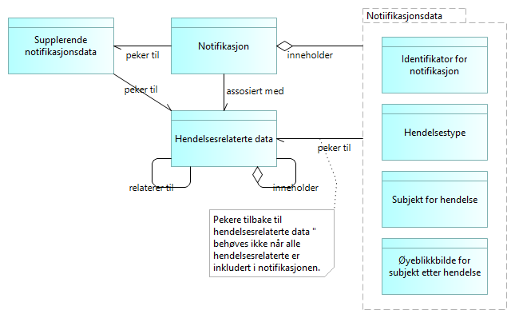
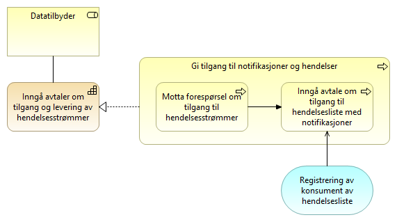

:lang: no
:doctitle: Mønstre for publisering 
:keywords: TBD
:toclevels: 3
include::../plattform_felles/includes/commonincludes.adoc[]

_Dette er en del av link:../nab_referanse_arkitekturer_datautveksling/[Referansearkitektur for datautveksling]_

image:../plattform_felles/media/i-arbeid.png[width=45, height=45] _UNDER OPPDATERING etter innspill 2020-04-28_

== Introduksjon
[[basiskonsept-publisering]]
Mønstre for publisering handler helt grunnleggende om at tilbydere publiserer hendelsesstømmer uten å måtte vite hvem konsumentene er. Konsumentene kan i sin tur koble seg på hendelsesstrømmene.

.Publisering av hendelser - basiskonsept

Dette gir en form for løs kobling mellom aktørene som fremmer innovasjon og samhandling. Nye samhandlingsparter kan kople seg på i tjenesteproduksjonen  i en form for dynamisk økosystem. Forretningsprosessene behøver ikke være kartlagt og fastsatt i minste detalj på forhånd.

Endringer i IT-systemene blir også enklere, fordi det vil være mindre avhengigheter til systemene hos andre virksomheter. En ønsker generelt å komme bort fra store monolittiske systemer som ikke er lagt opp til å samspille i en distribuert kontekst. 

NOTE: Løs kopling mellom IT-systemene er blant de de helt grunnleggende arkitekturprinsippene innen tjenesteorientert atrkitektur. Gjeldende arkitekturprinsipper fra Digitaliseringsdirektoratet per 2020 sier blant annet: _Ta hensyn til anerkjente designprinsipper for tjenesteorientert arkitektur, slik som løse koplinger, modularisering, standardiserte tjenestekontrakter med videre._

Det fokuseres her på mønstre som understøtter hendelsesdrevet arkitektur og tjenesteorientering, og det benyttes et begrepsapparat som gjenspeiler dette. Mønstre for publisering handler derfor her i hovedsak om publisering av data om hendelser, samt strømming av slike data. Andre former for publisering, slik som f.eks. publisering av API-er i en API-katalog, faller utenfor her.  

Det finnes flere varianter av mønstrene, og disse egner seg til ulike formål. Utvikling av arkitekturer og fellesløsninger pågår både i Norge og internasjonalt, blant annet med komponenter fra EU. Det finnes også en rekke teknologier og produkter, deriblant mye som _open source_.

TIP: I artikkelen  link:https://martinfowler.com/articles/201701-event-driven.html[What do you mean by “Event-Driven”?] (fra 2017), redegjør  Martin Fowler kort for noen av de mest aktuelle mønstrene for strømming av hendelser. Han peker her også på behovet for god veiledning.

Dette er fremdeles for de fleste et vanskelig område å navigere i. Det finnes mange kilder til informasjon, men ingen enkelt, dekkende lærebok. Både vinkling og begrepsapparat fra ulike kilder er egnet til forvirring. 

Ambisjonsnivået her er heller ikke  å gi en komplett innføring i alle aspekter. Beskrivelser og utvalg av mønstre vil være behovsdrevet og vil utvikles over tid.

// Et viktig prinsipp er å ikke "finne opp hjulet på nytt"; for å unngå unødig arbeid og for å bruke begreper som rimer med det lar seg oversette Det er dessuten et poeng å kunne samarbeide internasojnalt. Det er derfor viktig å avtsemme begrepsapparate 

.Noen litteraturhenvisninger
****
Det er skrevet mye om arkitekturmønstre for publisering (eller pub-sub) og hendelsesdrevet arkitektur de siste årene, gjerne med ulike innfallsvinkler ut fra sammenhengen med arkitekturparadigmer som SOA og Microservices.

Noen utvalgte henvisninger: 

. link:https://en.wikipedia.org/wiki/Event-driven_architecture[Wikipedia om Event-driven architecture]

. link:https://en.wikipedia.org/wiki/Event-driven_SOA[Wikipedia om Event-driven SOA]

. link:https://martinfowler.com/articles/201701-event-driven.html[Martin Fowler - What do you mean by “Event-Driven”?]

. link:https://en.wikipedia.org/w/index.php?title=Publish%E2%80%93subscribe_pattern&oldid=950857039[Wikipedia om Publish-Subscribe]

. https://doc.difi.no/nasjonal-arkitektur/kunnskap_/#event-collaboration[Event Collaboration]

. link:https://www.sciencedirect.com/topics/computer-science/event-notification[Event Notification ]

. https://doc.difi.no/nasjonal-arkitektur/kunnskap_/#event-sourcing[Event Sourcing]

. https://doc.difi.no/nasjonal-arkitektur/kunnskap_/#_pattern_cqrs_command_query_responsibility_segregation[CQRS]

. https://mapr.com/blog/event-driven-microservices-patterns/[Event Driven Microservices Architecture Patterns and Examples]

. https://www.confluent.io/blog/journey-to-event-driven-part-1-why-event-first-thinking-changes-everything/[Why Event-First Thinking Changes Everything]
****

////
= Egenskaper

Fordeler:

* Løs kopling mellom tilbyder og konsument gir fleksibilitet på begge sider.

* Skalerbarhet

Ulemper:

Kompleksitet...
////

[[bruksområder-publisering-generelt]]
== Bruksområder
// <<bruksområder-publisering-generelt,Generelle bruksområder for publisering>>

Eksempler på anvendelse av mønstre for publisering og konsumering av hendelsesstrømmer:  

* Trigging av forretningsprosesser hos samhandlingsparter som deltar i dynamiske forretningsprosesser og tilpasset saksbehandling.
* Replikering av data ved hendelsesbasert oppdatering av kopier og avledede datasett.
* Hendelsesbart innhenting av data brukt til analyser og statistikk.
* Strømming av IoT-data, enten periodisk (tidshendelse) eller ved terskeloverskridende endringer i måleverdier

//* Strømming av forretningsmessige hendelsesdata, f.eks. i tilknytning til vedtak i offentlig saksbehandling. Dette gir grunnlag for dynamisk etablering av nye forretningsprosesser og tjenester for å dekke aktuelle brukerbehov (stikkord: sammenhengende tjenester).

[[grunnleggende-begreper]]
== Begrepsapparat
// <<grunnleggende-begreper,Grunnleggende begreper for publisering av hendelsesstrømmer>>
Grunnleggende begreper og sammenhenger er vist i følgende modell. 

.Grunnleggende begreper for publisering av hendelser
image::../nab_referanse_arkitekturer_datautveksling_publisering/media/Grunnleggende begreper for publisering av hendelser.png[alt=Grunnleggende begreper for publisering av hendelser image]

// Håkon: Har og medfører

_Hendelser_ er det som skjer i den virkelige i verden, i en strøm av hendelser, eller __hendelsesstrømmer__. 

Assosiert med hver hendelse finnes et _datagrunnlag_ som tilsvarer tilstanden før hendelsen inntraff. I bakkant av hendelsen finnes tilsvarende  et "_oppdatert datagrunnlag_.

_Subjekt_ er hvem eller hva hendelsen omhandler, slik dette er å oppfatte i den aktuelle konteksten. Dette kan være et fysisk objekt (f.eks. person), en samling fysiske objekter (f.eks. befolkningsgruppe) eller et konsept (f.eks. politikk).  

I tilknytning til hver hendelse finnes _Hendelsesrelaterte data_. Dette kan være små eller store datasett som beskriver datagrunnlaget og aktuelle endringer. Nærmere om begreper og tekniske løsninger for dette gis i tilknytning til de ulike arkitekturmønstrene, med ulike måter å representere og oppdatere datagrunnlaget på, på tvers av tilbyder og konsument.  

// f.eks. lagret samlet eller distribuert. 

En _notifikasjon_ informerer om at en hendelse har inntruffet og kan inneholde  hele eller deler av det totale settet av  aktuelle _hendelsesrelaterte data_ direkte eller lenke til hvor dette finnes (eventuelt en kombinasjon).

Notifikasjoner samles og publiseres av tilbyder gjennom  _hendelseslister_. 

Em hendelse kan gi flere notifikasjoner.

Samme notifikasjon kan opptre i flere hendelseslister.

////
Notifikasjoner kan inneholde _komplette hendelsesdata_,  men dette er i mange tilfeller ikke hensiktsmessig.

Alternativet er å la konsumentene komme tilbake og be om _supplerende data_. Det er f.eks. uproblematisk å sende med en ny måleverdi for et termometer, mens det kan være mindre ønskelig å distribuere komplette kopier av større og distribuerte datasett. Hensynet til dataminimering spiller også en rolle i slike vurderinger.
////

////
Begrepet _klassifisering_ benyttes her om ulike typer metadata om datasettet som kan gi grunnlag for dataminimering, f.eks. at det inneholder persondata. Dette gjelder både for hendelsesdata og det _øyeblikksbildet_ (eller instansen av datasettet) som forelå da hendelsen inntraff og som forbindes med notifikasjonen.

For notifikasjoner som ikke gir det komplette _øyeblikksbildet_, må datakonsumenten avgjøre om det behøves supplerende data, og selv ta initiativ til å innhente de dataene det er behov for.

Hvordan konsumenten identifiserer aktuelle supplerende hendelsesdata, kan variere. En mulighet er at notifikasjonen inneholder en peker til det aktuelle datasettet, dvs. øyeblikksbildet, og at dette gjøres gjennom en _identifikator for øyeblikksbilde av datasett_. Selve datasettet, og instansen av datasettet, kan eventuelt være sammensatt og ligge distribuert. Det vil også kunne lenke til relaterte datasett som ikke ses på som en direkte del av det aktuelle datasettet (og der det kan være vanskelig å garantere at det finnes et konsistent øyeblikksbilde).

TIP: En globalt unik identifikator kan fungere som en direkte peker til aktuelle dataressurser på nettet. En kan da, under visse forutsetninger, unngå behovet for å måtte innhente kopier av supplerende data, også for data som ligger hos andre virksomheter og eventuelt distribuert hos flere virksomheter. 
////

:leveloffset!:
:leveloffset: +1

:leveloffset: +1

[[overskrift-grunnleggende-publisering]]
= Grunnleggende arkitekturmønstre for publisering

// include::../nab_referanse_arkitekturer_datautveksling_publisering/grunnleggende-publisering.adoc[]

//:leveloffset: -1

//= Strømming av oppdaterte data (event-carried state transfer)

//= Strømming av hendelser (event notification)

////
For notifikasjoner som ikke gir det komplette _øyeblikksbildet_, må datakonsumenten avgjøre om det behøves supplerende data, og selv ta initiativ til å innhente de dataene det er behov for.

Hvordan konsumenten identifiserer aktuelle supplerende hendelsesdata, kan variere. En mulighet er at notifikasjonen inneholder en peker til det aktuelle datasettet, dvs. øyeblikksbildet, og at dette gjøres gjennom en _identifikator for øyeblikksbilde av datasett_. Selve datasettet, og instansen av datasettet, kan eventuelt være sammensatt og ligge distribuert. Det vil også kunne lenke til relaterte datasett som ikke ses på som en direkte del av det aktuelle datasettet (og der det kan være vanskelig å garantere at det finnes et konsistent øyeblikksbilde).

TIP: En globalt unik identifikator kan fungere som en direkte peker til aktuelle dataressurser på nettet. En kan da, under visse forutsetninger, unngå behovet for å måtte innhente kopier av supplerende data, også for data som ligger hos andre virksomheter og eventuelt distribuert hos flere virksomheter. 
////

:leveloffset: +1
[[generisk-publisering]]
= Publisering og konsumering av hendelsesstrømmer (generisk mønster)

== Om dette mønsteret

Dette mønsteret er et _generisk_ arkitekturmønster, uten konkrete valg av teknologier og løsninger. 

<<basiskonsept-publisering,Det grunnleggende konseptet>> er det samme som for andre mønstre for publisering og konsumering av hendelsesstrømmer. Kort fortalt: Tilbydere publiserer hendelsesstømmer uten å måtte vite hvem konsumentene er. Konsumentene kan i sin tur koble seg på og lese fra hendelsesstrømmen.

Begrepsapparatet bygger på <<grunnleggende-begreper,grunnleggende begreper for publisering av hendelsesstroemmer>>.

[[egenskaper-generisk-publisering]]
Egenskaper:

* Hendelser kan ikke slettes (_immutable_), og notifikasjoner slettes heller ikke fra hendelseslister.  
* Notifikasjoner innhentes på initiav fra konsument (pull).
* Hver enkelt konsument kan lese samme notifikasjon flere ganger.  
* Hendelseslister kan traverseres og spørres mot.

== Aktørsamspill

Datatilbyder [underline]#publiserer# hendelsestrømmer som [underline]##konsumeres## av datakonsumenter.

Dtatilbyders publiseringsløsning [underline]#skriver# notifikasjoner til hendelseslister etterhvert som hendelser skjer, etterfulgt av at datakonsumentene [underline]#leser# notifikasjoner gjennom sine løsninger for innhenting og mottak. 

.Publisering av hendelser - grunnleggende konsept, med applikasjoner
image::../nab_referanse_arkitekturer_datautveksling_publisering/media/Publisering av hendelser - grunnleggende konsept, med applikasjoner.png[alt=Publisering av hendelser - grunnleggende konsept, med applikasjoner image]

Legg merke til at den publiserte hendelseslisten her betraktes som en del av tilbyders løsning og ansvar. 

I praksis kan også både datatilbyder og datakonsument velge å benytte en ekstern tjenesteleverandør for å formidle hendelsesdata. I så fall kan ekstern tjenesteleverandørs løsninger og tjenester anses som del av tilbyders eller konsuments løsninger og tjenester på lik linje med interne leverandører (og behøver ikke vises som egen part).

WARNING: Det faller utenfor omfanget her å gå inn på tilfeller der  ekstern tjenesteleverandør opptrer som  mellomledd på en måte som gjør det nødvendig å se på juridiske forhold eller løsninger på tvers av partene. 

== Applikasjonstjenester

Følgende figur angir aktuelle tjenester og grensesnitt.

.Publisering av hendelser - tjenester 
image::../nab_referanse_arkitekturer_datautveksling_publisering/media/Publisering av hendelser - tjenester .png[alt=Publisering av hendelser - tjenester  image]

Forklaring:

* Konsumenten kan innhente notifikasjoner på eget initiativ ved å spørre mot publiserte hendelseslister gjennom et grensesnitt for dette. Dersom det dreier seg om åpne data og tilbyders spørretjenester dekker behovet, kan dette gjøres uten at det tegnes abonnement eller settes opp særskilte avtaler. Lesing av notifikasjoner kan skje enkeltvis eller batchvis, avhengig av konsumentens preferanser og opsjoner i grensesnittet.
+
Grensesnittet for lesing av notifikasjoner er normalt et API (f.eks. REST eller GraphQL).
+
Merk: Dataminimering kan løses ved at det tilbys ulike hendelseslister for samme _grunnlagsnotifikasjoner_, gjerne forbeholdt ulike konsumentgrupper eller roller, med ulike rettigheter. 

* Registrering av abonnement gjøres typisk gjennom en standardtjeneste og et API for dette. Registreringen spesifiserer abonnementet mot det grensesnittet som tilbys, og kan omfatte:

** Valg av tilgjengelige opsjoner for automatisk "på døren" levering av meldinger til konsumentens integrasjonsløsning.
** Spesifisering av et utvalg av notifikasjoner fra den aktuelle hendelseslisten (server-side filtrering), ut fra tilgjengelige metadata og opsjoner.
** Spesifisering av dataminimering for notifikasjonsdata, slik at konsumenten unngår å motta f.eks. persondata som det ikke finnes rettslig grunnlag for å konsumere. 

* Som alternativ til at konsumenten selv tar initiativ (pull), kan tilbyder automatisk levere notifikasjoner til konsumentens integrasjonsløsning. Typiske løsninger:

** Asynkrone meldinger til en meldingskø hos konsumenten.
** Kall av API hos konsumenten.
** (Filoverføring.)
** (Direkte databaseoppdatering.)

== Innhenting av supplerende hendelsesrelaterte data

For notifikasjoner som ikke gir et tilstrekkelig sett av _hendelsesrelaterte data_ for konsumentens formål, må datakonsumenten selv ta initiativ til å innhente supplerende data.

Identifikasjon av aktuelle supplerende hendelsesrelaterte i notifikasjonen gjøres enten gjennom: 

a. en enkelt identifikator som angir det totale datasettet 
//Dette kan fungere godt når tilbyder har preparert det aktuelle datasettet for konsumenten ut fra spesifikasjon gitt i abonnementsoppsettet.

b. separate identifikatorer for ulike deler av  notifikasjonen
//f.eks for _subjekt_.

Selve innhentingen av _supplerende hendelsesrelaterte data_ dekkes av eOppslag referansearkitektur.

////
For å kunne filtrere og minimere innholdet i supplerende hendelsesdata gjennom spørringer, må konsumenten kjenne datamodellen for _hendelsesrelaterte data_.

Merk: Det totale datasettet for hendelsesrelaterte data kan eventuelt være sammensatt og ligge distribuert. Det vil også kunne lenke til relaterte datasett som ikke ses på som en direkte del av det aktuelle datasettet.  

TIP: Globalt unike identifikatorer kan fungere som direkte pekere til aktuelle dataressurser på nettet. Med spørrespråk som SPARQL of GraphQL kan slike ressurser finnes direkte, uten å gå veien om tilbyder.

////

== Filtrering og minimering av hendelseslister og notifikasjoner

Filtrering og minimering av notifikasjoner kan skje på følgende måter:

a. Tilbyder tilbyr ulike hendelseslister, der det i utgangspunktet er gjort et utvalg basert på metadata og kriterier som tema eller konfidensialitet. 

b. Ytterligere filtrering innen hver hendelsesliste ut fra konsumentens spesifikasjon.

//Merk: Abonnementsbasert filtrering dekkes av dette!?

c. Konsumenten forkaster notifikasjoner etter mottak.

Følgende modell oppsummerer sammenhengen mellom begreper som angår filtrering og dataminimering for hendelseslister og notifikasjoner på tvers av tilbyder og konsument.

// Håkon: Del opp i to: filterer/minimer vs. geerering vs. publisring

.Publisering av hendelser - filtrering og minimering
image::../nab_referanse_arkitekturer_datautveksling_publisering/media/Publisering av hendelser - filtrering og minimering.png[alt=Publisering av hendelser - filtrering og minimering image]

[[generisk-publish-subscribe]]
= Abonnementsbasert publisering (generisk mønster)

== Om dette mønsteret 

Dette mønsteret bygger på <<generisk-publisering,Generisk mønster for publisering og konsumering av hendelsesstrømmer>>.

NOTE: Mønsteret tilsvarer det som i litteraturen tradisjonelt omtales som _publish-subscribe_; se f.eks. link:https://en.wikipedia.org/w/index.php?title=Publish%E2%80%93subscribe_pattern&oldid=950857039[wikipedia om publish-subscribe pattern] for en enkel beskrivelse av dette.

Her introduserer støtte for å tegne abonnementer for formål og behov som:

* Støtte for strenge sanntidskrav. Unngå behov for å polle hendelseslistene for endringer og i stedet få abonnerte notifikasjoner levert fortløpende (pushbasert levering).
* Velg mellom opsjoner for å få mottak av notifikasjoner til ønsket teknisk grensesnitt (f.eks. kall av API vs. levering til meldingkø).
* SLA-avtaler 
* Abonnementsbasert betaling.

//Egenskaper:
// * <<egenskaper-generisk-publisering, Egenskaper for generisk publisering>> gjelder.

.Publisering av hendelser - basiskonsept med abonnement
image::../nab_referanse_arkitekturer_datautveksling_publisering/media/Publisering av hendelser - basiskonsept med abonnement.png[alt=Publisering av hendelser - basiskonsept med abonnement image]

.Analogi til mediehus:
****
 * Mediehus (tilbyder) publiserer nyheter  (hendelser)  via  nyhetskanaler (hendelsesstrømmer) til et konsumentmarked der konsumentene ikke nødvendigvis er kjent på forhånd. 
 * Konsumenter kan kople seg på for å lese nyheter på tilfeldig basis, f.eks. en løssalgsavis.
* Konsumenter kan eventuelt tegne abonnementer for å få levert nyhetene "på døra" (f.eks. til en innboks).
* Konsumenter kan også tegne abonnementer for å få et utvalg av nyhetene (innholdsfilter.) 
* Tilbyder kan ta betalt for innhold og tjenester, eller det kan være gratis.
****

== Om dataflyt og pull vs. push

I praksis kan det være at tilbyder  skriver notifikasjoner direkte til konsumentens integrasjonløsning, som en "pushbasert" abonnementstjeneste for levering av notifikasjoner.

Følgende figur viser dataflyten mellom systemene og illustrer dette.

.Publisering av hendelser - grunnleggende konsept, dataflyt mellom applikasjoner
image::../nab_referanse_arkitekturer_datautveksling_publisering/media/Publisering av hendelser - grunnleggende konsept, dataflyt mellom applikasjoner.png[alt=Publisering av hendelser - grunnleggende konsept, dataflyt mellom applikasjoner image]

Kombinasjonen av abonnement og spørring er det som bestemmer hvilke notifikasjoner som flyter fra tilbyder til konsument. 

Om det ikke er krav til å sette opp abonnement i forkant, kan spørringer gjøres direkte (pullbasert). 

Om det i registrering av abonnement på en hendelsesliste også registreres mer spesifikt hvilke notifikasjoner som ønskes levert hvordan, kan en tilsvarende få levert notifikasjoner på initiativ fra publiseringsløsningen (pushbasert).

Spørringer kan også gjøres (pullbasert) med utgangspunkt i en abonnementsavtale.

== Om tekniske grensesnitt
I dette _generiske_ arkitekturmønsteret, gis rom for ulike tekniske løsninger. 

Notifikasjoner kan f.eks. leveres gjennom et synkront API eller via en asynkron meldingskø hos konsumenten. Tilsvarende kan spørringer skje synkront eller asynkront. 

En mulig kombinasjon er at spørringen skjer gjennom et synkront API, mens notifikasjonene deretter leveres asynkront og fortløpende (pushbasert).

TIP: Spørringer kan også gjøres som en bestilling av framtidige notifikasjoner. Dette kan ses på som en type abonnment.  

Følgende figur illustrerer disse konseptene. 

// Erik: Figuren er ikke perfekt, fordi

.Publisering av hendelser - grunnleggende om tekniske grensesnitt

//= Regnskapsføring av hendelser (generisk mønster)
//Ref. Event sourcing

////
:leveloffset!:
:leveloffset: +1
= eNotifikasjon - publisering av hendelser med pullbasert innhenting 
include::../nab_referanse_arkitekturer_enotifikasjon/book-ra-enotifikasjon.adoc[]
:leveloffset!:
////

:leveloffset!:
:leveloffset: +1

//= Anbefalte anvendelser av grunnleggende arkitekturmønstre for publisering

:leveloffset: +1

= eNotifikasjon - publisering av hendelser med pullbasert innhenting 

== Om dette mønsteret

eNotifikasjon dreier seg om publisering av hendelsesdata via hendelseslister som kan aksesseres av datakonsumenter via spørring og oppslag i API-er.

Mønsteret bygger på _grunnleggende mønstre for publisering og strømming av hendelser_. 

Konsumentene kan også innhente tilleggsdata om hendelser fra datatilbydere via spørring og oppslag i API-er, ved behov. Dette er illustert i følgende figur.

.Pull-basert distribusjon av notifikasjoner
image::../nab_referanse_arkitekturer_datautveksling_publisering/media/Pull-basert distribusjon av notifikasjoner.png[alt=Pull-basert distribusjon av notifikasjoner image]

Som vist i figuren, skilles det mellom to hovedtyper API-er: 

1. API for oppslag/spørring mot hendelseslister.
2. API for oppslag/innhenting av supplerende hendelsesdata (ved behov).

For begge disse typene API-er er _eOppslag-mønsteret_ relevant. For spørring mot hendelseslister er det dessuten interessant å se på spesifikk funksjonalitet og tjenester som gis gjennom API.

Grunnleggende egenskaper ved eNotifikasjon som mønster:

* En hendelse kan representeres ved en eller flere  _notifikasjoner_.
* Notifikasjoner samles i _hendelseslister_.
* Hendelser kan ikke slettes (_immutable_), og notifikasjoner slettes heller ikke fra hendelseslister.  
* Notifikasjoner innhentes på initiav fra konsument (pull).
* Hver enkelt konsument kan lese samme notifikasjon flere ganger.  
* Hendelseslister kan traverseres og spørres mot.

//TIP: eNotifikasjon bygger på konsepter fra Event Sourcing, et anerkjent og mye omtalt arkitekturmønster.

//  Er det gitt hvem som skal holde rede på "markør"

// Event Sourcing is an architectural pattern in which the state of the application is determined by a sequence of events each of which is recorded in an append-only Event store or Stream. As an example, imagine that each “event” is an incremental update to an entry in a database. In this case, the state of a particular entry is simply the accumulation of events pertaining to that entry. In the example below the Stream persists the queue of all deposit and withdrawal events, and the database table persists the current account balances

== API for spørring mot hendelsesliste
Bruk av API dekkes av eOppslag.

Funkjsonalitet i API (foreløpig oversikt):

* Spørringer
* Navigering

== Begrepsapparat

Begrepsapparatet bygger på <<grunnleggende-begreper,det grunnleggende begrepsapparatet for publisering av hendelsesstrømmer>>.

//image:../plattform_felles/media/i-arbeid.png[width=45, height=45] #_Innarbeiding av kommentarer pågår, 2020-04-27_#

For mønsteret eNotifikasjon gjelder en detaljering av begrepet _hendelsesrelaterte data_ som følger her.

.Hendelsesrelaterte data

Forklaring til modellen:

* _Hendelsesrelaterte data_ kan være små eller store datasett som kan identifiseres og assosieres med en notifikasjon. Det komplette datasettet for dette kan ligge samlet, eller det kan være distribuert over flere lagringsløsninger og virksomheter. 

* _Notifikasjon_ kan inneholde et fullstendig sett av _hendelsesrelaterte data_, men dette er i mange tilfeller ikke hensiktsmessig. Alternativet er å la konsumentene komme tilbake og be om _supplerende notifikasjonsdata_.

* _Supplerende notifikasjonsdata_ er relevant når den den leverte notifikasjonen ikke  f.eks. uproblematisk å sende med en ny måleverdi for et termometer, mens det kan være mindre ønskelig å distribuere komplette kopier av større og distribuerte datasett. Hensynet til dataminimering spiller også en rolle i slike vurderinger.

* _Hendelsestype_ kan være et entydig element i et kontrollert vokabular, men det kan også være "fritekst".

* _Subjekt for hendelse_ vil identifisere subjektet, dvs. hvem eller hva hendelsen omhandler, slik dette er å oppfatte i den aktuelle konteksten. Dette kan være et fysisk objekt (f.eks. person), en samling fysiske objekter (f.eks. befolkningsgruppe) eller et konsept (f.eks. politikk).

//Notifikasjoner kan inneholde et fullstendig sett av _hendelsesrelaterte data_,  men dette er i mange tilfeller ikke hensiktsmessig. Alternativet er å la konsumentene komme tilbake og be om _supplerende data_. Det er f.eks. uproblematisk å sende med en ny måleverdi for et termometer, mens det kan være mindre ønskelig å distribuere komplette kopier av større og distribuerte datasett. Hensynet til dataminimering spiller også en rolle i slike vurderinger.

////
For å kunne filtrere og minimere innholdet i supplerende hendelsesdata gjennom spørringer, må konsumenten kjenne datamodellen for _hendelsesrelaterte data_.

Merk: Det totale datasettet for hendelsesrelaterte data kan eventuelt være sammensatt og ligge distribuert. Det vil også kunne lenke til relaterte datasett som ikke ses på som en direkte del av det aktuelle datasettet.  

TIP: Globalt unike identifikatorer kan fungere som direkte pekere til aktuelle dataressurser på nettet. Med spørrespråk som SPARQL of GraphQL kan slike ressurser finnes direkte, uten å gå veien om tilbyder.

////

////
Grunnleggende begreper og sammenhenger er vist i følgende modell. 

.eNotifikasjon - grunnleggende begreper
image::../nab_referanse_arkitekturer_enotifikasjon/media/eNotifikasjon - grunnleggende begreper.png[alt=eNotifikasjon - grunnleggende begreper image]

_Hendelser_ er det som skjer i den virkelige i verden, i en strøm av hendelser, eller __hendelsesstrømmer__. 

_Notifikasjoner_ gir informasjon om hendelser, og kan distribueres via _hendelseslister_ (på engelsk brukes begrepet __topics__) til den som måtte være interessert.

I tilknytning til hver hendelse finnes _Hendelsesdata_. Dette kan være små eller store _Datasett_, enten lagret samlet eller lagret distribuert i flere ulike lagringsløsninger (polyglot persistence).

Notifikasjoner kan inneholde _komplette hendelsesdata_,  men dette er i mange tilfeller ikke hensiktsmessig. Alternativet er å la konsumentene komme tilbake og be om _supplerende data_. Det er f.eks. uproblematisk å sende med en ny måleverdi for et termometer, mens det kan være mindre ønskelig å distribuere komplette kopier av større og distribuerte datasett. Hensynet til dataminimering spiller også en rolle i slike vurderinger.

Begrepet _klassifisering_ benyttes her om ulike typer metadata om datasettet som kan gi grunnlag for dataminimering, f.eks. at det inneholder persondata. Dette gjelder både for hendelsesdata og det _øyeblikksbildet_ (eller instansen av datasettet) som forelå da hendelsen inntraff og som forbindes med notifikasjonen.
////

////
For notifikasjoner som ikke gir det komplette _øyeblikksbildet_, må datakonsumenten avgjøre om det behøves supplerende data, og selv ta initiativ til å innhente de dataene det er behov for.

Hvordan konsumenten identifiserer aktuelle supplerende hendelsesdata, kan variere. En mulighet er at notifikasjonen inneholder en peker til det aktuelle datasettet, dvs. øyeblikksbildet, og at dette gjøres gjennom en _identifikator for øyeblikksbilde av datasett_. Selve datasettet, og instansen av datasettet, kan eventuelt være sammensatt og ligge distribuert. Det vil også kunne lenke til relaterte datasett som ikke ses på som en direkte del av det aktuelle datasettet (og der det kan være vanskelig å garantere at det finnes et konsistent øyeblikksbilde).

TIP: En globalt unik identifikator kan fungere som en direkte peker til aktuelle dataressurser på nettet. En kan da, under visse forutsetninger, unngå behovet for å måtte innhente kopier av supplerende data, også for data som ligger hos andre virksomheter og eventuelt distribuert hos flere virksomheter. 
////

// Henrik Figur under er tatt ut og bør erstattes med figur uten formidler rollen og tilhørende komponenter.

////
== Aktørsamspill

Figuren nedenfor viser involverte roller og applikasjoner, samt samspillet mellom disse.

.eNotifikasjon - grunnleggende konsepter
image::../nab_referanse_arkitekturer_enotifikasjon/media/eNotifikasjon - grunnleggende konsepter.png[alt=eNotifikasjon - grunnleggende konsepter image]

Kommentarer til denne figuren:

* Rollen som _Dataformidler_ kan være ivaretatt av datatilbyder selv, uten et eksternt mellomledd. 

* _Formidlingsløsninger_ kan tilsvarende være ivaretatt av Datatilbyder selv, hva gjelder formidlingen av notifikasjoner. 

* _Formidlingsløsninger_ omfatter også løsning for metadatakatalog for å finne fram til datakilder, designtime og runtime. Dette er ikke eksplisitt vist her. Eksempel på løsning: Felles datakatalog. 

* _Dataflyt_ og _notifikasjonsflyt_ er å forstå som den logiske flyten av data og notifikasjoner. Om dette skjer på initiativ fra datakonsument (pull) eller datatilbyder (push), er en annen sak.

* _Notifikasjonsdata_ om hver enkelt hendelse finnes i _hendelseslister_ som kan leses og navigeres av datakonsumentene. 

* _Formidlingsløsninger_ kan være integrert i _Fagsystem hos datatilbyder_. 

* _Data assosiert med hendelse_ kan her antas å inneholde all relevant informasjon om aktuelle hendelser. Datakonsumentene må kunne gå tilbake til Datatilbyder for å innhente supplerende data i tilknytning til hver enkelt notifikasjon, ved behov. Avhengig av behovene, må aktuelle data kunne være tilgjengelige for gjentatt lesing, kanskje flere år fram i tid.    

////

== Verdistrømmer

=== eNotifikasjon - oversikt over verdistrømmer

Følgende figur viser en oversikt over verdistrømmene på tvers av datatilbyder og datakonsument for eNotifikasjon. 

.eNotifikasjon - oversikt over verdistrømmer
image::../nab_referanse_arkitekturer_enotifikasjon/media/eNotifikasjon - oversikt over verdistrømmer.png[alt=eNotifikasjon - oversikt over verdistrømmer image]

//Dette er en spesialisert utgave av tilsvarende #_felles referansemodell for datautveksling_#. 

Stegene i verdistrømmen er nærmere forklart under egne avsnitt om verdistrømmene for hver rolle.  

=== eNotifikasjon - verdistrøm for datatilbyder
Her vises verdistrømmen for eNotifikasjon sett fra datatilbyder, med angivelse av kapabiliteter.

Det som er spesielt for eNotifikasjon er vist med uthevet skrift, dvs. _Generere og tilby notifikasjoner_. Øvrige kapabiliteter er beskrevet andre steder, blant annet i tilknytning til referansearkitekturer for eMelding (Sende data) og  eOppslag (Avgi data på forespørsel).  

.eNotifikasjon - tilbyders verdistrøm
image::../nab_referanse_arkitekturer_enotifikasjon/media/eNotifikasjon - tilbyders verdistrøm.png[alt=eNotifikasjon - tilbyders verdistrøm image]

=== eNotifikasjon - verdistrøm for datakonsumenter
Her vises verdistrømmen for eNotifikasjon sett fra datakonsumenter, med angivelse av kapabiliteter.

Det som er spesielt for eNotifikasjon er vist med uthevet skrift, dvs. _Innhente og håndtere notifikasjoner_. Øvrige kapabiliteter er beskrevet andre steder, blant annet i tilknytning til referansearkitekturer for eMelding (Motta data) og  eOppslag (Innhente data ved forespørsel).  

.eNotifikasjon - konsumenters verdistrom
image::../nab_referanse_arkitekturer_publisering/media/eNotifikasjon - konsumenters verdistrom.png[alt=eNotifikasjon - konsumenters verdistrom image]

== Kapabilitetskart for eNotifikasjon

Modellen under viser kapabiliteter som er spesifikke for eNotifikasjon. Øvrige kapabiliteter er beskrevet i samhandlingsmønsteret for _deling av data på forespørsel_.

.Kapabiliteter eNotifikasjon
image::../nab_referanse_arkitekturer_enotifikasjon/media/Kapabiliteter eNotifikasjon.png[alt=Kapabiliteter eNotifikasjon image]

//.Kapabiliteter eNotifikasjon
//image::../nab_referanse_arkitekturer_enotifikasjon/media/Kapabiliteter eNotifikasjon.png[alt=Kapabiliteter eNotifikasjon image]

[cols ="1,3", options="header"]
.Elementer i view for Kapabiliteter eNotifikasjon
|===

| Element
| Beskrivelse

| Datatilbyder
| Tilbyder av data til andre aktører.

| Datakonsument
| Den som innhenter eller mottar data fra andre aktører.

| Generere og tilby notifikasjoner
| Evnen til å dele informasjon om hendelser gjennom notifikasjoner som tilgjengeliggjøres for konsumenter gjennom hendelseslister.

|Avgi data på forespørsel
|Evnen til å avgi data på forespørsel.

| Innhente og håndtere notifikasjoner
| Evnen til å konsumere hendelseslister.

|===

//image:../nab_referanse_arkitekturer_enotifikasjon/media/Kapabiliteter eNotifikasjon.png[alt="Bilde mangler", width=750]

== Arkitekturmønstre

=== Gi tilgang til notifikasjoner og hendelser
Gi tilgang til notifikasjoner og hendelser er den prosessen datatilbyder må gjøre for å gi datakonsumenten tilgang til hendelseslister. Ved helt åpne hendelseslister kan prosessen være unødvendig og utgår, men vil normalt omfatte å tilgjengeliggjøre API som beskrevet i eOppslag. I tillegg må det eventuelt registreres en del informasjon i tilknytning til filtrering og tilpassning av hendelselister etter konsumentens behov og tilganger.

[cols ="1,3", options="header"]
.Elementer i view for Registrere konsument av hendelser
|===

| Element
| Beskrivelse

| Gi tilgang til notifikasjoner og hendelser
| Prosessen med oppsett for å gi tilgang til notifikasjoner og hendelser.

| Motta forespørsel om abonnement
| Prosessen med å motta forespørsel om å abonnere på eller lese hendelseslister.

| Registrere abonnent
| Prosessen med å registrere ny konsument av hendelsesliste.

| Inngå avtaler og sette opp abonnementer og tilganger til data og tjenester
| Evnen til å inngå avtaler og sette opp abonnementer og tilganger til data og tjenester

Klargjøre for deling av data

| Datatilbyder
| Tilbyder av data til andre aktører.

| Registrering av abonnement
| 

| Filterspesifikasjon
| 

| Minimerings-spesifikasjon
| 

|===

=== Få tilgang til notifikasjoner og hendelser
Få tilgang til notifikasjoner og hendelser er den prosessen datakonsument må gjøre for å sette opp og få tilganger til hendelseslister. Prosessetrinnene kommer i tillegg til prosessen for å få tigang til API som beskrevet i eOppslag.

image:../nab_referanse_arkitekturer_enotifikasjon/media/Tegne abonnement på hendelser.png[alt="Bilde mangler", width=750]

[cols ="1,3", options="header"]
.Elementer i view for Tegne abonnement på hendelser
|===

| Element
| Beskrivelse

| Få tilgang til notfikasjoner og hendelser
| 

| Beskrive behov og tilganger
| Prosessen med å beskrive hvilke tilganger konsument har rettigeheter til og hvilken type notifikasjoner som er aktuelle. 

| Registrere abonnenment
| Prosessen med å registrere seg som konsument av en hendelsesliste hos datatilbyder

| Inngå avtaler om abonnement og tilgang til data fra andre
| Evenen til å klargjøre for innhenting og mottak av data

Inngå avtaler om abonnement og tilgang til data fra andre

| Datakonsument
| Den som innhenter eller mottar data fra andre aktører.

| Filterspesifikasjon
| 

| Minimerings-spesifikasjon
| 

| Registreringstjeneste for abonnement på hendelseliste
| 

|===

=== Generer og publiser notifikasjoner
Generer og publiser notifikasjoner er den prosessen datatilbyder må gjøre for å tilby notifikasjoner gjennom hendelseslister. Hendelselister tilbys på tilsvarende måte som beskrevet for generelle mønstre for spørring og oppslag (herunder eOppslag), men det finnes spesielle krav for hendelseslister med tanke på segmentering,  filtrering og navigering.

.Generer og publiser notifikasjoner (arkitekturmønster)
image::../nab_referanse_arkitekturer_enotifikasjon/media/Generer og publiser notifikasjoner (arkitekturmønster).png[alt=Generer og publiser notifikasjoner (arkitekturmønster) image]

Forklaring til figur:

[cols ="1,3", options="header"]
.Elementer i view for Generer og publiser notifikasjoner (arkitekturmønster)
|===

| Element
| Beskrivelse

| Generere og tilby notifikasjoner
| Evnen til å dele informasjon om hendelser gjennom notifikasjoner som tilgjengeliggjøres for konsumenter gjennom hendelseslister.

| Datatilbyder
| Tilbyder av data til andre aktører.

| Generer og publiser notifikasjoner
| Prosessen med å dele informasjon om hendelser.

| Generer notifikasjon ut fra hendelse
| Prosessen med å generere en notifikasjon på bakgrunn av en hendelse.

| Publiser notifikasjon i hendelseslister
| Prosessen med å legge notifikasjoner i en eller flere hendelseslister som er eksponert overfor aktuelle konsumenter.

| Notifikasjoner
| Dataobjekt som peker til (eller representerer) en hendelse og gjøres tilgjengelig på en hendelsesliste så konsumenten får vite om hendelsen.

En notifikasjon kan inneholde lite eller mye informasjon om selve hendelsen, men det må være nok informasjon til at konsumenten kan vurdere om hendelsen er relevant for seg.

En notifikasjon inneholder også en referanse til hendelsen og relevante grunnlagsdata.

| Hendelsesliste (topic)
| Liste med notifikasjoner tilgjengelig for konsumenter. 

| Generering av notifikasjon
| Tjeneste som genererer notifikasjoner basert på hendelser, der alle aktuelle grunnlagsdata er med eller lenket til.

| Skriving av notifikasjon til eksponerte hendelseslister
| Tjeneste for å skrive en notifikasjon til en eller flere hendelseslister, eventuelt med filtrering av informasjon ut fra hvem som er aktuelle konsumenter (abonnenter).

| Komplett hendelsesliste
| 

| Komplett notifikasjon
| 

| Publisert hendelsesliste
| 

| Publisert notifikasjon
| 

|===

=== Avgi forespurte notifikasjoner
Notifikasjoner avgis gjennom API på tilsvarende måte som beskrevet for generelle mønstre for spørring og oppslag, men tilbyder må tilpasse hendelsene som avgis etter det konsumenten har rettigheter til og etterspør. F.eks. kan konsumenten kun ha rettigheter til en delmengde av alle hendelser i hendelsesliten og også kun være interessert i enkelte typer hendelser. Konsumenten vil også normalt kun ha behov for å hente notifikasjoner som ikke er hentet tidliger, men kan også ønske å hente tidligere notifikasjoner på nytt. 

.Avgi notifikasjoner på forespørsel
image::../nab_referanse_arkitekturer_enotifikasjon/media/Avgi notifikasjoner på forespørsel.png[alt=Avgi notifikasjoner på forespørsel image]

[cols ="1,3", options="header"]
.Elementer i view for Avgi notifikasjoner på forespørsel
|===

| Element
| Beskrivelse

| Tilbyders spørretjeneste mot hendelsesliste
| Tjeneste for spørring og navigering av hendelsesliste gjennom API. Det kan være aktuelt å filtrere informasjon ut fra hvem som spør og hvilken informasjon det er abonnert på, i tillegg til å filtrere ut fra spesifikasjoner i hver enkelt spørring.

| Avgi forespurte data gjennom API
| Prosessen med å avgi data på forespørsel gjennom et egnet API.

| Avgi forespurte notifikasjoner gjennom API
| Prosessen med å avgi notifikasjoner på forespørsel gjennom et API som 

| Motta forespørsel om notifikasjoner
| Motta forespørsler fra konsument om å avgi notifkiasjoner.

| Autentisere konsument
| Prosessen med å autentisere en konsument.

| Kontroller tilgang
| Kontroll og håndheving av konsumentens rettigheter til å få forespurte data.  I tillegg til "validering av sikkerhetsbillet", kan det være behov for kontroll mot virksomhetsinterne policies.

| Avgi utvalgte notifikasjoner 
| Avgi utvalgte hendelser basert på parametere i forespørsel om notifikasjoner. 

| Tilpass innhold til konsument
| 

| Junction
| 

| Datatilbyder
| Tilbyder av data til andre aktører.

| Avgi data på forespørsel
| Evnen til å avgi data på forespørsel

| Forespørsel om notifikasjoner
| Dataobjekt med eventuelle parametere for spørring på notifikasjoner fra tilgjengelig hendelsesliste. Kan inneholde referanse til hvor i hendelselisten (tid eller nummer) man ønsker å lese, avgrensning til temaer og liknende. 

| Filtrert hendelsesliste
| 

| Minimert notifikasjon
| 

| Filtrerings- og minimeringstjeneste
| 

|===

=== Konsumer notifikasjoner
Notifikasjoner leses på tilsvarende måte som beskrevet for generelle mønstre for spørring og oppslag (herunder eOppslag), men konsumentene må holde orden på spesielle forhold som rekkefølge og hvilke notifikasjoner som er lest. Konsumenten må også være i stand til å vurdere relevansen av hendelsene før videre behandling av notifikasjonene.

.Innhente notifikasjoner ((arkitekturmønster)
image::../nab_referanse_arkitekturer_enotifikasjon/media/Innhente notifikasjoner ((arkitekturmønster).png[alt=Innhente notifikasjoner ((arkitekturmønster) image]

[cols ="1,3", options="header"]
.Elementer i view for Innhente notifikasjoner ((arkitekturmønster)
|===

| Element
| Beskrivelse

| Datakonsument
| Den som innhenter eller mottar data fra andre aktører.

| Innhente og håndtere notifikasjoner
| Evnen til å konsumere hendelseslister.

| Forespørsel om notifikasjoner
| Dataobjekt med eventuelle parametere for spørring på notifikasjoner fra tilgjengelig hendelsesliste. Kan inneholde referanse til hvor i hendelselisten (tid eller nummer) man ønsker å lese, avgrensning til temaer og liknende. 

| Notifikasjon
| Dataobjekt som peker til (eller representerer) en hendelse og gjøres tilgjengelig på en hendelsesliste så konsumenten får vite om hendelsen.

En notifikasjon kan inneholde lite eller mye informasjon om selve hendelsen, men det må være nok informasjon til at konsumenten kan vurdere om hendelsen er relevant for seg.

En notifikasjon inneholder også en referanse til hendelsen og relevante grunnlagsdata.

| Kriterier og regler for vurdering
| Informasjon om hva som legges til grunn for å vurdere relevansen av en hendelse basert på tilgjengelig notifikasjon.

| Konsumer notifikasjoner
| Prosessen med å lese og håndtere notifikasjoner.

| Les notifikasjoner
| Prosess for å hente en eller flere notifikasjoner fra en hendelsesliste.

| Vurdere notifikasjon
| Prosess med å vurdere om en hendelsen knyttet til lest notifikasjon er relevant for egen virksomhet.

| Videre behandling av notifikasjon
| Prosess med videre behandling av en notifikasjon. Vil normalt være å innhente mer informasjon om hendelsen knyttet til notifikasjonen og eventuelt agere ut i fra denne.

| Forkast notifikasjon
| Prosess med å forkaste notifikasjon som ikke er relevant for virksomheten. Avhengig av krav til personvern og informasjonssikkerhet kan det være særskilte krav til hva som er lov å beholde. 

| Spørring mot eksponert hendelsesliste
| Tjeneste(r) for å forespørre notifikasjoner og navigere i hendelseslister.

|Tjeneste for mottak notifikasjoner
|

| Filtrering av notifikasjoner
| Tjeneste for å filtrere innhentede notifikasjoner. Dette er en tilleggsmekanisme for filtrering, sammenliknet med filtrering som gjøres gjennom spøringer mot datatilbyder, og benyttes ved behov.  Eksempler på behov:

a. Datatilbyder gir ikke gode nok muligheter for filtrering.

b. Formidling av noifikasjoner til flere og ulike typer (interne) konsumenter.

|Kassert notifikasjon
|Notifikasjoner som ikke angår datakonsumenten kasseres.

|Benyttet notifikasjon
|Notifikasjoner som skal benyttes til videre behandling.

|===

== Løsningsmønstre for eNotifikasjon
Spesifikke løsningsmønstre for eNotifikasjon er inntil videre ikke utarbeidet. Det er stor variasjon i praksis, og ingen fellesløsninger er så langt etablert i Norge.

Det finnes i mellomtiden noen  gode eksempler å peke på. Open source produkter som er i utstrakt gir også en pekepinn om aktuelle løsningsmønstre. 

Her nevnes spesielt: 

* Modernisert folkeregister fra Skatteetaten tilbyr hendelseslister og oppslag som konsumenttjenester. Disse tjenestene er beskrevet i link:https://skatteetaten.github.io/folkeregisteret-api-dokumentasjon/konsumenttjenester/[Folkeregisterets API dokumentasjon]

* https://ec.europa.eu/cefdigital/wiki/display/CEFDIGITAL/Context+Broker[EU CEF Context Broker]

//* _Context Broker_   
//* _Kafka_
//* _Rabbit MQ_.

////
TIP: Det finnes flere interessante løsninger . Herunder kommer bruk av fellesløsningen _Context Broker_ fra EU, standarder som AsyncAPI, samt bruk av open source løsninger som f.eks. _Kafka_ og _Rabbit MQ_. Følg med - her vil det komme mer;)
////

////

== Krav og  prinsipper for eNotifikasjon
Hendelsesbasert deling av data 

* Hendelser er uforanderlige (immutable)
* En hendelse representeres ved en notifikasjon
* Hendelseslister må pagineres og kunne traverseres 
* Det benyttes et pull-mønster for utveksling av hendelser

== Begreper og temaer
* Hendelsestype
* Topics
* Segmentere
* Avgrensning i "populasjon"? Kan det løses med å forkaste og ikke lagre noen spor.
* Hendelseslisten i DSF inneholder så lite, men nok til at de som er interessert kan forkaste og hente inn.

"Begreper":

* Hendelser = Den faktiske hendelsen.
* Datastrøm = En strøm av notifikasjoner
* Notifikasjon = det som utveksles/legges på kø om en hendelse
* Tynne og tykke hendelser

////

