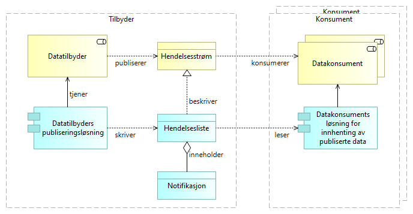
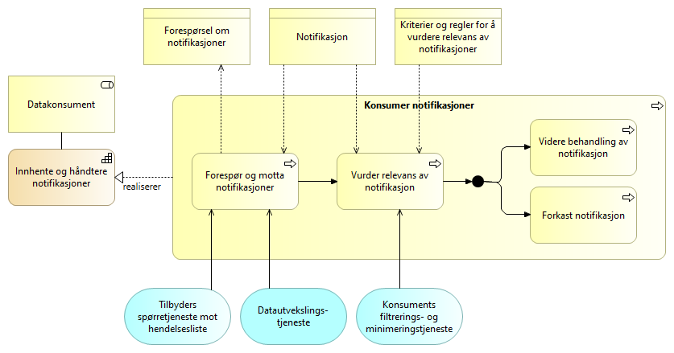

:lang: no
:doctitle: Mønstre for publisering 
:keywords: TBD
:toclevels: 3

include::../plattform_felles/includes/commonincludes.adoc[]

_Dette er en del av link:../nab_referanse_arkitekturer_datautveksling/[Referansearkitektur for datautveksling]_

//image:../plattform_felles/media/i-arbeid.png[width=45, height=45] _UNDER OPPDATERING etter innspill 2020-04-28_

== Introduksjon
[[basiskonsept-publisering]]
Mønstre for publisering handler helt grunnleggende om at tilbydere publiserer datastrømmer, eller hendelsesstrømmer, uten å måtte vite hvem konsumentene er. Konsumentene kan i sin tur koble seg på disse hendelsestrømmene og ta rede på hva som skjer.

.Publisering av hendelser - basiskonsept
image::../nab_referanse_arkitekturer_datautveksling_publisering/media/Publisering av hendelser - basiskonsept.png[alt=Publisering av hendelser - basiskonsept image]

Dette gir en form for løs kobling mellom aktørene som fremmer innovasjon og samhandling. Nye samhandlingsparter kan plukke opp hendelser og kople seg på i tjenesteproduksjonen. Forretningsprosessene behøver ikke være kartlagt og fastsatt i minste detalj på forhånd. Nye prosesser kan utvikles i dynamiske økosystemer. _Dette kan ses som et essensielt element i satsingen på sammenhengende tjenester og realisering av målsetninger om datadrevet økonomi og innovasjon; se f.eks.  https://www.regjeringen.no/no/tema/statlig-forvaltning/ikt-politikk/melding-om-datadrevet-okonomi-og-innovasjon/id2688376/[Stortingsmelding om datadrevet økonomi og innovasjon]._

// forvaltning betydningen av data som kilde til innovasjon, nye forretningsmodeller og forbedring av eksisterende digitale tjenester

Endringer i IT-systemene blir også enklere, fordi det vil være mindre avhengigheter til systemene hos andre virksomheter. En ønsker generelt å komme bort fra store monolittiske systemer som ikke er lagt opp til å samspille i en distribuert kontekst. 

NOTE: Løs kopling mellom IT-systemene er blant de de helt grunnleggende arkitekturprinsippene innen tjenesteorientert atrkitektur. Gjeldende arkitekturprinsipper fra Digitaliseringsdirektoratet per 2020 sier blant annet: _Ta hensyn til anerkjente designprinsipper for tjenesteorientert arkitektur, slik som løse koplinger, modularisering, standardiserte tjenestekontrakter med videre._

Det fokuseres her på mønstre som understøtter hendelsesdrevet arkitektur og tjenesteorientering, og det benyttes et begrepsapparat som gjenspeiler dette. Mønstre for publisering handler derfor her i hovedsak om publisering av data om hendelser, samt strømming av slike data. Andre former for publisering, slik som f.eks. publisering av API-er i en API-katalog, faller utenfor her.

Det finnes flere varianter av mønstrene, og disse egner seg til ulike formål. Utvikling av arkitekturer og fellesløsninger pågår både i Norge og internasjonalt, blant annet med komponenter fra EU. Det finnes også en rekke teknologier og produkter, deriblant mye som _open source_.

TIP: I artikkelen  link:https://martinfowler.com/articles/201701-event-driven.html[What do you mean by “Event-Driven”?] (fra 2017), redegjør  Martin Fowler kort for noen av de mest aktuelle mønstrene for strømming av hendelser. Han peker her også på behovet for god veiledning.

Dette er fremdeles for de fleste et vanskelig område å navigere i. Det finnes mange kilder til informasjon, men ingen enkelt, dekkende lærebok. Både vinkling og begrepsapparat fra ulike kilder er egnet til forvirring. 

Ambisjonsnivået her er heller ikke  å gi en komplett innføring i alle aspekter. Beskrivelser og utvalg av mønstre vil være behovsdrevet og vil utvikles over tid.

// Et viktig prinsipp er å ikke "finne opp hjulet på nytt"; for å unngå unødig arbeid og for å bruke begreper som rimer med det lar seg oversette Det er dessuten et poeng å kunne samarbeide internasojnalt. Det er derfor viktig å avtsemme begrepsapparate 

[[litteraturhenvisninger]]
.Noen litteraturhenvisninger
****
Det er skrevet mye om arkitekturmønstre for publisering, strømming og hendelsesdrevet arkitektur de siste årene, gjerne med ulike innfallsvinkler ut fra sammenhengen med arkitekturparadigmer som SOA og Microservices.

Noen utvalgte henvisninger: 

. link:https://en.wikipedia.org/wiki/Event-driven_architecture[Wikipedia om Event-driven architecture]

. link:https://en.wikipedia.org/wiki/Event-driven_SOA[Wikipedia om Event-driven SOA]

. link:https://martinfowler.com/articles/201701-event-driven.html[Martin Fowler - What do you mean by “Event-Driven”?]

. link:https://en.wikipedia.org/w/index.php?title=Publish%E2%80%93subscribe_pattern&oldid=950857039[Wikipedia om Publish-Subscribe]

. https://doc.difi.no/nasjonal-arkitektur/kunnskap_/#event-collaboration[Event Collaboration]

. link:https://www.sciencedirect.com/topics/computer-science/event-notification[Event Notification ]

[[litteraturhenvisninger-event-sourcing]]
. https://doc.difi.no/nasjonal-arkitektur/kunnskap_/#event-sourcing[Event Sourcing]

. https://doc.difi.no/nasjonal-arkitektur/kunnskap_/#_pattern_cqrs_command_query_responsibility_segregation[CQRS]

. https://mapr.com/blog/event-driven-microservices-patterns/[Event Driven Microservices Architecture Patterns and Examples]

. https://www.confluent.io/blog/journey-to-event-driven-part-1-why-event-first-thinking-changes-everything/[Why Event-First Thinking Changes Everything]
****

////
= Egenskaper

Fordeler:

* Løs kopling mellom tilbyder og konsument gir fleksibilitet på begge sider.

* Skalerbarhet

Ulemper:

Kompleksitet...
////

[[bruksområder-publisering-generelt]]
== Bruksområder
// <<bruksområder-publisering-generelt,Generelle bruksområder for publisering>>

Eksempler på anvendelse av mønstre for publisering og konsumering av hendelsesstrømmer:  

* Trigging av forretningsprosesser hos samhandlingsparter som deltar i dynamiske forretningsprosesser og tilpasset saksbehandling.
* Replikering av data ved hendelsesbasert oppdatering av kopier og avledede datasett.
* Logging av hendelsesrelaterte data for formål som arkivering og verifikasjon av etterlevelse. 
* Hendelsesbasert innhenting av data brukt til analyser og statistikk.
* Strømming av IoT-data, enten periodisk (tidshendelse) eller ved terskeloverskridende endringer i måleverdier

//* Strømming av forretningsmessige hendelsesdata, f.eks. i tilknytning til vedtak i offentlig saksbehandling. Dette gir grunnlag for dynamisk etablering av nye forretningsprosesser og tjenester for å dekke aktuelle brukerbehov (stikkord: sammenhengende tjenester).

//:leveloffset!:
//:leveloffset: +1
[[overskrift-grunnleggende-publisering]]
== Konsepter for publisering og konsumering av hendelsesstrømmer

// include::../nab_referanse_arkitekturer_datautveksling_publisering/grunnleggende-publisering.adoc[]

//:leveloffset: -1

//= Strømming av oppdaterte data (event-carried state transfer)

//= Strømming av hendelser (event notification)

////
For notifikasjoner som ikke gir det komplette _øyeblikksbildet_, må datakonsumenten avgjøre om det behøves supplerende data, og selv ta initiativ til å innhente de dataene det er behov for.

Hvordan konsumenten identifiserer aktuelle supplerende hendelsesdata, kan variere. En mulighet er at notifikasjonen inneholder en peker til det aktuelle datasettet, dvs. øyeblikksbildet, og at dette gjøres gjennom en _identifikator for øyeblikksbilde av datasett_. Selve datasettet, og instansen av datasettet, kan eventuelt være sammensatt og ligge distribuert. Det vil også kunne lenke til relaterte datasett som ikke ses på som en direkte del av det aktuelle datasettet (og der det kan være vanskelig å garantere at det finnes et konsistent øyeblikksbilde).

TIP: En globalt unik identifikator kan fungere som en direkte peker til aktuelle dataressurser på nettet. En kan da, under visse forutsetninger, unngå behovet for å måtte innhente kopier av supplerende data, også for data som ligger hos andre virksomheter og eventuelt distribuert hos flere virksomheter. 
////

:leveloffset: +1
[[generisk-publisering]]
== Basiskonsepter

//=== Basiskonsept

//<<basiskonsept-publisering,Det grunnleggende konseptet>> er, kort fortalt: Tilbydere publiserer hendelsesstømmer uten å måtte vite hvem konsumentene er. Konsumentene kan i sin tur koble seg på og lese fra hendelsesstrømmen.

////

Dette mønsteret er et _generisk_ arkitekturmønster, uten konkrete valg av teknologier og løsninger. 

<<basiskonsept-publisering,Det grunnleggende konseptet>> er det samme som for andre mønstre for publisering og konsumering av hendelsesstrømmer. Kort fortalt: Tilbydere publiserer hendelsesstømmer uten å måtte vite hvem konsumentene er. Konsumentene kan i sin tur koble seg på og lese fra hendelsesstrømmen.

Begrepsapparatet bygger på <<grunnleggende-begreper,grunnleggende begreper for publisering av hendelsesstrømmer>>.

[[egenskaper-generisk-publisering]]
Egenskaper:

* Hendelser kan ikke slettes (_immutable_), og notifikasjoner slettes heller ikke fra hendelseslister.  
* Notifikasjoner innhentes på initiav fra konsument (pull).
* Hver enkelt konsument kan lese samme notifikasjon flere ganger.  
* Hendelseslister kan traverseres og spørres mot.
////

=== Aktørsamspill

Datatilbyder [underline]#publiserer# hendelsestrømmer som [underline]##konsumeres## av datakonsumenter. Tilsvarende kan en si at datatilbyders publiseringsløsning [underline]#skriver# notifikasjoner til hendelseslister etterhvert som hendelser skjer, etterfulgt av at datakonsumentene [underline]#leser# notifikasjoner gjennom sine løsninger for innhenting og mottak. 

.Publisering av hendelser - grunnleggende konsept, med applikasjoner

Legg merke til at den publiserte hendelseslisten her er en del av tilbyders løsning og ansvar. 

I praksis kan også både datatilbyder og datakonsument velge å benytte en ekstern tjenesteleverandør for å formidle hendelsesdata. I så fall kan ekstern tjenesteleverandørs løsninger og tjenester anses som del av tilbyders eller konsuments løsninger og tjenester på lik linje med interne leverandører (og behøver ikke vises som egen part).

WARNING: Det faller utenfor omfanget her å gå inn på tilfeller der  ekstern tjenesteleverandør opptrer som  mellomledd på en måte som gjør det nødvendig å se på juridiske forhold eller løsninger på tvers av partene. 

[[grunnleggende-begreper]]
=== Begrepsapparat
// <<grunnleggende-begreper,Grunnleggende begreper for publisering av hendelsesstrømmer>>
Grunnleggende begreper og sammenhenger er vist i følgende modell. 

.Grunnleggende begreper for publisering av hendelser
image::../nab_referanse_arkitekturer_datautveksling_publisering/media/Grunnleggende begreper for publisering av hendelser.png[alt=Grunnleggende begreper for publisering av hendelser image]

* _Hendelser_ er det som skjer i den virkelige i verden, i en konstant strøm av endrede data, eller __hendelsesstrømmer__. 

[[subjekt-definisjon]]
* _Subjekt_ er hvem eller hva hendelsen omhandler, slik dette er å oppfatte i den aktuelle konteksten. Dette kan f.eks. være et fysisk objekt (eks. bil), en person, en virksomhet eller et konsept (eks. politikk). Det kan også være en samling av underordnede subjekter, slik som f.eks. en befolkningsgruppe eller alle virksomheter som har et navn som begynner på A. 

* Assosiert med hver hendelse finnes et _datagrunnlag_ som tilsvarer tilstanden før hendelsen inntraff. I bakkant av hendelsen finnes tilsvarende  et _oppdatert datagrunnlag_.

 

[[definisjon-hendelsesrelaterte-data]]
* I tilknytning til hver hendelse finnes _Hendelsesrelaterte data_. Dette kan være små eller store datasett som beskriver datagrunnlaget og aktuelle endringer. Nærmere om begreper og tekniske løsninger for dette gis i tilknytning til de ulike arkitekturmønstrene, med ulike måter å representere og oppdatere datagrunnlaget på, på tvers av tilbyder og konsument.  

// f.eks. lagret samlet eller distribuert. 

* En _notifikasjon_ informerer om at en hendelse har inntruffet og kan inneholde hele eller deler av det totale settet av aktuelle _hendelsesrelaterte data_, enten direkte eller gjennom lenke til hvor datasettet finnes (eventuelt en kombinasjon).

* Notifikasjoner samles og publiseres av tilbyder gjennom  _hendelseslister_.  

* En og samme hendelse kan være representert gjennom flere notifikasjoner som hver beskriver hendelsen på ulike måter for ulike formål og ulike målgrupper; som publisert gjennom ulike hendelseslister.

//* En og samme notifikasjon kan kun opptre i en og samme assosierte hendelsesliste.

// * Samme notifikasjon kan opptre i flere hendelseslister, myntet på ulike konsumentgrupper og filtrert på f.eks. subjekt, hendelsestype eller rettigheter/hjemmelsgrunnlag.

////
Notifikasjoner kan inneholde _komplette hendelsesdata_,  men dette er i mange tilfeller ikke hensiktsmessig.

Alternativet er å la konsumentene komme tilbake og be om _supplerende data_. Det er f.eks. uproblematisk å sende med en ny måleverdi for et termometer, mens det kan være mindre ønskelig å distribuere komplette kopier av større og distribuerte datasett. Hensynet til dataminimering spiller også en rolle i slike vurderinger.
////

////
Begrepet _klassifisering_ benyttes her om ulike typer metadata om datasettet som kan gi grunnlag for dataminimering, f.eks. at det inneholder persondata. Dette gjelder både for hendelsesdata og det _øyeblikksbildet_ (eller instansen av datasettet) som forelå da hendelsen inntraff og som forbindes med notifikasjonen.

For notifikasjoner som ikke gir det komplette _øyeblikksbildet_, må datakonsumenten avgjøre om det behøves supplerende data, og selv ta initiativ til å innhente de dataene det er behov for.

Hvordan konsumenten identifiserer aktuelle supplerende hendelsesdata, kan variere. En mulighet er at notifikasjonen inneholder en peker til det aktuelle datasettet, dvs. øyeblikksbildet, og at dette gjøres gjennom en _identifikator for øyeblikksbilde av datasett_. Selve datasettet, og instansen av datasettet, kan eventuelt være sammensatt og ligge distribuert. Det vil også kunne lenke til relaterte datasett som ikke ses på som en direkte del av det aktuelle datasettet (og der det kan være vanskelig å garantere at det finnes et konsistent øyeblikksbilde).

TIP: En globalt unik identifikator kan fungere som en direkte peker til aktuelle dataressurser på nettet. En kan da, under visse forutsetninger, unngå behovet for å måtte innhente kopier av supplerende data, også for data som ligger hos andre virksomheter og eventuelt distribuert hos flere virksomheter. 
////

[[notifikasjonsinnhold-generisk]]
=== Innhold i notifikasjoner
Begrepsapparatet bygger på <<grunnleggende-begreper,det grunnleggende begrepsapparatet for publisering av hendelsesstrømmer>>.

En modell som konkretiserer notifikasjonsinnholdet er vist i figuren nedenfor. Her er det også angitt relasjonene til hendelsesrelaterte data, noe som kan være et langt større datasett enn det som utveksles i notifikasjoner mellom tilbyder og konsument.

.Notifikasjonsinnhold

// erik: bør vi si identifisering av hendelse, heller enn notifikasjon? Er det en forskjell når vi filtrerer hendelseslisten, slik at ikke alle notifikasjoner er med? 

Forklaring til figuren over:

* En notifikasjon inneholder som minimum en _identifikator for notifikasjonen_. Denne må være gyldig på tvers av tilbyder og konsument. Tilbyder må holde rede på sammenhengen mellom notifikasjon og assosierte, <<definisjon-hendelsesrelaterte-data,hendelsesrelaterte data>>. 

* Hvilke notifikasjonsdata som forøvrig er relevante,  avhenger av hendelsestype og eventuell innholdsminimering.

** _Hendelsestype_ identifiserer typen hendelse overfor konsument, som grunnlag  for filtrering og videre behandling.  

** Sekvensinformasjon kan gis ved å peke på foregående notifikasjon for samme subjekt. Tidsstempel med tilstrekkelig oppløsning kan også angi sekvens, men gir  ikke generelt en like direkte og treffsikker identifisering av foregående notifikasjon. _Merk: Løpende sekvensnummer er også mulig å benytte, men er ikke vist her._

** Subjekt for hendelse: Se <<subjekt-definisjon,definisjon av subjekt>>.

// ikke her: ** Subjektets tilstand kan beskrives i form av et øyeblikksbilde eller som en serie endringer ut fra et tidligere øyeblikksbilde. En notifikasjon inneholder tilsvarende enten et øyeblikksbilde av subjektet eller data om hendelsen som beskriver den inkrementelle endringen. Eksempel: Termometeravlesning kan angis med ny temperatur eller med endring siden forrige avlesning. 

////

== Applikasjonstjenester

Følgende figur angir aktuelle tjenester og grensesnitt.

.Publisering av hendelser - tjenester 
image::../nab_referanse_arkitekturer_datautveksling_publisering/media/Publisering av hendelser - tjenester .png[alt=Publisering av hendelser - tjenester  image]

Forklaring:

* Konsumenten kan innhente notifikasjoner på eget initiativ ved å spørre mot publiserte hendelseslister gjennom et grensesnitt for dette. Dersom det dreier seg om åpne data og tilbyders spørretjenester dekker behovet, kan dette gjøres uten at det tegnes abonnement eller settes opp særskilte avtaler. Lesing av notifikasjoner kan skje enkeltvis eller batchvis, avhengig av konsumentens preferanser og opsjoner i grensesnittet.
+
Grensesnittet for lesing av notifikasjoner er normalt et API (f.eks. REST eller GraphQL).
+
Merk: Dataminimering kan løses ved at det tilbys ulike hendelseslister for samme _grunnlagsnotifikasjoner_, gjerne forbeholdt ulike konsumentgrupper eller roller, med ulike rettigheter. 

* Registrering av abonnement gjøres typisk gjennom en standardtjeneste og et API for dette. Registreringen spesifiserer abonnementet mot det grensesnittet som tilbys, og kan omfatte:

** Valg av tilgjengelige opsjoner for automatisk "på døren" levering av meldinger til konsumentens integrasjonsløsning.
** Spesifisering av et utvalg av notifikasjoner fra den aktuelle hendelseslisten (server-side filtrering), ut fra tilgjengelige metadata og opsjoner.
** Spesifisering av dataminimering for notifikasjonsdata, slik at konsumenten unngår å motta f.eks. persondata som det ikke finnes rettslig grunnlag for å konsumere. 

* Som alternativ til at konsumenten selv tar initiativ (pull), kan tilbyder automatisk levere notifikasjoner til konsumentens integrasjonsløsning. Typiske løsninger:

** Asynkrone meldinger til en meldingskø hos konsumenten.
** Kall av API hos konsumenten.
** (Filoverføring.)
** (Direkte databaseoppdatering.)

////

=== Innhenting av notifikasjoner gjennom spørring mot hendelseslister 

Pullbasert innhenting av notifikasjoner skjer gjennom at konsumenten forespør notifikasjoner fra tilbyder, etterfulgt av at forespurte notifikasjoner leveres. Dette kan være en enkelt notifikasjon eller flere i rekke. Illustrasjon (sekvensdiagram):

.Spørring mot hendelseslister - basisflyt
image::../nab_referanse_arkitekturer_datautveksling_publisering/media/Spørring mot hendelseslister - basisflyt.png[alt=Spørring mot hendelseslister - basisflyt image]

Forespørsler gjøres mot tilbyders spørretjeneste, som vist i følgende diagram.

.Tilbyders spørretjeneste mot hendelsesliste
image::../nab_referanse_arkitekturer_datautveksling_publisering/media/Tilbyders spørretjeneste mot hendelsesliste.png[alt=Tilbyders spørretjeneste mot hendelsesliste image]

Tilbyders spørretjeneste  mot hendelseslister må støtte ulike måter å lese ut aktuelle hendelser på, slik som:  

* Spørringer for å hente ut filtrerte utvalg av notifikasjoner og, ved behov, minimere datainnhold i hver enkelt notifikasjon.

* Avspilling av notifikasjoner innen angitt tidsrom.

* Avspilling av seneste notifikasjoner, f.eks etter en gitt identifikator.

  

=== Innhenting av supplerende hendelsesrelaterte data

For notifikasjoner som ikke gir et tilstrekkelig sett av _hendelsesrelaterte data_ for konsumentens formål, må datakonsumenten selv ta initiativ til å innhente _supplerende hendelsesrelaterte data_.

****
Det er uproblematisk å sende med en ny måleverdi for et termometer, mens det kan være mindre ønskelig å distribuere komplette kopier av større og distribuerte datasett. Hensyn til dataminimering (personvern eller andre hesnyn) spiller også en rolle i slike vurderinger.
****

Den typiske prosessen er illustrert i følgende sekvensdiagram:  

.Spørring mot hendelseslister - med innhenting av supplerende data
image::../nab_referanse_arkitekturer_datautveksling_publisering/media/Spørring mot hendelseslister - med innhenting av supplerende data.png[alt=Spørring mot hendelseslister - med innhenting av supplerende data image]

I _forespørsel om supplerende hendelsesrelaterte data_ må det kunne identifiseres hvilke data som ønskes. Tilbyder kan gi ulike opsjoner for dette. En mulighet er at _identifikator for notifikasjonen_ entydig identifiserer aktuelle datasett. En annen mulighet er f.eks. spørring etter etter spesifikke informasjonselementer for et angitt subjekt.

TIP: Det bør sikres at _hendelsesrelaterte data_ forblir identifiserbare og tilgjengelige over tid. En god måte å gjøre dette på er gjennom globalt unike identifikatorer i kombinasjon med en mekanisme for datavirtualisering.

// slik at aktuelle datasett kan flyttes uten at datakonsumenter behøver å se forskjellen. 

////
Identifikasjon av aktuelle supplerende hendelsesrelaterte i notifikasjonen gjøres enten gjennom: 

a. en enkelt identifikator som angir det totale datasettet 
//Dette kan fungere godt når tilbyder har preparert det aktuelle datasettet for konsumenten ut fra spesifikasjon gitt i abonnementsoppsettet.

b. separate identifikatorer for ulike deler av  notifikasjonen
//f.eks for _subjekt_.
////

NOTE: Selve innhentingen av _supplerende hendelsesrelaterte data_ dekkes av eOppslag referansearkitektur.

////
For å kunne filtrere og minimere innholdet i supplerende hendelsesdata gjennom spørringer, må konsumenten kjenne datamodellen for _hendelsesrelaterte data_.

Merk: Det totale datasettet for hendelsesrelaterte data kan eventuelt være sammensatt og ligge distribuert. Det vil også kunne lenke til relaterte datasett som ikke ses på som en direkte del av det aktuelle datasettet.  

TIP: Globalt unike identifikatorer kan fungere som direkte pekere til aktuelle dataressurser på nettet. Med spørrespråk som SPARQL of GraphQL kan slike ressurser finnes direkte, uten å gå veien om tilbyder.

////

== Avanserte konsepter

[[generisk-publish-subscribe]]
=== Abonnementsbasert publisering

// ==== Generelt 

// Dette mønsteret bygger på <<generisk-publisering,Generisk mønster for publisering og konsumering av hendelsesstrømmer>>.

NOTE: Dette konseptet tilsvarer det som i litteraturen tradisjonelt omtales som _publish-subscribe_; se f.eks. link:https://en.wikipedia.org/w/index.php?title=Publish%E2%80%93subscribe_pattern&oldid=950857039[wikipedia om publish-subscribe pattern] for en enkel beskrivelse av dette.

Her introduseres støtte for å tegne abonnementer for formål og behov som:

* Støtte for strenge sanntidskrav. Unngå behov for å polle hendelseslistene for endringer og i stedet få abonnerte notifikasjoner levert fortløpende (pushbasert levering).
* Velg mellom opsjoner for å få mottak av notifikasjoner til ønsket teknisk grensesnitt (f.eks. kall av API vs. levering til meldingkø).
* SLA-avtaler, f.eks. avtale om akseptable tidsforsinkelser før levering av notifikasjoner. 
* Abonnementsbasert betaling. f.eks. ut fra valg mellom ulike, volumbaserte prispakker som tilbys, eller f.eks. volumuavhengig fastpris. 

//Egenskaper:
// * <<egenskaper-generisk-publisering, Egenskaper for generisk publisering>> gjelder.

Følgende figur illustrerer det forretningsmessige koneptet for abonnement på hendelsesstrømmer.

.Publisering av hendelser - basiskonsept med abonnement
image::../nab_referanse_arkitekturer_datautveksling_publisering/media/Publisering av hendelser - basiskonsept med abonnement.png[alt=Publisering av hendelser - basiskonsept med abonnement image]

Registrering av abonnement gjøres typisk mot en selvbetjeningsløsning for dette hos datatilbyder. Datatilbyder vil deretter sende notifikasjoner fortløpende og pushbasert til konsumentens mottaksløsning som avtalt.

.Pushbasert levering av notifikasjoner til abonnenter

.Analogi til mediehus:
****
 * Mediehus (tilbyder) publiserer nyheter  (hendelser)  via  nyhetskanaler (hendelsesstrømmer) til et konsumentmarked der konsumentene ikke nødvendigvis er kjent på forhånd. 
 * Konsumenter kan kople seg på for å lese nyheter på tilfeldig basis, f.eks. en løssalgsavis.
* Konsumenter kan eventuelt tegne abonnementer for å få levert nyhetene "på døra" (f.eks. til en innboks).
* Konsumenter kan også tegne abonnementer for å få et utvalg av nyhetene (innholdsfilter.) 
* Tilbyder kan ta betalt for innhold og tjenester, eller det kan være gratis.
****

////
=== Pushbasert levering av notifikasjoner
Pushbasert levering av notifikasjoner has når tilbyder leverer notifikasjoner direkte til konsumentens integrasjonløsning. 

Spesifikasjon av  

Om det i registrering av abonnement på en hendelsesliste også registreres mer spesifikt hvilke notifikasjoner som ønskes levert hvordan, kan en tilsvarende få levert notifikasjoner på initiativ fra publiseringsløsningen (pushbasert).

Spørringer kan også gjøres (pullbasert) med utgangspunkt i en abonnementsavtale.
////

////
I praksis kan det være at tilbyder  skriver notifikasjoner direkte til konsumentens integrasjonløsning, som en "pushbasert" abonnementstjeneste for levering av notifikasjoner.

Følgende figur viser dataflyten mellom systemene og illustrer dette.

.Publisering av hendelser - grunnleggende konsept, dataflyt mellom applikasjoner
image::../nab_referanse_arkitekturer_datautveksling_publisering/media/Publisering av hendelser - grunnleggende konsept, dataflyt mellom applikasjoner.png[alt=Publisering av hendelser - grunnleggende konsept, dataflyt mellom applikasjoner image]

Kombinasjonen av abonnement og spørring er det som bestemmer hvilke notifikasjoner som flyter fra tilbyder til konsument. 

Om det ikke er krav til å sette opp abonnement i forkant, kan spørringer gjøres direkte (pullbasert). 

Om det i registrering av abonnement på en hendelsesliste også registreres mer spesifikt hvilke notifikasjoner som ønskes levert hvordan, kan en tilsvarende få levert notifikasjoner på initiativ fra publiseringsløsningen (pushbasert).

Spørringer kan også gjøres (pullbasert) med utgangspunkt i en abonnementsavtale.
////

////
=== Om tekniske grensesnitt

Notifikasjoner kan f.eks. leveres gjennom et synkront API eller via en asynkron meldingskø hos konsumenten. Tilsvarende kan spørringer skje synkront eller asynkront. 

En mulig kombinasjon er at spørringen skjer gjennom et synkront API, mens notifikasjonene deretter leveres asynkront og fortløpende (pushbasert).
////

//erik1 Fix figur!
////
TIP: Spørringer kan også gjøres som en bestilling av framtidige notifikasjoner. Dette kan ses på som en type abonnement.  

Følgende figur illustrerer disse konseptene. 

.Publisering av hendelser - grunnleggende om tekniske grensesnitt
image::../nab_referanse_arkitekturer_datautveksling_publisering/media/Publisering av hendelser - grunnleggende om tekniske grensesnitt.png[alt=Publisering av hendelser - grunnleggende om tekniske grensesnitt image]
////

[[filtrering-og-minimering]]
=== Filtrering og minimering av hendelseslister og notifikasjoner

Filtrering og minimering av hendelseslister og notifikasjoner handler om:

a. Filtrering av hendelseslister slik at en får det ønskede utvalget av subjekter og hendelser, f.eks. salg av leiligheter til under 2 millioner kroner i  din bydel. Dette handler ikke om å gjøre innhentingen stykkevis og delt. Det er normalt viktig å sørge for at den filtrerte hendelseslisten gir komplett historikk for formålet.      

b. Minimering av innholdet i notifikasjoner, slik at konsumenten unngår å motta eller få tilgang til mer informasjon enn det som er interessant for konsumenten eller det has hjemmel for ut fra personvernhensyn. 

Dette kan løses på ulike måter, herunder:

. Tilbyder tilbyr ulike hendelseslister, der det i utgangspunktet er gjort et utvalg fra det komplette utvalget innen tilbyders domene, basert på metadata og kriterier som tema eller konfidensialitet for hver hendelsesliste.

. Tilbyder filtrerer innen hver hendelsesliste ut fra konsumentens spesifikasjon /spørring. 

. Tilbyder minimerer innholdet i hver notifikasjon ut fra konsumentens spesifikasjon /spørring. 

. Konsumenten ignorerer irrelevante notifikasjoner ved å filtrere innlesingen på konsumentsiden eller forkaste notifikasjoneretter innlesing.

På veien fra tilbyder til konsument vil hendelseslister og notifikasjoner på denne måten endre innhold. Det er de samme hendelsene som gjelder, men nye datasett. Det kan være nyttig å skille mellom tilbyders publiserte notifikasjoner, utvekslede notifikasjoner (tilpasset for konsument av tilbyder) og de notifikasjonene som er relevante for konsument og tas videre til  prosessering. En kan tilsvarende se på serier av f.eks. utvekslede notifikasjoner som en utvekslet hendelsesliste. Dette begrepsapparatet er oppsummert i følgende modell.

.Filtrering og minimering av hendelseslister og notifikasjoner på tvers av tilbyder og konsument
image::../nab_referanse_arkitekturer_datautveksling_publisering/media/Filtrering og minimering av hendelseslister og notifikasjoner på tvers av tilbyder og konsument.png[alt=Filtrering og minimering av hendelseslister og notifikasjoner på tvers av tilbyder og konsument image]

[[utledning-av-subjekttilstand]]
=== Tilstand som resultat av hendelser 

Et subjekts tilstand kan beskrives i form av et øyeblikksbilde eller som en serie endringer ut fra et tidligere øyeblikksbilde. En notifikasjon inneholder tilsvarende enten et øyeblikksbilde av subjektet eller data om hendelsen som beskriver en inkrementell endring. 

Eksempel: Anta at termometeravlesninger rapporteres som daglige endringer siden forrige avlesning. For å finne dagens temperatur, må det være et kjent startpunkt (øyeblikksbilde).

TIP: En kan tenke på notifikasjoner  som transaksjoner i et regskap som gjøres opp med jevne mellomrom. Subjekttilstanden tilsvarer saldo, og ny saldo kan enkelt regnes ut ved å legge sammen alle transaksjonene siden forrige dokumenterte oppgjør. En kan også gå hele veien tilbake til oppstart, som i dette tilfellet uten videre er et kjent utgangspunkt (nullsaldo).

////
[[versjonsstyring-av-notifikasjoner]]
=== Versjonsstyring av notifikasjoner
Om datamodellen for notifikasjoner i en hendelsesliste endres,  
////

////
=== Tekniske grensesnitt

//.Publisering av hendelsesstrømmer - tekniske grensesnitt
//image::../nab_referanse_arkitekturer_datautveksling_publisering/media/Publisering av hendelsesstrømmer - tekniske grensesnitt.png[alt=Publisering av hendelsesstrømmer - tekniske grensesnitt image]

//== Grensesnitt for innhenting av notifikasjoner 

#eNotifikasjon# dreier seg om publisering av hendelsesdata via hendelseslister som kan aksesseres av datakonsumenter via spørring og oppslag i API-er.

Konsumentene kan også innhente tilleggsdata om hendelser fra datatilbydere via spørring og oppslag i API-er, ved behov. Dette er illustert i følgende figur.

.Pull-basert distribusjon av notifikasjoner
image::../nab_referanse_arkitekturer_datautveksling_publisering/media/Pull-basert distribusjon av notifikasjoner.png[alt=Pull-basert distribusjon av notifikasjoner image]

Som vist i figuren, skilles det mellom to hovedtyper API-er: 

1. API for oppslag/spørring mot hendelseslister.
2. API for oppslag/innhenting av supplerende hendelsesdata (ved behov).

For begge disse typene API-er er _eOppslag-mønsteret_ relevant. For spørring mot hendelseslister er det dessuten interessant å se på spesifikk funksjonalitet og tjenester som gis gjennom API.

Bruk av API dekkes av eOppslag.

Overordnet funksjonalitet i API for oppslag/spørring mot hendelseslister:

* Spørringer for å hente ut filtrerte utvalg av notifikasjoner og, ved behov, minimere datainnhold i hver enkelt notifikasjon.
* Navigering i hendelselister for å hente inn inkrementelle endringer og holde regnskap på tilstanden til aktuelle subjekter.
////

//= Regnskapsføring av hendelser (generisk mønster)
//Ref. Event sourcing

////
:leveloffset!:
:leveloffset: +1
= eNotifikasjon - publisering av hendelser med pullbasert innhenting 
include::../nab_referanse_arkitekturer_enotifikasjon/book-ra-enotifikasjon.adoc[]
:leveloffset!:
////

= eNotifikasjon

== Om dette mønsteret

eNotifikasjon er en referansearkitektur for utveksling av notifikasjoner som er innrettet på å støtte opp under "nyere" arkitekturmønstre for distribuerte applikasjoner, særlig aktuelt innen Microservices som arkitekturparadigme.   

NOTE: Det sentrale arkitekturmønsteret som støttes er best kjent som _Event Sourcing_. blant annet karakterisert ved at tilstanden til et _subjekt_ kan bestemmes ut fra en logg av hendelser. Se  <<litteraturhenvisninger-event-sourcing,litteraturhenvisninger om event sourcing>>.

//=== Egenskaper

Beskrivelsene her bygger på utvalgte deler av en separat oversikt over <<overskrift-grunnleggende-publisering,konsepter for publisering og konsumering av hendelsesstrømmer>>.

Grunnleggende egenskaper ved eNotifikasjon som mønster - en oppsummering av aktuelle konsepter:

* Tilstanden til et _subjekt_ kan bestemmes gjennom å prosessere en kronologisk sekvens av hendelser, ut fra et gitt øyeblikksbilde.
* En hendelse kan representeres ved en eller flere  _notifikasjoner_.
* Notifikasjoner samles i _hendelseslister_.
* Hendelser er i seg selv uforanderlige (_immutable_). Tilsvarende gjelder for notifikasjoner i hendelseslister, dvs. at notifikasjoner i regelen ikke endres eller slettes fra hendelseslister.  
// * Notifikasjoner innhentes på initiav fra konsument (pull).
* Hver enkelt konsument kan lese samme notifikasjon flere ganger.  
* Hendelseslister kan traverseres og spørres mot.
* En hendelsesliste tilsvarer en logg, og kan benyttes som en logg.

////
== Innhold i notifikasjoner (eNotifikasjon)

Dette er en konkretisering av <<notifikasjonsinnhold-generisk,generisk notifikasonsinnholdet>>. Begrepsapparatet bygger på <<grunnleggende-begreper,det grunnleggende begrepsapparatet for publisering av hendelsesstrømmer>>.

En modell for notifikasjonsinnholdet for _eNotifikasjon_ er vist i figuren nedenfor. Her er det også angitt  relasjonene til _hendelsesrelaterte data_, noe som kan være et langt større datasett enn det som utveksles i notifikasjoner mellom tilbyder og konsument.

Overordnet:

En notifikasjon inneholder som minimum en _identifikator for notifikasjon_, slik at det er mulig å identifisere assosierte hendelsesrelaterte data.
Det er normalt hensiktsmessig å inkludere en spesifikasjon av hendelsestype.
I tilknytning tli eNotifikasjon vil det bestandig kunne assosieres et subjekt (eventuel en samling), og en vil være interessert i å ta rede på status og historikk.

//image:../plattform_felles/media/i-arbeid.png[width=45, height=45] #_Innarbeiding av kommentarer pågår, 2020-04-27_#

// For mønsteret eNotifikasjon gjelder en detaljering av begrepet _hendelsesrelaterte data_ som følger her.

.Notifikasjonsinnhold

Forklaring til modellen:

 
* _Hendelsesrelaterte data_ kan være små eller store datasett som kan identifiseres og assosieres med en notifikasjon. Det komplette datasettet for dette kan ligge samlet, eller det kan være distribuert over flere lagringsløsninger og virksomheter. 

* _Notifikasjon_ kan inneholde et fullstendig sett av _hendelsesrelaterte data_, men dette er i mange tilfeller ikke hensiktsmessig. Alternativet er å la konsumentene komme tilbake og be om supplerende data. 

* _Identifikator for notifikasjon_ identifiserer notifikasjonen entydig for eller overfor tilbyder. Konsumenten kan bruke denne identifikatoren i spørringer for å innhente supplerende hendelsesrelaterte data om en mottatt notifikasjon. 

// * _Supplerende notifikasjonsdata_ er relevant når den den leverte notifikasjonen ikke inneholder   f.eks. uproblematisk å sende med en ny måleverdi for et termometer, mens det kan være mindre ønskelig å distribuere komplette kopier av større og distribuerte datasett. Hensynet til dataminimering spiller også en rolle i slike vurderinger.

* _Hendelsestype_ kan være et entydig element i et kontrollert vokabular, men det kan også være "fritekst".

* _Subjekt for hendelse_ vil identifisere subjektet, dvs. hvem eller hva hendelsen omhandler, slik dette er å oppfatte i den aktuelle konteksten. Dette kan være en person, et fysisk objekt, en samling av personer eller fysiske objekter, eller et konsept.

* _Øyeblikksbilde for subjekt etter hendelse_ kan være f.eks. en målerutlesning fra en sensor. Det kan også være f.eks. innholdet i en større database.

* _Inkrementell endring i øyeblikksbilde av subjekt_ gir både historikk og status for aktuelle subjekter.   

////

//Notifikasjoner kan inneholde et fullstendig sett av _hendelsesrelaterte data_,  men dette er i mange tilfeller ikke hensiktsmessig. Alternativet er å la konsumentene komme tilbake og be om _supplerende data_. Det er f.eks. uproblematisk å sende med en ny måleverdi for et termometer, mens det kan være mindre ønskelig å distribuere komplette kopier av større og distribuerte datasett. Hensynet til dataminimering spiller også en rolle i slike vurderinger.

////
For å kunne filtrere og minimere innholdet i supplerende hendelsesdata gjennom spørringer, må konsumenten kjenne datamodellen for _hendelsesrelaterte data_.

Merk: Det totale datasettet for hendelsesrelaterte data kan eventuelt være sammensatt og ligge distribuert. Det vil også kunne lenke til relaterte datasett som ikke ses på som en direkte del av det aktuelle datasettet.  

TIP: Globalt unike identifikatorer kan fungere som direkte pekere til aktuelle dataressurser på nettet. Med spørrespråk som SPARQL of GraphQL kan slike ressurser finnes direkte, uten å gå veien om tilbyder.

////

////
Grunnleggende begreper og sammenhenger er vist i følgende modell. 

.eNotifikasjon - grunnleggende begreper
image::../nab_referanse_arkitekturer_enotifikasjon/media/eNotifikasjon - grunnleggende begreper.png[alt=eNotifikasjon - grunnleggende begreper image]

_Hendelser_ er det som skjer i den virkelige i verden, i en strøm av hendelser, eller __hendelsesstrømmer__. 

_Notifikasjoner_ gir informasjon om hendelser, og kan distribueres via _hendelseslister_ (på engelsk brukes begrepet __topics__) til den som måtte være interessert.

I tilknytning til hver hendelse finnes _Hendelsesdata_. Dette kan være små eller store _Datasett_, enten lagret samlet eller lagret distribuert i flere ulike lagringsløsninger (polyglot persistence).

Notifikasjoner kan inneholde _komplette hendelsesdata_,  men dette er i mange tilfeller ikke hensiktsmessig. Alternativet er å la konsumentene komme tilbake og be om _supplerende data_. Det er f.eks. uproblematisk å sende med en ny måleverdi for et termometer, mens det kan være mindre ønskelig å distribuere komplette kopier av større og distribuerte datasett. Hensynet til dataminimering spiller også en rolle i slike vurderinger.

Begrepet _klassifisering_ benyttes her om ulike typer metadata om datasettet som kan gi grunnlag for dataminimering, f.eks. at det inneholder persondata. Dette gjelder både for hendelsesdata og det _øyeblikksbildet_ (eller instansen av datasettet) som forelå da hendelsen inntraff og som forbindes med notifikasjonen.
////

////
For notifikasjoner som ikke gir det komplette _øyeblikksbildet_, må datakonsumenten avgjøre om det behøves supplerende data, og selv ta initiativ til å innhente de dataene det er behov for.

Hvordan konsumenten identifiserer aktuelle supplerende hendelsesdata, kan variere. En mulighet er at notifikasjonen inneholder en peker til det aktuelle datasettet, dvs. øyeblikksbildet, og at dette gjøres gjennom en _identifikator for øyeblikksbilde av datasett_. Selve datasettet, og instansen av datasettet, kan eventuelt være sammensatt og ligge distribuert. Det vil også kunne lenke til relaterte datasett som ikke ses på som en direkte del av det aktuelle datasettet (og der det kan være vanskelig å garantere at det finnes et konsistent øyeblikksbilde).

TIP: En globalt unik identifikator kan fungere som en direkte peker til aktuelle dataressurser på nettet. En kan da, under visse forutsetninger, unngå behovet for å måtte innhente kopier av supplerende data, også for data som ligger hos andre virksomheter og eventuelt distribuert hos flere virksomheter. 
////

// Henrik Figur under er tatt ut og bør erstattes med figur uten formidler rollen og tilhørende komponenter.

////
== Aktørsamspill

Figuren nedenfor viser involverte roller og applikasjoner, samt samspillet mellom disse.

.eNotifikasjon - grunnleggende konsepter
image::../nab_referanse_arkitekturer_enotifikasjon/media/eNotifikasjon - grunnleggende konsepter.png[alt=eNotifikasjon - grunnleggende konsepter image]

Kommentarer til denne figuren:

* Rollen som _Dataformidler_ kan være ivaretatt av datatilbyder selv, uten et eksternt mellomledd. 

* _Formidlingsløsninger_ kan tilsvarende være ivaretatt av Datatilbyder selv, hva gjelder formidlingen av notifikasjoner. 

* _Formidlingsløsninger_ omfatter også løsning for metadatakatalog for å finne fram til datakilder, designtime og runtime. Dette er ikke eksplisitt vist her. Eksempel på løsning: Felles datakatalog. 

* _Dataflyt_ og _notifikasjonsflyt_ er å forstå som den logiske flyten av data og notifikasjoner. Om dette skjer på initiativ fra datakonsument (pull) eller datatilbyder (push), er en annen sak.

* _Notifikasjonsdata_ om hver enkelt hendelse finnes i _hendelseslister_ som kan leses og navigeres av datakonsumentene. 

* _Formidlingsløsninger_ kan være integrert i _Fagsystem hos datatilbyder_. 

* _Data assosiert med hendelse_ kan her antas å inneholde all relevant informasjon om aktuelle hendelser. Datakonsumentene må kunne gå tilbake til Datatilbyder for å innhente supplerende data i tilknytning til hver enkelt notifikasjon, ved behov. Avhengig av behovene, må aktuelle data kunne være tilgjengelige for gjentatt lesing, kanskje flere år fram i tid.    

////

== Verdistrømbeskrivelse

=== eNotifikasjon - oversikt over verdistrømmer

Følgende modell viser en oversikt over verdistrømmene på tvers av datatilbyder og datakonsument for eNotifikasjon. Dette er en spesialisering av den generiske verdistrømbeskrivelsen som finnes under link:../nab_arkitekturlandskap_segmentarkitektur_datadeling_verdistrømmer/[Felles referansemodeller for datadeling].

.eNotifikasjon - oversikt over verdistrømmer
image::../nab_referanse_arkitekturer_enotifikasjon/media/eNotifikasjon - oversikt over verdistrømmer.png[alt=eNotifikasjon - oversikt over verdistrømmer image]

//Dette er en spesialisert utgave av tilsvarende #_felles referansemodell for datautveksling_#. 

Disse verdistrømmene er nærmere beskrevet for hver rolle i påfølgende avsnitt.  

=== eNotifikasjon - verdistrøm for datatilbyder
Her vises verdistrømmen for eNotifikasjon sett fra datatilbyder, med angivelse av kapabiliteter.

Det som er spesifikt for eNotifikasjon er vist med uthevet skrift, dvs. _Inngå avtaler om tilgang og levering av hendelsesstrømmer_, _Generere og tilby notifikasjoner_, samt _Avgi forespurte notifikasjoner_. Realiseringen av disse kapabilitetene beskrives i prosessmodeller m.v. for eNotifikasjon. 

Øvrige kapabiliteter er beskrevet andre steder; se referansearkitektur for mønsteret eOppslag. 

.eNotifikasjon - tilbyders verdistrøm
image::../nab_referanse_arkitekturer_datautveksling_publisering/media/eNotifikasjon - tilbyders verdistrøm.png[alt=eNotifikasjon - tilbyders verdistrøm image]

=== eNotifikasjon - verdistrøm for datakonsumenter
Her vises verdistrømmen for eNotifikasjon sett fra datakonsumenter, med angivelse av kapabiliteter.

Det som er spesifikt for eNotifikasjon er vist med uthevet skrift, dvs. _Inngå avtaler om tilgang og innhenting av hendelsesstrømmer_ og _Innhente og håndtere notifikasjoner_. Realiseringen av disse kapabilitetene beskrives i prosessmodeller m.v. for eNotifikasjon.

Øvrige kapabiliteter er beskrevet andre steder; se referansearkitektur for mønsteret eOppslag.  

.eNotifikasjon - konsumenters verdistrøm
image::../nab_referanse_arkitekturer_enotifikasjon/media/eNotifikasjon - konsumenters verdistrøm.png[alt=eNotifikasjon - konsumenters verdistrøm image]

== Kapabilitetskart for eNotifikasjon

Modellen under gir en samlet oversikt over kapabiliteter som er spesifikke for eNotifikasjon, slik disse er identifisert i foregående verdistrømbeskrivelse. 

.Kapabiliteter eNotifikasjon
image::../nab_referanse_arkitekturer_enotifikasjon/media/Kapabiliteter eNotifikasjon.png[alt=Kapabiliteter eNotifikasjon image]

[cols ="1,3", options="header"]
.Elementer i view for Kapabiliteter eNotifikasjon
|===

| Element
| Beskrivelse

| Datatilbyder
| Tilbyder av data til andre aktører.

| Datakonsument
| Den som innhenter eller mottar data fra andre aktører.

| Innhente og håndtere notifikasjoner
| Evnen til å konsumere hendelseslister ved å innhente notifikasjoner.

| Generere og tilby notifikasjoner
| Evnen til å dele informasjon om hendelser gjennom notifikasjoner som tilgjengeliggjøres for konsumenter gjennom hendelseslister.

| Inngå avtaler om tilgang og innhenting av hendelsesstrømmer 
| Evnen til å inngå avtaler med datatilbyder om tilgang til hendelser gjennom hendelseslister med notifikasjoner.

| Inngå avtaler om tilgang og levering av hendelsesstrømmer
| Evnen til å inngå avtaler med datakonsumenter om tilgengjengeliggjøring av hendelseslister med notifikasjoner om hendelser.

| Avgi forespurte notifikasjoner
| Evnen til å avgi notifikasjoner på forespørsel

|===

== Realisering av kapabiliteter - generisk arkitekturmønster

Her beskrives realiseringen av de kapabilitetene som er spesifikke for eNotifikasjon i form av et generisk, løsningsuavhengig arkitekturmønster. Det vil kunne være flere måter å realisere aktuelle arkitekturbyggeklosser på.

=== Inngå avtaler om tilgang og levering av hendelsesstrømmer
Gi tilgang til notifikasjoner og hendelser er den prosessen datatilbyder må gjøre for å gi datakonsumenten tilgang til hendelseslister. Ved helt åpne hendelseslister kan prosessen være unødvendig og utgår, men vil normalt omfatte å tilgjengeliggjøre API som beskrevet i eOppslag. I tillegg kan det eventuelt registreres informasjon i tilknytning til filtrering og tilpasning av hendelselister ut fra konsumentens behov og tilganger.

.Gi tilgang til notifikasjoner og hendelser

[cols ="1,3", options="header"]
.Elementer i view for Gi tilgang til notifikasjoner og hendelser
|===

| Element
| Beskrivelse

| Gi tilgang til notifikasjoner og hendelser
| Prosessen med oppsett for å gi tilgang til notifikasjoner og hendelser.

| Motta forespørsel om tilgang til hendelsesstrømmer
| Prosessen med å motta forespørsel om tilgang til notifikasjoner på hendelseslister.

| Inngå avtale om tilgang til hendelsesliste med notifikasjoner
| Prosessen med å registrere seg som konsument av en hendelsesliste hos datatilbyder

| Datatilbyder
| Tilbyder av data til andre aktører.

| Registrering av konsument av hendelsesliste
| Tjeneste for å registrere konsumenter av hendelseslite med notifikasjoner.

| Inngå avtaler om tilgang og levering av hendelsesstrømmer
| Evnen til å inngå avtaler med datakonsumenter om tilgengjengeliggjøring av hendelseslister med notifikasjoner om hendelser.

|===

=== Inngå avtaler om tilgang og innhenting av hendelsesstrømmer
Få tilgang til notifikasjoner og hendelser er den prosessen datakonsument må gjøre for å sette opp og få tilganger til hendelseslister. Prosessetrinnene kommer i tillegg til prosessen for å få tigang til API som beskrevet i eOppslag.

.Få tilgang til notifikasjoner og hendelser
image::../nab_referanse_arkitekturer_datautveksling_publisering/media/Få tilgang til notifikasjoner og hendelser.png[alt=Få tilgang til notifikasjoner og hendelser image]

[cols ="1,3", options="header"]
.Elementer i view for Få tilgang til notifikasjoner og hendelser
|===

| Element
| Beskrivelse

| Beskrive behov og tilganger
| Prosessen med å beskrive hvilke tilganger konsument har rettigeheter til og hvilken type notifikasjoner som er aktuelle. 

| Inngå avtale om tilgang til hendelsesliste med notifikasjoner
| Prosessen med å registrere seg som konsument av en hendelsesliste hos datatilbyder

| Datakonsument
| Den som innhenter eller mottar data fra andre aktører.

| Inngå avtaler om tilgang og innhenting av hendelsesstrømmer 
| Evnen til å inngå avtaler med datatilbyder om tilgang til hendelser gjennom hendelseslister med notifikasjoner.

| Registrering av konsument av hendelsesliste
| Tjeneste for å registrere konsumenter av hendelseslite med notifikasjoner.

|===

=== Generere og tilby notifikasjoner
Generer og publiser notifikasjoner er den prosessen datatilbyder må gjøre for å tilby notifikasjoner gjennom hendelseslister. Hendelselister tilbys på tilsvarende måte som beskrevet for generelle mønstre for spørring og oppslag (herunder eOppslag), men det finnes spesielle krav for hendelseslister med tanke på segmentering,  filtrering og navigering.

.Generer og publiser notifikasjoner

[cols ="1,3", options="header"]
.Elementer i view for Generer og publiser notifikasjoner
|===

| Element
| Beskrivelse

| Generere og publisere notifikasjoner
| Evnen til å generere notifikasjoner som data om hendelser, samt å publisere slike notifikasjoner i en eller flere hendelseslister, eventuelt tilpasset ulike målgrupper.

| Datatilbyder
| Tilbyder av data til andre aktører.

| Generer og publiser notifikasjoner
| Prosessen med å dele informasjon om hendelser.

| Generer notifikasjon ut fra hendelse
| Prosessen med å generere en notifikasjon på bakgrunn av en hendelse.

| Publiser notifikasjon i hendelseslister
| Prosessen med å legge notifikasjoner i en eller flere hendelseslister som er eksponert overfor aktuelle konsumenter.

| Notifikasjon
| En notifikasjon informerer om at en hendelse har inntruffet og kan inneholde elle  peke til hele eller deler av det totale settet av aktuelle, hendelsesrelaterte data.

| Hendelsesliste
| Liste med notifikasjoner tilgjengelig for konsumenter. 

| Generering av notifikasjon
| Tjeneste som genererer notifikasjoner basert på hendelser, der alle aktuelle grunnlagsdata er med eller lenket til.

| Skriving av notifikasjon til eksponerte hendelseslister
| Tjeneste for å skrive en notifikasjon til en eller flere hendelseslister, eventuelt med filtrering av informasjon ut fra hvem som er aktuelle konsumenter.

| Komplett notifikasjon, tilbyders domene
| Notifikasjon som inneholder eller lenker til et fullstendig sett av hendelsesrelaterte data.

| Publisert hendelsesliste
| Hendelsesliste som eksponeres for konsument. En tilbyder kan tilby flere hendelselister i parallell f.eks. med ulike temaer og for konsumenter med ulike rettigheter.

| Publisert notifikasjon
| Notifikasjon som publiseres på en eller flere hendelseslister. Publiserte notifikasjoner kan være "tykke" eller "tynne" med hensyn på hvor mye informasjon om en hendelse de inneholder.

|===

=== Avgi forespurte notifikasjoner
Notifikasjoner avgis gjennom API på tilsvarende måte som beskrevet for generelle mønstre for spørring og oppslag, men tilbyder må, ved behov, tilpasse hendelsene som avgis etter det konsumenten har rettigheter til og etterspør. F.eks. kan konsumenten kun ha rettigheter til en delmengde av alle hendelser i hendelsesliten og også kun være interessert i enkelte typer hendelser. Konsumenten vil også normalt kun ha behov for å hente notifikasjoner som ikke er hentet tidliger, men kan også ønske å hente tidligere notifikasjoner på nytt. 

.Avgi forespurte notifikasjoner

[cols ="1,3", options="header"]
.Elementer i view for Avgi forespurte notifikasjoner
|===

| Element
| Beskrivelse

| Tilbyders spørretjeneste mot hendelsesliste
| Tjeneste for spørring og navigering av hendelsesliste gjennom API. 

| Avgi forespurte data gjennom API
| Prosessen med å avgi data på forespørsel gjennom et egnet API.

| Avgi forespurte notifikasjoner gjennom API
| Prosessen med å avgi notifikasjoner på forespørsel gjennom et API som 

| Motta forespørsel om notifikasjoner
| Motta forespørsler fra konsument om å avgi notifikasjoner.

| Avgi utvalgte notifikasjoner 
| Avgi utvalgte hendelser basert på parametere i forespørsel om notifikasjoner. 

| Tilpass innhold til konsument (dersom aktuelt)
| Prosessen med å tilpasse innholdet til konsument. Tilpasningen gjøres på grunnlag av parametere/informasjon i forespørselen.

| Autentiser konsument og kontroller tilgang
| Prosessen med å autentisere en konsument og kontrollere  rettigheter til data.

| Datatilbyder
| Tilbyder av data til andre aktører.

| Forespørsel om notifikasjoner
| Dataobjekt med eventuelle parametere for spørring på notifikasjoner fra tilgjengelig hendelsesliste. Kan inneholde referanse til hvor i hendelselisten (f.eks. tid eller sekvensnummer) man ønsker å lese, avgrensning til temaer, rettigheter og liknende.  
Informasjonen er grunnlag for eventuell tilpasning av innhold og utvalg. 

| Tilbyders filtrerings- og minimeringstjeneste
| Tjeneste for å filtrere og minimere informasjon ut fra parametere i forespørselen og hvilken informasjon konsumenten har rettigheter til.

| Autentiseringstjeneste
| Tjeneste som benyttes av tilbyder for å autentisere aktuell konsument.

| Tilgangskontroll-tjeneste
| Tjeneste for å sjekke rettigheter til data. Kan være eksterne eller interne tjenester.
Eksempler på rettigheter kan komme av samtykker fra person eller virksomhet, eller rollebasert fra vergemål, familierelasjon el.

| Avgi forespurte notifikasjoner
| Evnen til å avgi notifikasjoner på forespørsel

| Utvekslet hendelsesliste
| Hendelsesliste som utveksles,  filtrert ut fra konsumentens spesifikasjoner.

| Publisert hendelsesliste
| Hendelsesliste som eksponeres for konsument. En tilbyder kan tilby flere hendelselister i parallell f.eks. med ulike temaer og for konsumenter med ulike rettigheter.

| Publisert notifikasjon
| Notifikasjon som publiseres på en eller flere hendelseslister. Publiserte notifikasjoner kan være "tykke" eller "tynne" med hensyn på hvor mye informasjon om en hendelse de inneholder.

| Utvekslet notifikasjon
| Notifikasjon  som utveksles,  eventuelt minimert ut fra konsumentens spesifikasjoner.

|===

=== Innhente og håndtere notifikasjoner
Notifikasjoner leses på tilsvarende måte som beskrevet for generelle mønstre for spørring og oppslag (herunder eOppslag), men konsumentene må holde orden på spesielle forhold som rekkefølge og hvilke notifikasjoner som er lest. Konsumenten må også være i stand til å vurdere relevansen av hendelsene før videre behandling av notifikasjonene.

.Konsumer notifikasjoner

[cols ="1,3", options="header"]
.Elementer i view for Konsumer notifikasjoner
|===

| Element
| Beskrivelse

| Innhente og håndtere notifikasjoner
| Evnen til å konsumere hendelseslister ved å innhente notifikasjoner.

| Datakonsument
| Den som innhenter eller mottar data fra andre aktører.

| Konsumer notifikasjoner
| Prosessen med å lese og håndtere notifikasjoner.

| Forespør og motta notifikasjoner
| Prosess for å hente inn en eller flere notifikasjoner fra en hendelsesliste.

| Vurder relevans av notifikasjon
| Prosess med å vurdere om en hendelsen knyttet til lest notifikasjon er relevant for konsumenten.

| Forkast notifikasjon
| Prosess med å forkaste notifikasjon som ikke er relevant for virksomheten. Avhengig av krav til personvern og informasjonssikkerhet kan det være særskilte krav til hva som er lov å beholde. 

| Videre behandling av notifikasjon
| Prosess med videre behandling av en notifikasjon som normalt vil være å innhente mer informasjon om hendelsen eller subjektet notifikasjonen er knyttet til og eventuelt agere ut i fra denne.

| Forespørsel om notifikasjoner
| Dataobjekt med eventuelle parametere for spørring på notifikasjoner fra tilgjengelig hendelsesliste. Kan inneholde referanse til hvor i hendelselisten (f.eks. tid eller sekvensnummer) man ønsker å lese, avgrensning til temaer, rettigheter og liknende.  
Informasjonen er grunnlag for eventuell tilpasning av innhold og utvalg. 

| Kriterier og regler for å vurdere relevans av notifikasjoner
| Informasjon om hva som legges til grunn for å vurdere relevansen av en hendelse, basert på informasjon i lest notifikasjon.

| Notifikasjon
| En notifikasjon informerer om at en hendelse har inntruffet og kan inneholde elle  peke til hele eller deler av det totale settet av aktuelle, hendelsesrelaterte data.

| Konsuments filtrerings- og minimeringstjeneste
| Tjeneste for å filtrere innhentede notifikasjoner. Dette er en tilleggsmekanisme for filtrering og minimering, sammenliknet med det som gjøres gjennom spørringer mot datatilbyder, og benyttes ved behov. Filtreringen kan gjøres ved å filtrere selve innlesing eller ved å filtrere mottatte notifikasjoner etter innlesing. Etter innlesing kan det også gjøres minimering av innholdet i notifikasjonen.

| Datautvekslings-tjeneste
| Tjeneste for utveksling av data over aktuell transportprotokoll, f.eks, gjennom asynkrone medlinger eller synkrone API-oppslag.

| Tilbyders spørretjeneste mot hendelsesliste
| Tjeneste for spørring og navigering av hendelsesliste gjennom API. 

|===

== Løsningsmønstre for eNotifikasjon

Spesifikke løsningsmønstre for eNotifikasjon er inntil videre ikke utarbeidet. Det er stor variasjon i praksis, og ingen fellesløsninger er så langt etablert i Norge. 

TIP: Mer om fellesløsninger, standarder og løsningsmønstre vil følge her etterhvert. 

Det finnes i mellomtiden noen gode eksempler å peke på. 
//Open source produkter som er i utstrakt gir også en pekepinn om aktuelle løsningsmønstre, men ingen spesifikke produkter nevnes innil videre her. 

Her nevnes spesielt: 

. Modernisert folkeregister fra Skatteetaten tilbyr hendelseslister og oppslag som konsumenttjenester. Disse tjenestene er beskrevet i link:https://skatteetaten.github.io/folkeregisteret-api-dokumentasjon/konsumenttjenester/[Folkeregisterets API dokumentasjon].

////
=== Produkteksempler

Eksempler på produkter som per 2020 er i utstrakt bruk og kan sies å være med på å definere beste praksis innen "event streaming":

WARNING: Denne oversikten gir  ikke nødvendigvis et representativt bilde av markedet, og må uansett ikke ses på som produktanbefalinger. 

. https://ec.europa.eu/cefdigital/wiki/display/CEFDIGITAL/Context+Broker[EU CEF Context Broker] Utvalgte sitater:
* CEF Context Broker offers a mix of software components and support services that are based on global https://ec.europa.eu/cefdigital/wiki/display/CEFDIGITAL/EU+Standards[FIWARE NGSI] specifications for enabling applications to contextualise data. Context Broker is also fully compatible with the https://ec.europa.eu/cefdigital/wiki/display/CEFDIGITAL/EU+Standards[Context Information Management API standard] by the European Telecommunications Standards Institute (ETSI), as it was drafted using FIWARE NGSI as input. In the future, the FIWARE Foundation is planning to evolve the Context Broker in line with https://www.etsi.org/newsroom/press-releases/1519-2019-01-etsi-cim-group-releases-full-feature-specification-for-context-information-exchange-in-smart-cities[ETSI’s NGSI-LD standard].
+
* The CEF Context Broker is a digital solution that helps cities to collect, manage and share real-time data coming from multiple sources. Using this information, cities can see a much broader picture of actual events happening in different areas and can take data-driven decisions based on real-time information. Ref. https://eu-smartcities.eu/news/dare-rethink-your-city-cef-building-blocks[Dare to rethink your city with the CEF Building Blocks].

. https://kafka.apache.org/[Apache Kafka]
+
The Kafka cluster stores streams of records in categories called topics. 
+
Kafka has five core APIs:

* The Producer API allows an application to publish a stream of records to one or more Kafka topics.

* The Consumer API allows an application to subscribe to one or more topics and process the stream of records produced to them. 

* The Streams API allows an application to act as a stream processor, consuming an input stream from one or more topics and producing an output stream to one or more output topics, effectively transforming the input streams to output streams.

* The Connector API allows building and running reusable producers or consumers that connect Kafka topics to existing applications or data systems. For example, a connector to a relational database might capture every

* The Admin API allows managing and inspecting topics, brokers and other Kafka objects. 

. https://www.rabbitmq.com/[Rabbit MQ]
+
https://www.cloudamqp.com/blog/2019-12-10-event-driven-and-streaming-apps.html[Rapidly Building Event Driven and Streaming Applications with RabbitMQ]

.  https://en.wikipedia.org/wiki/Atom_(Web_standard)[Atom feed]

. https://azure.microsoft.com/en-au/services/event-hubs/[Microsoft Azure Event Hub]
+
Stream millions of events per second from any source to build dynamic data pipelines and immediately respond to business challenges.
////

////
TIP: Det finnes flere interessante løsninger . Herunder kommer bruk av fellesløsningen _Context Broker_ fra EU, standarder som AsyncAPI, samt bruk av open source løsninger som f.eks. _Kafka_ og _Rabbit MQ_. Følg med - her vil det komme mer;)
////

////

== Krav og  prinsipper for eNotifikasjon
Hendelsesbasert deling av data 

* Hendelser er uforanderlige (immutable)
* En hendelse representeres ved en notifikasjon
* Hendelseslister må pagineres og kunne traverseres 
* Det benyttes et pull-mønster for utveksling av hendelser

== Begreper og temaer
* Hendelsestype
* Topics
* Segmentere
* Avgrensning i "populasjon"? Kan det løses med å forkaste og ikke lagre noen spor.
* Hendelseslisten i DSF inneholder så lite, men nok til at de som er interessert kan forkaste og hente inn.

"Begreper":

* Hendelser = Den faktiske hendelsen.
* Datastrøm = En strøm av notifikasjoner
* Notifikasjon = det som utveksles/legges på kø om en hendelse
* Tynne og tykke hendelser

////

