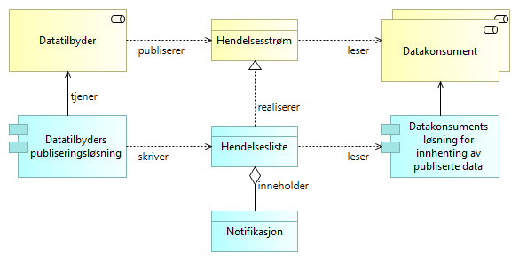

:lang: no
:doctitle: Grunnleggende mønster for publisering  
:keywords: TBD
:toclevels: 3
include::../plattform_felles/includes/commonincludes.adoc[]

// image:../plattform_felles/media/i-arbeid.png[width=45, height=45] _UNDER OPPDATERING, 2020-04-24_

== Introduksjon

Det grunnleggende mønsteret for publisering som omhandles her, bygger på det mønsteret som i litteraturen tradisjonelt omtales som _publish-subscribe_; se f.eks. link:https://en.wikipedia.org/w/index.php?title=Publish%E2%80%93subscribe_pattern&oldid=950857039[wikipedia om publish-subscribe pattern] for en enkel beskrivelse av dette.

.Publisering av datastrøm - grunnleggende konsept
image::../nab_referanse_arkitekturer_datautveksling_publisering/media/Publisering av datastrøm - grunnleggende konsept.png[alt=Publisering av datastrøm - grunnleggende konsept image]

.Publisering av hendelsesstrøm - grunnleggende konsept
image::../nab_referanse_arkitekturer_datautveksling_publisering/media/Publisering av hendelsesstrøm - grunnleggende konsept.png[alt=Publisering av hendelsesstrøm - grunnleggende konsept image]

Essens: 

* Tilbydere publiserer nyheter (hendelser) via  nyhetskanaler (hendelsesstrømmer) til et konsumentmarked der konsumentene (datakonsumentene) ikke nødvendigvis er kjent på forhånd. 
* Konsumenter kan kople seg på for å lese nyheter på tilfeldig basis (løssalgsavis).
* Konsumenter kan eventuelt tegne abonnementer for å få levert nyhetene "på døra" (f.eks. via en meldingskø på abonnentsiden, men dette kan også gjøres på andre måter).
* Konsumenter kan også tegne abonnementer for å få et utvalg av nyhetene (innholdsfilter.) 
* Tilbyder kan ta betalt for innhold og tjenester, eller det kan være gratis,

asdsa

.Publisering - grunnleggende konsept, med applikasjoner
