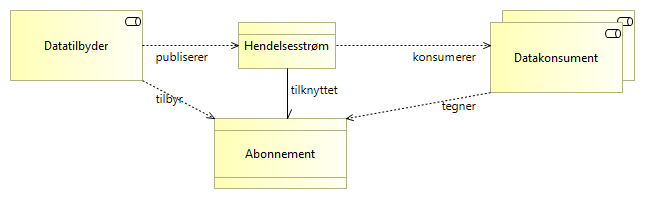
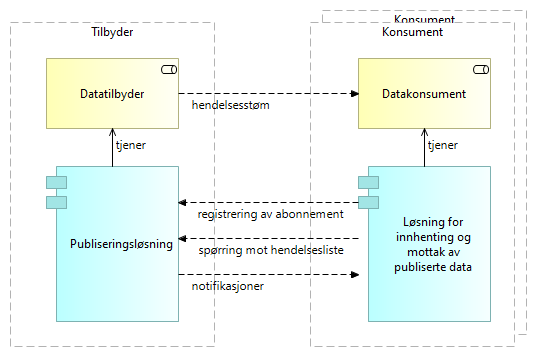

:lang: no
:doctitle: Generiske mønstre for publisering og konsumering av hendelsesstrømmer
:keywords: TBD
:toclevels: 3
include::../plattform_felles/includes/commonincludes.adoc[]

// image:../plattform_felles/media/i-arbeid.png[width=45, height=45] _UNDER OPPDATERING, 2020-04-24_

:leveloffset: +1

[[generisk-publisering]]
= Publisering og konsumering av hendelsesstrømmer (generisk mønster)

== Om dette mønsteret

Dette mønsteret er et _generisk_ arkitekturmønster, uten konkrete valg av teknologier og løsninger. 

Det grunnleggende konseptet er det samme som for andre  _mønstre for publisering og konsumering av hendelsesstrømmer_, og gjentas her: 
****
Tilbydere publiserer hendelsesstømmer uten å måtte vite hvem konsumentene er. Konsumentene kan i sin tur koble seg på og lese fra hendelsesstrømmen.

.Publisering av hendelser - basiskonsept
image::../nab_referanse_arkitekturer_datautveksling_publisering/media/Publisering av hendelser - basiskonsept.png[alt=Publisering av hendelser - basiskonsept image]
****

Begrepsapparat bygger på  _grunnleggende begrepsapparatet for publisering_.
// Erik: Fix lenke

Grunnleggende egenskaper:

* Hendelser kan ikke slettes (_immutable_), og notifikasjoner slettes heller ikke fra hendelseslister.  
* Notifikasjoner innhentes på initiav fra konsument (pull).
* Hver enkelt konsument kan lese samme notifikasjon flere ganger.  
* Hendelseslister kan traverseres og spørres mot.

== Aktørsamspill

Datatilbyder [underline]#publiserer# hendelsestrømmer som [underline]##konsumeres## av datakonsumenter.

Dtatilbyders publiseringsløsning [underline]#skriver# notifikasjoner til hendelseslister etterhvert som hendelser skjer, etterfulgt av at datakonsumentene [underline]#leser# notifikasjoner gjennom sine løsninger for innhenting og mottak. 

.Publisering av hendelser - grunnleggende konsept, med applikasjoner
image::../nab_referanse_arkitekturer_datautveksling_publisering/media/Publisering av hendelser - grunnleggende konsept, med applikasjoner.png[alt=Publisering av hendelser - grunnleggende konsept, med applikasjoner image]

Legg merke til at den publiserte hendelseslisten her betraktes som en del av tilbyders løsning og ansvar. 

I praksis kan også både datatilbyder og datakonsument velge å benytte en ekstern tjenesteleverandør for å formidle hendelsesdata. I så fall kan ekstern tjenesteleverandørs løsninger og tjenester anses som del av tilbyders eller konsuments løsninger og tjenester på lik linje med interne leverandører (og behøver ikke vises som egen part).

WARNING: Det faller utenfor omfanget her å gå inn på tilfeller der  ekstern tjenesteleverandør opptrer som  mellomledd på en måte som gjør det nødvendig å se på juridiske forhold eller løsninger på tvers av partene. 

== Applikasjonstjenester

Følgende figur angir aktuelle tjenester og grensesnitt.

.Publisering av hendelser - tjenester 
image::../nab_referanse_arkitekturer_datautveksling_publisering/media/Publisering av hendelser - tjenester .png[alt=Publisering av hendelser - tjenester  image]

Forklaring:

* Konsumenten kan innhente notifikasjoner på eget initiativ ved å spørre mot publiserte hendelseslister gjennom et grensesnitt for dette. Dersom det dreier seg om åpne data og tilbyders spørretjenester dekker behovet, kan dette gjøres uten at det tegnes abonnement eller settes opp særskilte avtaler. Lesing av notifikasjoner kan skje enkeltvis eller batchvis, avhengig av konsumentens preferanser og opsjoner i grensesnittet.
+
Grensesnittet for lesing av notifikasjoner er normalt et API (f.eks. REST eller GraphQL).
+
Merk: Dataminimering kan løses ved at det tilbys ulike hendelseslister for samme _grunnlagsnotifikasjoner_, gjerne forbeholdt ulike konsumentgrupper eller roller, med ulike rettigheter. 

* Registrering av abonnement gjøres typisk gjennom en standardtjeneste og et API for dette. Registreringen spesifiserer abonnementet mot det grensesnittet som tilbys, og kan omfatte:

** Valg av tilgjengelige opsjoner for automatisk "på døren" levering av meldinger til konsumentens integrasjonsløsning.
** Spesifisering av et utvalg av notifikasjoner fra den aktuelle hendelseslisten (server-side filtrering), ut fra tilgjengelige metadata og opsjoner.
** Spesifisering av dataminimering for notifikasjonsdata, slik at konsumenten unngår å motta f.eks. persondata som det ikke finnes rettslig grunnlag for å konsumere. 

* Som alternativ til at konsumenten selv tar initiativ (pull), kan tilbyder automatisk levere notifikasjoner til konsumentens integrasjonsløsning. Typiske løsninger:

** Asynkrone meldinger til en meldingskø hos konsumenten.
** Kall av API hos konsumenten.
** (Filoverføring.)
** (Direkte databaseoppdatering.)

== Filtrering og minimering av hendelseslister og notifikasjoner (semantisk og teknisk)

Filtrering av notifikasjoner kan skje på følgende måter:

a. Tilbyder tilbyr ulike hendelseslister, der det allerede er gjort et utvalg basert på metadata og kriterier som tema eller konfidensialitet. 

c. Konsumenten spesifiserer et abonnement på ytterligere filtrering innen hver hendelsesliste.

b. Spørring mot hendelsesliste.

d. Konsumenten forkaster notifikasjoner etter mottak.

Følgende modell oppsummerer sammenhengen mellom begreper som angår filtrering og dataminimering for hendelseslister og notifikasjoner på tvers av tilbyder og konsument.

// Håkon: Del opp i to: filterer/minimer vs. geerering vs. publisring

.Publisering av hendelser - filtrering og minimering
image::../nab_referanse_arkitekturer_datautveksling_publisering/media/Publisering av hendelser - filtrering og minimering.png[alt=Publisering av hendelser - filtrering og minimering image]

[[generisk-publish-subscribe]]
= Abonnementsbasert publisering av hendelser (generisk mønster)

== Om dette mønsteret 

Dette mønsteret bygger på <<generisk-publisering,Generisk mønster for publisering og konsumering av hendelsesstrømmer>>.

Der det stilles særskilte krav til f.eks. innhold eller levering av , kan det være nødvendig å sette opp abonnementer.

NOTE: Mønsteret tilsvarer  det mønsteret som i litteraturen tradisjonelt omtales som _publish-subscribe_; se f.eks. link:https://en.wikipedia.org/w/index.php?title=Publish%E2%80%93subscribe_pattern&oldid=950857039[wikipedia om publish-subscribe pattern] for en enkel beskrivelse av dette.

.Publisering av hendelser - basiskonsept med abonnement

.Analogi til mediehus:
****
 * Mediehus (tilbyder) publiserer nyheter  (hendelser)  via  nyhetskanaler (hendelsesstrømmer) til et konsumentmarked der konsumentene ikke nødvendigvis er kjent på forhånd. 
 * Konsumenter kan kople seg på for å lese nyheter på tilfeldig basis, f.eks. en løssalgsavis.
* Konsumenter kan eventuelt tegne abonnementer for å få levert nyhetene "på døra" (f.eks. til en innboks).
* Konsumenter kan også tegne abonnementer for å få et utvalg av nyhetene (innholdsfilter.) 
* Tilbyder kan ta betalt for innhold og tjenester, eller det kan være gratis.
****

== Om dataflyt og pull vs. push

I praksis kan det være at tilbyder  skriver notifikasjoner direkte til konsumentens integrasjonløsning, som en "pushbasert" abonnementstjeneste for levering av notifikasjoner.

Følgende figur viser dataflyten mellom systemene og illustrer dette.

.Publisering av hendelser - grunnleggende konsept, dataflyt mellom applikasjoner

Kombinasjonen av abonnement og spørring er det som bestemmer hvilke notifikasjoner som flyter fra tilbyder til konsument. 

Om det ikke er krav til å sette opp abonnement i forkant, kan spørringer gjøres direkte (pullbasert). 

Om det i registrering av abonnement på en hendelsesliste også registreres mer spesifikt hvilke notifikasjoner som ønskes levert hvordan, kan en tilsvarende få levert notifikasjoner på initiativ fra publiseringsløsningen (pushbasert).

Spørringer kan også gjøres (pullbasert) med utgangspunkt i en abonnementsavtale.

== Om tekniske grensesnitt
I dette _generiske_ arkitekturmønsteret, gis rom for ulike tekniske løsninger. 

Notifikasjoner kan f.eks. leveres gjennom et synkront API eller via en asynkron meldingskø hos konsumenten. Tilsvarende kan spørringer skje synkront eller asynkront. 

En mulig kombinasjon er at spørringen skjer gjennom et synkront API, mens notifikasjonene deretter leveres asynkront og fortløpende (pushbasert).

TIP: Spørringer kan også gjøres som en bestilling av framtidige notifikasjoner. Dette kan ses på som en type abonnment.  

Følgende figur illustrerer disse konseptene. 

// Erik: Figuren er ikke perfekt, fordi

.Publisering av hendelser - grunnleggende om tekniske grensesnitt
image::../nab_referanse_arkitekturer_datautveksling_publisering/media/Publisering av hendelser - grunnleggende om tekniske grensesnitt.png[alt=Publisering av hendelser - grunnleggende om tekniske grensesnitt image]

= Event sourcing (generisk mønster)