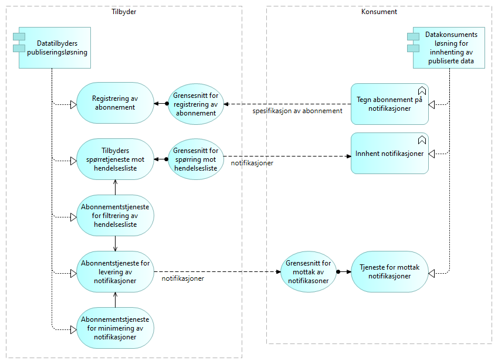

:lang: no
:doctitle: Generisk mønster for publisering  
:keywords: TBD
:toclevels: 3
include::../plattform_felles/includes/commonincludes.adoc[]

// image:../plattform_felles/media/i-arbeid.png[width=45, height=45] _UNDER OPPDATERING, 2020-04-24_

== Om dette mønsteret

Det grunnleggende mønsteret for publisering som omhandles her, bygger hovedsakelig på det mønsteret som i litteraturen tradisjonelt omtales som _publish-subscribe_; se f.eks. link:https://en.wikipedia.org/w/index.php?title=Publish%E2%80%93subscribe_pattern&oldid=950857039[wikipedia om publish-subscribe pattern] for en enkel beskrivelse av dette.

Det tas også inn visse detaljer fra andre arkitekturmønstre (slik som f.eks. Event Notification). 

//Tilbyder publiserer data i en til en hendelsesliste som ulike konsumenter kan kople seg på og lese fra (abonnere på oppdateringer fra).
//Tilbyder publiserer notifikasjoner om hendelser til en hendelsesliste som ulike konsumenter kan kople seg på og lese fra (abonnere på oppdateringer fra). 

//Det antas her at notifikasjonene inneholder alle relevante data 
== Hovedkonsepter

// Henrik kommentar

Det helt grunnleggende konseptet er at tilbyder publiserer data (til en  hendelsesstrøm) uten å forutsette noe om hvem konsumentene er. Konsumentene kan i sin tur koble seg på og lese fra hendelsesstrømmen.

.Publisering av hendelser - basiskonsept
image::../nab_referanse_arkitekturer_datautveksling_publisering/media/Publisering av hendelser - basiskonsept.png[alt=Publisering av hendelser - basiskonsept image]

Dersom det stilles særskilte krav til f.eks. innhold eller levering, kan det være nødvendig å sette opp abonnementer. 

.Publisering av hendelser - basiskonsept med abonnement
image::../nab_referanse_arkitekturer_datautveksling_publisering/media/Publisering av hendelser - basiskonsept med abonnement.png[alt=Publisering av hendelser - basiskonsept med abonnement image]

NOTE: Selv om mønsteret normalt omtales som Publish-Subscribe, understrekes det at abonnement ikke bestandig er nødvendig.

.Analogi til mediehus:
****
 * Mediehus (tilbyder) publiserer nyheter  (hendelser)  via  nyhetskanaler (hendelsesstrømmer) til et konsumentmarked der konsumentene ikke nødvendigvis er kjent på forhånd. 
 * Konsumenter kan kople seg på for å lese nyheter på tilfeldig basis, f.eks. en løssalgsavis.
* Konsumenter kan eventuelt tegne abonnementer for å få levert nyhetene "på døra" (f.eks. til en innboks).
* Konsumenter kan også tegne abonnementer for å få et utvalg av nyhetene (innholdsfilter.) 
* Tilbyder kan ta betalt for innhold og tjenester, eller det kan være gratis.
****

== Grunnleggende om løsninger for utveksling av notifikasjoner via hendelseslister

[underline]#Konseptuelt sett# kan en si at datatilbyders publiseringsløsning [underline]#skriver# notifikasjoner til hendelseslister etterhvert som hendelser skjer, etterfulgt av at datakonsumentene [underline]#leser# notifikasjoner gjennom sine løsninger for innhenting og mottak. Dette tilsvarer at datatilbyder [underline]#publiserer# og datakonsument [underline]##konsumerer##.

.Publisering av hendelser - grunnleggende konsept, med applikasjoner
image::../nab_referanse_arkitekturer_datautveksling_publisering/media/Publisering av hendelser - grunnleggende konsept, med applikasjoner.png[alt=Publisering av hendelser - grunnleggende konsept, med applikasjoner image]

I praksis kan det være at tilbyder  skriver notifikasjoner direkte til konsumentens integrasjonløsning, som em "pushbasert" abonnementstjeneste" for levering av notifikasjoner (se neste avsnitt).

I praksis kan også både datatilbyder og datakonsument velge å benytte en ekstern tjenesteleverandør for å formidle hendelsesdata. I så fall kan ekstern tjenesteleverandørs løsninger og tjenester anses som del av tilbyders eller konsuments løsninger og tjenester på lik linje med interne leverandører (og behøver ikke vises som egen part).

WARNING: Det faller utenfor omfanget her å gå inn på tilfeller der  ekstern tjenesteleverandør opptrer som  mellomledd på en måte som gjør det nødvendig å se på juridiske forhold eller løsninger på tvers av partene. 

== Applikasjonstjenester

Følgende figur angir aktuelle tjenester og grensesnitt.

.Publisering av hendelser - tjenester 

Forklaring:

* Konsumenten kan innhente notifikasjoner på eget initiativ ved å spørre mot publiserte hendelseslister gjennom et grensesnitt for dette. Dersom det dreier seg om åpne data og tilbyders spørretjenester dekker behovet, kan dette gjøres uten at det tegnes abonnement eller settes opp særskilte avtaler. Lesing av notifikasjoner kan skje enkeltvis eller batchvis, avhengig av konsumentens preferanser og opsjoner i grensesnittet.
+
Grensesnittet for lesing av notifikasjoner er normalt et API (f.eks. REST eller GraphQL).
+
Merk: Dataminimering kan løses ved at det tilbys ulike hendelseslister for samme _grunnlagsnotifikasjoner_, gjerne forbeholdt ulike konsumentgrupper eller roller, med ulike rettigheter. 

* Registrering av abonnement gjøres typisk gjennom en standardtjeneste og et API for dette. Registreringen spesifiserer abonnementet mot det grensesnittet som tilbys, og kan omfatte:

** Valg av tilgjengelige opsjoner for automatisk "på døren" levering av meldinger til konsumentens integrasjonsløsning.
** Spesifisering av et utvalg av notifikasjoner fra den aktuelle hendelseslisten (server-side filtrering), ut fra tilgjengelige metadata og opsjoner.
** Spesifisering av dataminimering for notifikasjonsdata, slik at konsumenten unngår å motta f.eks. persondata som det ikke finnes rettslig grunnlag for å konsumere. 

* Som alternativ til at konsumenten selv tar initiativ (pull), kan tilbyder automatisk levere notifikasjoner til konsumentens integrasjonsløsning. Typiske løsninger:

** Asynkrone meldinger til en meldingskø hos konsumenten.
** Kall av API hos konsumenten.
** (Filoverføring.)
** (Direkte databaseoppdatering.)

== Filtrering og minimering av hendelseslister og notifikasjoner (semantisk og teknisk)

Filtrering av notifikasjoner kan skje på følgende måter:
// Kommentar, Henrik!

a. Tilbyder tilbyr ulike hendelseslister, der det allerede er gjort et utvalg basert på metadata og kriterier som tema eller rettigheter. 
b. Konsumenten spesifiserer et abonnement på ytterligere filtrering innen hver hendelsesliste. Det kan være to formål for dette:
+
* Dataminimering ut fra hensyn til personvern eller konfidensialitet 
* Filtrering av ikke-relevante notifikasjoner

c. Konsumenten forkaster notifikasjoner etter mottak.

Følgende modell oppsummerer sammenhengen mellom begreper som angår filtrering og dataminimering for hendelseslister og notifikasjoner på tvers av tilbyder og konsument.

.Publisering av hendelser - filtrering og minimering

