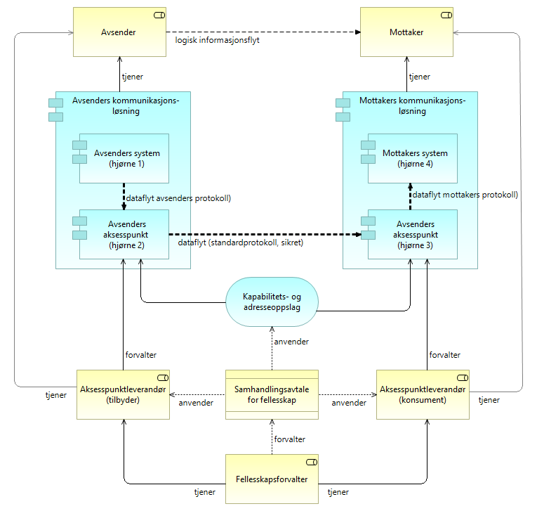

:lang: no
:doctitle: 4-hjørnersmodellen
:keywords: TBD
:toclevels: 3
include::../plattform_felles/includes/commonincludes.adoc[]

== Generelt
Begrepet "firehjørnersmodell", eller “4-corner model”, stammer fra  link:../kunnskap_referansearkitektur_eu-edelivery[CEF eDelivery]. 

Følgende figur illustrerer aktuelle konsepter: 

// .Firehjørnersmodellen - operativt
// image::../nab_referanse_arkitekturer_datautveksling_forsendelse/media/Firehjørnersmodellen - operativt.png[alt=Firehjørnersmodellen - operativt image]

.Firehjørnersmodellen
.Firehjørnersmodellen - forvaltningsmessig

 

NOTE: Denne modellen kan minne om en "tjenestebuss" (ESB), der det også finnes tilsvarende løs kopling mellom avsender og mottaker. Den grunnleggende forskjellen er at dette mønsteret er fullstendig distribuert og skalerer "uendelig"  over www på global basis.

I firehjørnersmodellen kommuniserer avsenders og mottakers systemer via hver sine _aksesspunktløsninger_. Aksesspunktene konverterer mellom applikasjonsspesifikke protokoller og en standardisert, sikker meldingsprotokoll over aktuell kommunikasosjonsinfrastruktur.

Hvert aksesspunkt blir en node i et tillitsfelleskap.

Aksesspunktene kan eventuelt integreres i avsenders og mottakers systemer. Om dette gjøres på begge sider, vil en rent fysisk ha en punkt-til-punkt forbindelse, men uten at det endrer konseptet som sådan.

////
I denne modellen In this model, the back-end systems of the users don’t exchange data directly with each other but do this through Access Points. These Access Points are conformant to the same technical specifications and therefore capable of communicating with each other.

As a result of this, users adopting CEF eDelivery can easily and safely exchange data even if their IT systems were developed independently from each other.

4-hjørnersmodellen er basert på en distribuert modell som tillater kommunikasjon mellom samhandlingsaktører uten behov for bilaterale avtaler ved at man baserer seg på innmelding i et fellesskap.

4-hjørnersmodellen med adresse- og kapabilitetsoppslag sikrer fleksibilitet og skalerbarhet hvor
////

////

Firehjørnersmodellen for meldingsforsendelse

.Firehjørnersmodellen - operativt
image::../nab_referanse_arkitekturer_datautveksling_forsendelse/media/Firehjørnersmodellen - operativt.png[alt=Firehjørnersmodellen - operativt image]

Tekst...

.Firehjørnersmodellen - forvaltningsmessig
image::../nab_referanse_arkitekturer_datautveksling_forsendelse/media/Firehjørnersmodellen - forvaltningsmessig.png[alt=Firehjørnersmodellen - forvaltningsmessig image]
////

////
.Firehjørnersmodellen - operativt
image::../nab_referanse_arkitekturer_datautveksling_forsendelse/media/Firehjørnersmodellen - operativt.png[alt=Firehjørnersmodellen - operativt image]
////

Nærmere om "hjørnene":

*Hjørne 1* representerer back-end systemet (som ligger innenfor avsenders juridiske ansvar) som sender melding til et annet back-end system (hjørne 4).

*Hjørne 2* (aksesspunkt for avsender) Samhandler med hjørne 1 og slår opp mottakers adresse og kapabiliteter. Aksesspunktet har evnen til å sende på en sikker og pålitelig måte til et annet aksesspunkt.

*Hjørne 3* (aksesspunkt for mottaker) Mottakers aksesspunkt har teknisk evne til å motta meldinger på en sikker og pålitelig måte og samhandle med hjørne 4.

*Hjørne 4* representerer back-end systemet til mottaker.

== Egenskaper ved  4-hjørnersmodellen

* Løs kopling mellom avsender og mottaker
* Sikker meldingsinfrastruktur (mellom aksesspunktene)
* Avtaleforvaltning gjennom betrodd tredjepart
* Mulighet for å oppdage tjenestetilbydere og inngå avtaler runtime 
* Ubegrenset skalering  
* [red]#Mulig å opprette flere communities#

== Backend-integrasjon
I 4-hjørnersmodellen er det fleksibilitet gjennom hvordan man velger å integrere aksesspunktet med egen IT-arkitektur og IT-infrastruktur. Sett fra avsenderapplikasjonen er det tre måter å integrere hjørne 1/hjørne 2 og hjørne 3/hjørne 4.

////
This ABB relates to the eDelivery 4-corner model and adresses the
Communication/Integration of Corner1-Corner2/Corner3-Corner4.

The 4-corner model creates a very flexible architecture, where the enterprises can make
their own decisiones on how to integrate the external Business Process Choreography
component into their own IT-architecture orientation.
From the backend perspective there is 4 ways of integration of Corner1-
Corner2/Corner3-Corner4
////

////
===== Tightly Coupling
Back-end system and Access Point is tighly
coupled i.e. The Back-end system has integrated
the Access Point into the Back-end system. One
Access Point handles the eDelivery of one Backend
System.
//// 

==== Tett kobling
Avsender applikasjon og aksesspunkt er tett koblet ved at avsender applikasjonen har integrert funksjonaliteten til aksesspunktet. Det blir dermed et en-til-en forhold mellom aksesspunkt og avsender applikasjonen.

////
===== Semi-Tightly Coupling
Back-end system and Access Point is semi-tighly
coupled i.e. The Back-end system and the Access
Point is internally loosely coupled, but part of the
same internal IT-Architecture and IT-Infrastructure
or the Access Point is an Internal Cloud solution.
One Access Point can handle the eDelivery of
several Back-end Systems.
////

==== Semi-tett kobling
Avsender applikasjonen og aksesspunkt er semi-tett koblet ved at back-end og aksesspunkt er løst koblet internt, men del av det samme interne IT-arkitekturen og IT-infrastrukturen. Et aksesspunkt kan håndtere flere avsender applikasjoner.

////
===== Loose Coupling Coupling
The Back-end system and the Access Point is
loosely coupled and not part of the same internal IT-Architecture and IT-Infrastructure. One Access
Point can handle the eDelivery of many Back-end
Systems from many Enterprises. This model
accomodate the use of Service-/Cloud providers,
where the interaction between the Back-end
system and the Cloud is determined by the
Architecture and Infrastructure of the
Service/Cloud provider.
////

==== Løs kobling
Avsender applikasjonen og aksesspunkt er løst koblet og ikke en del av samme interne IT-arkitektur og IT-infrastruktur. Ett aksesspunkt kan håndtere meldingsutveksling for mange avsender applikasjoner fra flere virksomheter.

////
===== Loose Coupling (Citizen)
The Citizen can send and receive eDocuments
through the use of Service-/Cloud providers,
where the interaction between the Citizen and the
Service-/Cloud provider is determined by the
setup of the architecture and infrastructure of the Service/Cloud provider.
////

Ved løs kobling er det spesielle hensyn ved ende til ende kryptering og integritet. Det er hjørne 1 som må pakke og kryptere informasjonen og kun hjørne 4 som kan dekryptere. Hjørne 2 og hjørne 3 har ikke lov til å pakke om, fjerne eller legge til noe til meldingen og fungerer kun som en ruting mekanisme.  
