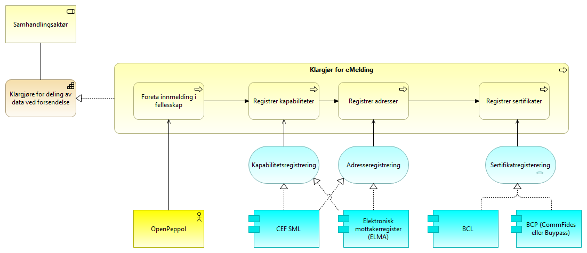
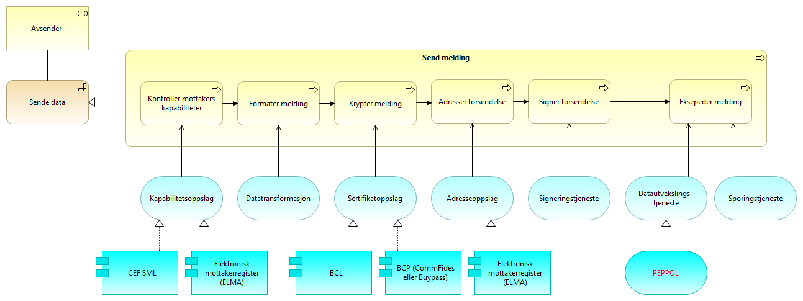
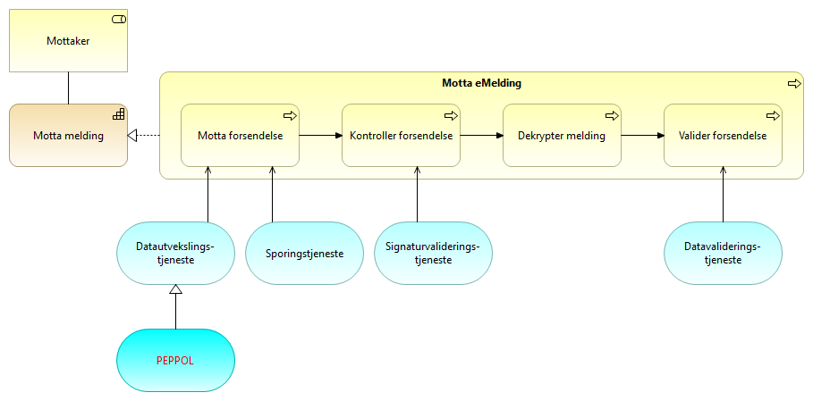

:lang: no
:doctitle: Referansearkitektur eMelding 
:keywords: eMelding
:toclevels: 3

include::../plattform_felles/includes/commonincludes.adoc[]

[.lead]
eMelding er en referansearkitektur for meldingsutveksling på tvers av virksomheter, sektorer og landegrenser.

== Introduksjon
include::../nab_referanse_arkitekturer_emelding/intro-ra-emelding.adoc[]

////
=== Krav til eMelding
include::../nab_referanse_arkitekturer_emelding/krav_eMelding.adoc[]
////

== Grunnleggende konsepter for eMelding

////
=== Generelt

* Løs kopling mellom avsender og mottaker
* Avtaleforvaltning gjennom betrodd tredjepart
* Mulighet for å oppdage tjenestetilbydere og inngå avtaler runtime 
* Ubegrenset skalering  
////

=== Firehjørnersmodellen
:leveloffset: +2
include::./4-hjørnersmodellen.adoc[]

:leveloffset: -2

== Konseptuelle prosessbeskrivelser (arkitekturbyggeklosser)

Se konseptuelle prosessbeskrivelser for link:../nab_referanse_arkitekturer_meldingsutveksling_generisk[generisk meldingsforsendelse].

== Anvendelse av eMelding i PEPPOL-infrastrukturen i Norge

=== Generelt

Beskrivelsene her peker på hvordan den generiske referansearkitekturen for eMelding kan realiseres med arkitektur- og løsningskomponenter som inngår i PEPPOL-infrastrukturen; basetr på CEF eDelivery.

Utover de arkitekturtegningene som presenenteres, henvises til omfattende dokumentasjon av eDelivery og PEPPOL.

.PEPPOL eDelivery Network overview
image::../kunnskap_losning_eu-peppol\media/PEPPOL eDelivery Network overview.png[]

Arkitektur- og løsningsbyggeklosser:

* CEF SMP (Service Metadata Publisher): Oppslagstjeneste for å finne adresse og kapabiliteter for aktuell mottaker. Inneholder mottakers ID, aksesspunktadresse og dokumenttyper som mottaker kan motta.Aktuelle løsninger:  link:https://samarbeid.difi.no/felleslosninger/elma[ELMA].

* BCP (Business Certificate Publisher): Sertifikatutsteder. Løsninger: Se https://vefa.difi.no/bcp/.

* Adressetjenesten CEF link:https://ec.europa.eu/cefdigital/wiki/display/CEFDIGITAL/SML+service[SML] (Service Metadata Locater): Global oppslagstjeneste for å finne fram til aktuell SMP.
* BCL (Business Certificate Locator): Oppslagstjeneste for å finne BCP (introdusert ifm. Enhanced PEPPOL eDelivery Network).
* Elektronisk mottaksregister (link:https://samarbeid.difi.no/felleslosninger/elma[ELMA]): Norsk register over foretak som kan ta i mot dokumenter i standardisert EHF-format.

//NOTE: Det er ikke hensikten å låse referansearkitekturen til spesifikke løsninger, da ulike sektorer og aktører kan ha behov som ikke passer med det som er beskrevet. PEPPOL gir   standarder som sikrer sikker meldingsutveksling som tilfredsstiller aktuelle krav til integritet, leveringssikkerhet, mv.

=== Klargjør for deling av data ved forsendelse (eMelding)

.Klargjør for eMelding (løsningsmønster)

Forklaring til figur:

[cols ="1,3", options="header"]
.Elementer i view for Klargjør for forsendelse SBB
|===

| Element
| Beskrivelse

| Klargjøre for deling av data ved forsendelse
| Evne til å klargjøre for meldingsutveksling med eksterne parter.

| Samhandlingsaktør
| Samlebetegnelse på roller som inngår i en samhandlingsprosess og samhandler med en annen samhandlingsaktør. Kan være en tilbyder, konsument, avsender, mottaker, leverandør etc.

| Klargjøre for meldingsutveksling
| Prosessen med å klargjøre for eMelding ved å akseptere felles avtaler og tilgjengeliggjøre nødvendig informasjon til andre samhandlingsaktører.

| Foreta innmelding i fellesskap
| Akseptere vilkår for og innrette seg etter reglene og forpliktelsene som gjelder i et fellesskap (community) gjennom å f.eks. signere en avtale eller kontrakt. Dette kan omfatte merkantile forhold.

| Registrer kapabiliteter
| Registering av kapabiliteter vil si å tilgjengeligjøre for avsendere og konsumenter hvilke meldinger og formater man kan motta og hvilke ressurser og tjenester man tilbyr.

| Registrer adresser
| Med adresse menes nødvendig informasjon for å få tilgang til tjenester fra tilbyder eller for å sende melding til mottaker av meldinger. 

| Registrer sertifikater
| Tilgjengeliggjøre for samhandlende parter sertifikater for bruk ved forsendelser. Dette kan være generelle eller domenespesifikke sertifikater. Eventuelt spesifikt for enkelet forretningsområder. 

Sertifikater må forvaltes og fornyes etter gjeldende regler for å være gyldige og egnet for bruk. 

| CEF SML
| Service Metadata Locator

| BCP
| Business Certificate Publisher

| Sertifikatregisterering
| Tjeneste for å registrere serifikater i felles katalogtjeneste.

| Adresseregistrering
| Tjeneste for å registrere adresse for å sende melding til mottaker.

| Kapabilitetsregistrering
| Tjeneste for å registrere kapabiliteter

| Elektronisk mottakerregister (ELMA)
| Med ELMA får brukerne dine oversikt over alle virksomheter i Norge som kan motta elektroniske fakturaer i henhold til EHF-standarden. 

| BCL
| Business Certificate Locater

|===

=== Operativ deling av data ved forsendelse (eMelding)

==== Send eMelding

.Send eMelding  (løsningsmønster)

Forklaring til figur:

[cols ="1,3", options="header"]
.Elementer i view for Send melding SBB
|===

| Element
| Beskrivelse

| Avsender 
| Den som sender et brev, en pakke, en e-post, en elektronisk melding, en SMS eller lignende.

| Send melding
| Prosessen med å sende en eMelding til en mottaker ved hjelp av fellestjenester.

| Kontroller mottakers kapabiliteter
| Prosess for å slå opp og kontrollere mottakers evner til samhandling innenfor fellesskapet.

| Eksepeder melding
| Prosessen med å sende melding til mottaker.

| Formater melding
| Prosess for å tilpasse informasjonspakken til mottakers kapabiliteter og fellesskapets standarder.

| Krypter melding
| Prosess med å sikre forsendelsen. Inkluderer konfidensialitets- og integritetssikring der dette er nødvendig. Normalt gjøres dette ved hjelp av kryptografi og sertifikater.

| Adresser forsendelse
| Prosess med å adressere forsendelsen. Dette kan være til mottaker direkte eller til dennes representant eller aksesspunkt,

| Signer forsendelse
| Prosessen med å signere meldingen som sendes til mottaker. Til dette benyttes eget sertifikats private nøkkel.

| Kapabilitetsoppslag
| Tjeneste for å slå opp kapabilitetene til en samhandlingspart

| Adresseoppslag
| Tjeneste for å slå opp adressen til en mottaker.

| Sending av data
| Evnen til å sende data til en mottaker.

| Sertifikatoppslag
| Tjeneste for å hente krypteringssertifkat til mottaker.

| Datautvekslings-tjeneste
| Tjeneste for utveksling av data. Samme som data exchange service. Benyttes av avsender og mottaker for transport av meldinger.

| Signeringstjeneste
| Tjeneste for å signere en elektronisk melding. For eMelding er det signatur i form av elektronisk segl som er mest relevant.

| Sporingstjeneste
| Tjeneste for sporing (audit) av meldinger.

| Datatransformasjon
| Tjeneste for  transformere data og meldinger til andre formater.

| CEF SML
| Service Metadata Locator

| BCP
| Business Certificate Publisher

| ELMA
| Elektronisk mottakeradresseregister

| BCL
| Business Certificate Locater

| PEPPOL
| 

|===

==== Motta eMelding

.Motta eMelding (løsningsmønster)

Forklaring til figur:

[cols ="1,3", options="header"]
.Elementer i view for Motta melding SBB
|===

| Element
| Beskrivelse

| Motta melding
| Evnen til å motta, validere og kvittere for mottatte meldinger.

| Mottaker
| Den som mottar en melding.

| Motta melding
| Prosessen med å motta melding. Består av flere delprosesser.

Etter mottak må mottaker følge opp og håndtere innholdet i meldingen.

| Valider forsendelse
| Prosessen med å kontrollere om innholdet i en forsendelse er i henhold til avtale og avtalte formater.

| Motta forsendelse
| Prosessen med å motta en melding fra avsender

| Kontroller forsendelse
| Prosessen med å kontrollere om forsendelsen er autentisk og fra en legitim avsender.

| Dekrypter melding
| Prosessen med å dekryptere mottatt melding. 

| Datautvekslings-tjeneste
| Tjeneste for utveksling av data. Samme som data exchange service. Benyttes av avsender og mottaker for transport av meldinger.

| Sporingstjeneste
| Tjeneste for sporing (audit) av meldinger.

| Signaturvaliderings-tjeneste
| Tjeneste for å validere og verifisere elektronsike signaturer. I forbindelse med eMelding er det kontroll av elektronisk segl som er mest relevant.

| Datavaliderings-tjeneste
| Tjeneste for å validere meldinger mot format og forventet innhold.

| PEPPOL
| 

|===

== Videre informasjon om eMelding

Videre informasjon og og dokumentasjon om eMelding finnes under https://www.difi.no/fagomrader-og-tjenester/digitalisering-og-samordning/nasjonal-arkitektur-old/referansearkitektur-meldingsutveksling-emelding.
////

////

. link:https://github.com/difi/nasjonal_arkitektur/blob/master/nab_referanse_arkitekturer_emelding/files/H%C3%B8ringsnotat-Strategi-og-referansearkitektur-meldingsutveksling.docx[Høringsnotat]

. link:https://github.com/difi/nasjonal_arkitektur/blob/master/nab_referanse_arkitekturer_emelding/files/Vedlegg-A-Forslag-Nasjonal-referansekarkitektur-og-strategi-for-meldingsutveksling-v1_1.docx[Veddlegg A - Forslag - Nasjonal referansekarkitektur og strategi for meldingsutveksling v1_1]

. link:https://github.com/difi/nasjonal_arkitektur/blob/master/nab_referanse_arkitekturer_emelding/files/Vedlegg-B-Referanse-arkitektur-for-eMelding-printable.pdf[Vedlegg B - Referansearkitektur for eMelding (teknisk)]

////

I SAT eDelivery deles tjenesten opp i fem kapabiliteter som er:

* Backend integration
* Service Location
* Capability Lookup
* Message Exchange
* Trust Establishment

////

////

== SAT eDelivery

=== Non technical description
The reference architecture supports cross enterprise business processes, where two
enterprises participate in a distributed Business Process in a choreography manner.
Where the Business Process crosses the Enterprise border to another Enterprise, the
sending enterprise makes an event notification and hands over necessary information to
a receiving Enterprise to invoke the corresponding business process. 

<Figure 2: eDelivery context>

An enterprise conducting a Business process, where the Business Process needs to
invoke a Business Process in another Enterprise can use the Reference architecture for
Norwegian e-Delivery to send an event notification and the required information
(eDocuments) to the other Enterprise to invoke and thereby proceed the continued
Business Process.

The Term Enterprise can be extended to Citizens, where a citicen can either be sending
i.e. trigger the process of a receiving Enterprise or be receiving, thereby start a "citizen
process" e.g. fill in tax return. 

=== Definition
eDelivery is electronicly pushing Event notification and eDocuments (Set of interrelated
structured or semistructured information) between two Enterprises i.e. from a sending
Back-end system (or Citizen) to another receiving Back-end System (or Citizen).

eDelivery supports public Public administrations, Businesses and Citizens to engage in
shared Business processes in an electronic way by exchanging event-notifications and
eDocuments with other Public administrations, Businesses and citizens, in a flexible
interoperable, secure, reliable and trusted way. 

=== Requirements
==== Electronic Delivery Service
Norwegian eDelivery basic requirements: SAT-eDelivery_Requirements

==== Electronic Registered Delivery Service
A service that makes it possible to transmit data between third parties by electronic
means and provides evidence relating to the handling of the transmitted data, including
proof of sending and receiving the data, and that protects transmitted data against the
risk of loss, theft, damage or any unauthorised alterations

eIDAS (reference) compliant requirements: ABB-eIDAS_Regulation

==== Description of Architecture
The Architecture is in compliance with the SOA principles, EIF principles and
the Norwegian IT-principles for public sector (see "Nasjonal strategi for
meldingsutveksling")

The Business Exchange Pattern used is Asynchronous-Push, meaning that the Sending
Enterprise can send event notifications and eDocuments in a reliable and secure way,
without knowing when the receiving Enterprise is ready to consume the event
notification and eDocuments.

It should be noted that here the term eDelivery is not fuly consistent with the CEF
eDelivery term eDelivery. The definition and architecture of eDelivery spans all of the EIF
layers, whereas CEF eDelivery uses the term for the technical part, here defined as
Technical eDelivery. 

=== Technical eDelivery Architecture
Technical eDelivery architecture is based on a distributed model, allowing
communication (one Back-end system to send eDocument(s) to another Back-end
system) between participants without the need to set up bilateral agreements and
technical channels. 

For Flexibility and Scalability the Architecture is based on a 4 Corner model with
Location- and Capability LookUp: 
Figure 3: Four Corner Model with Location- and Capability LookUp

*Corner 1* represents a Back-end system (within the legal responsibility of the sending
organization), that needs to send eDocument(s) to another Back-end system  (Corner 4).
This is done by interacting with

*Corner 2* (Sending Access Point). The adress and the receiving capabilities (legal,
organisational, semantic and technical) of the receiver is established through the
Location LookUp and the Capability LookUp. With the technical capability to send the
event notification and related eDocuments(s) in a reliable and secure  way to the correct
receiving 

*Corner 3* (Receiving Access Point). The Receiving Access Point has technical capability to
receive the eDocuments(s) in a reliable and secure  way and interact with

*Corner 4*, the receiving Back-end system (within the legal responsibility of the receiving
organization) to deliver the eDocuments.
In this 4-Corner Store-and-Forward model, every eDelivery Access Point becomes a node
in a trusted interoperabilty community

////
