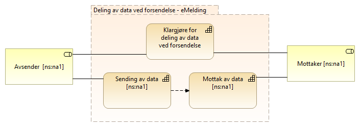

:lang: no
:doctitle: Referansearkitektur eMelding 
:keywords: eMelding

include::../plattform_felles/includes/commonincludes.adoc[]

[.lead]
eMelding er en referansearkitektur for asynkron informasjonsforsendelse

== Introduksjon
include::../nab_referanse_arkitekturer_emelding/ra-emelding-intro.adoc[]

== Kapabilitetskart - relevante kapabiliteter

== Arkitekturmønstre (konseptuelle beskrivelser, kun arkitekturbyggeklosser)

//

//

//

//

== Videre informasjon om eMelding

Videre informasjon og og dokumentasjon om eMelding finnes under https://www.difi.no/fagomrader-og-tjenester/digitalisering-og-samordning/nasjonal-arkitektur-old/referansearkitektur-meldingsutveksling-emelding.

////

. link:https://github.com/difi/nasjonal_arkitektur/blob/master/nab_referanse_arkitekturer_emelding/files/H%C3%B8ringsnotat-Strategi-og-referansearkitektur-meldingsutveksling.docx[Høringsnotat]

. link:https://github.com/difi/nasjonal_arkitektur/blob/master/nab_referanse_arkitekturer_emelding/files/Vedlegg-A-Forslag-Nasjonal-referansekarkitektur-og-strategi-for-meldingsutveksling-v1_1.docx[Veddlegg A - Forslag - Nasjonal referansekarkitektur og strategi for meldingsutveksling v1_1]

. link:https://github.com/difi/nasjonal_arkitektur/blob/master/nab_referanse_arkitekturer_emelding/files/Vedlegg-B-Referanse-arkitektur-for-eMelding-printable.pdf[Vedlegg B - Referansearkitektur for eMelding (teknisk)]

////

I SAT eDelivery deles tjenesten opp i fem kapabiliteter som er:

* Backend integration
* Service Location
* Capability Lookup
* Message Exchange
* Trust Establishment

== SAT eDelivery

=== Non technical description
The reference architecture supports cross enterprise business processes, where two
enterprises participate in a distributed Business Process in a choreography manner.
Where the Business Process crosses the Enterprise border to another Enterprise, the
sending enterprise makes an event notification and hands over necessary information to
a receiving Enterprise to invoke the corresponding business process. 

<Figure 2: eDelivery context>

An enterprise conducting a Business process, where the Business Process needs to
invoke a Business Process in another Enterprise can use the Reference architecture for
Norwegian e-Delivery to send an event notification and the required information
(eDocuments) to the other Enterprise to invoke and thereby proceed the continued
Business Process.

The Term Enterprise can be extended to Citizens, where a citicen can either be sending
i.e. trigger the process of a receiving Enterprise or be receiving, thereby start a "citizen
process" e.g. fill in tax return. 

=== Definition
eDelivery is electronicly pushing Event notification and eDocuments (Set of interrelated
structured or semistructured information) between two Enterprises i.e. from a sending
Back-end system (or Citizen) to another receiving Back-end System (or Citizen).

eDelivery supports public Public administrations, Businesses and Citizens to engage in
shared Business processes in an electronic way by exchanging event-notifications and
eDocuments with other Public administrations, Businesses and citizens, in a flexible
interoperable, secure, reliable and trusted way. 

=== Requirements
==== Electronic Delivery Service
Norwegian eDelivery basic requirements: SAT-eDelivery_Requirements

==== Electronic Registered Delivery Service
A service that makes it possible to transmit data between third parties by electronic
means and provides evidence relating to the handling of the transmitted data, including
proof of sending and receiving the data, and that protects transmitted data against the
risk of loss, theft, damage or any unauthorised alterations

eIDAS (reference) compliant requirements: ABB-eIDAS_Regulation

==== Description of Architecture
The Architecture is in compliance with the SOA principles, EIF principles and
the Norwegian IT-principles for public sector (see "Nasjonal strategi for
meldingsutveksling")

The Business Exchange Pattern used is Asynchronous-Push, meaning that the Sending
Enterprise can send event notifications and eDocuments in a reliable and secure way,
without knowing when the receiving Enterprise is ready to consume the event
notification and eDocuments.

It should be noted that here the term eDelivery is not fuly consistent with the CEF
eDelivery term eDelivery. The definition and architecture of eDelivery spans all of the EIF
layers, whereas CEF eDelivery uses the term for the technical part, here defined as
Technical eDelivery. 

=== Technical eDelivery Architecture
Technical eDelivery architecture is based on a distributed model, allowing
communication (one Back-end system to send eDocument(s) to another Back-end
system) between participants without the need to set up bilateral agreements and
technical channels. 

For Flexibility and Scalability the Architecture is based on a 4 Corner model with
Location- and Capability LookUp: 
Figure 3: Four Corner Model with Location- and Capability LookUp

*Corner 1* represents a Back-end system (within the legal responsibility of the sending
organization), that needs to send eDocument(s) to another Back-end system  (Corner 4).
This is done by interacting with

*Corner 2* (Sending Access Point). The adress and the receiving capabilities (legal,
organisational, semantic and technical) of the receiver is established through the
Location LookUp and the Capability LookUp. With the technical capability to send the
event notification and related eDocuments(s) in a reliable and secure  way to the correct
receiving 

*Corner 3* (Receiving Access Point). The Receiving Access Point has technical capability to
receive the eDocuments(s) in a reliable and secure  way and interact with

*Corner 4*, the receiving Back-end system (within the legal responsibility of the receiving
organization) to deliver the eDocuments.
In this 4-Corner Store-and-Forward model, every eDelivery Access Point becomes a node
in a trusted interoperabilty community

