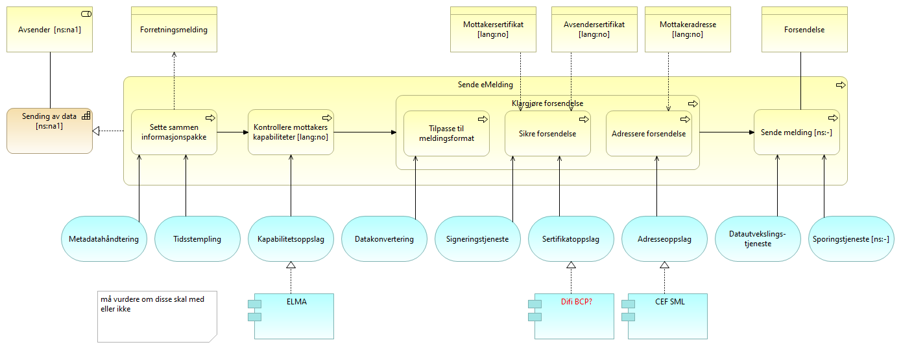
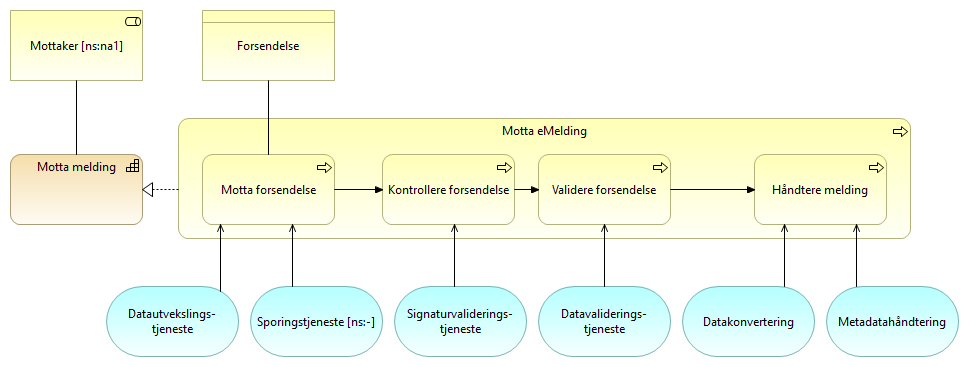

:lang: no
:doctitle: Referansearkitektur eMelding 
:keywords: eMelding

include::../plattform_felles/includes/commonincludes.adoc[]

[.lead]

== Introduksjon
include::../nab_referanse_arkitekturer_emelding/ra-emelding-intro.adoc[]

=== Krav til eMelding
include::../nab_referanse_arkitekturer_emelding/krav_eMelding.adoc[]

== Kapabilitetskart - relevante kapabiliteter

image:../nab_referanse_arkitekturer_emelding/media/Deling av data ved forsendelse.png[alt="Bilde mangler", width=750]

[cols ="1,1,3", options="header"]
.Elementer i view for Kapabiliteter eMelding
|===

| Deling av data ved forsendelse - eMelding
| grouping
| 

| Mottaker
| business-role
| Aktør som mottar melding

| Avsender 
| business-role
| den som sender et brev, en pakke, en e-post, en elektronisk melding, en SMS eller lignende
|===

== Arkitekturmønstre (konseptuelle beskrivelser, kun arkitekturbyggeklosser)

=== Klargjøring for deling av data ved forsendelse

==== Klargjøre for eMelding
Modellen under detaljerer hvordan en samhandlingsaktør, som i dette tilfellet normalt vil være en avsender eller mottaker, blir klar for å sende data som en melding. Dette gjøres ved å melde inn i et fellesskap og registrere nødvendige data i registre som er tilgjengelig for de andre samhandlingsaktørene i fellesskapet. Det vil kunne være forskjeller på hva som er nødvendig å gjøre avhengig av om samhandlingsaktøren er en sender eller mottaker, men i mange tilfeller vil man innha begge roller i fellesskapet.

[cols ="1,1,3", options="header"]
.Elementer i view for Klargjøre for forsendelse
|===

| Klargjøre for deling av data ved forsendelse
| capability
| Evne til å klargjøre for meldingsutveksling med eksterne parter.

| Samhandlingsaktør
| business-role
| 

| Klargjøre for eMelding
| business-process
| Prosessen med å klargjøre for eMelding ved å akseptere felles avtaler og tilgjengeliggjøre nødvendig informasjon til andre samhandlingsaktører.

| Interoperability specification
| business-object
| 

| Samhandlingsavtale
| contract
| 

| Mottakeradresse
| business-object
| 

| Avsendersertifikat
| business-object
| 

| Mottakersertifikat
| business-object
| 

| Kapabilitetsbeskrivelse
| business-object
| 

| CEF SML
| application-component
| 

| Difi BCP?
| application-component
| Business Certificate Publisher

| Sertifikatregisterering
| application-service
| 

| Adresseregistrering
| application-service
| 

| Kapabilitetsregistrering
| application-service
| 

| ELMA
| application-component
| 
|===

=== Operativ deling av data ved forsendelse

==== Sende melding

[cols ="1,1,3", options="header"]
.Elementer i view for Sende melding
|===

| Avsender 
| business-role
| den som sender et brev, en pakke, en e-post, en elektronisk melding, en SMS eller lignende

| Mottakeradresse
| business-object
| 

| Forretningsmelding
| business-object
| 

| Forsendelse
| business-object
| 

| Avsendersertifikat
| business-object
| 

| Mottakersertifikat
| business-object
| 

| Sende eMelding
| business-process
| Prosessen med å sende en eMelding til en mottaker ved hjelp av fellestjenester.

| Data Exchange Service
| application-service
| DESCRIPTION:
Shares the functionality that enables the secure exchange of messages, records, forms and other kinds of data between different ICT systems. This includes data routing, except endpoint discovery. 

Based on EIFv2
http://ec.europa.eu/isa/documents/isa_annex_ii_eif_en.pdf   

INTEROPERABILITY SALIENCY:
The Data Exchange Service ABB  is salient for technical interoperability because it provides secure and trustworthy data exchange between different ICT systems as stated in the EIF: "Define a common security and privacy framework and establish processes for public services to ensure secure and trustworthy data exchange between public administrations and in interactions with citizens and businesses."

EXAMPLES:
The following implementation is an example on how this specific Architecture Building Block (ABB) can be instantiated as a Solution Building Block (SBB):
XMLGate
XMLGate is a Web service application used to validate an XML instance against a well-defined schema. The XML flow is submitted either via a PDF form or by uploading the XML file.
https://webgate.ec.europa.eu/sanco-xmlgate/Login.jsp;jsessionid=2MPn_N5Wg9Dar4_W2-yVL_Xg-VlW3kn47PLVbNise9X5Kycx1yLI!-25226473 

| Kapabilitetsoppslag
| application-service
| 

| Adresseoppslag
| application-service
| 

| CEF SML
| application-component
| 

| Sending av data
| capability
| Evnene til å sende data til en mottaker.

| Data Transformation Service
| application-service
| DESCRIPTION:
Shares the functionality of conversion of one data format to another. 

Source: ISA2 – EIA Action

INTEROPERABILITY SALIENCY:
The Data Transformation Service ABB  is salient for technical interoperability  because it provides the functionalities to transform internal data structures to common and agreed interoperable formats as stated in the EIF recommendation n° 41: "Establish procedures and processes to integrate the opening of data in your common business processes, working routines, and in the development of new information systems."

EXAMPLES:
The following implementation is an example on how this specific Architecture Building Block (ABB) can be instantiated as a Solution Building Block (SBB):

Eurostat transformation service
The transformation service allows datasets to be converted from one file format to another, optionally performing additional tasks, such as mapping and transcoding. 
The service is operational but is currently only available for internal consumption within Eurostat. However, the source code of both web service and software component is available in the SDMX webspace:
http://ec.europa.eu/eurostat/web/sdmx-infospace/validation-transformation/transformation-services 

| e-Seal Creation Service
| application-service
| DESCRIPTION:
Shares the functionality of signing data in electronic forms on behalf of a legal person. 
An ‘electronic seal' means data in electronic form, which is attached to or logically associated with other data in electronic form to ensure the latter’s origin and integrity. The ‘creator of a seal’ is a legal person who creates an electronic seal.

Based on eIDAS - REGULATION (EU) No 910/2014 OF THE EUROPEAN PARLIAMENT AND OF THE COUNCIL of 23 July 2014 on electronic identification and trust services for electronic transactions in the internal market and repealing Directive 1999/93/EC.
http://eur-lex.europa.eu/legal-content/EN/TXT/?uri=uriserv%3AOJ.L_.2014.257.01.0073.01.ENG

INTEROPERABILITY SALIENCY:
The e-Seal Creation Service ABB  is salient for technical interoperability because it provides 
the functionalities required for e-seal creation service.
   
EXAMPLES:
The following implementation is an example on how this specific Architecture Building Block (ABB) can be instantiated as a Solution Building Block (SBB):

CEF eSignature DSS
DSS (Digital Signature Services) is an open-source software library for electronic signature creation and validation. DSS supports the creation and verification of interoperable and secure electronic signatures in line with European legislation. In particular, DSS aims to follow the eIDAS Regulation and related standards closely.
DSS can be re-used in an IT solution for electronic signatures to ensure that signatures are created and verified in line with European legislation and standards. DSS allows re-use in a variety of different ways: in an applet, in a stand-alone application or in a server application. DSS can also be used as a reference implementation for IT solutions which do not directly re-use it.
CEF eSignature's DSS open-source library delivers the following benefits to its users:
•	Open-source software under LGPL 2.1, a non-viral open source license;
•	Interoperability of the e-signatures;
•	Supports both e-signatures and e-seals;
•	Validation of countersignatures and multiple signatures;
•	Alignment with the eIDAS Regulation and related standards;
•	Supports EU standards on:
o	Signature formats and packaging methods;
o	Signature validation procedures;
•	Validation relying on Member States' trusted lists:
o	Status of trust service providers/trust service, compensation of information, path validation.
https://ec.europa.eu/cefdigital/wiki/display/CEFDIGITAL/eSignaturefile:///C:/Users/bocquilp/Downloads/DSS(ServiceOfferingDescription)%20(v0.03)%20(5).pdf 

| e-Timestamp Creation Service
| application-service
| DESCRIPTION:
Shares the functionality of the verification of timestamps used for establishing evidence that a give piece of data existed at a given point in time.
An ‘electronic time stamp’ means data in electronic form which binds other data in electronic form to a particular time establishing evidence that the latter data existed at that time.

Based on eIDAS - REGULATION (EU) No 910/2014 OF THE EUROPEAN PARLIAMENT AND OF THE COUNCIL of 23 July 2014 on electronic identification and trust services for electronic transactions in the internal market and repealing Directive 1999/93/EC.
http://eur-lex.europa.eu/legal-content/EN/TXT/?uri=uriserv%3AOJ.L_.2014.257.01.0073.01.ENG 

Syn. eTS Creation Service

INTEROPERABILITY SALIENCY:
The e-Timestamp Creation Service ABB  is salient for technical interoperability because it provides 
the functionalities required for e-Timestamp creation service.

EXAMPLES:
The following implementation is an example on how this specific Architecture Building Block (ABB) can be instantiated as a Solution Building Block (SBB):
DigiStamp eTimeStamp®
DigiStamp eTimeStamp® protects the intellectual property in any computer file:
•	Use Desktop and Web applications for on-demand protection
•	Plug the Timestamp Authority into the automated systems
Plug-in rigorous implementation of US & EU standards:
•	Secure, reliable, RFC 3161 timestamp cloud service
•	Archiving and Hash Chaining keyless security
•	Elliptic Curve Upgrade
Implementation of the Internet Engineering Task Force's RFC 3161 means DigiStamp timestamps are understood by data validation systems the world over:
•	Implementation of ANSI X9.95 further increases the compatibility of our timestamps.
•	Compliance with IETF RFC 3628 gives credence to the trustworthiness of our Time Stamp Authorities.
•	Conformance to IETF RFC 3126 makes our timestamps usable for long-term, legally binding agreements.
https://www.digistamp.com/ 

freeTSA.org offers free NTP and DNSCRYPT services
freeTSA.org provides a free Time Stamp Authority. Adding a trusted timestamp to code or to an electronic signature provides a digital seal of data integrity and a trusted date and time of when the transaction took place.
Trusted timestamping is the process of securely keeping track of the creation and modification times of a document. Security here means that no one - not even the owner of the document - should be able to change it once it has been recorded provided that the timestamper's integrity is never compromised. FreeTSA trusted timestamping Software as a Service (SaaS) provides an easy method to apply RFC 3161 trusted timestamps to time-sensitive transactions through independently verified and auditable date and UTC (Coordinated Universal Time) sources.
https://www.freetsa.org/index_en.php 

| Audit Service
| application-service
| DESCRIPTION:
Shares the audit functionality of providing support for the principle of accountability, which is holding users of a system accountable for their actions within the system, and detection of policy violations. The audit policy defines the elements of an information system which need to be traced, for example to assure traceability of actions: what, how, when, where and with what.

Based on The Open Group
http://www.opengroup.org/security/das/xdas_int.htm  

INTEROPERABILITY SALIENCY:
The Audit Service ABB  is salient for technical interoperability because it defines the elements of an information system which need to be traced, for example to assure traceability of user actions as stated in the EIF: "Public administrations should ensure that a 'data access and authorisation plan’ which determines who has access to what data and under what conditions, to ensure privacy. Unauthorised access and security breaches should be monitored and appropriate actions should be taken to prevent any recurrence of breaches" 

EXAMPLES:
The following implementation is an example on how this specific Architecture Building Block (ABB) can be instantiated as a Solution Building Block (SBB):

OpenIAM audit service
OpenIAM Auditing Service ensures that detailed information about events and activities associated with identities or resources are logged into a centralized repository and be tracked. It offers the following features:

•	Sign-on, Sign-off
•	User: create, update, delete or disable accounts
•	Role: create, update, delete or disable accounts
•	Resource: create, update, delete or disable accounts
•	Password changes, resets, challenge response questions changes
•	Synchronization events
•	Reconciliation events

Several reporting templates are provided for a BIRT report writer for use in an Eclipse designer. Organizations can also generate their own reports in BIRT with SQL.
https://www.openiam.com/products/identity-manager/features/audit-compliance/ 

| Metadata Management Service
| application-service
| DESCRIPTION:
Shares the functionalities for the i) creation, ii) storage, iii) categorisation and iv) retrieval of metadata.

Based on DAMA
http://www.dama.org/ 

INTEROPERABILITY SALIENCY:
The Metadata management Service ABB  is salient for interoperability  because it provides and shares the functionalities to manage metadata. EIF recommends to prioritise it: "Put in place an information management strategy at the highest possible level to avoid fragmentation and duplication. Management of metadata, master data and reference data should be prioritised".

EXAMPLES:
The following implementation is an example on how this specific Architecture Building Block (ABB) can be instantiated as a Solution Building Block (SBB):
Eurostat SDMX repository
The Euro SDMX Registry is Eurostat’s implementation of an SDMX registry to facilitate the exchange of statistical data and metadata by serving as a metadata repository. It stores the SDMX artefacts needed for the parties to access and interpret the content of the exchanged statistical data and metadata sets.
http://ec.europa.eu/eurostat/web/sdmx-infospace/sdmx-it-tools/sdmx-registry 

| Difi BCP?
| application-component
| Business Certificate Publisher

| Sertifikatoppslag
| application-service
| 

| ELMA
| application-component
| 
|===

==== Motta melding

[cols ="1,1,3", options="header"]
.Elementer i view for Motta melding
|===

| Motta melding
| capability
| Evnen til å motta, validere og kvittere for mottatte meldinger.

| Mottaker
| business-role
| Aktør som mottar melding

| Forsendelse
| business-object
| 

| Motta eMelding
| business-process
| 

| Data Validation Service
| application-service
| DESCRIPTION:
Shares the functionality of referring to any activity aimed at verifying that the value of a data item comes from a given set of acceptable values. Data validation may be followed by corrective actions, such as data editing or data imputation. 

Based on Eurostat Data Validation
http://ec.europa.eu/eurostat/data/data-validation  

INTEROPERABILITY SALIENCY:
The Data Validation Service ABB  is salient for technical interoperability because it shares the functionality to validate if data received (or to be sent) is compliant with common and agreed interoperable formats as stated in the EIF recommendation n° 41: "Establish procedures and processes to integrate the opening of data in your common business processes, working routines, and in the development of new information systems."

EXAMPLES:
The following implementation is an example on how this specific Architecture Building Block (ABB) can be instantiated as a Solution Building Block (SBB):

Eurostat Struval
The Structural Validation service (called STRUVAL) performs structural validation of statistical data files following the SDMX Information Model for a given data flow. It ensures that a data file respects the following key elements: 

•	SDMX compliance in terms of checks on file format and completeness in terms of mandatory fields; 
•	SDMX compliance in terms of the structure and coding defined by the Data Structure Definition (DSD); 
•	The constraints defined for respective data flows. 

The STRUVAL service returns a response containing a machine-readable message that is processed by the process manager. The invoker of the service receives a validation report, regardless of the result of the process (in case of no failures the reports hold no records). 
http://ec.europa.eu/eurostat/web/sdmx-infospace/validation-transformation/structural-validation 

| Data Exchange Service
| application-service
| DESCRIPTION:
Shares the functionality that enables the secure exchange of messages, records, forms and other kinds of data between different ICT systems. This includes data routing, except endpoint discovery. 

Based on EIFv2
http://ec.europa.eu/isa/documents/isa_annex_ii_eif_en.pdf   

INTEROPERABILITY SALIENCY:
The Data Exchange Service ABB  is salient for technical interoperability because it provides secure and trustworthy data exchange between different ICT systems as stated in the EIF: "Define a common security and privacy framework and establish processes for public services to ensure secure and trustworthy data exchange between public administrations and in interactions with citizens and businesses."

EXAMPLES:
The following implementation is an example on how this specific Architecture Building Block (ABB) can be instantiated as a Solution Building Block (SBB):
XMLGate
XMLGate is a Web service application used to validate an XML instance against a well-defined schema. The XML flow is submitted either via a PDF form or by uploading the XML file.
https://webgate.ec.europa.eu/sanco-xmlgate/Login.jsp;jsessionid=2MPn_N5Wg9Dar4_W2-yVL_Xg-VlW3kn47PLVbNise9X5Kycx1yLI!-25226473 

| Audit Service
| application-service
| DESCRIPTION:
Shares the audit functionality of providing support for the principle of accountability, which is holding users of a system accountable for their actions within the system, and detection of policy violations. The audit policy defines the elements of an information system which need to be traced, for example to assure traceability of actions: what, how, when, where and with what.

Based on The Open Group
http://www.opengroup.org/security/das/xdas_int.htm  

INTEROPERABILITY SALIENCY:
The Audit Service ABB  is salient for technical interoperability because it defines the elements of an information system which need to be traced, for example to assure traceability of user actions as stated in the EIF: "Public administrations should ensure that a 'data access and authorisation plan’ which determines who has access to what data and under what conditions, to ensure privacy. Unauthorised access and security breaches should be monitored and appropriate actions should be taken to prevent any recurrence of breaches" 

EXAMPLES:
The following implementation is an example on how this specific Architecture Building Block (ABB) can be instantiated as a Solution Building Block (SBB):

OpenIAM audit service
OpenIAM Auditing Service ensures that detailed information about events and activities associated with identities or resources are logged into a centralized repository and be tracked. It offers the following features:

•	Sign-on, Sign-off
•	User: create, update, delete or disable accounts
•	Role: create, update, delete or disable accounts
•	Resource: create, update, delete or disable accounts
•	Password changes, resets, challenge response questions changes
•	Synchronization events
•	Reconciliation events

Several reporting templates are provided for a BIRT report writer for use in an Eclipse designer. Organizations can also generate their own reports in BIRT with SQL.
https://www.openiam.com/products/identity-manager/features/audit-compliance/ 

| Data Transformation Service
| application-service
| DESCRIPTION:
Shares the functionality of conversion of one data format to another. 

Source: ISA2 – EIA Action

INTEROPERABILITY SALIENCY:
The Data Transformation Service ABB  is salient for technical interoperability  because it provides the functionalities to transform internal data structures to common and agreed interoperable formats as stated in the EIF recommendation n° 41: "Establish procedures and processes to integrate the opening of data in your common business processes, working routines, and in the development of new information systems."

EXAMPLES:
The following implementation is an example on how this specific Architecture Building Block (ABB) can be instantiated as a Solution Building Block (SBB):

Eurostat transformation service
The transformation service allows datasets to be converted from one file format to another, optionally performing additional tasks, such as mapping and transcoding. 
The service is operational but is currently only available for internal consumption within Eurostat. However, the source code of both web service and software component is available in the SDMX webspace:
http://ec.europa.eu/eurostat/web/sdmx-infospace/validation-transformation/transformation-services 

| Metadata Management Service
| application-service
| DESCRIPTION:
Shares the functionalities for the i) creation, ii) storage, iii) categorisation and iv) retrieval of metadata.

Based on DAMA
http://www.dama.org/ 

INTEROPERABILITY SALIENCY:
The Metadata management Service ABB  is salient for interoperability  because it provides and shares the functionalities to manage metadata. EIF recommends to prioritise it: "Put in place an information management strategy at the highest possible level to avoid fragmentation and duplication. Management of metadata, master data and reference data should be prioritised".

EXAMPLES:
The following implementation is an example on how this specific Architecture Building Block (ABB) can be instantiated as a Solution Building Block (SBB):
Eurostat SDMX repository
The Euro SDMX Registry is Eurostat’s implementation of an SDMX registry to facilitate the exchange of statistical data and metadata by serving as a metadata repository. It stores the SDMX artefacts needed for the parties to access and interpret the content of the exchanged statistical data and metadata sets.
http://ec.europa.eu/eurostat/web/sdmx-infospace/sdmx-it-tools/sdmx-registry 

| e-Seal Verification and Validation Service
| application-service
| DESCRIPTION:
Shares the functionality of the verification of documents that are signed electronically.
An ‘electronic seal' means data in electronic form, which is attached to or logically associated with other data in electronic form to ensure the latter’s origin and integrity. The ‘creator of a seal’ is a legal person who creates an electronic seal.

Based on eIDAS - REGULATION (EU) No 910/2014 OF THE EUROPEAN PARLIAMENT AND OF THE COUNCIL of 23 July 2014 on electronic identification and trust services for electronic transactions in the internal market and repealing Directive 1999/93/EC.
http://eur-lex.europa.eu/legal-content/EN/TXT/?uri=uriserv%3AOJ.L_.2014.257.01.0073.01.ENG 

INTEROPERABILITY SALIENCY:
The e-Seal Verification and Validation Service ABB  is salient for technical interoperability because it provides 
the functionalities required for e-seal verification and validation service.

EXAMPLES:
The following implementation is an example on how this specific Architecture Building Block (ABB) can be instantiated as a Solution Building Block (SBB):

CEF eSignature DSS
DSS (Digital Signature Services) is an open-source software library for electronic signature creation and validation. DSS supports the creation and verification of interoperable and secure electronic signatures in line with European legislation. In particular, DSS aims to follow the eIDAS Regulation and related standards closely.
DSS can be re-used in an IT solution for electronic signatures to ensure that signatures are created and verified in line with European legislation and standards. DSS allows re-use in a variety of different ways: in an applet, in a stand-alone application or in a server application. DSS can also be used as a reference implementation for IT solutions which do not directly re-use it.
CEF eSignature's DSS open-source library delivers the following benefits to its users:
•	Open-source software under LGPL 2.1, a non-viral open source license;
•	Interoperability of the e-signatures;
•	Supports both e-signatures and e-seals;
•	Validation of countersignatures and multiple signatures;
•	Alignment with the eIDAS Regulation and related standards;
•	Supports EU standards on:
o	Signature formats and packaging methods;
o	Signature validation procedures;
•	Validation relying on Member States' trusted lists:
o	Status of trust service providers/trust service, compensation of information, path validation.
https://ec.europa.eu/cefdigital/wiki/display/CEFDIGITAL/eSignaturefile:///C:/Users/bocquilp/Downloads/DSS(ServiceOfferingDescription)%20(v0.03)%20(5).pdf 

|===

== Videre informasjon om eMelding

Videre informasjon og og dokumentasjon om eMelding finnes under https://www.difi.no/fagomrader-og-tjenester/digitalisering-og-samordning/nasjonal-arkitektur-old/referansearkitektur-meldingsutveksling-emelding.

////

. link:https://github.com/difi/nasjonal_arkitektur/blob/master/nab_referanse_arkitekturer_emelding/files/H%C3%B8ringsnotat-Strategi-og-referansearkitektur-meldingsutveksling.docx[Høringsnotat]

. link:https://github.com/difi/nasjonal_arkitektur/blob/master/nab_referanse_arkitekturer_emelding/files/Vedlegg-A-Forslag-Nasjonal-referansekarkitektur-og-strategi-for-meldingsutveksling-v1_1.docx[Veddlegg A - Forslag - Nasjonal referansekarkitektur og strategi for meldingsutveksling v1_1]

. link:https://github.com/difi/nasjonal_arkitektur/blob/master/nab_referanse_arkitekturer_emelding/files/Vedlegg-B-Referanse-arkitektur-for-eMelding-printable.pdf[Vedlegg B - Referansearkitektur for eMelding (teknisk)]

////

I SAT eDelivery deles tjenesten opp i fem kapabiliteter som er:

* Backend integration
* Service Location
* Capability Lookup
* Message Exchange
* Trust Establishment

== SAT eDelivery

=== Non technical description
The reference architecture supports cross enterprise business processes, where two
enterprises participate in a distributed Business Process in a choreography manner.
Where the Business Process crosses the Enterprise border to another Enterprise, the
sending enterprise makes an event notification and hands over necessary information to
a receiving Enterprise to invoke the corresponding business process. 

<Figure 2: eDelivery context>

An enterprise conducting a Business process, where the Business Process needs to
invoke a Business Process in another Enterprise can use the Reference architecture for
Norwegian e-Delivery to send an event notification and the required information
(eDocuments) to the other Enterprise to invoke and thereby proceed the continued
Business Process.

The Term Enterprise can be extended to Citizens, where a citicen can either be sending
i.e. trigger the process of a receiving Enterprise or be receiving, thereby start a "citizen
process" e.g. fill in tax return. 

=== Definition
eDelivery is electronicly pushing Event notification and eDocuments (Set of interrelated
structured or semistructured information) between two Enterprises i.e. from a sending
Back-end system (or Citizen) to another receiving Back-end System (or Citizen).

eDelivery supports public Public administrations, Businesses and Citizens to engage in
shared Business processes in an electronic way by exchanging event-notifications and
eDocuments with other Public administrations, Businesses and citizens, in a flexible
interoperable, secure, reliable and trusted way. 

=== Requirements
==== Electronic Delivery Service
Norwegian eDelivery basic requirements: SAT-eDelivery_Requirements

==== Electronic Registered Delivery Service
A service that makes it possible to transmit data between third parties by electronic
means and provides evidence relating to the handling of the transmitted data, including
proof of sending and receiving the data, and that protects transmitted data against the
risk of loss, theft, damage or any unauthorised alterations

eIDAS (reference) compliant requirements: ABB-eIDAS_Regulation

==== Description of Architecture
The Architecture is in compliance with the SOA principles, EIF principles and
the Norwegian IT-principles for public sector (see "Nasjonal strategi for
meldingsutveksling")

The Business Exchange Pattern used is Asynchronous-Push, meaning that the Sending
Enterprise can send event notifications and eDocuments in a reliable and secure way,
without knowing when the receiving Enterprise is ready to consume the event
notification and eDocuments.

It should be noted that here the term eDelivery is not fuly consistent with the CEF
eDelivery term eDelivery. The definition and architecture of eDelivery spans all of the EIF
layers, whereas CEF eDelivery uses the term for the technical part, here defined as
Technical eDelivery. 

=== Technical eDelivery Architecture
Technical eDelivery architecture is based on a distributed model, allowing
communication (one Back-end system to send eDocument(s) to another Back-end
system) between participants without the need to set up bilateral agreements and
technical channels. 

For Flexibility and Scalability the Architecture is based on a 4 Corner model with
Location- and Capability LookUp: 
Figure 3: Four Corner Model with Location- and Capability LookUp

*Corner 1* represents a Back-end system (within the legal responsibility of the sending
organization), that needs to send eDocument(s) to another Back-end system  (Corner 4).
This is done by interacting with

*Corner 2* (Sending Access Point). The adress and the receiving capabilities (legal,
organisational, semantic and technical) of the receiver is established through the
Location LookUp and the Capability LookUp. With the technical capability to send the
event notification and related eDocuments(s) in a reliable and secure  way to the correct
receiving 

*Corner 3* (Receiving Access Point). The Receiving Access Point has technical capability to
receive the eDocuments(s) in a reliable and secure  way and interact with

*Corner 4*, the receiving Back-end system (within the legal responsibility of the receiving
organization) to deliver the eDocuments.
In this 4-Corner Store-and-Forward model, every eDelivery Access Point becomes a node
in a trusted interoperabilty community

