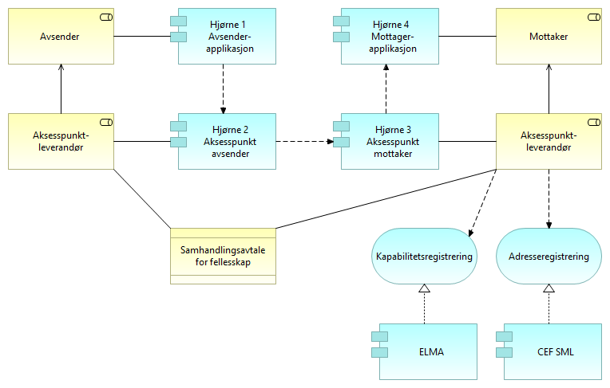

:lang: no
:doctitle: Referansearkitektur eMelding 
:keywords: eMelding

include::../plattform_felles/includes/commonincludes.adoc[]

[.lead]

== Introduksjon
include::../nab_referanse_arkitekturer_emelding/ra-emelding-intro.adoc[]

////
=== Krav til eMelding
include::../nab_referanse_arkitekturer_emelding/krav_eMelding.adoc[]
////

== Kapabilitetskart - relevante kapabiliteter
Modellen under viser hovedinndelingen i kapabiliteter en avsender og en mottaker må ha for å dele data ved meldingsutveksling. Beskrivelsene tar utgangspunkt i forsendelse av meldinger innenfor et fellesskap og er en delmengde av det større området som omhandler deling av data på forespørsel.

image:../nab_referanse_arkitekturer_emelding/media/kapabiliteter_forsendelse.png[alt="Bilde mangler", width=750]

[cols ="1,3", options="header"]
.Elementer i view for Kapabiliteter eMelding
|===

| Element
| Beskrivelse

| Sending av data
| Evnen til å sende data til en mottaker.

| Mottak av data
| Evnene til å motta en melding eller forsendelse fra en avsender.

| Klargjøre for deling av data ved forsendelse
| Evne til å klargjøre for meldingsutveksling med eksterne parter.

| Mottaker
| Den som mottar en melding.

| Avsender 
| Den som sender et brev, en pakke, en e-post, en elektronisk melding, en SMS eller lignende.

|===

== Arkitekturmønstre (konseptuelle beskrivelser, kun arkitekturbyggeklosser)

=== Klargjøring for deling av data ved forsendelse

==== Klargjøre for eMelding
Modellen under detaljerer hvordan en samhandlingsaktør, som i dette tilfellet normalt vil være en avsender eller mottaker, blir klar for å sende data som en melding. Dette gjøres ved å melde inn i et fellesskap og registrere nødvendige data i registre som er tilgjengelig for de andre samhandlingsaktørene i fellesskapet. Det vil kunne være forskjeller på hva som er nødvendig å gjøre avhengig av om samhandlingsaktøren er en sender eller mottaker, men normalt vil man innha begge roller i fellesskapet.

image:../nab_referanse_arkitekturer_emelding/media/ABB_klargjøre.png[alt="Bilde mangler", width=750]

[cols ="1,3", options="header"]
.Elementer i view for Klargjør for forsendelse ABB
|===

| Element
| Beskrivelse

| Klargjøre for deling av data ved forsendelse
| Evne til å klargjøre for meldingsutveksling med eksterne parter.

| Samhandlingsaktør
| Den som inngår i en samhandlingsprosess og samhandler med en annen samhandlingsaktør. Kan være en tilbyder, konsument, avsender, mottaker, leverandør etc.

| Klargjøre for melding
| Prosessen med å klargjøre for eMelding ved å akseptere felles avtaler og tilgjengeliggjøre nødvendig informasjon til andre samhandlingsaktører.

| Foreta innmelding i fellesskap
| Akseptere vilkår for og innrette seg etter reglene og forpliktelsene som gjelder i et fellesskap (community) gjennom å f.eks. signere en avtale eller kontrakt. Dette kan omfatte merkantile forhold.

| Registrer kapabiliteter
| Registering av kapabiliteter vil si å tilgjengeligjøre for avsendere og konsumenter hvilke meldinger og formater man kan motta og hvilke ressurser og tjenester man tilbyr.

| Registrer adresser
| Med adresse menes nødvendig informasjon for å få tilgang til tjenester fra tilbyder eller for å sende melding til mottaker av meldinger. 

| Registrer sertifikater
| Tilgjengeliggjøre for samhandlende parter sertifikater for bruk ved forsendelser. Dette kan være generelle eller domenespesifikke sertifikater. Eventuelt spesifikt for enkelet forretningsområder. 

Sertifikater må forvaltes og fornyes etter gjeldende regler for å være gyldige og egnet for bruk. 

| Interoperability specification
| Spesifikasjoner for hvordan man samhandler i et fellesskap. Dette kan være meldingsformater, krav til tekniske komponenter etc.

| Samhandlingsavtale for fellesskap
| Avtale som regulerer forhold tilknyttet samhandlingen i et fellesskap for eMelding.

| Mottakeradresse
| Teknsik adresse for hvor meldinger skal sendes. Dette kan være adressen til inet

| Avsendersertifikat
| Offentlig nøkkel benyttes for kryptering og validering av signatur.

Privat nøkkel benyttes til dekryptering og signering av meldinger.

| Mottakersertifikat
| Offentlig nøkkel benyttes for kryptering og validering av signatur.

Privat nøkkel benyttes til dekryptering og signering av meldinger.

| Kapabilitetsbeskrivelse
| Strukturert beskrivelse av evner og kapabiliteter relevante for samhandling i fellesskapet

| Sertifikatregisterering
| Tjeneste for å registrere serifikater i felles katalogtjeneste.

| Adresseregistrering
| Tjeneste for å registrere adresse for å sende melding til mottaker.

| Kapabilitetsregistrering
| Tjeneste for å registrere kapabiliteter

|===

=== Operativ deling av data ved forsendelse

==== Sende melding
Sende melding detaljerer prosessen med å sende en melding etter klargjøring for forsendelse. Alle stegene i prosessen vil ikke alltid være nødvendig avhengig av dataene som utveksles og spesifikasjonene for samhandling innen fellesskapet.

image:../nab_referanse_arkitekturer_emelding/media/ABB_sende.png[alt="Bilde mangler", width=750]

[cols ="1,3", options="header"]
.Elementer i view for Send melding ABB
|===

| Element
| Beskrivelse

| Avsender 
| Den som sender et brev, en pakke, en e-post, en elektronisk melding, en SMS eller lignende.

| Mottakeradresse
| Teknsik adresse for hvor meldinger skal sendes. Dette kan være adressen til inet

| Forsendelse
| Den pakken som sendes til mottaker. Inkluderer forretningsmelding, metadata, adresse etc.

| Avsendersertifikat
| Offentlig nøkkel benyttes for kryptering og validering av signatur.

Privat nøkkel benyttes til dekryptering og signering av meldinger.

| Mottakersertifikat
| Offentlig nøkkel benyttes for kryptering og validering av signatur.

Privat nøkkel benyttes til dekryptering og signering av meldinger.

| Send melding
| Prosessen med å sende en eMelding til en mottaker ved hjelp av fellestjenester.

| Kontroller mottakers kapabiliteter
| Prosess for å slå opp og kontrollere mottakers evner til samhandling innenfor fellesskapet.

| Eksepeder melding
| Prosessen med å sende melding til mottaker.

| Formater melding
| Prosess for å tilpasse informasjonspakken til mottakers kapabiliteter og fellesskapets standarder.

| Krypter melding
| Prosess med å sikre forsendelsen. Inkluderer konfidensialitets- og integritetssikring der dette er nødvendig. Normalt gjøres dette ved hjelp av kryptografi og sertifikater.

| Adresser forsendelse
| Prosess med å adressere forsendelsen. Dette kan være til mottaker direkte eller til dennes representant eller aksesspunkt,

| Signer forsendelse
| Prosessen med å signere meldingen som sendes til mottaker. Til dette benyttes eget sertifikats private nøkkel.

| Kapabilitetsoppslag
| Tjeneste for å slå opp kapabilitetene til en samhandlingspart

| Adresseoppslag
| Tjeneste for å slå opp adressen til en mottaker.

| Sending av data
| Evnen til å sende data til en mottaker.

| Sertifikatoppslag
| Tjeneste for å hente krypteringssertifkat til mottaker.

| Datautvekslings-tjeneste
| Tjeneste for utveksling av data. Samme som data exchange service. Benyttes av avsender og mottaker for transport av meldinger.

| Signeringstjeneste
| Tjeneste for å signere en elektronisk melding. For eMelding er det signatur i form av elektronisk segl som er mest relevant.

| Sporingstjeneste
| Tjeneste for sporing (audit) av meldinger.

| Meldingsinnhold
| Meldingsinnholdet eller informasjonen som skal sendes til ekstern part. 

| Datatransformasjon
| Tjeneste for  transformere data og meldinger til andre formater.

|===

==== Motta melding
Motta melding detaljerer prosessen med å motta en melding etter klargjøring for forsendelse. Alle stegene i prosessen vil ikke alltid være nødvendig avhengig av dataene som utveksles og spesifikasjonene for samhandling innen fellesskapet.

image:../nab_referanse_arkitekturer_emelding/media/ABB_motta.png[alt="Bilde mangler", width=600]

[cols ="1,3", options="header"]
.Elementer i view for Motta melding ABB
|===

| Element
| Beskrivelse

| Motta melding
| Evnen til å motta, validere og kvittere for mottatte meldinger.

| Mottaker
| Den som mottar en melding.

| Forsendelse
| Den pakken som sendes til mottaker. Inkluderer forretningsmelding, metadata, adresse etc.

| Motta melding
| Prosessen med å motta melding. Består av flere delprosesser.

Etter mottak må mottaker følge opp og håndtere innholdet i meldingen.

| Valider forsendelse
| Prosessen med å kontrollere om innholdet i en forsendelse er i henhold til avtale og avtalte formater.

| Motta forsendelse
| Prosessen med å motta en melding fra avsender

| Kontroller forsendelse
| Prosessen med å kontrollere om forsendelsen er autentisk og fra en legitim avsender.

| Dekrypter melding
| Prosessen med å dekryptere mottatt melding. 

| Datautvekslings-tjeneste
| Tjeneste for utveksling av data. Samme som data exchange service. Benyttes av avsender og mottaker for transport av meldinger.

| Sporingstjeneste
| Tjeneste for sporing (audit) av meldinger.

| Signaturvaliderings-tjeneste
| Tjeneste for å validere og verifisere elektronsike signaturer. I forbindelse med eMelding er det kontroll av elektronisk segl som er mest relevant.

| Datavaliderings-tjeneste
| Tjeneste for å validere meldinger mot format og forventet innhold.

| Mottakersertifikat
| Offentlig nøkkel benyttes for kryptering og validering av signatur.

Privat nøkkel benyttes til dekryptering og signering av meldinger.

| Avsendersertifikat
| Offentlig nøkkel benyttes for kryptering og validering av signatur.

Privat nøkkel benyttes til dekryptering og signering av meldinger.

|===

== Løsningsmønstre
Beskrivelsen under viser hvordan den generiske arkitekturen i det foregående kapittelet kan realiseres med løsningskomponentene som inngår i PEPPOL-infrastrukturen henholdsvis Elektronisk mottaksregister (ELMA), adressetjenestene CEF SML/SMP og sertifikatkatalogløsningene BCP/BCL . Disse fellesløsningene leverer de tjenestene som er beskrevet på forretningsnivå over.

Det er ikke hensikten å låse referansearkitekturen til spesifikke løsninger, da ulike sektorer og aktører kan ha behov som ikke passer med det som er beskrevet. I PEPPOL-infrastrukturen som benyttes som datautvekslingstjeneste er det spesifiserte protokoller og standardere som sikrer en del funksjoner som pålitelig meldingsutveksling med integritet og 

=== Klargjøre for deling av data ved forsendelse

==== Klargjøre for eMelding
image:../nab_referanse_arkitekturer_emelding/media/SBB_klargjøre.png[alt="Bilde mangler", width=600]

[cols ="1,3", options="header"]
.Elementer i view for Klargjør for forsendelse SBB
|===

| Element
| Beskrivelse

| Klargjøre for deling av data ved forsendelse
| Evne til å klargjøre for meldingsutveksling med eksterne parter.

| Samhandlingsaktør
| Samlebetegnelse på roller som inngår i en samhandlingsprosess og samhandler med en annen samhandlingsaktør. Kan være en tilbyder, konsument, avsender, mottaker, leverandør etc.

| Klargjøre for meldingsutveksling
| Prosessen med å klargjøre for eMelding ved å akseptere felles avtaler og tilgjengeliggjøre nødvendig informasjon til andre samhandlingsaktører.

| Foreta innmelding i fellesskap
| Akseptere vilkår for og innrette seg etter reglene og forpliktelsene som gjelder i et fellesskap (community) gjennom å f.eks. signere en avtale eller kontrakt. Dette kan omfatte merkantile forhold.

| Registrer kapabiliteter
| Registering av kapabiliteter vil si å tilgjengeligjøre for avsendere og konsumenter hvilke meldinger og formater man kan motta og hvilke ressurser og tjenester man tilbyr.

| Registrer adresser
| Med adresse menes nødvendig informasjon for å få tilgang til tjenester fra tilbyder eller for å sende melding til mottaker av meldinger. 

| Registrer sertifikater
| Tilgjengeliggjøre for samhandlende parter sertifikater for bruk ved forsendelser. Dette kan være generelle eller domenespesifikke sertifikater. Eventuelt spesifikt for enkelet forretningsområder. 

Sertifikater må forvaltes og fornyes etter gjeldende regler for å være gyldige og egnet for bruk. 

| CEF SML
| Service Metadata Locator

| BCP
| Business Certificate Publisher

| Sertifikatregisterering
| Tjeneste for å registrere serifikater i felles katalogtjeneste.

| Adresseregistrering
| Tjeneste for å registrere adresse for å sende melding til mottaker.

| Kapabilitetsregistrering
| Tjeneste for å registrere kapabiliteter

| Elektronisk mottakerregister (ELMA)
| Med ELMA får brukerne dine oversikt over alle virksomheter i Norge som kan motta elektroniske fakturaer i henhold til EHF-standarden. 

| BCL
| Business Certificate Locater

|===

=== Operativ deling av data ved forsendelse

==== Sende melding

[cols ="1,3", options="header"]
.Elementer i view for Send melding SBB
|===

| Element
| Beskrivelse

| Avsender 
| Den som sender et brev, en pakke, en e-post, en elektronisk melding, en SMS eller lignende.

| Send melding
| Prosessen med å sende en eMelding til en mottaker ved hjelp av fellestjenester.

| Kontroller mottakers kapabiliteter
| Prosess for å slå opp og kontrollere mottakers evner til samhandling innenfor fellesskapet.

| Eksepeder melding
| Prosessen med å sende melding til mottaker.

| Formater melding
| Prosess for å tilpasse informasjonspakken til mottakers kapabiliteter og fellesskapets standarder.

| Krypter melding
| Prosess med å sikre forsendelsen. Inkluderer konfidensialitets- og integritetssikring der dette er nødvendig. Normalt gjøres dette ved hjelp av kryptografi og sertifikater.

| Adresser forsendelse
| Prosess med å adressere forsendelsen. Dette kan være til mottaker direkte eller til dennes representant eller aksesspunkt,

| Signer forsendelse
| Prosessen med å signere meldingen som sendes til mottaker. Til dette benyttes eget sertifikats private nøkkel.

| Kapabilitetsoppslag
| Tjeneste for å slå opp kapabilitetene til en samhandlingspart

| Adresseoppslag
| Tjeneste for å slå opp adressen til en mottaker.

| Sending av data
| Evnen til å sende data til en mottaker.

| Sertifikatoppslag
| Tjeneste for å hente krypteringssertifkat til mottaker.

| Datautvekslings-tjeneste
| Tjeneste for utveksling av data. Samme som data exchange service. Benyttes av avsender og mottaker for transport av meldinger.

| Signeringstjeneste
| Tjeneste for å signere en elektronisk melding. For eMelding er det signatur i form av elektronisk segl som er mest relevant.

| Sporingstjeneste
| Tjeneste for sporing (audit) av meldinger.

| Datatransformasjon
| Tjeneste for  transformere data og meldinger til andre formater.

| CEF SML
| Service Metadata Locator

| BCP
| Business Certificate Publisher

| ELMA
| Elektronisk mottakeradresseregister

| BCL
| Business Certificate Locater

| PEPPOL
| 

|===

==== Motta melding
image:../nab_referanse_arkitekturer_emelding/media/SBB_motta.png[alt="Bilde mangler", width=600]

[cols ="1,3", options="header"]
.Elementer i view for Motta melding SBB
|===

| Element
| Beskrivelse

| Motta melding
| Evnen til å motta, validere og kvittere for mottatte meldinger.

| Mottaker
| Den som mottar en melding.

| Motta melding
| Prosessen med å motta melding. Består av flere delprosesser.

Etter mottak må mottaker følge opp og håndtere innholdet i meldingen.

| Valider forsendelse
| Prosessen med å kontrollere om innholdet i en forsendelse er i henhold til avtale og avtalte formater.

| Motta forsendelse
| Prosessen med å motta en melding fra avsender

| Kontroller forsendelse
| Prosessen med å kontrollere om forsendelsen er autentisk og fra en legitim avsender.

| Dekrypter melding
| Prosessen med å dekryptere mottatt melding. 

| Datautvekslings-tjeneste
| Tjeneste for utveksling av data. Samme som data exchange service. Benyttes av avsender og mottaker for transport av meldinger.

| Sporingstjeneste
| Tjeneste for sporing (audit) av meldinger.

| Signaturvaliderings-tjeneste
| Tjeneste for å validere og verifisere elektronsike signaturer. I forbindelse med eMelding er det kontroll av elektronisk segl som er mest relevant.

| Datavaliderings-tjeneste
| Tjeneste for å validere meldinger mot format og forventet innhold.

| PEPPOL
| 

|===

== "Firehjørnersmodellen"
=== Konsept (operativt)

eMelding benytter en 4-hjørnersmodell hvor meldinger utveksles mellom aksesspunkter, slik dette er spesifisert i PEPPOL-infrastrukturen

// 

.Firehjørnersmodellen - operativt
image::../nab_referanse_arkitekturer_datautveksling_forsendelse/media/Firehjørnersmodellen - operativt.png[alt=Firehjørnersmodellen - operativt image]

4-hjørnersmodellen er basert på en distribuert modell som tillater kommunikasjon mellom samhandlingsaktører uten behov for bilaterale avtaler ved at man baserer seg på innmelding i et fellesskap.

4-hjørnersmodellen med adresse- og kapabilitetsoppslag sikrer fleksibilitet og skalerbarhet hvor

*Hjørne 1* representerer back-end systemet (som ligger innenfor avsenders juridiske ansvar) som sender melding til et annet back-end system (hjørne 4)

*Hjørne 2* (aksesspunkt for avsender) Samhandler med hjørne 1 og slår opp mottakers adresse og kapabiliteter. Aksesspunktet har evnen til å sende på en sikker og pålitelig måte til et annet aksesspunkt.

*Hjørne 3* (aksesspunkt for mottaker) Mottakers aksesspunkt har teknisk evne til å motta meldinger på en sikker og pålitelig måte og samhandle med hjørne 4.

*Hjørne 4* representerer back-end systemet til mottaker

I 4-hjørnersmodellen blir hvert aksesspunkt en node i et tillitsfelleskap.

=== Backend-integrasjon
I 4 hjørners modellen er det fleksibilitet gjennom hvordan man velger å integrere aksesspunktet med egen IT-arkitektur og IT-infrastruktur. Sett fra avsenderapplikasjonen er det tre måter å integrere hjørne 1/hjørne 2 og hjørne 3/hjørne 4.

////
This ABB relates to the eDelivery 4-corner model and adresses the
Communication/Integration of Corner1-Corner2/Corner3-Corner4.

The 4-corner model creates a very flexible architecture, where the enterprises can make
their own decisiones on how to integrate the external Business Process Choreography
component into their own IT-architecture orientation.
From the backend perspective there is 4 ways of integration of Corner1-
Corner2/Corner3-Corner4
////

////
===== Tightly Coupling
Back-end system and Access Point is tighly
coupled i.e. The Back-end system has integrated
the Access Point into the Back-end system. One
Access Point handles the eDelivery of one Backend
System.
//// 

==== Tett kobling
Avsender applikasjon og aksesspunkt er tett koblet ved at avsender applikasjonen har integrert funksjonaliteten til aksesspunktet. Det blir dermed et en til en forhold mellom aksesspunkt og avsender applikasjonen.

////
===== Semi-Tightly Coupling
Back-end system and Access Point is semi-tighly
coupled i.e. The Back-end system and the Access
Point is internally loosely coupled, but part of the
same internal IT-Architecture and IT-Infrastructure
or the Access Point is an Internal Cloud solution.
One Access Point can handle the eDelivery of
several Back-end Systems.
////

==== Semi-tett kobling
Avsender applikasjonen og aksesspunkt er semi-tett koblet ved at back-end og aksesspunkt er løst koblet internt, men del av det samme interne IT-arkitekturen og IT-infrastrukturen. Et aksesspunkt kan håndtere flere avsender applikasjoner.

////
===== Loose Coupling Coupling
The Back-end system and the Access Point is
loosely coupled and not part of the same internal IT-Architecture and IT-Infrastructure. One Access
Point can handle the eDelivery of many Back-end
Systems from many Enterprises. This model
accomodate the use of Service-/Cloud providers,
where the interaction between the Back-end
system and the Cloud is determined by the
Architecture and Infrastructure of the
Service/Cloud provider.
////

==== Løs kobling
Avsender applikasjonen og aksesspunkt er løst koblet og ikke en del av samme interne IT-arkitektur og IT-infrastruktur. Ett aksesspunkt kan håndtere meldingsutveksling for mange avsender applikasjoner fra flere virksomheter.

////
===== Loose Coupling (Citizen)
The Citizen can send and receive eDocuments
through the use of Service-/Cloud providers,
where the interaction between the Citizen and the
Service-/Cloud provider is determined by the
setup of the architecture and infrastructure of the Service/Cloud provider.
////

Ved løs kobling er det spesielle hensyn ved ende til ende kryptering og integritet. Det er hjørne 1 som må pakke og kryptere informasjonen og kun hjørne 4 som kan dekryptere. Hjørne 2 og hjørne 3 har ikke lov til å pakke om, fjerne eller legge til noe til meldingen og fungerer kun som en ruting mekanisme.  

////
In the case of Loose Coupling, there's special issues related to Corner1/Corner4
when dealing with Non-repudiation, since this is End-to-End. Corner1 must pack
and encrypt the original message and only Corner4 can reply with an encrypted
message. Corner 2 and Corner 3 is not allowed to repack, delete or add to the
message, only act as a routing mechanism.
////

////
Technical eDelivery architecture is based on a distributed model, allowing
communication (one Back-end system to send eDocument(s) to another Back-end
system) between participants without the need to set up bilateral agreements and
technical channels. 

For Flexibility and Scalability the Architecture is based on a 4 Corner model with
Location- and Capability LookUp: 
Figure 3: Four Corner Model with Location- and Capability LookUp

*Corner 1* represents a Back-end system (within the legal responsibility of the sending
organization), that needs to send eDocument(s) to another Back-end system  (Corner 4).
This is done by interacting with

*Corner 2* (Sending Access Point). The adress and the receiving capabilities (legal,
organisational, semantic and technical) of the receiver is established through the
Location LookUp and the Capability LookUp. With the technical capability to send the
event notification and related eDocuments(s) in a reliable and secure  way to the correct
receiving 

*Corner 3* (Receiving Access Point). The Receiving Access Point has technical capability to
receive the eDocuments(s) in a reliable and secure  way and interact with

*Corner 4*, the receiving Back-end system (within the legal responsibility of the receiving
organization) to deliver the eDocuments.
In this 4-Corner Store-and-Forward model, every eDelivery Access Point becomes a node
in a trusted interoperabilty community
////

=== Felles avtaleforvaltning
Illustrasjon:

.Firehjørnersmodellen - forvaltningsmessig
image::../nab_referanse_arkitekturer_datautveksling_forsendelse/media/Firehjørnersmodellen - forvaltningsmessig.png[alt=Firehjørnersmodellen - forvaltningsmessig image]

////
== Videre informasjon om eMelding

Videre informasjon og og dokumentasjon om eMelding finnes under https://www.difi.no/fagomrader-og-tjenester/digitalisering-og-samordning/nasjonal-arkitektur-old/referansearkitektur-meldingsutveksling-emelding.
////

////

. link:https://github.com/difi/nasjonal_arkitektur/blob/master/nab_referanse_arkitekturer_emelding/files/H%C3%B8ringsnotat-Strategi-og-referansearkitektur-meldingsutveksling.docx[Høringsnotat]

. link:https://github.com/difi/nasjonal_arkitektur/blob/master/nab_referanse_arkitekturer_emelding/files/Vedlegg-A-Forslag-Nasjonal-referansekarkitektur-og-strategi-for-meldingsutveksling-v1_1.docx[Veddlegg A - Forslag - Nasjonal referansekarkitektur og strategi for meldingsutveksling v1_1]

. link:https://github.com/difi/nasjonal_arkitektur/blob/master/nab_referanse_arkitekturer_emelding/files/Vedlegg-B-Referanse-arkitektur-for-eMelding-printable.pdf[Vedlegg B - Referansearkitektur for eMelding (teknisk)]

////

////
I SAT eDelivery deles tjenesten opp i fem kapabiliteter som er:

* Backend integration
* Service Location
* Capability Lookup
* Message Exchange
* Trust Establishment

== SAT eDelivery

=== Non technical description
The reference architecture supports cross enterprise business processes, where two
enterprises participate in a distributed Business Process in a choreography manner.
Where the Business Process crosses the Enterprise border to another Enterprise, the
sending enterprise makes an event notification and hands over necessary information to
a receiving Enterprise to invoke the corresponding business process. 

<Figure 2: eDelivery context>

An enterprise conducting a Business process, where the Business Process needs to
invoke a Business Process in another Enterprise can use the Reference architecture for
Norwegian e-Delivery to send an event notification and the required information
(eDocuments) to the other Enterprise to invoke and thereby proceed the continued
Business Process.

The Term Enterprise can be extended to Citizens, where a citicen can either be sending
i.e. trigger the process of a receiving Enterprise or be receiving, thereby start a "citizen
process" e.g. fill in tax return. 

=== Definition
eDelivery is electronicly pushing Event notification and eDocuments (Set of interrelated
structured or semistructured information) between two Enterprises i.e. from a sending
Back-end system (or Citizen) to another receiving Back-end System (or Citizen).

eDelivery supports public Public administrations, Businesses and Citizens to engage in
shared Business processes in an electronic way by exchanging event-notifications and
eDocuments with other Public administrations, Businesses and citizens, in a flexible
interoperable, secure, reliable and trusted way. 

=== Requirements
==== Electronic Delivery Service
Norwegian eDelivery basic requirements: SAT-eDelivery_Requirements

==== Electronic Registered Delivery Service
A service that makes it possible to transmit data between third parties by electronic
means and provides evidence relating to the handling of the transmitted data, including
proof of sending and receiving the data, and that protects transmitted data against the
risk of loss, theft, damage or any unauthorised alterations

eIDAS (reference) compliant requirements: ABB-eIDAS_Regulation

==== Description of Architecture
The Architecture is in compliance with the SOA principles, EIF principles and
the Norwegian IT-principles for public sector (see "Nasjonal strategi for
meldingsutveksling")

The Business Exchange Pattern used is Asynchronous-Push, meaning that the Sending
Enterprise can send event notifications and eDocuments in a reliable and secure way,
without knowing when the receiving Enterprise is ready to consume the event
notification and eDocuments.

It should be noted that here the term eDelivery is not fuly consistent with the CEF
eDelivery term eDelivery. The definition and architecture of eDelivery spans all of the EIF
layers, whereas CEF eDelivery uses the term for the technical part, here defined as
Technical eDelivery. 

=== Technical eDelivery Architecture
Technical eDelivery architecture is based on a distributed model, allowing
communication (one Back-end system to send eDocument(s) to another Back-end
system) between participants without the need to set up bilateral agreements and
technical channels. 

For Flexibility and Scalability the Architecture is based on a 4 Corner model with
Location- and Capability LookUp: 
Figure 3: Four Corner Model with Location- and Capability LookUp

*Corner 1* represents a Back-end system (within the legal responsibility of the sending
organization), that needs to send eDocument(s) to another Back-end system  (Corner 4).
This is done by interacting with

*Corner 2* (Sending Access Point). The adress and the receiving capabilities (legal,
organisational, semantic and technical) of the receiver is established through the
Location LookUp and the Capability LookUp. With the technical capability to send the
event notification and related eDocuments(s) in a reliable and secure  way to the correct
receiving 

*Corner 3* (Receiving Access Point). The Receiving Access Point has technical capability to
receive the eDocuments(s) in a reliable and secure  way and interact with

*Corner 4*, the receiving Back-end system (within the legal responsibility of the receiving
organization) to deliver the eDocuments.
In this 4-Corner Store-and-Forward model, every eDelivery Access Point becomes a node
in a trusted interoperabilty community

////
