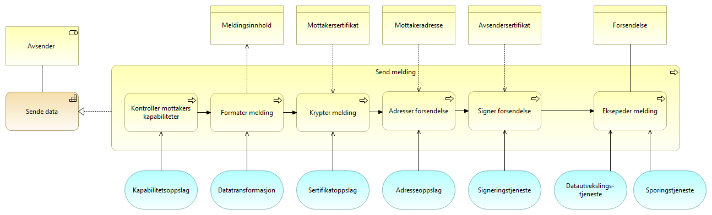
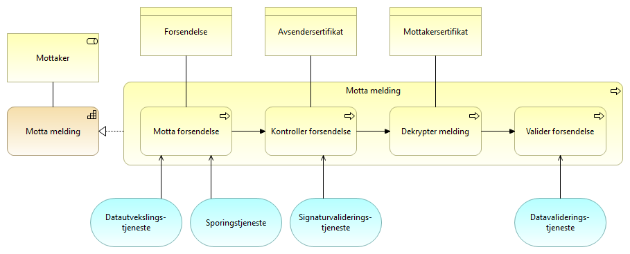
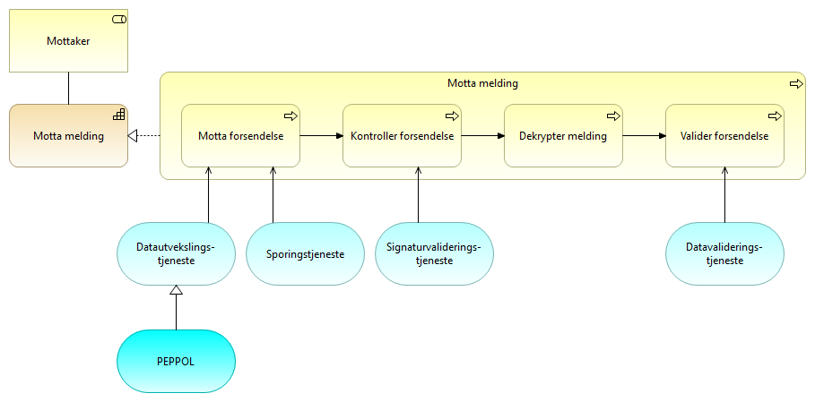

:lang: no
:doctitle: Referansearkitektur eMelding 
:keywords: eMelding

include::../plattform_felles/includes/commonincludes.adoc[]

[.lead]

== Introduksjon
include::../nab_referanse_arkitekturer_emelding/ra-emelding-intro.adoc[]

////
=== Krav til eMelding
include::../nab_referanse_arkitekturer_emelding/krav_eMelding.adoc[]
////

== Kapabilitetskart - relevante kapabiliteter

image:../nab_referanse_arkitekturer_emelding/media/Deling av data ved forsendelse.png[alt="Bilde mangler", width=750]

[cols ="1,1,3", options="header"]
.Elementer i view for Kapabiliteter eMelding
|===
|Element
|Elementtype
|Beskrivelse

| Deling av data ved forsendelse - eMelding
| grouping
| 

| Mottaker
| business-role
| Aktør som mottar melding

| Avsender 
| business-role
| den som sender et brev, en pakke, en e-post, en elektronisk melding, en SMS eller lignende
|===

== Arkitekturmønstre (konseptuelle beskrivelser, kun arkitekturbyggeklosser)

=== Klargjøring for deling av data ved forsendelse

==== Klargjøre for eMelding
Modellen under detaljerer hvordan en samhandlingsaktør, som i dette tilfellet normalt vil være en avsender eller mottaker, blir klar for å sende data som en melding. Dette gjøres ved å melde inn i et fellesskap og registrere nødvendige data i registre som er tilgjengelig for de andre samhandlingsaktørene i fellesskapet. Det vil kunne være forskjeller på hva som er nødvendig å gjøre avhengig av om samhandlingsaktøren er en sender eller mottaker, men i mange tilfeller vil man innha begge roller i fellesskapet.

image:../nab_referanse_arkitekturer_emelding/media/ABB_klargjøre.png[alt="Bilde mangler", width=750]

[cols ="1,1,3", options="header"]
.Elementer i view for Klargjøre for forsendelse

[cols ="1,1,3", options="header"]
.Elementer i view for Klargjøre for forsendelse
|===

|Element
|Elementtype
|Beskrivelse

| Klargjøre for deling av data ved forsendelse
| capability
| Evne til å klargjøre for meldingsutveksling med eksterne parter.

| Samhandlingsaktør
| business-actor
| Den som inngår i en samhandlingsprosess og samhandler med en annen samhandlingsaktør. Kan være en tilbyder, konsument, avsender, mottaker, leverandør etc.

| Klargjøre for eMelding
| business-process
| Prosessen med å klargjøre for eMelding ved å akseptere felles avtaler og tilgjengeliggjøre nødvendig informasjon til andre samhandlingsaktører.

| Interoperability specification
| business-object
| Spesifikasjoner for hvordan man samhandler i et fellesskap. Dette kan være meldingsformater, krav til tekniske komponenter etc.

| Samhandlingsavtale for fellesskap
| contract
| Avtale som regulerer forhold tilknyttet samhandlingen i et fellesskap for eMelding.

| Mottakeradresse
| business-object
| Teknsik adresse for hvor meldinger skal sendes. Dette kan være adressen til inet

| Avsendersertifikat
| business-object
| Offentlig nøkkel benyttes for kryptering og validering av signatur.

Privat nøkkel benyttes til dekryptering og signering av meldinger.

| Mottakersertifikat
| business-object
| Offentlig nøkkel benyttes for kryptering og validering av signatur.

Privat nøkkel benyttes til dekryptering og signering av meldinger.

| Kapabilitetsbeskrivelse
| business-object
| Strukturert beskrivelse av evner og kapabiliteter relevante for samhandling i fellesskapet

| Sertifikatregisterering
| application-service
| Tjeneste for å registrere serifikater i felles katalogtjeneste.

| Adresseregistrering
| application-service
| Tjeneste for å registrere adresse for å sende melding til mottaker.

| Kapabilitetsregistrering
| application-service
| Tjeneste for å registrere kapabiliteter
|===

=== Operativ deling av data ved forsendelse

==== Sende melding

[cols ="1,1,3", options="header"]
.Elementer i view for Sende melding
|===

|Element
|Elementtype
|Beskrivelse

| Avsender 
| business-role
| Den som sender et brev, en pakke, en e-post, en elektronisk melding, en SMS eller lignende.

| Mottakeradresse
| business-object
| Teknsik adresse for hvor meldinger skal sendes. Dette kan være adressen til inet

| Forsendelse
| business-object
| Den pakken som sendes til mottaker. Inkluderer forretningsmelding, metadata, adresse etc.

| Avsendersertifikat
| business-object
| Offentlig nøkkel benyttes for kryptering og validering av signatur.

Privat nøkkel benyttes til dekryptering og signering av meldinger.

| Mottakersertifikat
| business-object
| Offentlig nøkkel benyttes for kryptering og validering av signatur.

Privat nøkkel benyttes til dekryptering og signering av meldinger.

| Sende eMelding
| business-process
| Prosessen med å sende en eMelding til en mottaker ved hjelp av fellestjenester.

| Kapabilitetsoppslag
| application-service
| Tjeneste for å slå opp kapabilitetene til en samhandlingspart

| Adresseoppslag
| application-service
| Tjeneste for å slå opp adressen til en mottaker.

| Sending av data
| capability
| Evnene til å sende data til en mottaker.

| Sertifikatoppslag
| application-service
| Tjeneste for å hente krypteringssertifkat til mottaker.

| Datautvekslings-tjeneste
| application-service
| Tjeneste for utveksling av data. Samme som data exchange service. Benyttes av avsender og mottaker for transport av meldinger.

| Signeringstjeneste
| application-service
| Tjeneste for å signere en elektronisk melding. For eMelding er det signatur i form av elektronisk segl som er mest relevant.

| Sporingstjeneste
| application-service
| Tjeneste for sporing (audit) av meldinger.

| Forretningsmelding SBB
| business-object
| Meldingsinnholdet eller informasjonen som skal sendes til ekstern part. 

| Datatransformasjon
| application-service
| Tjeneste for  transformere data og meldinger til andre formater.
|===

==== Motta melding

[cols ="1,1,3", options="header"]
.Elementer i view for Motta melding
|===

|Element
|Elementtype
|Beskrivelse

| Motta melding
| capability
| Evnen til å motta, validere og kvittere for mottatte meldinger.

| Mottaker
| business-role
| Den som mottar en melding.

| Forsendelse
| business-object
| Den pakken som sendes til mottaker. Inkluderer forretningsmelding, metadata, adresse etc.

| Motta eMelding
| business-process
| Prosessen med å motta melding. Består av flere sub-prosesser.

Etter mottak må mottaker følge opp og håndtere innholdet i meldingen.

| Datautvekslings-tjeneste
| application-service
| Tjeneste for utveksling av data. Samme som data exchange service. Benyttes av avsender og mottaker for transport av meldinger.

| Sporingstjeneste
| application-service
| Tjeneste for sporing (audit) av meldinger.

| Signaturvaliderings-tjeneste
| application-service
| Tjeneste for å validere og verifisere elektronsike signaturer. I forbindelse med eMelding er det kontroll av elektronisk segl som er mest relevant.

| Datavaliderings-tjeneste
| application-service
| Tjeneste for å validere meldinger mot format og forventet innhold.

| Mottakersertifikat
| business-object
| Offentlig nøkkel benyttes for kryptering og validering av signatur.

Privat nøkkel benyttes til dekryptering og signering av meldinger.

| Avsendersertifikat
| business-object
| Offentlig nøkkel benyttes for kryptering og validering av signatur.

Privat nøkkel benyttes til dekryptering og signering av meldinger.
|===

== Løsningsmønstre

=== Klargjøre for deling av data ved forsendelse

==== Klargjøre for eMelding
image:../nab_referanse_arkitekturer_emelding/media/SBB_klargjøre.png[alt="Bilde mangler", width=600]

[cols ="1,1,3", options="header"]
.Elementer i view for Klargjøre for forsendelse
|===

|Element
|Elementtype
|Beskrivelse

| Klargjøre for deling av data ved forsendelse
| capability
| Evne til å klargjøre for meldingsutveksling med eksterne parter.

| Samhandlingsaktør
| business-actor
| Den som inngår i en samhandlingsprosess og samhandler med en annen samhandlingsaktør. Kan være en tilbyder, konsument, avsender, mottaker, leverandør etc.

| Klargjøre for eMelding
| business-process
| Prosessen med å klargjøre for eMelding ved å akseptere felles avtaler og tilgjengeliggjøre nødvendig informasjon til andre samhandlingsaktører.

| CEF SML
| application-component
| Service Metadata Locator

| BCP
| application-component
| Business Certificate Publisher

| Sertifikatregisterering
| application-service
| Tjeneste for å registrere serifikater i felles katalogtjeneste.

| Adresseregistrering
| application-service
| Tjeneste for å registrere adresse for å sende melding til mottaker.

| Kapabilitetsregistrering
| application-service
| Tjeneste for å registrere kapabiliteter

| ELMA
| application-component
| Elektronisk mottakeradresseregister

| BCL
| application-component
| Business Certificate Locater

|===

=== Operativ deling av data ved forsendelse

==== Sende melding
image:../nab_referanse_arkitekturer_emelding/media/SBB_sende.png[alt="Bilde mangler", width=750]

[cols ="1,1,3", options="header"]
.Elementer i view for Sende melding
|===

|Element
|Elementtype
|Beskrivelse

| Avsender 
| business-role
| Den som sender et brev, en pakke, en e-post, en elektronisk melding, en SMS eller lignende.

| Sende eMelding
| business-process
| Prosessen med å sende en eMelding til en mottaker ved hjelp av fellestjenester.

| Kapabilitetsoppslag
| application-service
| Tjeneste for å slå opp kapabilitetene til en samhandlingspart

| Adresseoppslag
| application-service
| Tjeneste for å slå opp adressen til en mottaker.

| Sending av data
| capability
| Evnene til å sende data til en mottaker.

| Sertifikatoppslag
| application-service
| Tjeneste for å hente krypteringssertifkat til mottaker.

| Datautvekslings-tjeneste
| application-service
| Tjeneste for utveksling av data. Samme som data exchange service. Benyttes av avsender og mottaker for transport av meldinger.

| Signeringstjeneste
| application-service
| Tjeneste for å signere en elektronisk melding. For eMelding er det signatur i form av elektronisk segl som er mest relevant.

| Sporingstjeneste
| application-service
| Tjeneste for sporing (audit) av meldinger.

| Datatransformasjon
| application-service
| Tjeneste for  transformere data og meldinger til andre formater.

| CEF SML
| application-component
| Service Metadata Locator

| BCP
| application-component
| Business Certificate Publisher

| ELMA
| application-component
| Elektronisk mottakeradresseregister

| BCL
| application-component
| Business Certificate Locater

| PEPPOL
| application-service
| 
|===
==== Motta melding

[cols ="1,1,3", options="header"]
.Elementer i view for Motta melding
|===

|Element
|Elementtype
|Beskrivelse

| Motta melding
| capability
| Evnen til å motta, validere og kvittere for mottatte meldinger.

| Mottaker
| business-role
| Den som mottar en melding.

| Motta eMelding
| business-process
| Prosessen med å motta melding. Består av flere sub-prosesser.

Etter mottak må mottaker følge opp og håndtere innholdet i meldingen.

| Datautvekslings-tjeneste
| application-service
| Tjeneste for utveksling av data. Samme som data exchange service. Benyttes av avsender og mottaker for transport av meldinger.

| Sporingstjeneste
| application-service
| Tjeneste for sporing (audit) av meldinger.

| Signaturvaliderings-tjeneste
| application-service
| Tjeneste for å validere og verifisere elektronsike signaturer. I forbindelse med eMelding er det kontroll av elektronisk segl som er mest relevant.

| Datavaliderings-tjeneste
| application-service
| Tjeneste for å validere meldinger mot format og forventet innhold.

| PEPPOL
| application-service
| 
|===
==== Firehjørnersmodellen
eMelding slik det er spesifisert i PEPPOL-infrastrukturen benytter en 4-hjørnersmodell hvor meldinger utveksles mellom aksesspunkter.

image:../nab_referanse_arkitekturer_emelding/media/figur_aksesspunkt.png[alt="Bilde mangler", width=600]

4-hjørnersmodellen er basert på en distribuert modell som tillater kommunikasjon mellom samhandlingsaktører uten behov for bilaterale avtaler ved at man baserer seg på innmelding i et fellesskap.

4-hjørnersmodellen med adresse- og kapabilitetsoppslag sikrer fleksibilitet og skalerbarhet hvor

*Hjørne 1* representerer back-end systemet (som ligger innenfor avsenders juridiske ansvar) som sender melding til et annet back-end system (hjørne 4)

*Hjørne 2* (aksesspunkt for avsender) Samhandler med hjørne 1 og slår opp mottakers adresse og kapabiliteter. Aksesspunktet har evnen til å sende på en sikker og pålitelig måte til et annet aksesspunkt.

*Hjørne 3* (aksesspunkt for mottaker) Mottakers aksesspunkt har teknisk evne til å motta meldinger på en sikker og pålitelig måte og samhandle med hjørne 4.

*Hjørne 4* representerer back-end systemet til mottaker

I 4-hjørnersmodellen blir hvert aksesspunkt en node i et tillitsfelleskap.

////
Technical eDelivery architecture is based on a distributed model, allowing
communication (one Back-end system to send eDocument(s) to another Back-end
system) between participants without the need to set up bilateral agreements and
technical channels. 

For Flexibility and Scalability the Architecture is based on a 4 Corner model with
Location- and Capability LookUp: 
Figure 3: Four Corner Model with Location- and Capability LookUp

*Corner 1* represents a Back-end system (within the legal responsibility of the sending
organization), that needs to send eDocument(s) to another Back-end system  (Corner 4).
This is done by interacting with

*Corner 2* (Sending Access Point). The adress and the receiving capabilities (legal,
organisational, semantic and technical) of the receiver is established through the
Location LookUp and the Capability LookUp. With the technical capability to send the
event notification and related eDocuments(s) in a reliable and secure  way to the correct
receiving 

*Corner 3* (Receiving Access Point). The Receiving Access Point has technical capability to
receive the eDocuments(s) in a reliable and secure  way and interact with

*Corner 4*, the receiving Back-end system (within the legal responsibility of the receiving
organization) to deliver the eDocuments.
In this 4-Corner Store-and-Forward model, every eDelivery Access Point becomes a node
in a trusted interoperabilty community
////

== Videre informasjon om eMelding

Videre informasjon og og dokumentasjon om eMelding finnes under https://www.difi.no/fagomrader-og-tjenester/digitalisering-og-samordning/nasjonal-arkitektur-old/referansearkitektur-meldingsutveksling-emelding.

////

. link:https://github.com/difi/nasjonal_arkitektur/blob/master/nab_referanse_arkitekturer_emelding/files/H%C3%B8ringsnotat-Strategi-og-referansearkitektur-meldingsutveksling.docx[Høringsnotat]

. link:https://github.com/difi/nasjonal_arkitektur/blob/master/nab_referanse_arkitekturer_emelding/files/Vedlegg-A-Forslag-Nasjonal-referansekarkitektur-og-strategi-for-meldingsutveksling-v1_1.docx[Veddlegg A - Forslag - Nasjonal referansekarkitektur og strategi for meldingsutveksling v1_1]

. link:https://github.com/difi/nasjonal_arkitektur/blob/master/nab_referanse_arkitekturer_emelding/files/Vedlegg-B-Referanse-arkitektur-for-eMelding-printable.pdf[Vedlegg B - Referansearkitektur for eMelding (teknisk)]

////

I SAT eDelivery deles tjenesten opp i fem kapabiliteter som er:

* Backend integration
* Service Location
* Capability Lookup
* Message Exchange
* Trust Establishment

== SAT eDelivery

=== Non technical description
The reference architecture supports cross enterprise business processes, where two
enterprises participate in a distributed Business Process in a choreography manner.
Where the Business Process crosses the Enterprise border to another Enterprise, the
sending enterprise makes an event notification and hands over necessary information to
a receiving Enterprise to invoke the corresponding business process. 

<Figure 2: eDelivery context>

An enterprise conducting a Business process, where the Business Process needs to
invoke a Business Process in another Enterprise can use the Reference architecture for
Norwegian e-Delivery to send an event notification and the required information
(eDocuments) to the other Enterprise to invoke and thereby proceed the continued
Business Process.

The Term Enterprise can be extended to Citizens, where a citicen can either be sending
i.e. trigger the process of a receiving Enterprise or be receiving, thereby start a "citizen
process" e.g. fill in tax return. 

=== Definition
eDelivery is electronicly pushing Event notification and eDocuments (Set of interrelated
structured or semistructured information) between two Enterprises i.e. from a sending
Back-end system (or Citizen) to another receiving Back-end System (or Citizen).

eDelivery supports public Public administrations, Businesses and Citizens to engage in
shared Business processes in an electronic way by exchanging event-notifications and
eDocuments with other Public administrations, Businesses and citizens, in a flexible
interoperable, secure, reliable and trusted way. 

=== Requirements
==== Electronic Delivery Service
Norwegian eDelivery basic requirements: SAT-eDelivery_Requirements

==== Electronic Registered Delivery Service
A service that makes it possible to transmit data between third parties by electronic
means and provides evidence relating to the handling of the transmitted data, including
proof of sending and receiving the data, and that protects transmitted data against the
risk of loss, theft, damage or any unauthorised alterations

eIDAS (reference) compliant requirements: ABB-eIDAS_Regulation

==== Description of Architecture
The Architecture is in compliance with the SOA principles, EIF principles and
the Norwegian IT-principles for public sector (see "Nasjonal strategi for
meldingsutveksling")

The Business Exchange Pattern used is Asynchronous-Push, meaning that the Sending
Enterprise can send event notifications and eDocuments in a reliable and secure way,
without knowing when the receiving Enterprise is ready to consume the event
notification and eDocuments.

It should be noted that here the term eDelivery is not fuly consistent with the CEF
eDelivery term eDelivery. The definition and architecture of eDelivery spans all of the EIF
layers, whereas CEF eDelivery uses the term for the technical part, here defined as
Technical eDelivery. 

=== Technical eDelivery Architecture
Technical eDelivery architecture is based on a distributed model, allowing
communication (one Back-end system to send eDocument(s) to another Back-end
system) between participants without the need to set up bilateral agreements and
technical channels. 

For Flexibility and Scalability the Architecture is based on a 4 Corner model with
Location- and Capability LookUp: 
Figure 3: Four Corner Model with Location- and Capability LookUp

*Corner 1* represents a Back-end system (within the legal responsibility of the sending
organization), that needs to send eDocument(s) to another Back-end system  (Corner 4).
This is done by interacting with

*Corner 2* (Sending Access Point). The adress and the receiving capabilities (legal,
organisational, semantic and technical) of the receiver is established through the
Location LookUp and the Capability LookUp. With the technical capability to send the
event notification and related eDocuments(s) in a reliable and secure  way to the correct
receiving 

*Corner 3* (Receiving Access Point). The Receiving Access Point has technical capability to
receive the eDocuments(s) in a reliable and secure  way and interact with

*Corner 4*, the receiving Back-end system (within the legal responsibility of the receiving
organization) to deliver the eDocuments.
In this 4-Corner Store-and-Forward model, every eDelivery Access Point becomes a node
in a trusted interoperabilty community

