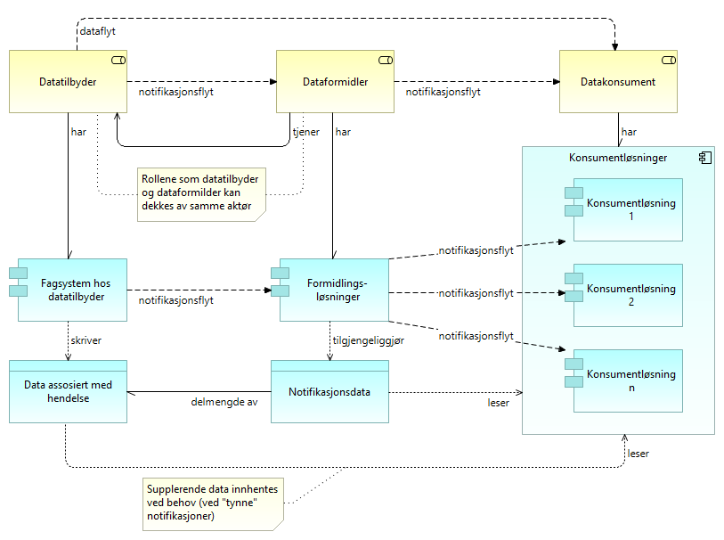
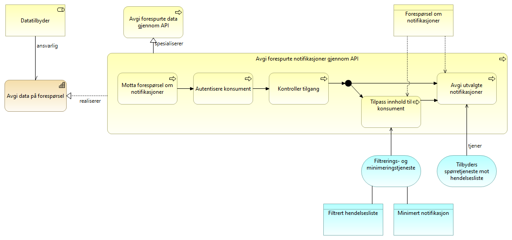

:lang: no
:doctitle: Referansearkitektur eNotifikasjon
:keywords: eNotifikasjon

include::../plattform_felles/includes/commonincludes.adoc[]

[.lead]
eNotifikasjon er en referansearkitektur for publisering av hendelsesdata med løs kopling mellom tilbyder og konsument. 

//image:../plattform_felles/media/i-arbeid.png[width=45, height=45] _I arbeid (høst 2019)_

//== Introduksjon
//include::../nab_referanse_arkitekturer_enotifikasjon/ra-enotifikasjon-intro.adoc[]

== Om dette mønsteret

eNotifikasjon gir arkitektur- og løsningsmønstre som spesialiserer link:../nab_referanse_arkitekturer_datautveksling_publisering[det generiske mønsteret for publisering].

eNotifikasjon dreier seg om publisering av hendelsesdata, eller notifikasjoner, via hendelseslister som kan aksesseres av datakonsumenter via spørring og oppslag i API-er. Konsumentene kan også innhente tilleggsdata om hendelser fra datatilbydere via spørring og oppslag i API-er, ved behov.

== Grunnleggende konsepter for eNotifikasjon

=== Oppsummering av grunnleggende egenskaper ved eNotifikasjon som mønster

* En hendelse kan representeres ved en eller notifikasjoner.
* Notifikasjoner samles i hendelseslister.
* Hendelser kan ikke slettes (_immutable_), og notifikasjoner slettes heller ikke fra hendelseslister.  
* Hendelseslister må kunne traverseres.
* Notifikasjoner innhentes på initiav fra konsument (pull).

// Henrik Figur under er tatt ut og bør erstattes med figur uten formidler rollen og tilhørende komponenter.
////

== Aktørsamspill

Figuren nedenfor viser involverte roller og applikasjoner, samt samspillet mellom disse.

.eNotifikasjon - grunnleggende konsepter

Kommentarer til denne figuren:

* Rollen som _Dataformidler_ kan være ivaretatt av datatilbyder selv, uten et eksternt mellomledd. 

* _Formidlingsløsninger_ kan tilsvarende være ivaretatt av Datatilbyder selv, hva gjelder formidlingen av notifikasjoner. 

* _Formidlingsløsninger_ omfatter også løsning for metadatakatalog for å finne fram til datakilder, designtime og runtime. Dette er ikke eksplisitt vist her. Eksempel på løsning: Felles datakatalog. 

* _Dataflyt_ og _notifikasjonsflyt_ er å forstå som den logiske flyten av data og notifikasjoner. Om dette skjer på initiativ fra datakonsument (pull) eller datatilbyder (push), er en annen sak.

* _Notifikasjonsdata_ om hver enkelt hendelse finnes i _hendelseslister_ som kan leses og navigeres av datakonsumentene. 

* _Formidlingsløsninger_ kan være integrert i _Fagsystem hos datatilbyder_. 

* _Data assosiert med hendelse_ kan her antas å inneholde all relevant informasjon om aktuelle hendelser. Datakonsumentene må kunne gå tilbake til Datatilbyder for å innhente supplerende data i tilknytning til hver enkelt notifikasjon, ved behov. Avhengig av behovene, må aktuelle data kunne være tilgjengelige for gjentatt lesing, kanskje flere år fram i tid.    

////

== Verdistrømmer

=== eNotifikasjon - oversikt over verdistrømmer

Følgende figur viser en oversikt over verdistrømmene på tvers av datatilbyder og datakonsument for eNotifikasjon. 

.eNotifikasjon - oversikt over verdistrømmer
image::../nab_referanse_arkitekturer_enotifikasjon/media/eNotifikasjon - oversikt over verdistrømmer.png[alt=eNotifikasjon - oversikt over verdistrømmer image]

//Dette er en spesialisert utgave av tilsvarende #_felles referansemodell for datautveksling_#. 

Stegene i verdistrømmen er nærmere forklart under egne avsnitt om verdistrømmene for hver rolle.  

=== eNotifikasjon - verdistrøm for datatilbyder
Her vises verdistrømmen for eNotifikasjon sett fra datatilbyder, med angivelse av kapabiliteter.

Det som er spesielt for eNotifikasjon er vist med uthevet skrift, dvs. _Generere og tilby notifikasjoner_. Øvrige kapabiliteter er beskrevet andre steder, blant annet i tilknytning til referansearkitekturer for eMelding (Sende data) og  eOppslag (Avgi data på forespørsel).  

.eNotifikasjon - tilbyders verdistrøm
image::../nab_referanse_arkitekturer_enotifikasjon/media/eNotifikasjon - tilbyders verdistrøm.png[alt=eNotifikasjon - tilbyders verdistrøm image]

=== eNotifikasjon - verdistrøm for datakonsumenter
Her vises verdistrømmen for eNotifikasjon sett fra datakonsumenter, med angivelse av kapabiliteter.

Det som er spesielt for eNotifikasjon er vist med uthevet skrift, dvs. _Innhente og håndtere notifikasjoner_. Øvrige kapabiliteter er beskrevet andre steder, blant annet i tilknytning til referansearkitekturer for eMelding (Motta data) og  eOppslag (Innhente data ved forespørsel).  

.eNotifikasjon - konsumenters verdistrøm
image::../nab_referanse_arkitekturer_enotifikasjon/media/eNotifikasjon - konsumenters verdistrøm.png[alt=eNotifikasjon - konsumenters verdistrøm image]

== Kapabilitetskart for eNotifikasjon

Modellen under viser kapabiliteter som er spesifikke for eNotifikasjon. Øvrige kapabiliteter er beskrevet i samhandlingsmønsteret for _deling av data på forespørsel_.

.Kapabiliteter eNotifikasjon
image::../nab_referanse_arkitekturer_enotifikasjon/media/Kapabiliteter eNotifikasjon.png[alt=Kapabiliteter eNotifikasjon image]

[cols ="1,3", options="header"]
.Elementer i view for Kapabiliteter eNotifikasjon
|===

| Element
| Beskrivelse

| Datatilbyder
| Tilbyder av data til andre aktører.

| Datakonsument
| Den som innhenter eller mottar data fra andre aktører.

| Generere og tilby notifikasjoner
| Evnen til å dele informasjon om hendelser gjennom notifikasjoner som tilgjengeliggjøres for konsumenter gjennom hendelseslister.

| Innhente og håndtere notifikasjoner
| Evnen til å konsumere hendelseslister.

|===

//image:../nab_referanse_arkitekturer_enotifikasjon/media/Kapabiliteter eNotifikasjon.png[alt="Bilde mangler", width=750]

== Arkitekturmønstre

=== Generer og publiser notifikasjoner
Generer og publiser notifikasjoner er den prosessen datatilbyder må gjøre for å tilby notifikasjoner gjennom hendelseslister. Hendelselister tilbys på tilsvarende måte som beskrevet for generelle mønstre for spørring og oppslag (herunder eOppslag), men det finnes spesielle krav for hendelseslister med tanke på segmentering,  filtrering og navigering.

.Generer og publiser notifikasjoner (arkitekturmønster)
image::../nab_referanse_arkitekturer_enotifikasjon/media/Generer og publiser notifikasjoner (arkitekturmønster).png[alt=Generer og publiser notifikasjoner (arkitekturmønster) image]]

Forklaring til figur:

[cols ="1,3", options="header"]
.Elementer i view for Generer og publiser notifikasjoner (arkitekturmønster)
|===

| Element
| Beskrivelse

| Datatilbyder
| Tilbyder av data til andre aktører.

| Generere og tilby notifikasjoner
| Evnen til å dele informasjon om hendelser gjennom notifikasjoner som tilgjengeliggjøres for konsumenter gjennom hendelseslister.

| Notifikasjon
| Dataobjekt som peker til (eller representerer) en hendelse og gjøres tilgjengelig på en hendelsesliste så konsumenten får vite om hendelsen.

En notifikasjon kan inneholde lite eller mye informasjon om selve hendelsen, men det må være nok informasjon til at konsumenten kan vurdere om hendelsen er relevant for seg.

En notifikasjon inneholder også en referanse til hendelsen og relevante grunnlagsdata.

| Hendelsesliste
| Liste med notifikasjoner tilgjengelig for konsumenter

| Generer og publiser notifikasjoner
| Prosessen med å dele informasjon om hendelser.

| Generer notifikasjon ut fra hendelse
| Prosessen med å generere en notifikasjon på bakgrunn av en hendelse.

| Publiser notifikasjon i hendelseslister
| Prosessen med å legge notifikasjoner i en eller flere hendelseslister som er eksponert overfor aktuelle konsumenter.

. 

| Generering av full notifikasjon
| Tjeneste som genererer "fulle" notifikasjoner basert på hendelser, der alle aktuelle grunnlagsdata er med eller lenket til.

| Skriving av notifikasjon til eksponerte hendelseslister
| Tjeneste for å skrive en notifikasjon til en eller flere hendelseslister, eventuelt med filtrering av informasjon ut fra hvem som er aktuelle konsumenter (abonnenter).

|===

=== Avgi forespurte notifikasjoner
Notifikasjoner avgis gjennom API på tilsvarende måte som beskrevet for generelle mønstre for spørring og oppslag, men tilbyder må tilpasse hendelsene som avgis etter det konsumenten har rettigheter til og etterspør. F.eks. kan konsumenten kun ha rettigheter til en delmengde av alle hendelser i hendelsesliten og også kun være interessert i enkelte typer hendelser. Konsumenten vil også normalt kun ha behov for å hente notifikasjoner som ikke er hentet tidliger, men kan også ønske å hente tidligere notifikasjoner på nytt. 

.Avgi notifikasjoner på forespørsel

[cols ="1,3", options="header"]
.Elementer i view for Avgi notifikasjoner på forespørsel
|===

| Element
| Beskrivelse

| Spørretjeneste mot hendelsesliste
| Tjeneste for spørring og navigering av hendelsesliste gjennom API. Det kan være aktuelt å filtrere informasjon ut fra hvem som spør og hvilken informasjon det er abonnert på, i tillegg til å filtrere ut fra spesifikasjoner i hver enkelt spørring.

| Avgi forespurte data gjennom API
| Prosessen med å avgi data på forespørsel gjennom et egnet API.

| Avgi forespurte notifikasjoner gjennom API
| Prosessen med å avgi notifikasjoner på forespørsel gjennom et API som 

| Motta forespørsel om notifikasjoner
| Motta forespørsler fra konsument om å avgi notifkiasjoner.

| Autentisere konsument
| Prosessen med å autentisere en konsument.

| Kontroller tilgang
| Kontroll og håndheving av konsumentens rettigheter til å få forespurte data.  I tillegg til "validering av sikkerhetsbillet", kan det være behov for kontroll mot virksomhetsinterne policies.

| Avgi utvalgte notifikasjoner 
| Avgi utvalgte hendelser basert på parametere i forespørsel om notifikasjoner. 

| Datatilbyder
| Tilbyder av data til andre aktører.

| Avgi data på forespørsel
| Avgi data på forespørsel

| Forespørsel om notifikasjoner
| Dataobjekt med eventuelle parametere for spørring på notifikasjoner fra tilgjengelig hendelsesliste. Kan inneholde referanse til hvor i hendelselisten (tid eller nummer) man ønsker å lese, avgrensning til temaer og liknende. 

|===

=== Konsumer notifikasjoner
Notifikasjoner leses på tilsvarende måte som beskrevet for generelle mønstre for spørring og oppslag (herunder eOppslag), men konsumentene må holde orden på spesielle forhold som rekkefølge og hvilke notifikasjoner som er lest. Konsumenten må også være i stand til å vurdere relevansen av hendelsene før videre behandling av notifikasjonene.

.Innhente notifikasjoner ((arkitekturmønster)
image::../nab_referanse_arkitekturer_enotifikasjon/media/Innhente notifikasjoner ((arkitekturmønster).png[alt=Innhente notifikasjoner ((arkitekturmønster) image]

[cols ="1,3", options="header"]
.Elementer i view for Innhente notifikasjoner ((arkitekturmønster)
|===

| Element
| Beskrivelse

| Datakonsument
| Den som innhenter eller mottar data fra andre aktører.

| Innhente og håndtere notifikasjoner
| Evnen til å konsumere hendelseslister.

| Forespørsel om notifikasjoner
| Dataobjekt med eventuelle parametere for spørring på notifikasjoner fra tilgjengelig hendelsesliste. Kan inneholde referanse til hvor i hendelselisten (tid eller nummer) man ønsker å lese, avgrensning til temaer og liknende. 

| Notifikasjon
| Dataobjekt som peker til (eller representerer) en hendelse og gjøres tilgjengelig på en hendelsesliste så konsumenten får vite om hendelsen.

En notifikasjon kan inneholde lite eller mye informasjon om selve hendelsen, men det må være nok informasjon til at konsumenten kan vurdere om hendelsen er relevant for seg.

En notifikasjon inneholder også en referanse til hendelsen og relevante grunnlagsdata.

| Kriterier og regler for vurdering
| Informasjon om hva som legges til grunn for å vurdere relevansen av en hendelse basert på tilgjengelig notifikasjon.

| Konsumer notifikasjoner
| Prosessen med å lese og håndtere notifikasjoner.

| Les notifikasjoner
| Prosess for å hente en eller flere notifikasjoner fra en hendelsesliste.

| Vurdere notifikasjon
| Prosess med å vurdere om en hendelsen knyttet til lest notifikasjon er relevant for egen virksomhet.

| Videre behandling av notifikasjon
| Prosess med videre behandling av en notifikasjon. Vil normalt være å innhente mer informasjon om hendelsen knyttet til notifikasjonen og eventuelt agere ut i fra denne.

| Forkast notifikasjon
| Prosess med å forkaste notifikasjon som ikke er relevant for virksomheten. Avhengig av krav til personvern og informasjonssikkerhet kan det være særskilte krav til hva som er lov å beholde. 

| Spørring mot eksponert hendelsesliste
| Tjeneste(r) for å forespørre notifikasjoner og navigere i hendelseslister.

| Filtrering av notifikasjoner
| Tjeneste for å filtrere innhentede notifikasjoner. Dette er en tilleggsmekanisme for filtrering, sammenliknet med filtrering som gjøres gjennom spøringer mot datatilbyder, og benyttes ved behov.  Eksempler på behov:

a. Datatilbyder gir ikke gode nok muligheter for filtrering.

b. Formidling av noifikasjoner til flere og ulike typer (interne) konsumenter.

|===

== Løsningsmønstre
Spesifikke løsningsmønstre for eNotifikasjon er inntil videre ikke utarbeidet. Det er stor variasjon i praksis, og ingen fellesløsninger er så langt etablert i Norge.

Det beste eksempelet er så langt distriubsjonen av modernisert folkeregister fra Skatteetaten som blant annet tilbyr hendelseslister og oppslag som konsumenttjenester. Disse tjenestene er beskrevet i link:https://skatteetaten.github.io/folkeregisteret-api-dokumentasjon/konsumenttjenester/[Folkeregisterets API dokumentasjon]

////
TIP: Det finnes flere interessant mønstre og løsninger å peke til som "god praksis". Herunder kommer bruk av fellesløsningen _Context Broker_ fra EU, standarder som AsyncAPI, samt bruk av open source løsninger som f.eks. _Kafka_ og _Rabbit MQ_. Følg med - her vil det komme mer;)
////

////

== Krav og  prinsipper for eNotifikasjon
Hendelsesbasert deling av data 

* Hendelser er uforanderlige (immutable)
* En hendelse representeres ved en notifikasjon
* Hendelseslister må pagineres og kunne traverseres 
* Det benyttes et pull-mønster for utveksling av hendelser

== Begreper og temaer
* Hendelsestype
* Topics
* Segmentere
* Avgrensning i "populasjon"? Kan det løses med å forkaste og ikke lagre noen spor.
* Hendelseslisten i DSF inneholder så lite, men nok til at de som er interessert kan forkaste og hente inn.

"Begreper":

* Hendelser = Den faktiske hendelsen.
* Datastrøm = En strøm av notifikasjoner
* Notifikasjon = det som utveksles/legges på kø om en hendelse
* Tynne og tykke hendelser

////