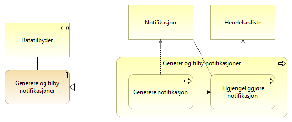

:lang: no
:doctitle: Referansearkitektur eNotifikasjon
:keywords: eNotifikasjon

include::../plattform_felles/includes/commonincludes.adoc[]

[.lead]
eNotifikasjon er en referansearkitektur for asynkron publisering av informasjon.

image:../plattform_felles/media/i-arbeid.png[width=45, height=45] _I arbeid (høst 2019)_

== Introduksjon
include::../nab_referanse_arkitekturer_enotifikasjon/ra-enotifikasjon-intro.adoc[]

== Om eNotifikasjon
eNotifikasjon er en delmengde av hendelsesdrevet deling av data. Mønsteret forutsetter de samme kapabilitetene som eOppslag for oppsett og utveksling av data. Hendelseslister gjøres tilgjengelig som APIer på samme måte som andre oppslag og benytter tilsvarende mekanismer for tilgangsstyring. Det som derimot kommer i tillegg er kapabilitetene for å generere og tilby notifikasjon fra tilbyder og å innhente og håndtere notifikasjoner for konsument. 

image:../nab_referanse_arkitekturer_enotifikasjon/media/eNotifikasjon kapabiliteter kort.png[alt="Bilde mangler", width=750]

[cols ="1,3", options="header"]
.Elementer i view for Kapabiliteter eNotifikasjon
|===

| Element
| Beskrivelse

| Tilbyder
| En aktør som tilbyr data til eksterne parter, enten på vegne av andre, som forvalter av data eller som dataansvarlig.

| Konsument
| Den som konsumerer data.

| Innhente og håndtere notifikasjoner
| Evene til å innhente og håndtere notifikasjoner om endringer i et datasett.

| Generere og tilby notifikasjoner
| Evnen til å tilby hendelseslister med notifikasjoner om endringer i ett eller flere datasett.

|===

//image:../nab_referanse_arkitekturer_enotifikasjon/media/Kapabiliteter eNotifikasjon.png[alt="Bilde mangler", width=750]

[cols ="1,3", options="header"]
.Elementer i view for Generere notifikasjoner
|===

| Element
| Beskrivelse

| Generere og tilby notifikasjoner
| Evnen til å tilby hendelseslister med notifikasjoner om endringer i ett eller flere datasett.

| Hendelse
| En hendelse som kan være aktuell å formidel til andre aktører og brukere av data. 

| Tilbyder
| En aktør som tilbyr data til eksterne parter, enten på vegne av andre, som forvalter av data eller som dataansvarlig.

| Generer og tilby notifikasjoner
| Prosessen med å genererer og tilby notifikasjon.

| Generere notifikasjon
| Prosessen med å generere notifikasjon når det inntreffer en relevant hendelse. Normalt vil dette være en endring i en database eller datasett som er av interesse for brukerene av dataene.

| Tilgjengeliggjøre notifikasjon
| Evnen til å tilggjengeliggjøre notifikasjoner om hendelser. Dette vil som regel være å gjøre dem tilgjengelig i en hendelsesliste.

|===

image:../nab_referanse_arkitekturer_enotifikasjon/media/ABB_Innhente.png[alt="Bilde mangler", width=750]

[cols ="1,3", options="header"]
.Elementer i view for Innhente notifikasjoner
|===

| Element
| Beskrivelse

| Innhente og håndtere notifikasjoner
| Evene til å innhente og håndtere notifikasjoner om endringer i et datasett.

| Konsument
| Den som konsumerer data.

| Konsumere notifikasjoner
| Prosessen med å konsumere notifikasjoner.

| Les notifikasjon
| Prosessen med å lese notifikasjoner fra en hendelsesliste.

| Vurdere notifikasjon
| Prosessen med å vurdere om en notifikasjon er relevant for virksomheten.

| Forkaste notifikasjon
| Prosessen med å forkaste en notifikasjon dersom den ikke er relevant. Det kan være hensyn til personvern og informasjonssikkerhet som angir hvor mye av informasjon fra notifikasjonene som kan beholdes.

| Videre behandling av notifikasjon
| Prosessen med å behandle notifikasjoner som normalt vil være å slå opp på hendelsen fra tilbyder og vurdere ytterligere behandling ut i fra det. For oppslag vil mønsteret for forespørsel av data benyttes.

|===

== Krav og  prinsipper for eNotifikasjon
Hendelsesbasert deling av data 

* Hendelser er uforanderlige (immutable)
* En hendelse representeres ved en notifisering
* Hendelseslister må pagineres og kunne traverseres 
* Det benyttes et pull-mønster for utveksling av hendelser
* Skille mellom events og commands ved produksjon av hendelser

== Vokabular/begreper
* Hendelsestype
* Topics
* Segmentere
* Avgrensning i "populasjon"? Kan det løses med å forkaste og ikke lagre noen spor.
* Hendelseslisten i DSF inneholder så lite, men nok til at de som er interessert kan forkaste og hente inn.

Begreper:

* Hendelser = Den faktiske hendelsen.
* Datastrøm = En strøm av notifikasjoner
* Notifikasjon = det som utveksles/legges på kø om en hendelse
* Tynne og tykke hendelser

