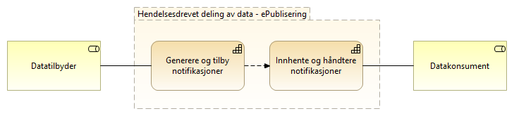
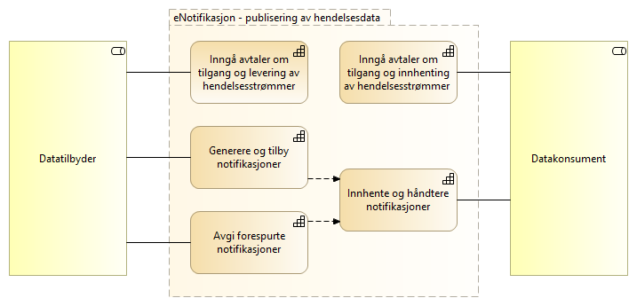

:lang: no
:doctitle: Referansearkitektur eNotifikasjon
:keywords: eNotifikasjon

include::../plattform_felles/includes/commonincludes.adoc[]

[.lead]
eNotifikasjon er en referansearkitektur for asynkron publisering av informasjon.

image:../plattform_felles/media/i-arbeid.png[width=45, height=45] _I arbeid (høst 2019)_

== Introduksjon
include::../nab_referanse_arkitekturer_enotifikasjon/ra-enotifikasjon-intro.adoc[]

== Om eNotifikasjon
eNotifikasjon er en delmengde av hendelsesdrevet deling av data. Mønsteret forutsetter de samme kapabilitetene som eOppslag for oppsett og utveksling av data. Hendelseslister gjøres tilgjengelig som APIer på samme måte som andre oppslag og benytter tilsvarende mekanismer for tilgangsstyring. Det som derimot kommer i tillegg er kapabilitetene for å generere og tilby notifikasjon fra tilbyder og å innhente og håndtere notifikasjoner for konsument. 

== Krav og  prinsipper for eNotifikasjon
Hendelsesbasert deling av data 

* Hendelser er uforanderlige (immutable)
* En hendelse representeres ved en notifisering
* Hendelseslister må pagineres og kunne traverseres 
* Det benyttes et pull-mønster for utveksling av hendelser
* Skille mellom events og commands ved produksjon av hendelser

== Vokabular/begreper
* Hendelsestype
* Topics
* Segmentere
* Avgrensning i "populasjon"? Kan det løses med å forkaste og ikke lagre noen spor.
* Hendelseslisten i DSF inneholder så lite, men nok til at de som er interessert kan forkaste og hente inn.

Begreper:

* Hendelser = Den faktiske hendelsen.
* Datastrøm = En strøm av notifikasjoner
* Notifikasjon = det som utveksles/legges på kø om en hendelse
* Tynne og tykke hendelser

