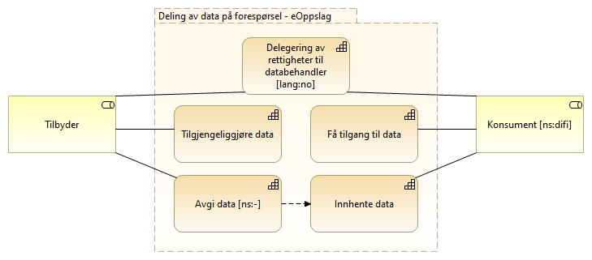
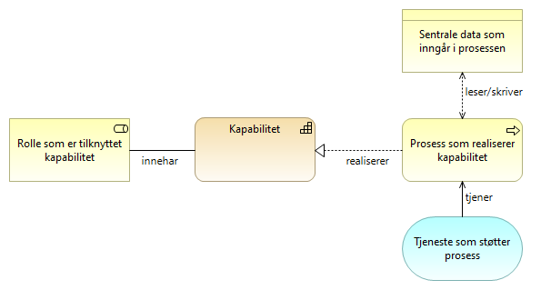
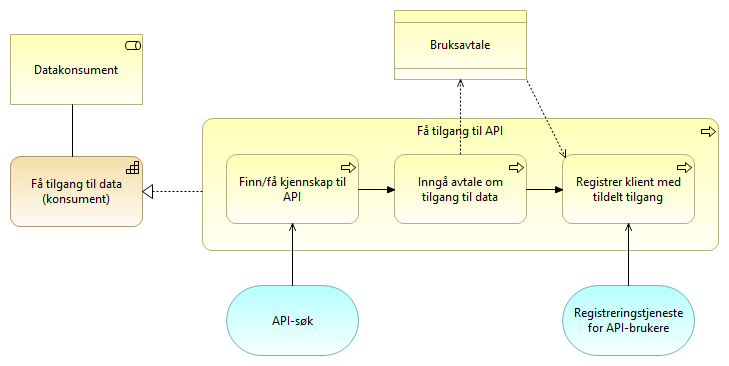
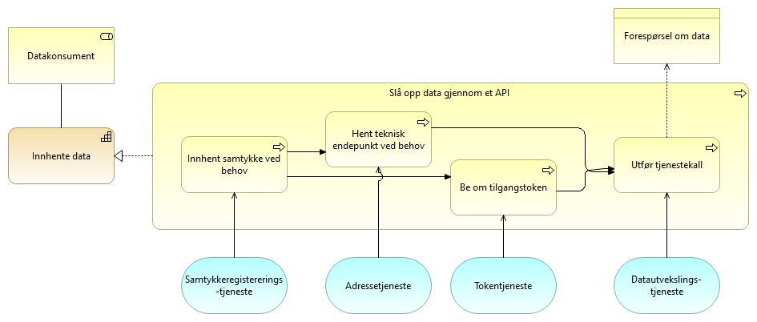
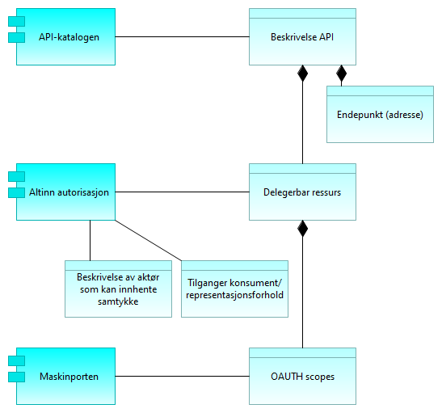
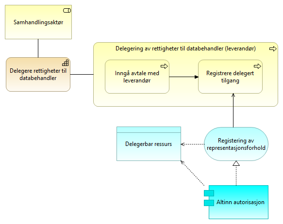
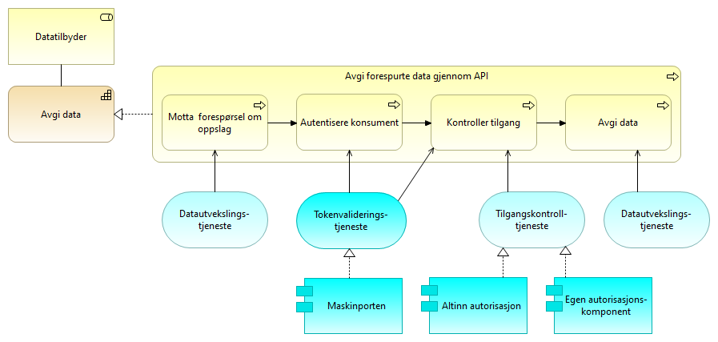

:lang: no
:doctitle: Referansearkitektur for eOppslag
:keywords: Referansearkitekturer

include::../plattform_felles/includes/commonincludes.adoc[]

//:erik2:

== Om eOppslag

// Test lenke: <<../nab_arkitekturlandskap_strategisk-arkitektur_kapabilitetskart#Deling av data på forespørsel, Deling av data på forespørsel>>

//:leveloffset: +4
//include::../nab_arkitekturlandskap_strategisk-arkitektur_kapabilitetskart/deling-av-data-på-forspørsel.adoc[]
//:leveloffset!:

//erik: forsøk å lenke direkte til riktig sted:  <../nab_arkitekturlandskap/book-arkitekturlandskap.adoc#Kapabilitetskart,kapabilitetskart>>. Henrik: gjør dette i omskriving av de tre første kapitlene

//Henrik: Legge inn (gjenta) beskrivelsen av kapabilitetesområdet "Deling av data på forespørsel" her, eller i dette avsnittet.

eOppslag er en referansearkitektur for oppslag i data gjennom synkrone API-kall. Dette er en delmengde av et større området som omhandler _Deling av data på forespørsel_. 

Referansearkitekturen dekker både sikrede API-er og API-er som tilbyr åpent tilgjengelige data uten tilgangsbegrensninger.

eOppslag som referansearkitektur gir ingen begrensninger i forhold til  hva slags informasjon det gjelder, om det er strukturerte eller ustrukturerte data eller hva data skal brukes til. Tilbyder og konsument av data kan være på tvers av virksomheter eller innenfor samme virksomhet.

Eksempler på bruk:

* Oppslag i et felles dataregister, f.eks. Folkeregisteret.
* Oppslag av data hos en annen virksomhet .
* Oppslag av data i egen virksomhet.

//// 
//Flyttet til eget 

== Dokumentstruktur
Det gis først en overordnet beskrivelse av kapabilitetene som er relevante for eOppslag. Deretter beskrives realiseringen av hver kapabilitet gjennom modeller for rene arkitekturmønstre (uten kobling til spesifikke løsninger) og løsningsmønstre som angir god praksis for bruk av _nasjonale fellesløsninger_).

De detaljerte beskrivelsene har separate underkapitler om henholdsvis klargjøring og operativ deling av data.

NOTE: Beskrivelsene som omhandler oppsett og bruk av _tilgangsstyring_ er ikke relevante for API-er som tilbyr åpent tilgjengelige data.

Selve beskrivelsene er basert på modeller i henhold til Archimate-standarden.

I den tekstlige beskrivelsen her, er modellene vist som figurer. Hvert modellelement er beskrevet i tabeller for hver figur, eventuelt med henvisning til overordnet eller forutgående figur. Det er også publisert klikkbare Archimate-modeller under https://nasjonal-arkitektur.github.io/nab_modeller_html-hovedbibliotek/. Disse fungerer godt, med bare  noen få ekstra klikk for å komme fram til de aktuelle modellene for eOppslag. De aktuelle modellene kan også nås gjennom hyperlenking fra figurene her, men brukergrensesnittet er da mindre hensiktsmessig (nye vinduer eller faner for hvert klikk).   

////

== Kapabilitetskart - relevante kapabiliteter
Modellen under viser hovedinndelingen i kapabiliteter en tilbyder og en konsument må ha for å dele data gjennom tilgangsstyrte API-er. Dette er en delmengde av det større området som omhandler _Deling av data på forespørsel_. 

Tilbyder må kunne tilgjengeliggjøre data og dette er delt i to kapabiliteter:

* _Tilgjengeliggjøre data_ omhandler hvordan man registerer API og setter opp tilganger. 
* _Avgi data_ omhandler den operative delingen av data fra tilbyder.

Tilsvarende er det to detaljerte kapabiliteter tilknyttet konsument og det å innhente data: 

* _Få tilgang til data_ består av prosesser for oppsett av tilgang.
* _Innhente data_ er det konsumenten må gjøre hver gang det gjøres et oppslag.

I tillegg kan begge parter ha kapabiliteten:

* _Delegering av rettigheter til databehandler_ må gjøres dersom en av partene benytter seg av en databehandler.

[cols ="1,3", options="header"]
.Elementer i view for Kapabiliteter eOppslag
|===

| Element
| Beskrivelse

| Tilgjengeliggjøre data
| Evnen til å gjøre data tilgjengelig for aktører utenfor egen virksomhet.

| Innhente data
| Evnen til å innhente data fra en annen aktør.

| Avgi data
| Evne til å avgi data på forespørsel. Kan omfatte tilgangsstyring.

| Delegering av rettigheter til databehandler
| Evnen til å delegere rettigheter til databehandler som utfører oppgaver på vegne av behandlingsansvarlig.

| Få tilgang til data (konsument)
| Evnen til å skaffe seg tilgang til tilbudte data fra annen aktør. 

| Konsument
| Den som konsumerer data.

| Tilbyder
| En aktør som tilbyr data til eksterne parter, enten på vegne av andre, som forvalter av data eller som dataansvarlig.

|===

NOTE: Mer informasjon om kapabilitetskart og nedbrytingen av overordnede temaområder og kapabiliteter finnes under link:../nab_arkitekturlandskap[Nasjonalt arkitekturlandskap]. Her finnes _Deling av data på forespørsel_ som et eget område under området _Datautveksling_. 

== Arkitekturmønstre (konseptuelle beskrivelser, kun arkitekturbyggeklosser)

I dette kapittelet beskrives kapabilitetene som inngår i eOppslag. 

////
De er detaljert ved prosessteg som realiserer kapabiliteten. Det vil si at kan du gjennomføre prosesstegene innehar du evnen kapabiliteten beskriver. Det er også identifisert hvilke generiske fellestjenester det er behov for å ha for å støtte prosesstegene. 
////

Beskrivelsene er forsøkt å holde helt generisk uten å peke til noen løsning og det vil dermed kunne være flere måter å realisere de ulike elementene på.

////
=== Hvordan lese modellene
Modellene viser hvilke roller som innehar den respektive kapabiliten og er involvert i prosessene. Prosessene realiserer kapabiliteten og tjenester med tilhørende sentrale informasjonselementer støtter opp om prosessene.

//Henrik: Erik skriver mer tekst her.

// erik: her kunne jeg tenkt meg å skrive noe mer... kan være en/mange osv...

De grunnleggende elementene i modellene forklares i denne figuren:

////

=== Klargjøring for _deling av data på forespørsel_

==== Tilgjengeliggjøre API

Tilgjengeliggjøring av API gjøres av tilbyder av data og er det tilbyder må gjennomføre for å gjøre et API synlig og tilgjengelig gjennom kataloger og søkeløsninger. Registrering av konsumenters rettigheter og tilganger inngår også som et prosessteg. 

Dersom det er registrering av et åpent API, er det kun relevante prossessteg som utføres.

image:../nab_referanse_arkitekturer_eoppslag/media/ABB_Tilgjengeliggjøre.png[alt="Bilde mangler", link=https://nasjonal-arkitektur.github.io/nab_modeller_html-hovedbibliotek/e7e6c527-26f4-461c-b4dd-651fcbe85c8d/views/0134474e-0b53-4b7c-b4e2-cf2f2e957616.html]

[cols ="1,3", options="header"]
.Elementer i view for Tilgjengeliggjøre data (copy)
|===

| Element
| Beskrivelse

| Bruksavtale
| Avtale om tilgang til og bruk av data. Dette kan for eksempel være en bilateralt utformet avtale, aksept av generelle bruksvilkår eller lisens for bruk av åpne data.

| Tilbyder
| En aktør som tilbyr data til eksterne parter, enten på vegne av andre, som forvalter av data eller som dataansvarlig.

| Tilgjengeliggjøre data
| Evnen til å gjøre data tilgjengelig for aktører utenfor egen virksomhet.

| Tilgjengeliggjøre API
| Prosessen med å tilby data gjennom et API til aktører utenfor egen virksomhet.

| Inngå avtale om tilgang til data
| Prosess for å inngå avtale om tilgang og bruk av data.

| Tildele tilganger til API
| Prosessen med å registrere hvilke databrukere som skal få tilgang til et API.

| Registrere API
| Prosessen med å registere et API i relevante tjenester, API-katalogen, Maskinporten, Kapabilitetsoversikt.

| API-registreringstjeneste
| Tjeneste for å registerer de API-ene man ønsker å tilby til konsumenter og egenskaper ved disse.

| Regisstrering av API-brukere
| Tjeneste for gjennom selvbetjening å registrere og vedlikeholde tilgangene konsumenter skal ha til API-er og scopes.

|===

==== Få tilgang til API
_Få tilgang til API_ er det en konsument av data må gjøre for å få tilgang til data gjennom et API. Det omfatter å få kjennskap til aktuelt API, inngå avtale om bruk av data, samt å registrere den tekniske komponenten som skal utføre tjenestekallet. Dersom det dreier seg om tilgang til et _åpent tilgjengelig_ API, kan enkelte delaktiviteter i prosessene hoppes over.

[cols ="1,3", options="header"]
.Elementer i view for Få tilgang til data
|===

| Element
| Beskrivelse

| Få tilgang til data (konsument)
| Evnen til å skaffe seg tilgang til tilbudte data fra annen aktør. 

| Konsument
| Den som konsumerer data.

| Bruksavtale
| Avtale om tilgang til og bruk av data. Dette kan for eksempel være en bilateralt utformet avtale, aksept av generelle bruksvilkår eller lisens for bruk av åpne data.

| Få tilgang til API
| Prosessen med å skaffe seg tilgang til tilbudte data fra annen aktør. Omfatte å finne API-er, inngå nødvendige avtaler og få tilganger.

| Inngå avtale om tilgang til data
| Prosess hvor konsumenten inngår eventuell avtale med tilbyder om tilgang til data.

| Registrer klient med tildelt tilgang
| Prosess for konsument å registerere (provisjonering av) den klienten som skal ha tilgang til API-et ved bruk av sikkerhetsbillett. Dette forutsetter at konsumenten har avtale om bruk av sikkerhetsbillettjenesten og at tilbyder har gitt konsumenten tilgang.

Dersom det er en leverandør som har blitt delegert rettigheter som databehandler på vegne av konsument er det leverandøren som registrer sin klient.

| Finne/få kjennskap til API
| Prosessen med å finne eller få kjennskap til tilgjengelige API-er gjennom relevante kataloger og søkeløsninger.

| API-søk
| Tjeneste for å søke etter og finne tilgjengelige API-er

| Registreringstjeneste for API-brukere
| Tjeneste for å registrere klienter som skal ha tilgang til et gitt API.

|===

==== Delegering av rettigheter til databehandler
Delegering av rettigheter til databehandler er det en konsument må gjøre for at en leverandør kan identifisere seg med sitt eget virksomhetssertifikat og opptre på vegne av konsumenten som er den som innehar behandlingsgrunnlaget for å innhente data.

[cols ="1,3", options="header"]
.Elementer i view for Delegere rettigheter til databehandler (copy)
|===

| Element
| Beskrivelse

| Delegering av rettigheter til databehandler
| Evnen til å delegere rettigheter til databehandler som utfører oppgaver på vegne av behandlingsansvarlig.

| Samhandlingsaktør
| Den som inngår i en samhandlingsprosess og samhandler med en annen samhandlingsaktør. Kan være en tilbyder, konsument, avsender, mottaker, leverandør etc.

| Tjenesteavtale
| Avtale mellom leverandør og konsument som er grunnlaget for å kunne delegere rettigheter fra konsument til en leverandør

| Delegering av rettigheter til databehandler (leverandør)
| Prosessen med å delegere rettigheter til databehandler/leverandør.

| Inngå avtale med leverandør
| Prosessen med å inngå en avtale med leverandør. En slik avtale vil normalt være inngått tidligere og uavhengig av om man skal ta i bruk et nytt API. En tjenesteavtale med leverandør er en forutsetning forutsetning for å kunne delegere en tilgang.

| Registrere delegert tilgang
| Prosessen med å delegere tilganger. I tilknytning til eOppslag vil formålet være å gi leverandør tilgang til å representere konsument overfor et API, men registreringen vil potensielt også kunne gjelde for andre områder.

| Registering av representasjonsforhold
| Tjeneste for å registrere et representasjonsforhold som gir leverandør mulighet til å opptre på vegne av konsument

|===

=== Operativ deling av data på forespørsel

==== Slå opp data gjennom et API
Slå opp data gjennom et API er det en konsument må gjøre når det utføres et tjenestekall for å innhente data gjennom et API. Dersom det er et åpent API er det kun relevante prossessteg som utføres.

[cols ="1,3", options="header"]
.Elementer i view for Innhente data
|===

| Element
| Beskrivelse

| Adressetjeneste
| Tjeneste som gir mulighet til å slå opp teknisk endepunkt

| Tokentjeneste
| Tjeneste som utsteder sikkerhetsbilletter. Sikkerhetsbillett utstedes basert på tildelte rettigheter og eventuelle representasjonsforhold.

| Innhente data
| Evnen til å innhente data fra en annen aktør.

| Forespørsel om data
| Forespørsel om data med parametetere i forespørselen, sikkerhetsbillett mv.

| Datautvekslings-tjeneste
| Tjeneste for utveksling av data. Samme som data exchange service. Benyttes av avsender og mottaker for transport av meldinger.

| Slå opp data gjennom et API 
| Prosessen med lå opp og hente data gjennom et API.

| Be om tilgangstoken
| Prosessen med å benytte en sikkerhetsbillettjeneste for hente en sikkerhetsbillett som gir tilgang til et API. Dette forutsetter at alt er registert og satt opp riktig mot de aktuelle tjenestene.

| Utfør tjenestekall
| Prosessen med å benytte (gjøre et oppslag mot) et eksternt API.

| Hent teknisk endepunkt ved behov
| Prosessen å slå opp den tekniske adressen til et API før spørring mot API-et. Gjøres kun dersom det er nødvendig.

| Innhent samtykke ved behov
| Prosess for å innhente samtykke fra person eller virksomhet som grunnlag for å innhente data. Dette gjøres kun ved behov.

| Datakonsument
| Den som innhenter eller mottar data fra andre aktører.

| Samtykkeregistererings-tjeneste
| Tjeneste for å innhente samtykke fra den registrert som dataene gjelder. Dette kan være en person eller en virksomhet.

|===

==== Avgi forespurte data
Avgi forespurte data er det tilbyder av data må gjøre for å svare på en forespørsel. Prosessen kontrollere tilgang gjøres kun dersom det er enakk om å avgi data gjennom et sikret API.

image:../nab_referanse_arkitekturer_eoppslag/media/ABB_Avgi.png[alt="Bilde mangler", width=500,link=https://nasjonal-arkitektur.github.io/nab_modeller_html-hovedbibliotek/e7e6c527-26f4-461c-b4dd-651fcbe85c8d/views/c993199e-3879-4f72-967d-4339159f6641.html]

[cols ="1,3", options="header"]
.Elementer i view for Avgi data
|===

| Element
| Beskrivelse

| Avgi data
| Evne til å avgi data på forespørsel. Kan omfatte tilgangsstyring.

| Tilbyder
| En aktør som tilbyr data til eksterne parter, enten på vegne av andre, som forvalter av data eller som dataansvarlig.

| Svar på forespørsel
| Informasjonen som avgis til konsument som svar på en forespørsel.

| Avgi forespurte data gjennom API
| Prosessen med å avgi data på forespørsel gjennom et egnet API.

| Motta  forespørsel om oppslag
| Prosessen med å motta forespørsler fra API-konsument om å avgi data.

| Kontroller tilgang
| Prosessen med kontroll og håndheving av konsumentens rettigheter til å få forespurte data. I tillegg til "validering av sikkerhetsbillet", kan det være behov for kontroll mot virksomhetsinterne policies.

| Avgi data
| Prosessen med å gi svar på forespørselen.

| Autentisere konsument
| Prosessen med å autentisere en konsument.

| Tilgangskontroll-tjeneste
| Tjeneste for å sjekke rettigheter til data. Kan være eksterne eller interne tjenester.
Eksempler på rettigheter kan komme av samtykker fra person eller virksomhet, eller rollebasert fra vergemål, familierelasjon el.

| Autentiseringstjeneste
| Tjeneste som benyttes av tilbyder for å validere og kontrollere autentisiteten til et OAUTH2 token fra Maskinporten

| Datautvekslings-tjeneste
| Tjeneste for utveksling av data. Benyttes av avsender/tilbyder og mottaker/konsument for transport av data.

| Datautvekslings-tjeneste
| Tjeneste for utveksling av data. Benyttes av avsender/tilbyder og mottaker/konsument for transport av data.

| Forespørsel
| Informasjon om det som forespørres.

| Autentiseringsdata
| Data som autentiserer konsument, f.eks. digitalt sertifikat eller sikkerhetsbillett.

| Autorisasjonsdata
| Data som autoriserer konsument, f.eks. påstander i en sikkerhetsbillett.

|===

== Løsningsmønstre (logiske beskrivelser med arkitekturbyggeklosser og aktuelle løsningsbyggeklosser)

Beskrivelsen under viser hvordan den generiske arkitekturen i det foregående kapittelet kan realiseres med løsningskomponentene Maskinporten, API-katalogen og Altinn-autorisasjon. Disse fellesløsningene leverer de tjenestene som er beskrevet på forretningsnivå over.

Det er ikke hensikten å låse referansearkitekturen til spesifikke løsninger, da ulike sektorer og aktører kan ha behov som ikke passer med det som er beskrevet. For synkrone tjenestekall basert på REST og med tilgangsstyring ved hjelp av OAUTH2-tokens, vil det være god støtte i å benytte de foreslåtte løsningene. 

////
=== Hvordan lese modellene

For enklere lesbarhet er laget med forretningstjenester utelatt fra modellene og mer løsningsnære applikasjonstjenester er benyttet direkte inn mot forretningsprosessene. Modellene viser dermed hvordan fellesløsninger i form av applikasjonskomponenter støtter de ulike forretningsprosessene gjennom applikasjonstjenester.

//Henrik: I teksten over mener jeg det er riktig å benytte begrepet fellesløsninger. Er det eventuelt bedre med "aktuelle fellesløsninger" eller noe i den duren?

De grunnleggende elementene i modellene foklares i denne figuren:

image:../nab_referanse_arkitekturer_eoppslag/media/forklaring_app_lag.png[alt="Bilde mangler", width=500, link=https://nasjonal-arkitektur.github.io/nab_modeller_html-hovedbibliotek/e7e6c527-26f4-461c-b4dd-651fcbe85c8d/views/6a46c6d0-64eb-43d4-97f3-2a94516c2211.html]
////

// For å registrere API må man for i de respektive fellestjenestene ha rettigheter til dette på vegne av egen virksomhet. Dette tildeles iht. hvem som har rettigheter i enhetsregisteret og rettighetene må delegeres nedover i organisasjonen til den som skal gjennomføre registreringen. Dette foregår i Altinn.

//Henrik: få inn figur som viser dette?

=== Klargjøring for _deling av data på forespørsel_

==== Informasjon som inngår i klargjøring av forespørsel

Figuren under viser hvilken informasjons som må registreres i de ulike komponentene som del av klargjøringen av å forespørre data fra et API.

==== Tilgjengeliggjøre data

For å tilby data gjennom et API sikret med fellestjenester må tilbyder inngå avtale for bruk av Maskinporten og Felles API-katalog. De respektive API-ene og hvem som skal ha hvilke rettighetene til disse må så registreres i løsningene.

image:../nab_referanse_arkitekturer_eoppslag/media/SBB_Tilgjengeliggjøre.png[alt="Bilde mangler",  link=https://nasjonal-arkitektur.github.io/nab_modeller_html-hovedbibliotek/e7e6c527-26f4-461c-b4dd-651fcbe85c8d/views/80c1baa6-55d8-4434-ab14-55e2d0afa827.html]

[cols ="1,3", options="header"]
.Elementer i view for Tilgjengeliggjøre data løsningsmønster (copy)
|===

| Element
| Beskrivelse

| Registrere Open API specification¨
| Tjeneste i Felles API-katalogen for å registrere API. Bruk av tjenesten forutsetter at rettigheter til å gjøre dette på vegne av tilbyders virksomhet.

| Selvbetjeningstjeneste for administrasjon av integrasjoner og APIer
| "administrasjonssentre" vil ha rettigheter til å registrere på vegne av andre f.eks. API-katalogen

| Regisstrering av API-brukere
| Tjeneste for gjennom selvbetjening å registrere og vedlikeholde tilgangene konsumenter skal ha til API-er og scopes.

| Token-egenskaper
| Egenskaper som f.eks. gyldighetstid ved tilgangstoken som er Maskinportens variant av sikkerhetsbillett.

| OAUTH scopes
| Et scope kan beskrives som en ressurs-definisjon, og et token er som regel knyttet til ett eller flere scopes. Scopes benyttes til å styre tilganger til API-er og operasjoner,samt eventuelt hva slags responser man får fra API-er.

| Tilganger konsument
| Oversikt over hvilke API og OAUTH-scopes en virksomhet (representert ved organisasjonsnummer) skal ha tilgang til (utstedt token for).

| Maskinporten
| Fellesløsning for API-sikring ved bruk av OAUTH2-tokens.

| Felles API-katalog
| Del av Felles datakatalog som gir mulighet for å søke etter API-er og lese API-spesifikasjoner https://fellesdatakatalog.brreg.no/apis

| Tilbyder
| En aktør som tilbyr data til eksterne parter, enten på vegne av andre, som forvalter av data eller som dataansvarlig.

| Tilgjengeliggjøre data
| Evnen til å gjøre data tilgjengelig for aktører utenfor egen virksomhet.

| Tilgjengeliggjøre API
| Prosessen med å tilby data gjennom et API til aktører utenfor egen virksomhet.

| Inngå avtale om tilgang til data
| Prosess for å inngå avtale om tilgang og bruk av data.

| Tildele tilganger til API
| Prosessen med å registrere hvilke databrukere som skal få tilgang til et API.

| Registrere API
| Prosessen med å registere et API i relevante tjenester, API-katalogen, Maskinporten, Kapabilitetsoversikt.

| Open API Specification
| Dataobjekt som beskriver et API inkludert adresse og operasjoner som tilbys.

|===

==== Få tilgang til data
For å få tilgang til data gjennom et API sikret ved hjelp av nasjonale fellesløsninger, må konsumenten inngå avtale for bruk av Maskinporten og registrere den tekniske klienten som skal benytte løsningen.

[cols ="1,3", options="header"]
.Elementer i view for Få tilgang til data - løsningsmønster (copy)
|===

| Element
| Beskrivelse

| Maskinporten
| Fellesløsning for API-sikring ved bruk av OAUTH2-tokens.

| Felles API-katalog
| Del av Felles datakatalog som gir mulighet for å søke etter API-er og lese API-spesifikasjoner https://fellesdatakatalog.brreg.no/apis

| Få tilgang til data (konsument)
| Evnen til å skaffe seg tilgang til tilbudte data fra annen aktør. 

| Konsument
| Den som konsumerer data.

| Få tilgang til API
| Prosessen med å skaffe seg tilgang til tilbudte data fra annen aktør. Omfatte å finne API-er, inngå nødvendige avtaler og få tilganger.

| Inngå avtale om tilgang til data
| Prosess hvor konsumenten inngår eventuell avtale med tilbyder om tilgang til data.

| Registrer klient med tildelt tilgang
| Prosess for konsument å registerere (provisjonering av) den klienten som skal ha tilgang til API-et ved bruk av sikkerhetsbillett. Dette forutsetter at konsumenten har avtale om bruk av sikkerhetsbillettjenesten og at tilbyder har gitt konsumenten tilgang.

Dersom det er en leverandør som har blitt delegert rettigheter som databehandler på vegne av konsument er det leverandøren som registrer sin klient.

| Finne/få kjennskap til API
| Prosessen med å finne eller få kjennskap til tilgjengelige API-er gjennom relevante kataloger og søkeløsninger.

| API-søk
| Tjeneste for å søke etter og finne tilgjengelige API-er

| Registreringstjeneste for API-brukere
| Tjeneste for å registrere klienter som skal ha tilgang til et gitt API.

| Open API Specification
| Dataobjekt som beskriver et API inkludert adresse og operasjoner som tilbys.

|===

==== Delegering av rettigheter til databehandler

Dersom konsumenten benytter en leverandør som skal opptre på konsumentens vegne, må dette forholdet registereres gjennom Altinn autorisasjon slik at det blir tilgjengelig for Maskinporten å kontrollere representasjonsforholdet.

[cols ="1,3", options="header"]
.Elementer i view for Delegere rettigheter til databehandler - løsningsmønster 
|===

| Element
| Beskrivelse

| Altinn autorisasjon
| Autorisasjonskomponenten i Altinn som gir muligheter til å delegere rettigheter til andre organisasjoner eller personer. Rettigheter til bruk av autorisasjonskomponenten baserer seg på registrerte roller i Enhetsregisteret.

| Registering av representasjonsforhold
| Tjeneste for å registrere et representasjonsforhold som gir leverandør mulighet til å opptre på vegne av konsument

| Delegering av rettigheter til databehandler
| Evnen til å delegere rettigheter til databehandler som utfører oppgaver på vegne av behandlingsansvarlig.

| Samhandlingsaktør
| Den som inngår i en samhandlingsprosess og samhandler med en annen samhandlingsaktør. Kan være en tilbyder, konsument, avsender, mottaker, leverandør etc.

| Delegering av rettigheter til databehandler (leverandør)
| Prosessen med å delegere rettigheter til databehandler/leverandør.

| Inngå avtale med leverandør
| Prosessen med å inngå en avtale med leverandør. En slik avtale vil normalt være inngått tidligere og uavhengig av om man skal ta i bruk et nytt API. En tjenesteavtale med leverandør er en forutsetning forutsetning for å kunne delegere en tilgang.

| Registrere delegert tilgang
| Prosessen med å delegere tilganger. I tilknytning til eOppslag vil formålet være å gi leverandør tilgang til å representere konsument overfor et API, men registreringen vil potensielt også kunne gjelde for andre områder.

| Delegerbar ressurs
| Beskrivelse av ressurs, f.eks. et API, som det kan gis rettigheter til gjennom et representasjonsforhold.

|===

=== Utveksling av data

==== Innhente data

Når en konsumet skal slå opp data gjennom et API benyttes Maskinporten for å få utstedt en sikkerhetsbillett som legges ved tjenestekallet til tilbyders API. Maskinporten utsteder sikkerhetsbilletter som OAUTH2-tokens.

[cols ="1,3", options="header"]
.Elementer i view for Innhente data - løsningsmønster
|===

| Element
| Beskrivelse

| Maskinporten
| Fellesløsning for API-sikring ved bruk av OAUTH2-tokens.

| Datakonsument
| Den som innhenter eller mottar data fra andre aktører.

| Tokentjeneste
| Tjeneste som utsteder sikkerhetsbilletter. Sikkerhetsbillett utstedes basert på tildelte rettigheter og eventuelle representasjonsforhold.

| Virksomhetssertifikat
| En virksomhets elektroniske ID. Benyttes for å autentisere virksomheten overfor tokentjenesten.

| Innhente data
| Evnen til å innhente data fra en annen aktør.

| Endepunkt (adresse)
| Teknisk adresse til et API eller ressurs

| Oppslag representasjons-forhold
| Tjeneste som benyttes av tokentjenesten for å kontrollere om det foreligger et delegert representasjonsforhold fra konsument til leverendør i autorisasjonstjenesten til Altinn.

| Slå opp data gjennom et API 
| Prosessen med lå opp og hente data gjennom et API.

| Hent teknisk endepunkt ved behov
| Prosessen å slå opp den tekniske adressen til et API før spørring mot API-et. Gjøres kun dersom det er nødvendig.

| Be om tilgangstoken
| Prosessen med å benytte en sikkerhetsbillettjeneste for hente en sikkerhetsbillett som gir tilgang til et API. Dette forutsetter at alt er registert og satt opp riktig mot de aktuelle tjenestene.

| Utfør tjenestekall
| Prosessen med å benytte (gjøre et oppslag mot) et eksternt API.

| Innhent samtykke ved behov
| Prosess for å innhente samtykke fra person eller virksomhet som grunnlag for å innhente data. Dette gjøres kun ved behov.

| Tilganger konsument
| Oversikt over hvilke API og OAUTH-scopes en virksomhet (representert ved organisasjonsnummer) skal ha tilgang til (utstedt token for).

| Altinn autorisasjon
| Autorisasjonskomponenten i Altinn som gir muligheter til å delegere rettigheter til andre organisasjoner eller personer. Rettigheter til bruk av autorisasjonskomponenten baserer seg på registrerte roller i Enhetsregisteret.
Altinn autorisasjon leverer også tjenester for å registrere og kontrollere samtykke gitt av person eller virksomhet.

| Felles API-katalog
| Del av Felles datakatalog som gir mulighet for å søke etter API-er og lese API-spesifikasjoner https://fellesdatakatalog.brreg.no/apis

| Adressetjeneste
| Tjeneste som gir mulighet til å slå opp teknisk endepunkt

| Datautvekslings-tjeneste
| Tjeneste for utveksling av data. Samme som data exchange service. Benyttes av avsender og mottaker for transport av meldinger.

| Samtykkeregistererings-tjeneste
| Tjeneste for å innhente samtykke fra den registrert som dataene gjelder. Dette kan være en person eller en virksomhet.

| Altinn autorisasjon
| Autorisasjonskomponenten i Altinn som gir muligheter til å delegere rettigheter til andre organisasjoner eller personer. Rettigheter til bruk av autorisasjonskomponenten baserer seg på registrerte roller i Enhetsregisteret.
Altinn autorisasjon leverer også tjenester for å registrere og kontrollere samtykke gitt av person eller virksomhet.

|===

==== Avgi data

Når tilbyder får en forspørsel om data som et API-kall og det ligger ved en sikkerhetsbillett benyttes valideringstjenesten til maskinporten for grov tilgangskontroll.

[cols ="1,3", options="header"]
.Elementer i view for Avgi data - løsningsmønster (copy)
|===

| Element
| Beskrivelse

| Maskinporten
| Fellesløsning for API-sikring ved bruk av OAUTH2-tokens.

| Tokenvalideringstjeneste
| Tjeneste som benyttes av tilbyder for å validere og kontrollere autentisiteten til et OAUTH2 token fra Maskinporten

| Avgi data
| Evne til å avgi data på forespørsel. Kan omfatte tilgangsstyring.

| Tilbyder
| En aktør som tilbyr data til eksterne parter, enten på vegne av andre, som forvalter av data eller som dataansvarlig.

| Avgi forespurte data gjennom API
| Prosessen med å avgi data på forespørsel gjennom et egnet API.

| Motta  forespørsel om oppslag
| Prosessen med å motta forespørsler fra API-konsument om å avgi data.

| Kontroller tilgang
| Prosessen med kontroll og håndheving av konsumentens rettigheter til å få forespurte data. I tillegg til "validering av sikkerhetsbillet", kan det være behov for kontroll mot virksomhetsinterne policies.

| Avgi data
| Prosessen med å gi svar på forespørselen.

| Autentisere konsument
| Prosessen med å autentisere en konsument.

| Tilgangskontroll-tjeneste
| Tjeneste for å sjekke rettigheter til data. Kan være eksterne eller interne tjenester.
Eksempler på rettigheter kan komme av samtykker fra person eller virksomhet, eller rollebasert fra vergemål, familierelasjon el.

| Altinn autorisasjon
| Autorisasjonskomponenten i Altinn som gir muligheter til å delegere rettigheter til andre organisasjoner eller personer. Rettigheter til bruk av autorisasjonskomponenten baserer seg på registrerte roller i Enhetsregisteret.

| Egen autorisasjons-komponent
| 

| Datautvekslings-tjeneste
| Tjeneste for utveksling av data. Benyttes av avsender/tilbyder og mottaker/konsument for transport av data.

| Datautvekslings-tjeneste
| Tjeneste for utveksling av data. Benyttes av avsender/tilbyder og mottaker/konsument for transport av data.

|===

////
==== Videre detaljering av komponentene

API-katalogen er en del av Felles datakatalog som leveres av Brønnøysundregisterene. REgistreringsprosessen beskrives her:

https://fellesdatakatalog.brreg.no/about-registration

Maskinporten:
Maskinporten tilbyr offentlige etater en enkel måte å sikre sine API-er med virksomhetsautentisering og tilgangstyring.

https://difi.github.io/idporten-oidc-dokumentasjon/oidc_guide_maskinporten.html

Altinn-autorisasjon:
https://altinnett.brreg.no/no/Tjenester/Sikkerhet/Autorisasjon/
////

//// 
erik, andre notater: 

Bør vi ikke ha noe om logging?

Bør vi ikke peker på en fellesløsning (burde vært Altinn autorisasjon) også uten at det dreier seg om delegering? Kreveren oppdatering av kapabilitetskartet med en kapabilitete for autirsasjon

Begrepskapittel? Erik!!!!!

+ VI BØR HA SEPARAT BESKRIVELSE AV hvordan  referansearkitekturene inngår i samhandlingsprosesser  

1. Få på plass Eriks "gamle" figurer av overordnede beskrivelser i riktig Archi-bibliotek (påbegynt)

2. Fikse symboler og størrelsen på bokser og  "transiente farger"(påbegynt). OK

3. Fikse navn vs. label med linebreak osv.OK

4. Publisere Archi-html  (gjort) OK
5. Legge til lenker fra asciidoc-figurene til de publiserte archi-figurene OK

6.Fixe opp i diverse layout-grums i modellene ??????

7. Introduser egne service realization viewpoints per business service der detaljer om input/output og mapping til løsninger vises!!

småtteri  huskelap:
5. Rett opp fra default height 67 tli 70 i https://doc.difi.no/nasjonal-arkitektur/plattform_praktiske-tips/#_installer_og_konfigurer_archi 

////