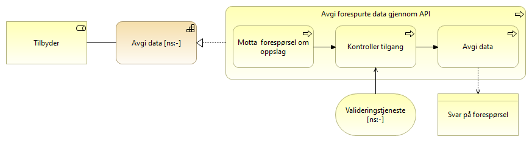
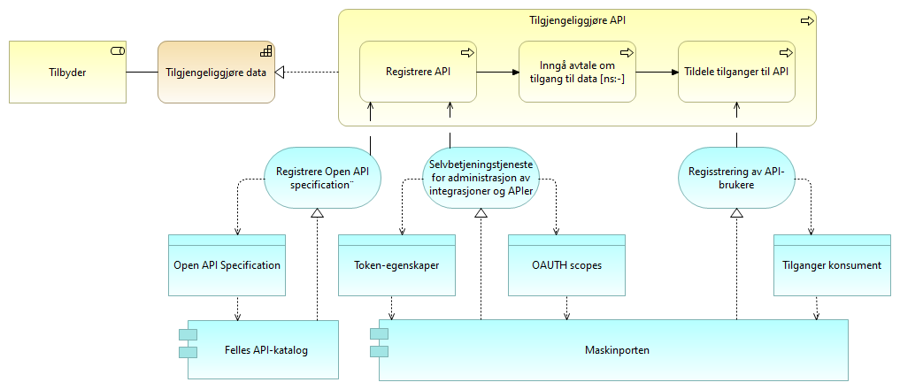
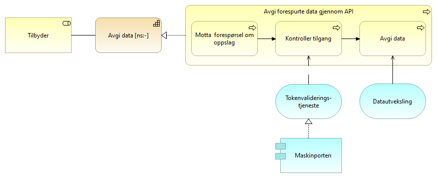

:lang: no
:doctitle: Referansearkitektur for eOppslag
:keywords: Referansearkitekturer

include::../plattform_felles/includes/commonincludes.adoc[]

//:erik1:

== Om eOppslag

//Henrik: Legge inn (gjenta) beskrivelsen av kapabilitetesområdet "Deling av data på forespørsel" her, eller i dette avsnittet.

ifdef::erik1[]
[red]#*[underline]##Eriks kommentarer til dette kapitlet:##*#

* [red]#Bytt Ordet "mønsteret" med "referansearkitekturen"!?#

* [red]#Det at "en prosess hos konsumenten typisk er avhengig av informasjon fra tilbyder for å fortsette" kommer veldig plutselig på leseren her og bør ikke stå i samme setning som foregående informasjon. (Vi burde hatt en overordnet beskrivelse av hvordan ulike referansearkitekturer adresserer ulike behov i de tverrgående prosessene.)#

* [red]#Endre "Mønsteret dekker oppslag" i første avsnitt til "Referansearkitekturen dekker [underline]#synkront" oppslag". Dette er essensiell informasjon. Merk: Dermed kan første setning i neste avsnitt kuttes.#

* [red]#Bytt ordet "obligatorisk" med "relevant" i andre avsnitt.#

* [red]#Siste avsnitt sier "I innledningen til referansearkitekturer er det skissert ulike kapabilitetsområder", men dette er ikke lengre en riktig henvisning. Se https://doc.difi.no/nasjonal-arkitektur/nab_arkitekturlandskap/#

endif::[]

eOppslag er en delmengde av kapabilitesområdet deling av data på forespørsel. Referansearkitekturen dekker synkront oppslag i informasjon, hvilket vil si forespørsel om informasjon mellom to parter.

Dette gjelder for både sikrede APIer hvor tilgangsstyring løses ved bruk av blant annet fellestjenester, og APIer som tilbyr åpent tilgjengelige data uten tilgangsbegrensninger. En stor del av beskrivelsene tar for seg oppsett og bruk av tjenester tilknyttet tilgangsstyring, men dette er ikke relevant for APIer som tilbyr åpne data.

I beskrivelsen av Nasjonal arkitekturlandskap er det beskrevet ulike kapabilitetsområder og identifisert overordnede kapabiliteter som inngår i de ulike referansearkitekturene; se under https://doc.difi.no/nasjonal-arkitektur/nab_arkitekturlandskap/

I dette kapittelet detaljeres kapabilitetene tilknyttet eOppslag.

== Struktur på beskrivelsen
 
 
ifdef::erik1[]

[red]#*[underline]##Eriks kommentarer til dette kapitlet:##*#

* [red]#Lite av det som står her er spesifikt for eOppslag. så det bør løftes opp og ut til beskrivelse av en dokumentasjonsmal.#

* [red]#Vi bør unngå å blande sammen form og innhold i samme setning.#

* [red]#Om vi skal si at elementene er forklart i en tabell under hver modell (relativt innlysende her), bør vi også si at en alternativt kan klikke seg inn på Archi-modellene og finne beskrivelsene der (ikke fullt så innlysende).#

* [red]#Sitat: "Modellene i beskrivelsene viser relasjonene mellom de ulike elementene". Kommentar: Ja, det er vel det modeller gjør:) Nødvendig å si?#

* [red]#Begrepet "kjerneinformasjon"?# 

*  [red]#Viktig poeng om at det er "to grupper" av beskrivelser, dvs. om oppsett og klargjøring vs. operativ bruk,  men er dette egentlig gjort i praksis? jeg kunne tenkt meg en mer systematisk tilnærming til dette (når vi får tid)#

*  [red]#Dette kapitlet ser jeg ellers i sammenheng med "hvordan lese modellene" (som av en eller annen grunn kun er gjort for "arkitekturmønstre" og ikke "løsningsmønstre")#

endif::[]

Det gis først en overordnet beskrivelse av kapabilitetene som inngår i eOppslag. Disse kapabilitetene beskrives videre i hver sin modell og detaljeres gjennom prosesstegene som skal til for å realisere kapabiliteten. Det vises også til forretningstjenestene og noe av den sentrale informasjonen som benyttes i prosessene.

Modellene i beskrivelsene viser relasjonene mellom de ulike elementene og elementene er forklart i tabellene under hver modell. Elementer som benyttes flere ganger, f.eks. rollen som tilbyder, forklares kun tilknyttet modellen på høyest nivå.

Disse modellene er så langt som mulig generiske og beskriver mønstre uten kobling til spesifikke løsninger og vil kunne realiseres på ulike måter. 

I kapitlet med løsningsmønstre vises det derimot til konkrete felleløsninger som gir en beste praksis på hvordan eOppslag implementeres.

== Oversikt eOppslag

ifdef::erik1[]

[red]#*[underline]##Eriks kommentarer til dette kapitlet:##*#

* [red]#Senere: Jeg ville her  tatt med relasjoner for å vise hvilke tilbyder-kapabiliteter som henger sammen med hvilke konsument-kapabiliteter. Det er bra for lesbarheten? Det er kanskje også nødvendig informasjon om du vil analysere og rapportere på sammenhengene programmatisk.#

* [red]#Senere: Jeg ville her (gitt valgt kapabilitetsnebryting) brukt _Archimate Grouping_ for å skille klart mellom oppsett vs. operasjon#

* [red]#Spørsmål/refleksjon: Motsats på tilbydersiden til konsumentsidens "delegere rettigheter til databehandler"?#

endif::[]

Modellen under viser de kapabilitetene en tilbyder og en konsument må ha for å dele data gjennom tilgangsstyrte APIer.

Tilbyder må kunne tilgjengeliggjøre data og dette er delt i to kapabiliteter hvor den ene, "Registrering av API" går ut på hvordan man registerer og setter opp tilganger. Den andre kapabiliteten "Avgi forespurte data" er det man gjøre når en konsument gjøre et kall mot det respektive APIet.

Tilsvarende er det tre detaljerte kapabiliteter tilknyttet konsument og det å innhente data. "Få tilgang til API" består av prosesser for oppsett av tilgang, "Delegering av rettigheter til databehandler" må gjøres dersom konsument benytter seg av en databehandler og "Slå opp data gjennom synkront API" er det konsumenten må gjøre hver gang det gjøres et oppslag.

I de detaljerte beskrivelsene i kapitlene under er kapabilitetene delt i to grupper hvor den første er de kapabilitetene som inngår i å klargjøre for deling av data på forespørsel. Det er prosessene som må til for å tilgjengeliggjøre APIer, klienter og å sette opp tilganger både fra tilbyder og konsument sin side. Den andre grupperer de prosessene som inngår i den faktiske delingen av data på forespørsel. 

image:../nab_referanse_arkitekturer_eoppslag/media/Deling på forespørsel.png[alt="Bilde mangler", width=750]

[cols ="1,1,3", options="header"]
.Elementer i figur for deling av data på forespørsel
|===
|Element
|Elementtype
|Beskrivelse

|Tilbyder av data
|Rolle
|Den part som besitter informasjon som kan deles.

|Konsument (databruker)
|Rolle
|Den part som i en egen virksomhetsprosess har behov for informasjon fra en annen part.

|Tilgjengeliggjøring av data
|Kapabilitet
|Evnen til å gjøre data tilgjengelig for aktører utenfor egen virksomhet.

|Tilgjengeliggjøre API
|Sub-kapabilitet
|Del av "tilgjengeliggjøreing av data". Evnen til å registrere eget API i fellestjenester så det blir tilgjengelig for andre aktører.

|Avgi forespurte data
|Sub-kapabilitet
|Del av "tilgjengeliggjøreing av data". Evene til å avgi data på forespørsel gjennom et egnet API. Kan omfatte tilgangsstyring.

|Innhenting av data
|Kapabilitet
|Evenen til å hente tilbydte data fra annen aktør.

|Få tilgang til API
|Sub-kapabilitet
|Evnen til å få tilgang til tilbydte data fra annen aktør. 

|Delegering av rettigheter til databehandler
|Sub-kapabilitet
|Evnen til å delegere rettigheter til databehandler som utfører oppgaver på vegne av behandlingsansvarlig

|Slå opp data gjennom et API
|Sub-kapabilitet
|Evnen til å slå opp og hente data gjennom et eksternt API.

|===

//== Detaljerte beskrivelser 

== Arkitekturmønstre (konseptuelle beskrivelser, kun arkitekturbyggeklosser)

ifdef::erik1[]

[red]#*[underline]##Eriks kommentarer til dette kapitlet:##*#

* [red]#Dette kapitlet bør (ineste omgang) løftes opp og ut til beskrivelser av modelleringskonvensjoner og dokumentasjonsmaler.#

* [red]#Jeg ville ikke vært så eksplisitt på layout,som f.eks. hva som er i midten, nederst og øverst#

* [red]#Jeg leser "Øverst i figurene er det en knytning til hvilken kapabilitet dette er en del av", men dette mangler i figuren her.#

* [red]#Det er nå direkte feil  å si at "Nederst i figuren er det beskrevet de fellestjenestene og elementene som støtter prosessene."#

* [red]#Relasjonene bør navngis.#

* [red]#"Tjeneste som støtter prosess" bør her hete "[underline]##forretningstjeneste## som ..."#

* [red]#Jeg ser i de påfølgende modellene at det fortsatt er brukt gule bokser på tjenester som helt klart er applikasjonstjenester". Jeg mener at vi skal se se på "konseptuelle applikasjonstjenester" som ABB-er (noe jeg som nevnt vil beskrive separat under modellingskonvensjoner). Det som uansett er viktig her, er at det blir en "smertefri" overgang til de modellene som også tar med seg SBB-ene. Der har vi jo kuttet ut noen av de gule tjenestene fordi de ikke gir noen tilleggsinformasjon. Hvorfor ikke også her? Dvs tillat å gå direkte fra _process_ til _business object_ i denne figuren. Inkluder også "blå tjenester" (med serves og realizes). Et eksempel på det siste er "API-søk", som støtter "Finne/få kjennskap til API".#

* [red]#Jeg foreslår at vi inntil videre konsekvent navngir og beskriver applikasjonstjenester som ABB-er. Forskjellen mellom generiske arkitekturmønstre og mer løsningsnære arkitekturmønstre blir dermed primært at vi bare legger på (logiske) applikasjonskomponenter,slik som f.eks.  ##

* [red]#Layoutdetalj: Symboler og tekst er her veldig små¨ i forhold til andre figurer/modeller. Prøv å få til et mer enhetlig look?#

endif::[]

I dette kapittelet beskrives kapabilitetene som inngår i eOppslag. De er detaljert ved prosessteg som realiserer kapabiliteten. Det vil si at kan du gjennomføre prosesstegene innehar du evnen kapabiliteten beskriver. Det er også identifisert hvilke generiske fellestjenester det er behov for å ha for å støtte prosesstegene. 

Beskrivelsene er forsøkt å holde helt generisk uten å peke til noen løsning og det vil dermed kunne være flere måter å realisere de ulike elementene på.

=== Hvordan lese modellene
Modellene viser hvilke roller som innehar den respektive kapabiliten og er involvert i prosessene. Prosessene realiserer kapabiliteten og tjenester med tilhørende sentrale informasjonselementer støtter opp om prosessene.

De grunnleggende elementene i modellene foklares i denne figuren:

image:../nab_referanse_arkitekturer_eoppslag/media/Forklaring prosess.png[alt="Bilde mangler", width=350]

=== Klargjøring for _deling av data på forespørsel_
ifdef::erik1[]
[red]#*[underline]##Eriks kommentarer til følgende avsnitt :##*#

* [red]#Om teksten skal stå, vil jeg ha e noverskrift, som f.eks. "Generelt" eller introduksjon. I (de så langt uskrevne) dokumentasjonskonvensjonene våre, står det at du ikke skal gjemme bort tekst fra innholdsfortegnelsen slik som dette:)#

* [red]#Behøves denne teksten her, egentlig? Burde vi ikke ha forklart dette godt noki overordnede og underliggende kapitler?#

endif::[]

==== Tilgjengeliggjøre API
ifdef::erik1[]
[red]#*[underline]##Eriks kommentarer til dette kapitlet:##*#

* [red]#Kutt forretningstjenestene "API-registrering" og "Tilgangsregistrering" som mellomledd til forretningsobjektene - disse forretningstjenestene gir liten eller ingentilleggsinformasjon ift. prosessene.#

* [red]#Vurder å ta inn "de blå" tjenestene som ABB-er her.#

endif::[]

Tilgjengeliggjøring av API gjøres av tilbyder av data og er det tilbyder må gjennomføre for å gjøre et API synlig og tilgjengelig gjennom fellesløsninger. Registrering av konsumenters rettigheter og tilganger inngår også som et prosessteg. Dersom det er registrering av et åpent API, er det kun relevante prossessteg som utføres.

image:../nab_referanse_arkitekturer_eoppslag/media/registrere API.png[alt="Bilde mangler", width=750]

[cols ="1,1,3", options="header"]
.Elementer i figur for registrering av API
|===
|Element
|Elementtype
|Beskrivelse

|Tilbyder av data
|Rolle
|Den part som besitter informasjon som kan deles.

|Konsument (databruker)
|Rolle
|Den part som i en egen virksomhetsprosess har behov for informasjon fra en annen part.

|Bruksavtale
|Kontrakt
|Avtale eller kontrakt om tilgang til og bruk av data. Dette kan for eksempel være en bilateralt utformet avtale, aksept av generelle bruksvilkår, eller lisens for bruken av åpne data.

|Registrere API
|Prosess
|Prosess for tilbyder å registrere API i nasjonale fellesløsninger så det blir letter tilgjengelig for konsumenter. Forutsetter at konsument har inngått avtale eller godtatt bruksvilkår for bruk av løsningen.

|Inngå avtale om tilgang til data
|Prosess
|Prosess for å inngå avtale om tilgang og bruk av data.

|Registrere tilganger til API
|Prosess
|Prosess for å registrere tilganger til de virksomheter som har et gyldig behandlingsgrunnlag og som har inngått avtale om tilgang til data.

|API-registrering
|Forretningstjeneste
|Tjeneste for å registerer de APIene man ønsker å tilby til konsumenter og egenskaper ved disse.

|Egenskaper ved sikkerhetsbillett for tilgang til API
|Forretningsobjekt
|Egenskaper  ved sikkerhetsbillett, f.eks. granulariteten på tilganger.

|Tilgangsregistrering
|Forretningstjeneste
|Tjeneste for å registrere de virksomhetene som skal få tilgang til APIer og hvilket tilgangsnivå de skal ha.

|Tilgangsspesifikasjoner konsument
|Forretningsobjekt
|Beskrivelse av de tilganger en konsument skal ha til et spesifikt API.

|===

==== Få tilgang til API
Få tilgang til API er det en konsument av data må gjøre for å få tilgang til data gjennom et API. Det omfatter å få kjennskap til APIet, inngå avtale om bruk av data, og registrere den tekniske komponenten som skal utføre tjenestekallet. Dersom det er tilgang til et åpent API er det kun relevante prossessteg som utføres.

image:../nab_referanse_arkitekturer_eoppslag/media/få tilgang til API.png[alt="Bilde mangler", width=750]

[cols ="1,1,3", options="header"]
.Elementer i figur for å få tilgang til API
|===
|Element
|Elementtype
|Beskrivelse

|Tilbyder av data
|Rolle
|Se over

|Konsument (databruker)
|Rolle
|Se over

|Bruksavtale
|Kontrakt
|Se over

|Finne/få kjennskap til API
|Forretningsprosess
|Prosessen med å finne eller få kjennskap til tilgjengelige APIer. Benytter tjeneste for å søke i fellesløsninger.

|Inngå avtale om tilgang til data
|Forretningsprosess
|Konsumenten sin porsess med å inngå eventuell avtale med tilbyder om tilgang til data.

|Registrer klient med tildelt tilgang
|Forretningsprosess
|Prosess for konsument å registerere (provisjonering av) den klienten som skal ha tilgang til APIet ved bruk av sikkerhetsbillett. Dette forutsetter at konsumenten har avtale om bruk av sikkerhetsbillettjenesten og at tilbyder har gitt konsumenten tilgang. 

Dersom det er en leverandør som har blitt delegert rettigheter som databehandler på vegne av konsument er det leverandøren som registrer sin klient. 

|API-søk
|Forretningstjeneste
|Tjeneste for å søke etter og finne tilgjengelige APIer. 

|Registreringstjeneste for API-bruker
|Forretningstjeneste
|Tjeneste for å registere brukere av tokentjeneste

|===

==== Delegering av rettigheter til databehandler
Delegering av rettigheter til databehandler er det en konsument må gjøre for at en leverandør kan identifisere seg med sitt eget virksomhetssertifikat og opptre på vegne av konsumenten som er den som innehar behandlingsgrunnlaget for å innhente data.

image:../nab_referanse_arkitekturer_eoppslag/media/delegering av rettigheter.png[alt="Bilde mangler", width=500]

[cols ="1,1,3", options="header"]
.Elementer i figur for delegering av rettigheter til databehandler
|===
|Element
|Elementtype
|Beskrivelse

|Tjenesteavtale
|Kontrakt
|Avtale mellom leverandør og konsument som er grunnlaget for å kunne delegere rettigheter fra konsument til en leverandør

|Konsument (databruker)
|Rolle
|Se over

|Leverandør
|Rolle
|En part som leverer tjenester eller utfører oppgaver på vegne av en annen part.

|Inngå avtale med leverandør
|Prosess
|Prosessen med å inngå en avtale med leverandør. En slik avtale vil normalt være inngått tidligere og uavhengig av om man skal ta i bruk et nytt API.  En tjenesteavtale med leverandør er en forutsetning forutsetning for å kunne delegere en tilgang.

|Registrere delegert tilgang
|Prosess
|Prosessen med å delegere tilganger. I tilknytning til eOppslag vil formålet være å gi leverandør tilgang til å representere konsument overfor et API, men registreringen vil potensielt også kunne gjelde for andre områder.

|Registreringstjeneste for representasjonsforhold
|Forretningstjeneste
|Tjeneste for å registerer representasjonsforhold. I dette tilfellet delegering av rettigheter til å benytte et API på vegne av konsument.

|===

=== Operativ deling av data på forespørsel

==== Slå opp data gjennom et API
Slå opp data gjennom et API er det en konsument må gjøre når det utføres et tjenestekall for å innhente data gjennom et API. Dersom det er et åpent API er det kun relevante prossessteg som utføres.

image:../nab_referanse_arkitekturer_eoppslag/media/slå opp data.png[alt="Bilde mangler", width=500]

[cols ="1,1,3", options="header"]
.Elementer i figur for å slå opp data
|===
|Element
|Elementtype
|Beskrivelse

|Konsument (databruker)
|Rolle
|Se over

|Hent teknisk adresse
|Forretningsprosess
|Prosessen å slå opp den tekniske adressen til et API før spørring mot APIet. Gjøres kun dersom det er nødvendig.

|Hent sikkerhetsbillett
|Forretningsprosess
|Prosessen med å benytte en sikkerhetsbillettjeneste for hente en sikkerhetsbillett som gir tilgang til et API. Dette forutsetter at alt er registert og satt opp riktig mot de aktuelle tjenestene.

|Utfør tjenestekall
|Forretningsprosess
|Prosessen med å benytte (gjøre et oppslag mot) et eksternt API

|Adressetjeneste
|Forretningstjeneste
|Tjeneste som gir mulighet til å slå opp teknisk endepunkt.

|Utstedelse av sikkerhetsbillett
|Forretningstjeneste
|Tjeneste som utsteder sikkerhetsbilletter.

|Tjeneste for informasjon om representasjonsforhold
|Forretningstjeneste
|Tjeneste som gir oversikt over representasjonsforhold. Benyttes av tokentjeneste dersom en leverandør skal få tilgang på vegne av en konsument
|===

==== Avgi forespurte data
Avgi forespurte data er det tilbyder av data må gjøre for å svare på en forespørsel. Prosessen kontrollere tilgang gjøres kun dersom det er enakk om å avgi data gjennom et sikret API.

[cols ="1,1,3", options="header"]
.Elementer i figur for å avgi forespurte data
|===
|Element
|Elementtype
|Beskrivelse

|Tilbyder av data
|Rolle
|Se over

|Intern tilgangskontroll
|Forretningstjeneste
|Intern tjeneste hos tilbyder for å håndheve tilgangsnivåpolicy ved tilgangskontroll.

|Motta forespørsel om oppslag
|Forretningsprosess
|Prosess med å motta forespørsler fra API-konsument om å utlevere data.

|Kontroller tilgang
|Forretningsprosess
|Prosessen med å kontrollere om konsumenten har rettigheter til å få de forespurte data.

|Avgi data
|Forretningsprosess
|Prosessen med å gi svar på forespørselen.

|Validering av sikkerhetsbillett
|Forretningstjeneste
|Tjeneste for å validere gyldigheten av sikkerhetsbilletten. Med en gyldig sikkerhetsbillett skal det ikke være nødvendig å validere grunnlaget eller innholdet i sikkerhetsbilletten siden det er et tillitsforhold mellom partene.

|===

== Løsningsmønstre (logiske beskrivelser med arkitekturbyggeklosser og aktuelle løsningsbyggeklosser)

ifdef::erik1[]

[red]#*[underline]##Eriks kommentarer til første del av dette kapitlet:##*#

* [red]#Det mangler en overskrift til første avsnitt. Bør det hete "Hvordan lese modellene", slik som for arkitekturmønstrene?#

* [red]#Om "skal leses i henhold til følgende modell": Nice try:) Her hoppes det over ethvert forsøk på å forklare. Kanskje det er greit, men det er ikke greit at dette er beskrevet på så ulike måter under arkitekturmønstre vs. løsningsmønstre.#

* [red]#Figuren er for liten - vanskelig å lese tekst uten å forstørre. Tilstreb lik størrelse på tekst i alle figurer.#

endif::[]

Beskrivelsen under viser hvordan den generiske arkitekturen i det foregående kapittelet kan realiseres med løsningskomponentene Maskinporten, API-katalogen og Altinn-autorisasjon. Disse fellesløsningene leverer de tjenestene som er beskrevet på forretningsnivå over.

Det er ikke hensikten å låse referansearkitekturen til spesifikke løsninger, da ulike sektorer og aktører kan ha behov som ikke passer med den foreslåtte. For synkrone tjenestekall basert på REST og med tilgangsstyring ved hjelp av OAUTH2-tokens, vil det være god støtte i å benytte de foreslåtte løsningene. 

=== Hvordan lese modellene

For enklere lesbarhet er laget med forretningstjenester utelatt fra modellene og mer løsningsnære applikasjnstjenester er benyttet direkte inn mot forretningsprosessene. Modellene viser dermed hvordan fellesløsninger i form av applikasjonskomponenter støtter de ulike forretningsprosessene gjennom applikasjonstjenester.

De grunnleggende elementene i modellene foklares i denne figuren:

image:../nab_referanse_arkitekturer_eoppslag/media/forklaring_app_lag.png[alt="Bilde mangler", width=350]

// For å registrere API må man for i de respektive fellestjenestene ha rettigheter til dette på vegne av egen virksomhet. Dette tildeles iht. hvem som har rettigheter i enhetsregisteret og rettighetene må delegeres nedover i organisasjonen til den som skal gjennomføre registreringen. Dette foregår i Altinn.

//Henrik: få inn figur som viser dette?

=== Klargjøring for _deling avdata på forespørsel_

==== Tilgjengeliggjøre API

ifdef::erik1[]

[red]#*[underline]##Eriks kommentarer til dette kapitlet:##*#

* [red]#Navning og beskrivelser av "de blå tjenestene" er ikke konsistent med tanke på om de er knyttet til en spesifikk SBB-applikasjonskomponent og slik sett er å betrakte som en SBB-tjeneste vs. en (konseptuell) ABB-tjeneste.Jeg foreslår at vi inntil videre konsekvent navngir og beskriver applikasjonstjenester som ABB-er. Forskjellen mellom generiske arkitekturmønstre og mer løsningsnære arkitekturmønstre blir dermed bare at vi bare legger på (logiske) applikasjonskomponenter.#

endif::[]

For å tilby data gjennom et API sikret med fellestjenester må tilbyder inngå avtale for bruk av Maskinporten og API-katalogen (Felles datakatalog). De respektive APIene og hvem som skal ha hvilke rettighetene til disse må så registreres i løsningene.

[cols ="1,1,3", options="header"]
.Elementer i figur for registrering av API
|===
|Element
|Elementtype
|Beskrivelse

|Open API Specification
|Dataobjekt
|Maskinlesbar beskrivelse av REST APIer. Dette er formatet som benyttes for å registrere et API i felles API-katalog

|Tokenegenskaper
|Dataobjekt
|Egenskaper som f.eks. gyldighetstid ved tilgangstoken som er Maskinportens variant av sikkerhetsbillett.

|OAUTH scopes
|Dataobjekt
|Et scope kan best beskrives som en ressurs-definisjon og et token er som regel knyttet til ett eller flere scopes. Scopes benyttes til å styre tilganger til APIer og operasjoner og eventuelt hva slags responser man får fra APIet.

|Tilganger konsument
|Dataobjekt
|Beskrivelse av de tilgangene, dvs. hvilke scopes en gitt konsument skal ha til et API.

|Registrere Open API Specification
|Applikasjonstjeneste
|Tjeneste i API-katalogen for å registrere API. Bruk av tjenesten forutsetter at man har de fått tildelt rettigheter til å gjøre dette på vegne av tilbyders virksomhet.

|Selvbetjeningstjeneste for administrasjon og registering av APIer i Maskinporten
|Applikasjonstjeneste
|Tjeneste i API-katalogen for å registrere API. Bruk av tjenesten forutsetter at man har de fått tildelt rettigheter til å gjøre dette på vegne av tilbyders virksomhet.

|Selvbetjenesigstjeneste for administrasjon av integrasjoner og APIer
|Applikasjonstjeneste
|Tjeneste for gjennom selvbetjening å registrere og vedlikeholde API-definisjoner og scopes i Maskinporten.

|Registrering av API-brukere
|Applikasjonstjeneste
|Tjeneste for gjennom selvbetjening å registrere og vedlikeholde tilgangene konsumenter skal ha til APIer og scopes.

|API-katalogen
|Applikasjonskomponent
|Del av Felles datakatalog som gir mulighet for å søke etter APIer og lese API-spesifikasjoner
https://fellesdatakatalog.brreg.no/apis

|Maskinporten
|Applikasjonskomponent
|Fellesløsning for API-sikring ved bruk av OAUTH2-tokens.

|===

==== Få tilgang til API
For å få tilgang til et API sikret ved hjelp av fellesløsninger må konsumenten inngå avtale for bruk av Maskinporten og registrere den tekniske klienten som skal benytte løsningen.

image:../nab_referanse_arkitekturer_eoppslag/media/få_tilgang_app_lag.png[alt="Bilde mangler", width=500]

[cols ="1,1,3", options="header"]
.Elementer i figur for å få tilgang til API
|===
|Element
|Elementtype
|Beskrivelse

|Søk i API-katalogen
|Applikasjonstjeneste
|Tjeneste for å søke etter API-er som er registrert i felles API-katalog.

|Selvbetjeneingstjeneste for administrasjon i Maskinporten
|Applikasjonstjeneste
|Tjeneste for gjennom selvbetjening å registrere og vedlikeholde API-definisjoner og scopes i Maskinporten.

|API-katalogen
|Applikasjonskomponent
|Del av Felles datakatalog som gir mulighet for å søke etter APIer og lese API-spesifikasjoner
https://fellesdatakatalog.brreg.no/apis

|Maskinporten
|Applikasjonskomponent
|Fellesløsning for API-sikring ved bruk av OAUTH2-tokens.

|===

==== Delegering av rettigheter til databehandler
Dersom konsumenten benytter en leverandør som skal opptre på vegne av seg selv må dette forholdet registereres gjennom Altinn autorisasjon slik at det blir tilgjengelig for Maskinporten å kontrollere representasjonsforholdet.

image:../nab_referanse_arkitekturer_eoppslag/media/delegere_rettigheter_app_lag.png[alt="Bilde mangler", width=350]

[cols ="1,1,3", options="header"]
.Elementer i figur delegering av rettigheter til leverandør
|===
|Element
|Elementtype
|Beskrivelse

|Registrering av delegerte tilganger
|Applikasjonstjeneste
|Tjeneste for å registrere et representasjonsforhold som gir leverandør mulighet til å opptre på vegne av konsument

|Altinn autorisasjon
|Applikasjonskomponent
|Autorisasjonskomponenten i Altinn som gir muligheter til å delegere rettigheter til andre organisasjoner eller personer. Rettigheter til bruk av autorisasjonskomponenten baserer seg på registrerte roller i Enhetsregisteret.

|===
=== Utveksling av data

==== Slå opp data gjennom et API

Når en konsumet skal slå opp data gjennom et API benyttes Maskinporten for å få utstedt en sikkerhetsbillett som legges ved tjenestekallet til tilbyders API.

image:../nab_referanse_arkitekturer_eoppslag/media/slå_opp_app_lag.png[alt="Bilde mangler", width=500]

[cols ="1,1,3", options="header"]
.Elementer i figur slå opp data gjennom et API
|===
|Element
|Elementtype
|Beskrivelse

|Oppslag API-adresse
|Applikasjonstjeneste
|Oppslag på adresse (server-object) til et API i adressekatalogen.

|OAUTH2 tokentjeneste
|Applikasjonstjeneste
|Tjeneste som utsteder et OAUTH2-token basert på autentisering med virksomhetssertifikat og tidligere tildelte rettigheter.

|Oppslag representasjonsforhold
|Applikasjonstjeneste
|Tjeneste som benyttes av tokentjenesten for å kontrollere om det foreligger et delegert representasjonsforhold fra konsument til leverendør i autorisasjonstjenesten til Altinn.

|API-katalogen
|Applikasjonskomponent
|Del av Felles datakatalog som gir mulighet for å søke etter APIer og lese API-spesifikasjoner
https://fellesdatakatalog.brreg.no/apis

|Maskinporten
|Applikasjonskomponent
|Fellesløsning for API-sikring ved bruk av OAUTH2-tokens.

|Altinn autorisasjon
|Applikasjonskomponent
|Autorisasjonskomponenten i Altinn som gir muligheter til å delegere rettigheter til andre organisasjoner eller personer. Rettigheter til bruk av autorisasjonskomponenten baserer seg på registrerte roller i Enhetsregisteret.

|Virksomhetssertifikat til konsument
|Dataobjekt
|En virksomhets elektroniske ID. Benyttes for å autentisere virksomheten overfor tokentjenesten.

|Tilganger konsument
|Dataobjekt
|Oversikt over hvilke API og OAUTH-scopes en virksomhet (representert ved organisasjonsnummer) skal ha tilgang til (utstedt token for).

|===

==== Avgi forespurte data

Når tilbyder får en forspørsel om data som et API-kall og det ligger ved en sikkerhetsbillett benyttes valideringstjenesten til maskinporten for grov tilgangskontroll.

[cols ="1,1,3", options="header"]
.Elementer i figur avgi forespurte data
|===
|Element
|Elementtype
|Beskrivelse

|Tokenvalideringstjeneste
|Applikasjonstjeneste
|Tjeneste som benyttes av tilbyder for å validere og kontrollere autentisiteten til et OAUTH2 token fra Maskinporten.

|Maskinporten
|Applikasjonskomponent
|Fellesløsning for API-sikring ved bruk av OAUTH2-tokens.

|===

////
==== Videre detaljering av komponentene

API-katalogen er en del av Felles datakatalog som leveres av Brønnøysundregisterene. REgistreringsprosessen beskrives her:

https://fellesdatakatalog.brreg.no/about-registration

Maskinporten:
Maskinporten tilbyr offentlige etater en enkel måte å sikre sine APIer med virksomhetsautentisering og tilgangstyring.

https://difi.github.io/idporten-oidc-dokumentasjon/oidc_guide_maskinporten.html

Altinn-autorisasjon:
https://altinnett.brreg.no/no/Tjenester/Sikkerhet/Autorisasjon/
////
