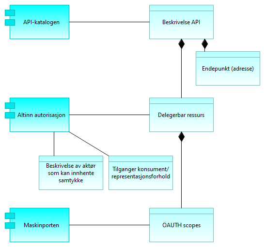

:lang: no
:doctitle: eOppslag referansearkitektur
:keywords: 

include::../plattform_felles/includes/commonincludes.adoc[]

== Om eOppslag

eOppslag er en referansearkitektur for oppslag i data gjennom synkrone API-kall. Dette er en spesialisering av _Generisk mønster for spørring og oppslag_.

Beskrivelsen under viser hvordan den generiske arkitekturen i det foregående kapittelet kan realiseres med løsningskomponentene Maskinporten, API-katalogen og Altinn-autorisasjon. Disse fellesløsningene leverer de tjenestene som er beskrevet på forretningsnivå over.

eOppslag kan benyttes både for sikrede API-er og API-er som tilbyr åpent tilgjengelige data uten tilgangsbegrensninger.

Det er ikke hensikten å låse referansearkitekturen til spesifikke løsninger, da ulike sektorer og aktører kan ha behov som ikke passer med det som er beskrevet. For synkrone tjenestekall basert på REST og med tilgangsstyring ved hjelp av OAUTH2-tokens, vil det være god støtte i å benytte de foreslåtte løsningene. 

Nederst i beskrivelsen av løsningsmønstre er det en overordnet beskrivelse av hvilke data som inngår i registrering i de ulike komponentene.

// For å registrere API må man for i de respektive fellestjenestene ha rettigheter til dette på vegne av egen virksomhet. Dette tildeles iht. hvem som har rettigheter i enhetsregisteret og rettighetene må delegeres nedover i organisasjonen til den som skal gjennomføre registreringen. Dette foregår i Altinn.

//Henrik: få inn figur som viser dette?

== Klargjøring for _deling av data på forespørsel_

=== Tilgjengeliggjøre data

For å tilby data gjennom et API sikret med fellestjenester må tilbyder inngå avtale for bruk av Maskinporten og Felles API-katalog. De respektive API-ene og hvem som skal ha hvilke rettighetene til disse må så registreres i løsningene.

image:../nab_referanse_arkitekturer_forespørsel-svar-generisk/media/SBB_Tilgjengeliggjøre.png[alt="Bilde mangler",  link=https://nasjonal-arkitektur.github.io/nab_modeller_html-hovedbibliotek/e7e6c527-26f4-461c-b4dd-651fcbe85c8d/views/80c1baa6-55d8-4434-ab14-55e2d0afa827.html, link=https://www.vg.no/]

[cols ="1,3", options="header"]
.Elementer i view for Tilgjengeliggjøre data løsningsmønster
|===

| Element
| Beskrivelse

| Datatilbyder
| Tilbyder av data til andre aktører.

| Tilgjengeliggjøre data
| Evnen til å gjøre data tilgjengelig for aktører utenfor egen virksomhet.

| Tilgjengeliggjøre API
| Prosessen med å tilby data gjennom et API til aktører utenfor egen virksomhet.

| Registrere API
| Prosess med å registere API i relevante tjenester, api-katalog, Maskinporten, Kapabilitetsoversikt

| Inngå avtale om tilgang til data
| Prosess for å inngå avtale om tilgang og bruk av data.

| Tildele tilganger til API
| Prosess for å registrere hvilke databrukere som skal få tilgang
Sette policy, og grov tilgangsstyring gjennom maskinporten.

| Registrere brukere av samtykke
| Prosess for å registrere konsumenter som skal ha mulighet for å innhente samtykker som gir tilgang til en tjeneste.

Dette utføres kun om det er behov for samtykke for tilgang til dataene.

| Registrere Open API specification¨
| Tjeneste i Felles API-katalogen for å registrere API. Bruk av tjenesten forutsetter at rettigheter til å gjøre dette på vegne av tilbyders virksomhet.

| Selvbetjeningstjeneste for administrasjon av integrasjoner og APIer
| Tjeneste "administrasjonssentre" vil ha rettigheter til å registrere på vegne av andre f.eks. API-katalogen

| Registrering av API-brukere
| Tjeneste for gjennom selvbetjening å registrere og vedlikeholde tilgangene konsumenter skal ha til API-er og scopes.

| Registrere samtykkebasert tilgang
| Tjeneste for å registerer konsumenter som kan innhente samtykke som gir grunnlag for utlevering fra datatilbyder.

| Beskrivelse API
| Dataobjekt som er en maskinlesbar beskrivelse av REST API-er iht. Open API Specification. Dette er formatet som benyttes for å registrere et API i felles API-katalog

| Token-egenskaper
| Egenskaper som f.eks. gyldighetstid ved tilgangstoken som er Maskinportens variant av sikkerhetsbillett.

| OAUTH scopes
| Dataobjekt som som kan beskrives som en ressurs-definisjon, og et token er som regel knyttet til ett eller flere scopes. Scopes benyttes til å styre tilganger til API-er og operasjoner, samt eventuelt hva slags responser man får fra API-er.

| Tilganger konsument
| Oversikt over hvilke API og OAUTH-scopes en virksomhet (representert ved organisasjonsnummer) skal ha tilgang til (utstedt token for).

| Aktører som kan innhente samtykke for bruk av API
| Oversikt over aktører som skal ha mulighet til å innhente samtykke som grunnlag for å få tilgang til data gjennom et API. 
URL til konsumenten det kan innhentes samtykke for må inngå i beskrivelsen.

| Felles API-katalog
| Del av Felles datakatalog som gir mulighet for å søke etter API-er og lese API-spesifikasjoner https://fellesdatakatalog.brreg.no/apis

| Maskinporten
| Maskinporten er en løsning for tilgangsstyring for virksomheter som utveksler data. Løsningen garanterer identiteten mellom virksomheter, og sørger for maskin-til-maskin autentisering

| Altinn autorisasjon
| Autorisasjonskomponenten i Altinn som gir muligheter til å delegere rettigheter til andre organisasjoner eller personer. Rettigheter til bruk av autorisasjonskomponenten baserer seg på registrerte roller i Enhetsregisteret.
Altinn autorisasjon leverer også tjenester for å registrere og kontrollere samtykke gitt av person eller virksomhet.

|===

=== Få tilgang til data
For å få tilgang til data gjennom et API sikret ved hjelp av nasjonale fellesløsninger, må konsumenten inngå avtale for bruk av Maskinporten og registrere den tekniske klienten som skal benytte løsningen.

image:../nab_referanse_arkitekturer_forespørsel-svar-generisk/media/SBB_Tilgang.png[alt="Bilde mangler",link=https://nasjonal-arkitektur.github.io/nab_modeller_html-hovedbibliotek/e7e6c527-26f4-461c-b4dd-651fcbe85c8d/views/32191953-d527-4b27-8a58-b8ec5fd93660.html]

[cols ="1,3", options="header"]
.Elementer i view for Få tilgang til data - løsningsmønster
|===

| Element
| Beskrivelse

| Datakonsument
| Den som innhenter eller mottar data fra andre aktører.

| Få tilgang til data (konsument)
| Evnen til å skaffe seg tilgang til tilbudte data fra annen aktør. 

| Få tilgang til API
| Prosessen med å skaffe seg tilgang til tilbudte data fra annen aktør. Omfatte å finne API-er, inngå nødvendige avtaler og få tilganger.

| Finn/få kjennskap til API
| Prosessen med å finne eller få kjennskap til tilgjengelige API-er gjennom relevante kataloger og søkeløsninger.

| Inngå avtale om tilgang til data
| Prosess for å inngå avtale om tilgang og bruk av data.

| Registrer klient med tildelt tilgang
| Prosess for konsument å registerere (provisjonering av) den klienten som skal ha tilgang til API-et ved bruk av sikkerhetsbillett. Dette forutsetter at konsumenten har avtale om bruk av sikkerhetsbillettjenesten og at tilbyder har gitt konsumenten tilgang.

Dersom det er en leverandør som har blitt delegert rettigheter som databehandler på vegne av konsument er det leverandøren som registrer sin klient.

| API-søk
| Tjeneste for å søke etter og finne tilgjengelige API-er

| Registreringstjeneste for API-brukere
| Tjeneste for å registrere klienter som skal ha tilgang til et gitt API.

| Beskrivelse API
| Dataobjekt som er en maskinlesbar beskrivelse av REST API-er iht. Open API Specification. Dette er formatet som benyttes for å registrere et API i felles API-katalog

| Felles API-katalog
| Del av Felles datakatalog som gir mulighet for å søke etter API-er og lese API-spesifikasjoner https://fellesdatakatalog.brreg.no/apis

| Maskinporten
| Maskinporten er en løsning for tilgangsstyring for virksomheter som utveksler data. Løsningen garanterer identiteten mellom virksomheter, og sørger for maskin-til-maskin autentisering

|===

==== Delegering av rettigheter til databehandler

Dersom konsumenten benytter en leverandør som skal opptre på konsumentens vegne, må dette forholdet registereres gjennom Altinn autorisasjon slik at det blir tilgjengelig for Maskinporten å kontrollere representasjonsforholdet.

image:../nab_referanse_arkitekturer_forespørsel-svar-generisk/media/SBB_Delegering.png[alt="Bilde mangler", link=https://nasjonal-arkitektur.github.io/nab_modeller_html-hovedbibliotek/e7e6c527-26f4-461c-b4dd-651fcbe85c8d/views/3d9dcb59-8e6e-4f2d-aee7-c729dea4f53f.html]

[cols ="1,3", options="header"]
.Elementer i view for Delegere rettigheter til databehandler - løsningsmønster
|===

| Element
| Beskrivelse

| Samhandlingsaktør
| Samlebetegnelse på roller som inngår i en samhandlingsprosess og samhandler med en annen samhandlingsaktør. Kan være en tilbyder, konsument, avsender, mottaker, leverandør etc.

| Delegere rettigheter til databehandler
| Evnen til å delegere rettigheter til databehandler som utfører oppgaver på vegne av behandlingsansvarlig.

| Delegering av rettigheter til databehandler (leverandør)
| Prosessen med å delegere rettigheter til databehandler/leverandør.

| Inngå avtale med leverandør
| Prosessen med å inngå en avtale med leverandør. En slik avtale vil normalt være inngått tidligere og uavhengig av om man skal ta i bruk et nytt API. En tjenesteavtale med leverandør er en forutsetning forutsetning for å kunne delegere en tilgang.

| Registrere delegert tilgang
| Prosessen med å delegere tilganger. I tilknytning til eOppslag vil formålet være å gi leverandør tilgang til å representere konsument overfor et API, men registreringen vil potensielt også kunne gjelde for andre områder.

| Delegerbar ressurs
| Dataobjekt som beskriver en ressurs, f.eks. et API, som det kan gis rettigheter til gjennom et representasjonsforhold.

| Registering av representasjonsforhold
| Tjeneste for å registrere et representasjonsforhold som gir leverandør mulighet til å opptre på vegne av konsument

| Altinn autorisasjon
| Autorisasjonskomponenten i Altinn som gir muligheter til å delegere rettigheter til andre organisasjoner eller personer. Rettigheter til bruk av autorisasjonskomponenten baserer seg på registrerte roller i Enhetsregisteret.
Altinn autorisasjon leverer også tjenester for å registrere og kontrollere samtykke gitt av person eller virksomhet.

|===

=== Informasjon som inngår i klargjøring av forespørsel

Figuren under viser hvilken informasjons som må registreres i de ulike komponentene som del av klargjøringen for å forespørre data fra et API.

[cols ="1,3", options="header"]
.Elementer i view for Dataobjekter eOppslag
|===

| Element
| Beskrivelse

| API-katalogen
| API-katalogen er en del av Felles datakatalog som inneholder API-beskrivelser med endepunktsadresser og kobling til datasett.

| Beskrivelse API
| Dataobjekt som er en maskinlesbar beskrivelse av REST API-er iht. Open API Specification. Dette er formatet som benyttes for å registrere et API i felles API-katalog

| Endepunkt (adresse)
| Dataobjekt som representerer teknisk adresse til et API eller ressurs.

| Altinn autorisasjon
| Autorisasjonskomponenten i Altinn som gir muligheter til å delegere rettigheter til andre organisasjoner eller personer. Rettigheter til bruk av autorisasjonskomponenten baserer seg på registrerte roller i Enhetsregisteret.
Altinn autorisasjon leverer også tjenester for å registrere og kontrollere samtykke gitt av person eller virksomhet.

| Delegerbar ressurs
| Dataobjekt som beskriver en ressurs, f.eks. et API, som det kan gis rettigheter til gjennom et representasjonsforhold.

| Beskrivelse av aktør som kan innhente samtykke
| Dataobjekt som beskriver en datakonsument som har rett til å innhente samtykke om å slå opp data.
Viktig innholde er bl.a. URL

| Tilganger konsument/representasjonsforhold
| Dataobjekt som beskriver hvilke tilganger til ressurser en representant (leverandør) skal ha på vegne av konsument.

| Maskinporten
| Maskinporten er en løsning for tilgangsstyring for virksomheter som utveksler data. Løsningen garanterer identiteten mellom virksomheter, og sørger for maskin-til-maskin autentisering

| OAUTH scopes
| Dataobjekt som som kan beskrives som en ressurs-definisjon, og et token er som regel knyttet til ett eller flere scopes. Scopes benyttes til å styre tilganger til API-er og operasjoner, samt eventuelt hva slags responser man får fra API-er.

|===

== Utveksling av data

=== Innhente data

Når en konsumet skal slå opp data gjennom et API benyttes Maskinporten for å få utstedt en sikkerhetsbillett som legges ved tjenestekallet til tilbyders API. Maskinporten utsteder sikkerhetsbilletter som OAUTH2-tokens.

image:../nab_referanse_arkitekturer_forespørsel-svar-generisk/media/SBB_Innhente.png[alt="Bilde mangler", width=750,link=https://nasjonal-arkitektur.github.io/nab_modeller_html-hovedbibliotek/e7e6c527-26f4-461c-b4dd-651fcbe85c8d/views/8d72be4b-7e31-438d-9990-c2c3f38f551e.html]

[cols ="1,3", options="header"]
.Elementer i view for Innhente data - løsningsmønster
|===

| Element
| Beskrivelse

| Datakonsument
| Den som innhenter eller mottar data fra andre aktører.

| Innhente data
| Evnen til å innhente data fra en annen aktør.

| Slå opp data gjennom et API 
| Prosessen med lå opp og hente data gjennom et API.

| Innhent samtykke ved behov
| Prosess for å innhente samtykke fra person eller virksomhet som grunnlag for å innhente data. Dette gjøres kun ved behov.

| Hent teknisk endepunkt ved behov
| Prosessen å slå opp den tekniske adressen til et API før spørring mot API-et. Gjøres kun dersom det er nødvendig.

| Be om tilgangstoken
| Prosessen med å benytte en sikkerhetsbillettjeneste for hente en sikkerhetsbillett som gir tilgang til et API. Dette forutsetter at alt er registert og satt opp riktig mot de aktuelle tjenestene.

| Utfør tjenestekall
| Prosessen med å benytte (gjøre et oppslag mot) et eksternt API.

| Samtykkeregistererings-tjeneste
| Tjeneste for å innhente samtykke fra den registrert som dataene gjelder. Dette kan være en person eller en virksomhet.

| Adressetjeneste
| Tjeneste som gir mulighet til å slå opp teknisk endepunkt

| Tokentjeneste
| Tjeneste som utsteder sikkerhetsbilletter. Sikkerhetsbillett utstedes basert på tildelte rettigheter og eventuelle representasjonsforhold.

| Oppslag representasjonsforhold
| Tjeneste som benyttes av tokentjenesten for å kontrollere om det foreligger et delegert representasjonsforhold fra konsument til leverendør i autorisasjonstjenesten til Altinn.

| Datautvekslingstjeneste
| Tjeneste for utveksling av data. Samme som data exchange service. Benyttes av avsender og mottaker for transport av meldinger.

| Endepunkt (adresse)
| Teknisk adresse til et API eller ressurs

| Virksomhetssertifikat
| En virksomhets elektroniske ID. Benyttes for å autentisere virksomheten overfor tokentjenesten.

| Tilganger konsument
| Oversikt over hvilke API og OAUTH-scopes en virksomhet (representert ved organisasjonsnummer) skal ha tilgang til (utstedt token for).

| Altinn autorisasjon
| Autorisasjonskomponenten i Altinn som gir muligheter til å delegere rettigheter til andre organisasjoner eller personer. Rettigheter til bruk av autorisasjonskomponenten baserer seg på registrerte roller i Enhetsregisteret.
Altinn autorisasjon leverer også tjenester for å registrere og kontrollere samtykke gitt av person eller virksomhet.

| Felles API-katalog
| Del av Felles datakatalog som gir mulighet for å søke etter API-er og lese API-spesifikasjoner https://fellesdatakatalog.brreg.no/apis

| Maskinporten
| Fellesløsning for API-sikring ved bruk av OAUTH2-tokens.

| Altinn autorisasjon
| Autorisasjonskomponenten i Altinn som gir muligheter til å delegere rettigheter til andre organisasjoner eller personer. Rettigheter til bruk av autorisasjonskomponenten baserer seg på registrerte roller i Enhetsregisteret.
Altinn autorisasjon leverer også tjenester for å registrere og kontrollere samtykke gitt av person eller virksomhet.

|===

=== Avgi data

Når tilbyder får en forspørsel om data som et API-kall og det ligger ved en sikkerhetsbillett benyttes valideringstjenesten til maskinporten for grov tilgangskontroll.

image:../nab_referanse_arkitekturer_forespørsel-svar-generisk/media/SBB_Avgi.png[alt="Bilde mangler", width=650,link=https://nasjonal-arkitektur.github.io/nab_modeller_html-hovedbibliotek/e7e6c527-26f4-461c-b4dd-651fcbe85c8d/views/5a43e372-cf45-491f-a5e9-514d83e1e259.html]

[cols ="1,3", options="header"]
.Elementer i view for Avgi data - løsningsmønster
|===

| Element
| Beskrivelse

| Datatilbyder
| Tilbyder av data til andre aktører.

| Avgi data
| Evne til å avgi data på forespørsel. Kan omfatte tilgangsstyring.

| Avgi forespurte data gjennom API
| Prosessen med å avgi data på forespørsel gjennom et egnet API.

| Motta  forespørsel om oppslag
| Motta forespørsler fra API-konsument om å avgi data.

| Autentisere konsument
| Prosessen med å autentisere en kosnument.

| Kontroller tilgang
| Kontroll og håndheving av konsumentens rettigheter til å få forespurte data.  I tillegg til "validering av sikkerhetsbillet", kan det være behov for kontroll mot virksomhetsinterne policies.

| Avgi data
| Prosessen med å gi svar på forespørselen. 

| Datautvekslingstjeneste
| Tjeneste for utveksling av data. Samme som data exchange service. Benyttes av avsender og mottaker for transport av meldinger.

| Tokenvalideringstjeneste
| Tjeneste som benyttes av tilbyder for å validere og kontrollere autentisiteten til et OAUTH2 token fra Maskinporten

| Tilgangskontrolltjeneste
| Tjeneste for å sjekke rettigheter til data. Kan være eksterne eller interne tjenester.
Eksempler på rettigheter kan komme av samtykker fra person eller virksomhet, eller rollebasert fra vergemål, familierelasjon el.

| Datautvekslingstjeneste
| Tjeneste for utveksling av data. Samme som data exchange service. Benyttes av avsender og mottaker for transport av meldinger.

| Maskinporten
| Maskinporten er en løsning for tilgangsstyring for virksomheter som utveksler data. Løsningen garanterer identiteten mellom virksomheter, og sørger for maskin-til-maskin autentisering

| Altinn autorisasjon
| Autorisasjonskomponenten i Altinn som gir muligheter til å delegere rettigheter til andre organisasjoner eller personer. Rettigheter til bruk av autorisasjonskomponenten baserer seg på registrerte roller i Enhetsregisteret.
Altinn autorisasjon leverer også tjenester for å registrere og kontrollere samtykke gitt av person eller virksomhet.

| Egen autorisasjonskomponent
| Komponent for å håndheve virksomhetens regler for tilgang. 
Også kalt policy enforcement point (PEP).

|===

////
==== Videre detaljering av komponentene

API-katalogen er en del av Felles datakatalog som leveres av Brønnøysundregisterene. REgistreringsprosessen beskrives her:

https://fellesdatakatalog.brreg.no/about-registration

Maskinporten:
Maskinporten tilbyr offentlige etater en enkel måte å sikre sine API-er med virksomhetsautentisering og tilgangstyring.

https://difi.github.io/idporten-oidc-dokumentasjon/oidc_guide_maskinporten.html

Altinn-autorisasjon:
https://altinnett.brreg.no/no/Tjenester/Sikkerhet/Autorisasjon/
////

////

== Om eOppslag

// Test lenke: <<../nab_arkitekturlandskap_strategisk-arkitektur_kapabilitetskart#Deling av data på forespørsel, Deling av data på forespørsel>>

//:leveloffset: +4
//include::../nab_arkitekturlandskap_strategisk-arkitektur_kapabilitetskart/deling-av-data-på-forspørsel.adoc[]
//:leveloffset!:

//erik: forsøk å lenke direkte til riktig sted:  <../nab_arkitekturlandskap/book-arkitekturlandskap.adoc#Kapabilitetskart,kapabilitetskart>>. Henrik: gjør dette i omskriving av de tre første kapitlene

//Henrik: Legge inn (gjenta) beskrivelsen av kapabilitetesområdet "Deling av data på forespørsel" her, eller i dette avsnittet.

eOppslag er en referansearkitektur for oppslag i data gjennom synkrone API-kall. Dette er en delmengde av et større området som omhandler _Deling av data på forespørsel_ og en spesialisering av _Generisk mønster for spørring og oppslag_.

Referansearkitekturen dekker både sikrede API-er og API-er som tilbyr åpent tilgjengelige data uten tilgangsbegrensninger.

eOppslag som referansearkitektur gir ingen begrensninger i forhold til  hva slags informasjon det gjelder, om det er strukturerte eller ustrukturerte data eller hva data skal brukes til. Tilbyder og konsument av data kan være på tvers av virksomheter eller innenfor samme virksomhet.

Eksempler på bruk:

* Oppslag i et felles dataregister, f.eks. Folkeregisteret.
* Oppslag av data hos en annen virksomhet .
* Oppslag av data i egen virksomhet.
////

////
== Interoperabilitetsspesifikasjoner
image:../plattform_felles/media/i-arbeid.png[width=45, height=45] _Under omstrukturering_

TIP: Her kommer informasjon om protokoller som REST, GraphQL, m.v 
////

