:lang: no
:doctitle: Referansearkitektur for eOppslag
:keywords: Referansearkitekturer

include::../plattform_felles/includes/commonincludes.adoc[]
== Om eOppslag

//Henrik: Legge inn (gjenta) beskrivelsen av kapabilitetesområdet "Deling av data på forespørsel" her, eller i dette avsnittet.

eOppslag er en delmengde av kapabilitesområdet deling av data på forespørsel. Mønsteret dekker oppslag i informasjon, hvilket vil si forespørsel om informasjon mellom to parter, hvor en prosess hos konsumenten typisk er avhengig av informasjon fra tilbyder for å fortsette.

eOppslag er avgrenset til det å tilby og konsumere data gjennom synkrone kall mot APIer. Det dekker både sikrede APIer hvor tilgangsstyring løses ved bruk av blant annet fellestjenester, og åpne APIer som tilbyr åpent tilgjengelige data. En stor del av beskrivelsene tar for seg oppsett og bruk av tjenester tilknyttet tilgangsstyring, men dette er ikke obligatorisk for APIer som tilbyr åpne data.

I innledningen til referansearkitekturer er det skissert ulike kapabilitetsområder og identifisert overordnede kapabiliteter som inngår i de ulike referansearkitekturene. I dette kapittelet detaljeres kapabilitetene tilknyttet eOppslag.

== Struktur på beskrivelsen
Første modellen i beskrivelsen detaljerer de overordnede kapabilitetene som inngår i eOppslag. Disse kapabilitetene beskrives videre i hver sin modell og detaljeres gjennom prosesstegene som skal til for å realisere kapabiliteten. Det vises også til forretningstjenestene og noe av kjerneinformasjonen som benyttes i prosessene.

Modellene viser relasjonene mellom de ulike elementene og elementene er forklart i tabellene under hver modell. Elementer som benyttes flere ganger, f.eks. rollen som tilbyder, forklares kun tilknyttet modellen på høyest nivå.

== Oversikt eOppslag
Modellen under viser de kapabilitetene en tilbyder og en konsument må ha for å dele data gjennom tilgangsstyrte APIer.

Tilbyder må kunne tilggjengeliggjøre data og dette er delt i to kapabiliteter hvor den ene, "Registrering av API" går ut på hvordan man registerer og setter opp tilganger. Den andre kapabiliteten "Avgi forespurte data" er det man gjøre når en konsument gjøre et kall mot det respektive APIet.

Tilsvarende er det tre detaljerte kapabiliteter tilknyttet konsument og det å innhente data. "Få tilgang til API" består av prosesser for oppsett av tilgang, "Delegering av rettigheter til databehandler" må gjøres dersom konsument benytter seg av en databehandler og "Slå opp data gjennom synkront API" er det konsumenten må gjøre hver gang det gjøres et oppslag.

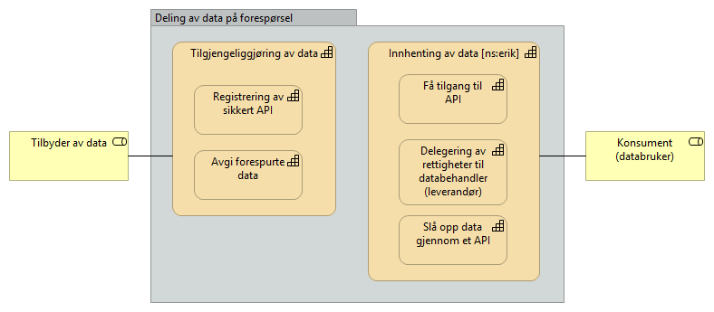

[cols ="1,1,3", options="header"]
.Elementer i figur for deling av data på forespørsel
|===
|Element
|Elementtype
|Beskrivelse

|Tilbyder av data
|Rolle
|Den part som besitter informasjon som kan deles.

|Konsument (databruker)
|Rolle
|Den part som i en egen virksomhetsprosess har behov for informasjon fra en annen part.

|Tilgjengeliggjøring av data
|Kapabilitet
|Evnen til å gjøre data tilgjengelig for aktører utenfor egen virksomhet.

|Registerering av sikkert API
|Sub-kapabilitet
|Del av "tilgjengeliggjøreing av data". Evnen til å registrere eget API i fellestjenester så det blir tilgjengelig for andre aktører.

|Avgi forespurte data
|Sub-kapabilitet
|Del av "tilgjengeliggjøreing av data". Evene til å avgi data på forespørsel gjennom et egnet API. Kan omfatte tilgangsstyring.

|Innhenting av data
|Kapabilitet
|Evenen til å hente tilbydte data fra annen aktør.

|Få tilgang til API
|Sub-kapabilitet
|Evnen til å få tilgang til tilbydte data fra annen aktør. 

|Delegering av rettigheter til databehandler
|Sub-kapabilitet
|Evnen til å delegere rettigheter til databehandler som utfører oppgaver på vegne av behandlingsansvarlig

|Slå opp data gjennom et API
|Sub-kapabilitet
|Evnen til å slå opp og hente data gjennom et eksternt API.

|===

//== Detaljerte beskrivelser 

== Arkitekturmønstre (konseptuelle beskrivelser, kun arkitekturbyggeklosser)

=== Hvordan lese modellene

I dette kapittelet beskrives kapabilitetene som inngår i eOppslag. Dette er gjort tekstlig og ved hjelp av modeller. Modellene består av tre nivåer. 

* I midten er det spesifisert noen prosessteg som realiserer kapabiliteten. Det vil si at kan du gjennomføre prosesstegene innehar du evnen kapabiliten beskriver.

* Nederst i figuren er det beskrevet de fellestjenestene og elementene som støtter prosessene.

* Øverst i figurene er det en knytning til hvilken kapabilitet dette er en del av, rollen som utfører prosesstegene og eventuelle andre avhengigheter som må på plass for å kunne gjennomføre prosessene, f.eks. inngå bilaterale avtaler.

De grunnleggende elementene i modellene foklares i denne figuren:

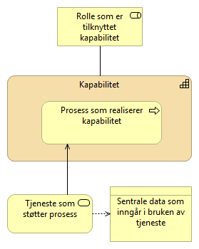

=== Klargjøring for _deling av data på forespørsel_

Beskrivelse av kapabilitetene som inngår i å klargjøre for deling av data på forespørsel. Dette er prosessene som må til for å registrere og sette opp tilganger både fra tilbyder og konsument sin side. 

==== Registrering av API

Registrering av API gjøres av tilbyder av data og er det tilbyder må gjennomføre for å gjøre et API synlig og tilgjengelig gjennom fellesløsninger. Registrering av konsumenters rettigheter og tilganger inngå også som et prosessteg. Dersom det er registrering av et åpent API er det kun relevante prossessteg som utføres.

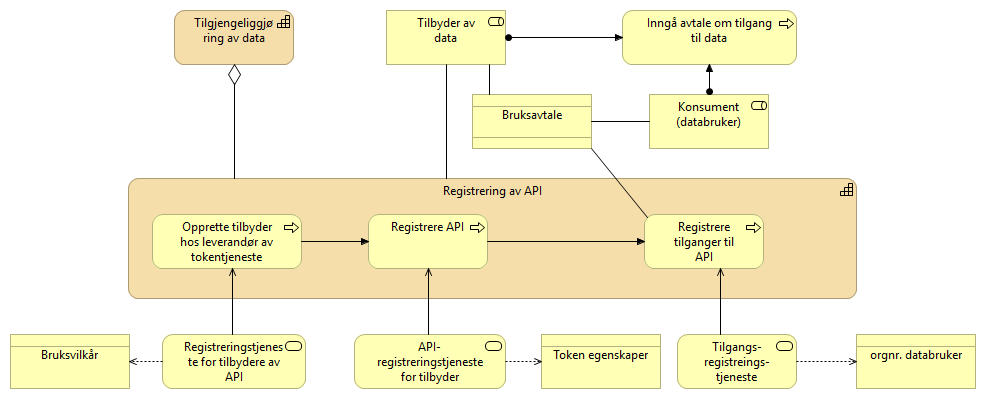

[cols ="1,1,3", options="header"]
.Elementer i figur for registrering av API
|===
|Element
|Elementtype
|Beskrivelse

|Inngå avtale om tilgang til data
|Prosess
|Prosess for å inngå avtale om tilgang og bruk av data.

|Bruksavtale
|Kontrakt
|Avtale eller kontrakt om tilgang til og bruk av data. Dette kan for eksempel være en bilateralt utformet avtale, aksept av generelle bruksvilkår, eller lisens for bruken av åpne data.

|Opprette tilbyder hos leverandør av tokentjeneste
|Prosess
|Prosess for tilbyder å opprettes som bruker av fellesløsning for tilgangsstyring.

|Registrere API
|Prosess
|Prosess for tilbyder å registrere API i nasjonale fellesløsninger så det blir letter tilgjengelig for konsumenter.

|Registrere tilganger til API
|Prosess
|Prosess for å registrere tilganger til de virksomheter som har et gyldig behandlingsgrunnlag og som har inngått avtale om tilgang til data.

|Bruksvilkår
|Forretningsobjekt
|Bruksvilkår for bruk av fellestjeneste for autentisering og autorisasjon.

|Registreringstjeneste for tilbyder av API
|Forretningstjeneste
|Tjeneste for tilbyder å registrere seg som brukersted for felles tokentjeneste for autentisering og autorisasjon.

|API-registreringstjeneste for tilbyder
|Forretningstjeneste
|Tjeneste for å registerer de APIene man ønsker å tilby til konsumenter og egenskaper ved disse.

|Token egenskaper
|Forretningsobjekt
|Egenskaper  ved token, f.eks. granulariteten på tilganger.

|Tilgangsregistreringstjeneste
|Forretningstjeneste
|Tjeneste for å registrere de virksomhetene som skal få tilgang til APIer og hvilket tilgangsnivå de skal ha.

|Orgnr. databruker
|Forretningsobjekt
|Organisasjonsnummeret til den som har avtale om å få tilgang til data.

|===

==== Få tilgang til API
Få tilgang til API er det en konsument av data må gjøre for å få tilgang til data gjennom et API. Det omfatter å få kjennskap til APIet, inngå avtaler om bruk av data og fellesløsninger, og registrere den teknsike komponenten som skal utføre tjenestekallet. Dersom det er tilgang til et åpent API er det kun relevante prossessteg som utføres.

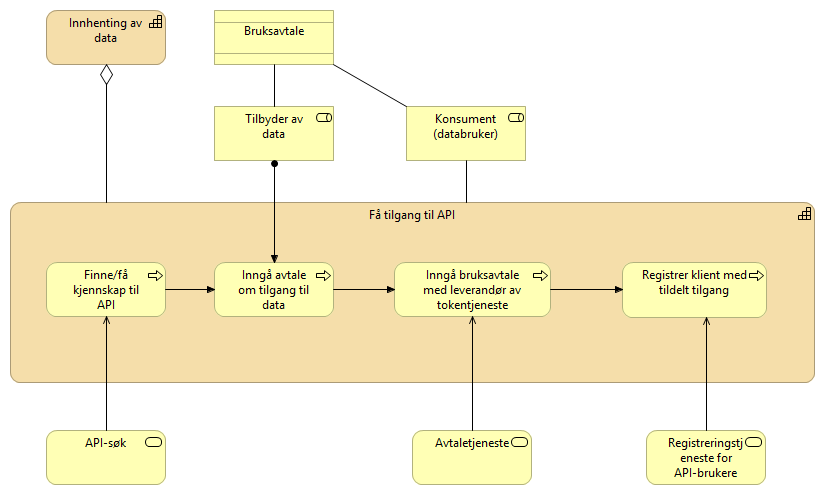

[cols ="1,1,3", options="header"]
.Elementer i figur for å få tilgang til API
|===
|Element
|Elementtype
|Beskrivelse

|Bruksavtale
|Kontrakt
|Se over

|Finne/få kjennskap til API
|Forretningsprosess
|Prosessen med å finne eller få kjennskap til tilgjengelige APIer. Benytter tjeneste for å søke i fellesløsninger.

|Inngå avtale om tilgang til data
|Forretningsprosess
|Konsumenten sin porsess med å inngå eventuell avtale med tilbyder om tilgang til data.

|Inngå bruksavtale med leverandør av tokentjenester
|Forretningsprosess
|Prosessen med å inngå bruksavtale for å benytte fellesløsning for tilgangstyring når man skal benytte APIer som er sikret ved bruk av fellesløsninger.

|Registrer klient med tildelt tilgang
|Forretningsprosess
|Prosess for konsument å registerere (provisjonering av) den klienten som skal ha tilgang til APIet. Dette forutsetter at tilbyder har gitt konsument tilgang. Dersom det er en leverandør som har blitt delegert rettigheter som databehandler på vegne av konsument er det leverandøren som registrer sin klient. 

|API-søk
|Forretningstjeneste
|Tjeneste for å søke etter og finne tilgejgnelig APIer. 

|Avtaletjeneste
|Forretningstjeneste
|Tjenste for å inngå avtale om bruk av en fellesløsning.

|Registreringstjeneste for API-bruker
|Forretningstjeneste
|Tjeneste for å registere brukere av tokentjeneste

|===

==== Delegering av rettigheter til databehandler
Delegering av rettigheter til databehandler er det en konsument må gjøre for at en leverandør kan identifisere seg med sitt eget virksomhetssertifikat og opptre på vegne av konsumenten som er den som innehar behandlingsgrunnlaget for å innhente data.

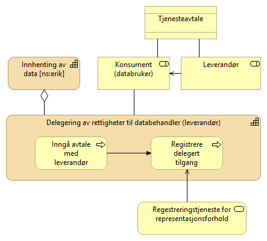

[cols ="1,1,3", options="header"]
.Elementer i figur for delegering av rettigheter til databehandler
|===
|Element
|Elementtype
|Beskrivelse

|Tjenesteavtale
|Kontrakt
|Avtale mellom leverandør og konsument som er grunnlaget for å kunne delegere rettigheter fra konsument til en leverandør

|Leverandør
|Rolle
|En part som leverer tjenester eller utfører oppgaver på vegne av en annen part.

|Inngå avtale med leverandør
|Prosess
|Prosessen med å inngå en avtale med leverandør. En slik avtale vil normalt være inngått tidligere og uavhengig av om man skal ta i bruk et nytt API.  En tjenesteavtale med leverandør er en forutsetning forutsetning for å kunne delegere en tilgang.

|Registrere delegert tilgang
|Prosess
|Prosessen med å delegere tilganger. I tilknytning til eOppslag vil formålet være å gi leverandør tilgang til å representere konsument overfor et API, men registreringen vil potensielt også kunne gjelde for andre områder.

|Registreringstjeneste for representasjons-forhold
|Forretningstjeneste
|Tjeneste for å registerer representasjonsforhold. I dette tilfellet delegering av rettigheter til å benytte et API på vegne av konsument.

|===

=== Operativ deling av data på forespørsel

Her beskrives prosessene som inngår i den faktiske delingen av data på forespørsel. Dette forutsetter at partene har gjennomført de riktige stegene for å klargjøre for deling av data.

==== Slå opp data gjennom et API
Slå opp data gjennom et API er det en konsument må gjøre når det utføres et tjenestekall for å innhente data gjennom et API. Dersom det er et åpent API er det kun relevante prossessteg som utføres.

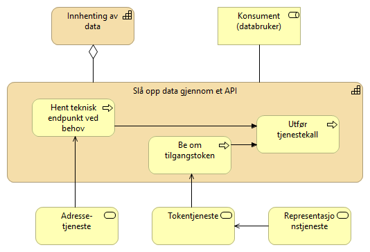

[cols ="1,1,3", options="header"]
.Elementer i figur for å slå opp data
|===
|Element
|Elementtype
|Beskrivelse

|Hent teknisk adresse
|Forretningsprosess
|Prosessen å slå opp den tekniske adressen til et API før spørring mot APIet. Gjøres kun dersom det er nødvendig.

|Be om tilgangstoken
|Forretningsprosess
|Prosessen med å benytte en tokentjeneste for hente et tilgangstoken som gir tilgang til et API. Dette forutsetter at alt er registert og satt opp riktig mot de aktuelle tjenestene.

|Utfør tjenestekall
|Forretningsprosess
|Prosessen med å benytte (gjøre et oppslag mot) et eksternt API

|Adressetjeneste
|Forretningstjeneste
|Tjeneste som gir mulighet til å slå opp teknisk endepunkt.

|Tokentjeneste
|Forretningstjeneste
|Tjeneste som utsteder tilgangstoken.

|Representasjonstjeneste
|Forretningstjeneste
|Tjeneste som gir oversikt over representasjonsforhold. Benyttes av tokentjeneste dersom en leverandør skal få tilgang på vegne av en konsument
|===

==== Avgi forespurte data
Avgi forespurte data er det tilbyder av data må gjøre for å svare på en forespørsel. Prosessen kontrollere tilgang gjøres kun dersom det er enakk om å avgi data gjennom et sikret API.

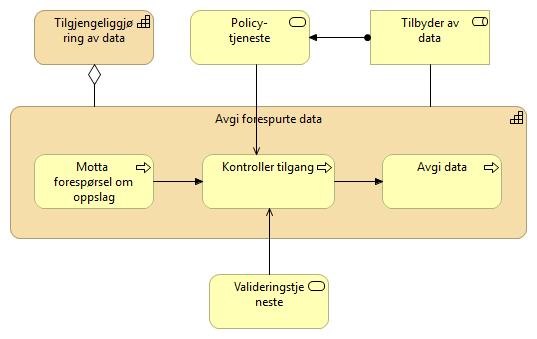

[cols ="1,1,3", options="header"]
.Elementer i figur for å avgi forespurte data
|===
|Element
|Elementtype
|Beskrivelse

|Policytjeneste
|Forretningstjeneste
|Intern tjeneste hos tilbyder for å håndheve tilgangsnivåpolicy ved tilgangsstyring.

|Motta forespørsel om oppslag
|Forretningsprosess
|Prosess med å motta forespørsler om å utlevere data fra API-konsument.

|Kontroller tilgang
|Forretningsprosess
|Prosessen med å kontrollere om konsumenten har rettigheter til å få de forespurte data.

|Avgi data
|Forretningsprosess
|Prosessen med å gi svar på forespørselen.

|Verifiseringstjeneste
|Forretningstjeneste
|Tjeneste for å verifisere gyldigheten av tilgangstokenet. Med et gyldig tilgangstoken skal det ikke være nødvendig å validere grunnlaget eller innholdet i tilgangstokenet siden det er et tillitsforhold mellom partene.

|===

== Løsningsmønstre (logiske beskrivelser med arkitekturbyggeklosser og aktuelle løsningsbyggeklosser)

=== Oppsett for deling

Beskrivelsen under viser hvordan den generiske arkitekturen i det foregående kapittelet kan realiseres med løsningskomponentene Maskinporten, API-katalogen og Altinn-autorisasjon. Disse fellesløsningene leverer de tjenestene som er beskrevet på forretningsnivå over.

Det er ikke hensikten å låse referansearkitekturen til spesifikke løsninger, da ulike sektorer og aktører kan ha behov som ikke passer med den foreslåtte løsningen. For synkrone tjenestekall basert på REST og med sikring ved hjelp av OAUTH2 tokens, vil det være god støtte i å benytte de foreslåtte løsnigene. 

For enklere lesbarhet er modellene gjort enklest mulig og skal leses i henhold til følgende modell:

image:../nab_referanse_arkitekturer_eoppslag/media/forklaring_app_lag.png[alt="Bilde mangler", width=250]

// For å registrere API må man for i de respektive fellestjenestene ha rettigheter til dette på vegne av egen virksomhet. Dette tildeles iht. hvem som har rettigheter i enhetsregisteret og rettighetene må delegeres nedover i organisasjonen til den som skal gjennomføre registreringen. Dette foregår i Altinn.

//Henrik: få inn figur som viser dette?

==== Registrering av API

For å tilby data gjennom et API sikret med fellestjenester kan Maskinporten og API-katalogen benyttes.

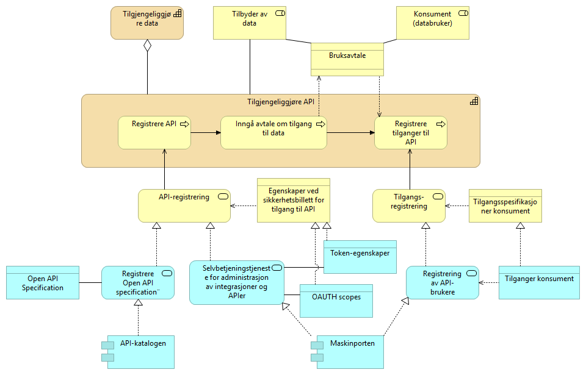

[cols ="1,1,3", options="header"]
.Elementer i figur for registrering av API
|===
|Element
|Elementtype
|Beskrivelse

|Selvbetjeningstjeneste for administrasjon og registering av APIer i Maskinporten
|Applikasjonstjeneste
|

|Registereringstjeneste for APIer til API-katalogen
|Applikasjonstjeneste
|

|Registrering av tilgang til API-konsumenter
|Applikasjonstjeneste
|

|Maskinporten
|Applikasjonskomponent
|

|API-katalogen
|
|

|===

==== Få tilgang til API

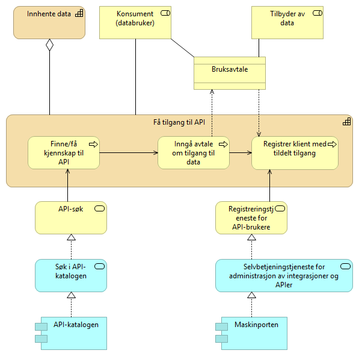

[cols ="1,1,3", options="header"]
.Elementer i figur for å få tilgang til API
|===
|Element
|Elementtype
|Beskrivelse

|Tjeneste for søk i API-katalogen
|Applikasjonstjeneste
|

|Selvbetjeneingstjeneste for administrasjon i Maskinporten
|Applikasjonstjeneste
|

|API-katalogen
|Applikasjonskomponent
|

|Leverandør av tokentjeneste for autentisering og autorisasjon
|Rolle
|

|Maskinporten
|Applikasjonskomponent
|

|===

==== Delegering av rettigheter til databehandler

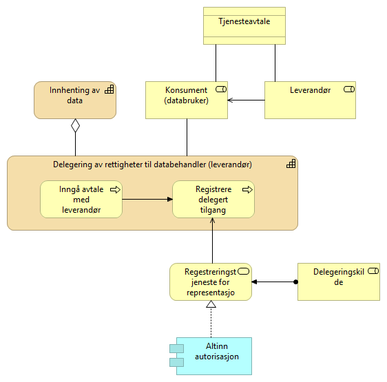

[cols ="1,1,3", options="header"]
.Elementer i figur for å få tilgang til API
|===
|Element
|Elementtype
|Beskrivelse

|Altinn autorisasjon
|Applikasjonskomponent
|

|===
=== Utveksling av data

==== Avgi forespurte data

Når tilbyder får en forspørsel om data som et API-kall og det ligger ved en sikkerhetsbillett beyttes valideringstjenesten til maskinporten for grov tilgangskontroll.

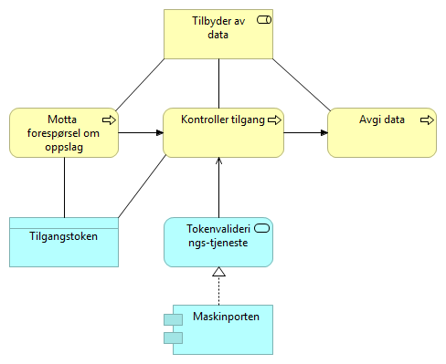

==== Slå opp data gjennom et API

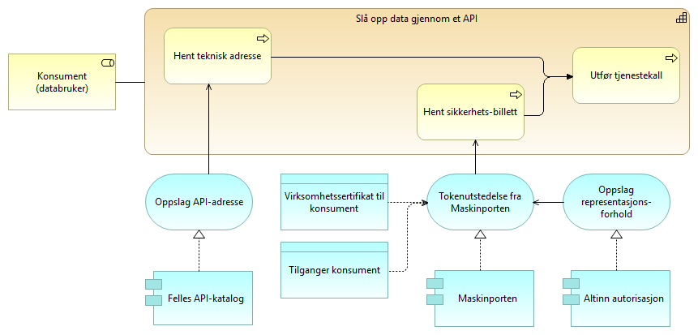

==== Videre detaljering av komponentene

API-katalogen er en del av Felles datakatalog som leveres av Brønnøysundregisterene. REgistreringsprosessen beskrives her:

https://fellesdatakatalog.brreg.no/about-registration

Maskinporten:

Altinn-autorisasjon:

