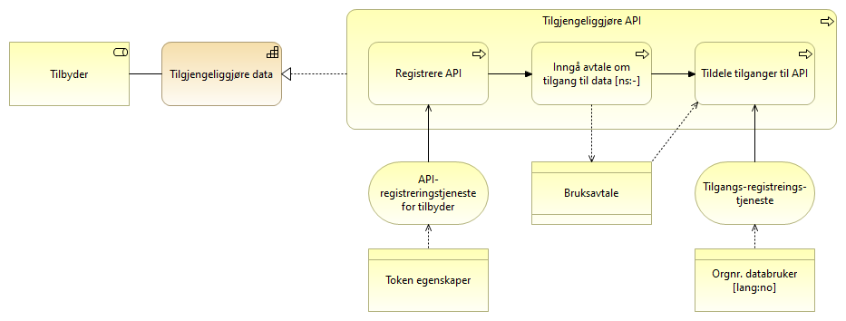
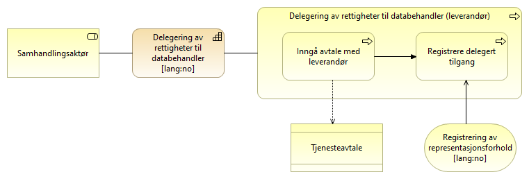
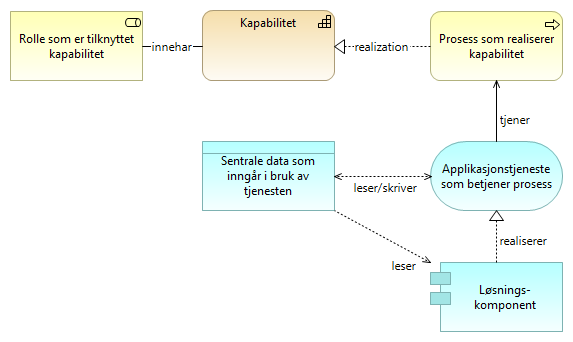
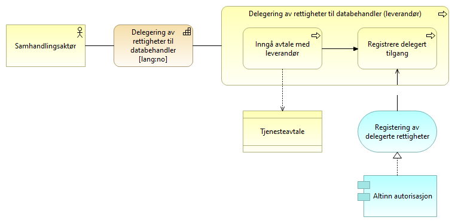

:lang: no
:doctitle: Referansearkitektur for eOppslag
:keywords: Referansearkitekturer

include::../plattform_felles/includes/commonincludes.adoc[]

:erik2:

== Om eOppslag

//Henrik: Legge inn (gjenta) beskrivelsen av kapabilitetesområdet "Deling av data på forespørsel" her, eller i dette avsnittet.

eOppslag er en referansearkitektur som adresserer en delmengde av kapabilitesområdet _deling av data på forespørsel_, nærmere bestemt gjennom synkront API-kall. Referansearkitekturen dekker både klargjøring og operativ datautveksling mellom tilbyder og konsument.

NOTE: Mer informasjon om kapabilitetskart og nedbrytingen av overordnede temaområder og kapabiliteter finnes under link:../nab_arkitekturlandskap[Nasjonalt arkitekturlandskap]. Her finnes _Deling av data på forespørsel_ som et eget område under området _Datautveksling_. 

//erik: forsøk å lenke direkte til riktig sted:  <../nab_arkitekturlandskap/book-arkitekturlandskap.adoc#Kapabilitetskart,kapabilitetskart>>.

Dette gjelder for både sikrede API-er hvor tilgangsstyring løses ved bruk av blant annet fellestjenester, og API-er som tilbyr åpent tilgjengelige data uten tilgangsbegrensninger. En stor del av beskrivelsene tar for seg oppsett og bruk av tjenester tilknyttet tilgangsstyring, men dette er ikke relevant for API-er som tilbyr åpent tilgjengelige data.

eOppslag som referansearkitektur adresserer generelt hvordan man kan dele data på forespørsel uavhengig av hva slags informasjon det gjelder, om det er strukturerte eller ustrukturerte data, og hva konsumenten skal bruke det til. En tilbyder av data og en konsument av data kan også være innenfor samme virksomhet selv om beskrivelsene i som oftest er skrevet med utgangspunkt i at det er forespørsel om data på tvers av virksomheter vil tilnærmingen også være aktuell å benytte for eksempel internt i egen virksomhet.

== Struktur på beskrivelsen
 
Det gis først en overordnet beskrivelse av kapabilitetene som inngår i eOppslag. Disse kapabilitetene beskrives videre i egne modeller som viser realiseringen i verdikjeder og prosesser. Det vises også til forretningstjenestene og noe av den sentrale informasjonen som benyttes i prosessene.

Modellene i beskrivelsene viser relasjonene mellom de ulike elementene, og elementene er forklart i tabellene under hver modell. Elementer som benyttes flere ganger, f.eks. rollen som tilbyder, forklares kun tilknyttet modellen på høyest nivå.

Det skilles mellom generiske arkitekturmønstre og  løsningsmønstre  der 

Modellene beskrives først som generiske arkitekturmønstre uten kobling til spesifikke løsninger. Det gis deretter en mer løsningsnære beskrivelser som inkluderer god praksis for bruk av fellesløsninger.

NOTE: #Det vil også publiseres# klikkbare Archimate-modeller under https://nasjonal-arkitektur.github.io/nab_modeller_html-hovedbibliotek/. De aktuele modellene skal kunne nås gjennom hyperlenking fra figurene her.

== Oversikt eOppslag

Modellen under viser de kapabilitetene en tilbyder og en konsument må ha for å dele data gjennom tilgangsstyrte API-er.

Tilbyder må kunne tilgjengeliggjøre data og dette er delt i to kapabiliteter hvor den ene, "Registrering av API" går ut på hvordan man registerer og setter opp tilganger. Den andre kapabiliteten "Avgi forespurte data" er det man gjøre når en konsument gjøre et kall mot det respektive API-et.

Tilsvarende er det tre detaljerte kapabiliteter tilknyttet konsument og det å innhente data. "Få tilgang til API" består av prosesser for oppsett av tilgang, "Delegering av rettigheter til databehandler" må gjøres dersom konsument benytter seg av en databehandler og "Slå opp data gjennom synkront API" er det konsumenten må gjøre hver gang det gjøres et oppslag.

I de detaljerte beskrivelsene i kapitlene under er kapabilitetene delt i to grupper hvor den første er de kapabilitetene som inngår i å klargjøre for deling av data på forespørsel. Det er prosessene som må til for å tilgjengeliggjøre API-er, klienter og å sette opp tilganger både fra tilbyder og konsument sin side. Den andre grupperer de prosessene som inngår i den faktiske delingen av data på forespørsel. 

image:../nab_referanse_arkitekturer_eoppslag/media/Deling på forespørsel.png[alt="Bilde mangler", width=750,link=https://nasjonal-arkitektur.github.io/nab_modeller_html-hovedbibliotek/e7e6c527-26f4-461c-b4dd-651fcbe85c8d/views/4b722aae-1323-46b0-bcac-e730d418b190.html]

[cols ="1,1,3", options="header"]
.Elementer i figur for deling av data på forespørsel
|===
|Element
|Elementtype
|Beskrivelse

|Tilbyder av data
|Rolle
|Den part som besitter informasjon som kan deles.

|Konsument (databruker)
|Rolle
|Den part som bruker informasjon fra en annen part.

//erik: er det viktig at det er i en egen virksomhetsprosess? VI BØR HA SEPARAT BESKRIVELSE AV hvordan disse referansearkitekturene inngår i samhandlingsprosesser  

|Tilgjengeliggjøre data
|Kapabilitet
|Evnen til å gjøre data tilgjengelig for aktører utenfor egen virksomhet.

//erik: endret navn til "tilgjengeliggjøre data"
// erik: må det være utenfor egen virksomhet? har vi sagt eksplisitt at dette gjelder for denne referansearkitekturen? Skal vi åpne for at det kan være innenfor samme virksomhet, men si noe mer ekplisitt om behovet for avtaler og infosikkerhet? 

|Tilgjengeliggjøre API
|Kapabilitet
ifndef::erik2[]
|Del av "tilgjengeliggjøre data". Evnen til å registrere eget API i fellestjenester så det blir tilgjengelig for andre aktører.
endif::erik2[]
ifdef::erik2[]
|Publisere informasjon om API i kataloger eller søkeløsninger, slik at det blir enkelt å finne fram til for aktuelle konsumenter. Videre inngå bruksavtaler og sette opp tilg
endif::erik2[]

// erik: "registrere eget API fellestjenester"??
// erik: hvorfor være eksplisitt om realiseringen av kapabiliteten her?

|Avgi forespurte data
|Kapabilitet
|Del av "tilgjengeliggjøreing av data". Evne til å avgi data på forespørsel gjennom et egnet API. Kan omfatte tilgangsstyring.

//erik: Om det kun dreier seg om å avgi data gjennom API, bør ordet "API" være med i navnet?

|Innhenting av data
|Kapabilitet
|Evnen til å hente tilbudte data fra annen aktør.

|Få tilgang til API
|Kapabilitet
|Evnen til å få tilgang til tilbudte data fra annen aktør. 

//erik: "evnen til å få tilgang" høres rart ut, bare...

|Delegering av rettigheter til databehandler
|Kapabilitet
|Evnen til å delegere rettigheter til databehandler som utfører oppgaver på vegne av behandlingsansvarlig

|Slå opp data gjennom et API
|Kapabilitet
|Evnen til å slå opp og hente data gjennom et API.

|===

//== Detaljerte beskrivelser 

== Arkitekturmønstre (konseptuelle beskrivelser, kun arkitekturbyggeklosser)

I dette kapittelet beskrives kapabilitetene som inngår i eOppslag. De er detaljert ved prosessteg som realiserer kapabiliteten. Det vil si at kan du gjennomføre prosesstegene innehar du evnen kapabiliteten beskriver. Det er også identifisert hvilke generiske fellestjenester det er behov for å ha for å støtte prosesstegene. 

Beskrivelsene er forsøkt å holde helt generisk uten å peke til noen løsning og det vil dermed kunne være flere måter å realisere de ulike elementene på.

=== Hvordan lese modellene
Modellene viser hvilke roller som innehar den respektive kapabiliten og er involvert i prosessene. Prosessene realiserer kapabiliteten og tjenester med tilhørende sentrale informasjonselementer støtter opp om prosessene.

De grunnleggende elementene i modellene foklares i denne figuren:

image:../nab_referanse_arkitekturer_eoppslag/media/Forklaring prosess.png[alt="Bilde mangler", width=350]

// erik: her kunne jeg tenkt meg å skrive noe mer... kan være en/mange osv...

=== Klargjøring for _deling av data på forespørsel_

==== Tilgjengeliggjøre API

Tilgjengeliggjøring av API gjøres av tilbyder av data og er det tilbyder må gjennomføre for å gjøre et API synlig og tilgjengelig gjennom fellesløsninger. Registrering av konsumenters rettigheter og tilganger inngår også som et prosessteg. Dersom det er registrering av et åpent API, er det kun relevante prossessteg som utføres.

[cols ="1,1,3", options="header"]
.Elementer i figur for registrering av API
|===
|Element
|Elementtype
|Beskrivelse

|Tilbyder av data
|Rolle
|Se over

|Konsument (databruker)
|Rolle
|Se over

|Bruksavtale
|Kontrakt
|Avtale eller kontrakt om tilgang til og bruk av data. Dette kan for eksempel være en bilateralt utformet avtale, aksept av generelle bruksvilkår, eller lisens for bruken av åpne data.

// erik: grammatikk
// dropp "eller kontrakt"?
// dropp "og bruk"???

|Registrere API
|Prosess
|Prosess for tilbyder å registrere API i nasjonale fellesløsninger så det blir lettere tilgjengelig for konsumenter. Forutsetter at tilbyder har inngått avtale eller godtatt bruksvilkår for bruk av de nasjonale fellesløsningene.

// erik: registerere APIi nasjonale fellesløsninger? Henrik: finne et annet begrep
// erik:dette forutsetter vel ingenting om konsumenten, dvs. droppp siste setning? Henrik: endret tekst, skulle være tilbyder.

|Inngå avtale om tilgang til data
|Prosess
|Prosess for å inngå avtale om tilgang og bruk av data.

|Registrere tilganger til API
|Prosess
|Prosess for å registrere tilganger til de virksomheter som har et gyldig behandlingsgrunnlag og som har inngått avtale om tilgang til data.

|API-registrering
|Forretningstjeneste
|Tjeneste for å registerer de API-ene man ønsker å tilby til konsumenter og egenskaper ved disse.

|Egenskaper ved sikkerhetsbillett for tilgang til API
|Forretningsobjekt
|Egenskaper  ved sikkerhetsbillett, f.eks. granulariteten på tilganger.

|Tilgangsregistrering
|Forretningstjeneste
|Tjeneste for å registrere de virksomhetene som skal få tilgang til API-er og hvilket tilgangsnivå de skal ha.

|Tilgangsspesifikasjoner konsument
|Forretningsobjekt
|Beskrivelse av de tilganger en konsument skal ha til et spesifikt API.

|===

==== Få tilgang til API
Få tilgang til API er det en konsument av data må gjøre for å få tilgang til data gjennom et API. Det omfatter å få kjennskap til API-et, inngå avtale om bruk av data, og registrere den tekniske komponenten som skal utføre tjenestekallet. Dersom det er tilgang til et åpent API er det kun relevante prossessteg som utføres.

////
erik, forslag til ny tekst :

_Få tilgang til API_ er det en konsument av data må gjøre for å få tilgang til data gjennom et API. Det omfatter å få kjennskap til aktuelt API, inngå avtale om bruk av data, samt å registrere den tekniske komponenten som skal utføre tjenestekallet. Dersom det dreier seg om tilgang til et _åpent tilgjengelig_ API, kan enkelte delaktiviteter i prosessene hoppes over.
////

image:../nab_referanse_arkitekturer_eoppslag/media/få tilgang til API.png[alt="Bilde mangler", width=750]

[cols ="1,1,3", options="header"]
.Elementer i figur for å få tilgang til API
|===
|Element
|Elementtype
|Beskrivelse

|Tilbyder av data
|Rolle
|Se over

|Konsument (databruker)
|Rolle
|Se over

|Bruksavtale
|Kontrakt
|Se over

|Finne/få kjennskap til API
|Forretningsprosess
|Prosessen med å finne eller få kjennskap til tilgjengelige API-er. Benytter tjeneste for å søke i fellesløsninger.

|Inngå avtale om tilgang til data
|Forretningsprosess
|Konsumenten sin porsess med å inngå eventuell avtale med tilbyder om tilgang til data.

|Registrer klient med tildelt tilgang
|Forretningsprosess
|Prosess for konsument å registerere (provisjonering av) den klienten som skal ha tilgang til API-et ved bruk av sikkerhetsbillett. Dette forutsetter at konsumenten har avtale om bruk av sikkerhetsbillettjenesten og at tilbyder har gitt konsumenten tilgang. 

Dersom det er en leverandør som har blitt delegert rettigheter som databehandler på vegne av konsument er det leverandøren som registrer sin klient. 

|API-søk
|Forretningstjeneste
|Tjeneste for å søke etter og finne tilgjengelige API-er. 

|Registreringstjeneste for API-bruker
|Forretningstjeneste
|Tjeneste for å registere brukere av tokentjeneste

|===

==== Delegering av rettigheter til databehandler
Delegering av rettigheter til databehandler er det en konsument må gjøre for at en leverandør kan identifisere seg med sitt eget virksomhetssertifikat og opptre på vegne av konsumenten som er den som innehar behandlingsgrunnlaget for å innhente data.

[cols ="1,1,3", options="header"]
.Elementer i figur for delegering av rettigheter til databehandler
|===
|Element
|Elementtype
|Beskrivelse

|Tjenesteavtale
|Kontrakt
|Avtale mellom leverandør og konsument som er grunnlaget for å kunne delegere rettigheter fra konsument til en leverandør

|Konsument (databruker)
|Rolle
|Se over

|Leverandør
|Rolle
|En part som leverer tjenester eller utfører oppgaver på vegne av en annen part.

|Inngå avtale med leverandør
|Prosess
|Prosessen med å inngå en avtale med leverandør. En slik avtale vil normalt være inngått tidligere og uavhengig av om man skal ta i bruk et nytt API.  En tjenesteavtale med leverandør er en forutsetning forutsetning for å kunne delegere en tilgang.

|Registrere delegert tilgang
|Prosess
|Prosessen med å delegere tilganger. I tilknytning til eOppslag vil formålet være å gi leverandør tilgang til å representere konsument overfor et API, men registreringen vil potensielt også kunne gjelde for andre områder.

|Registreringstjeneste for representasjonsforhold
|Forretningstjeneste
|Tjeneste for å registerer representasjonsforhold. I dette tilfellet delegering av rettigheter til å benytte et API på vegne av konsument.

|===

=== Operativ deling av data på forespørsel

==== Slå opp data gjennom et API
Slå opp data gjennom et API er det en konsument må gjøre når det utføres et tjenestekall for å innhente data gjennom et API. Dersom det er et åpent API er det kun relevante prossessteg som utføres.

image:../nab_referanse_arkitekturer_eoppslag/media/slå opp data.png[alt="Bilde mangler", width=500]

[cols ="1,1,3", options="header"]
.Elementer i figur for å slå opp data
|===
|Element
|Elementtype
|Beskrivelse

|Konsument (databruker)
|Rolle
|Se over

|Hent teknisk adresse
|Forretningsprosess
|Prosessen å slå opp den tekniske adressen til et API før spørring mot API-et. Gjøres kun dersom det er nødvendig.

|Hent sikkerhetsbillett
|Forretningsprosess
|Prosessen med å benytte en sikkerhetsbillettjeneste for hente en sikkerhetsbillett som gir tilgang til et API. Dette forutsetter at alt er registert og satt opp riktig mot de aktuelle tjenestene.

|Utfør tjenestekall
|Forretningsprosess
|Prosessen med å benytte (gjøre et oppslag mot) et eksternt API

|Adressetjeneste
|Forretningstjeneste
|Tjeneste som gir mulighet til å slå opp teknisk endepunkt.

|Utstedelse av sikkerhetsbillett
|Forretningstjeneste
|Tjeneste som utsteder sikkerhetsbilletter.

|Tjeneste for informasjon om representasjonsforhold
|Forretningstjeneste
|Tjeneste som gir oversikt over representasjonsforhold. Benyttes av tokentjeneste dersom en leverandør skal få tilgang på vegne av en konsument
|===

==== Avgi forespurte data
Avgi forespurte data er det tilbyder av data må gjøre for å svare på en forespørsel. Prosessen kontrollere tilgang gjøres kun dersom det er enakk om å avgi data gjennom et sikret API.

image:../nab_referanse_arkitekturer_eoppslag/media/avgi data.png[alt="Bilde mangler", width=500]

[cols ="1,1,3", options="header"]
.Elementer i figur for å avgi forespurte data
|===
|Element
|Elementtype
|Beskrivelse

|Tilbyder av data
|Rolle
|Se over

|Intern tilgangskontroll
|Forretningstjeneste
|Intern tjeneste hos tilbyder for å håndheve tilgangsnivåpolicy ved tilgangskontroll.

//erik: tilgangsnivåpolicy????

|Motta forespørsel om oppslag
|Forretningsprosess
|Prosess med å motta forespørsler fra API-konsument om å utlevere data.

|Kontroller tilgang
|Forretningsprosess
|Prosessen med å kontrollere om konsumenten har rettigheter til å få de forespurte data.

|Avgi data
|Forretningsprosess
|Prosessen med å gi svar på forespørselen.

|Validering av sikkerhetsbillett
|Forretningstjeneste
|Tjeneste for å validere gyldigheten av sikkerhetsbilletten. Med en gyldig sikkerhetsbillett skal det ikke være nødvendig å validere grunnlaget eller innholdet i sikkerhetsbilletten siden det er et tillitsforhold mellom partene.

|===

== Løsningsmønstre (logiske beskrivelser med arkitekturbyggeklosser og aktuelle løsningsbyggeklosser)

Beskrivelsen under viser hvordan den generiske arkitekturen i det foregående kapittelet kan realiseres med løsningskomponentene Maskinporten, API-katalogen og Altinn-autorisasjon. Disse fellesløsningene leverer de tjenestene som er beskrevet på forretningsnivå over.

Det er ikke hensikten å låse referansearkitekturen til spesifikke løsninger, da ulike sektorer og aktører kan ha behov som ikke passer med det som er beskrevet. For synkrone tjenestekall basert på REST og med tilgangsstyring ved hjelp av OAUTH2-tokens, vil det være god støtte i å benytte de foreslåtte løsningene. 

=== Hvordan lese modellene

For enklere lesbarhet er laget med forretningstjenester utelatt fra modellene og mer løsningsnære applikasjonstjenester er benyttet direkte inn mot forretningsprosessene. Modellene viser dermed hvordan fellesløsninger i form av applikasjonskomponenter støtter de ulike forretningsprosessene gjennom applikasjonstjenester.

De grunnleggende elementene i modellene foklares i denne figuren:

// For å registrere API må man for i de respektive fellestjenestene ha rettigheter til dette på vegne av egen virksomhet. Dette tildeles iht. hvem som har rettigheter i enhetsregisteret og rettighetene må delegeres nedover i organisasjonen til den som skal gjennomføre registreringen. Dette foregår i Altinn.

//Henrik: få inn figur som viser dette?

=== Klargjøring for _deling avdata på forespørsel_

==== Tilgjengeliggjøre API

For å tilby data gjennom et API sikret med fellestjenester må tilbyder inngå avtale for bruk av Maskinporten og API-katalogen (Felles datakatalog). De respektive API-ene og hvem som skal ha hvilke rettighetene til disse må så registreres i løsningene.

image:../nab_referanse_arkitekturer_eoppslag/media/registerer_api_app_lag.png[alt="Bilde mangler", width=750]

[cols ="1,1,3", options="header"]
.Elementer i figur for registrering av API
|===
|Element
|Elementtype
|Beskrivelse

|Open API Specification
|Dataobjekt
|Maskinlesbar beskrivelse av REST API-er. Dette er formatet som benyttes for å registrere et API i felles API-katalog

|Tokenegenskaper
|Dataobjekt
|Egenskaper som f.eks. gyldighetstid ved tilgangstoken som er Maskinportens variant av sikkerhetsbillett.

|OAUTH scopes
|Dataobjekt
|Et scope kan best beskrives som en ressurs-definisjon og et token er som regel knyttet til ett eller flere scopes. Scopes benyttes til å styre tilganger til API-er og operasjoner og eventuelt hva slags responser man får fra API-et.

|Tilganger konsument
|Dataobjekt
|Beskrivelse av de tilgangene, dvs. hvilke scopes en gitt konsument skal ha til et API.

|Registrere Open API Specification
|Applikasjonstjeneste
|Tjeneste i API-katalogen for å registrere API. Bruk av tjenesten forutsetter at man har de fått tildelt rettigheter til å gjøre dette på vegne av tilbyders virksomhet.

|Selvbetjeningstjeneste for administrasjon og registering av API-er i Maskinporten
|Applikasjonstjeneste
|Tjeneste i API-katalogen for å registrere API. Bruk av tjenesten forutsetter at man har de fått tildelt rettigheter til å gjøre dette på vegne av tilbyders virksomhet.

|Selvbetjenesigstjeneste for administrasjon av integrasjoner og API-er
|Applikasjonstjeneste
|Tjeneste for gjennom selvbetjening å registrere og vedlikeholde API-definisjoner og scopes i Maskinporten.

|Registrering av API-brukere
|Applikasjonstjeneste
|Tjeneste for gjennom selvbetjening å registrere og vedlikeholde tilgangene konsumenter skal ha til API-er og scopes.

|API-katalogen
|Applikasjonskomponent
|Del av Felles datakatalog som gir mulighet for å søke etter API-er og lese API-spesifikasjoner
https://fellesdatakatalog.brreg.no/apis

|Maskinporten
|Applikasjonskomponent
|Fellesløsning for API-sikring ved bruk av OAUTH2-tokens.

|===

==== Få tilgang til API
For å få tilgang til et API sikret ved hjelp av fellesløsninger må konsumenten inngå avtale for bruk av Maskinporten og registrere den tekniske klienten som skal benytte løsningen.

image:../nab_referanse_arkitekturer_eoppslag/media/få_tilgang_app_lag.png[alt="Bilde mangler", width=500]

[cols ="1,1,3", options="header"]
.Elementer i figur for å få tilgang til API
|===
|Element
|Elementtype
|Beskrivelse

|Søk i API-katalogen
|Applikasjonstjeneste
|Tjeneste for å søke etter API-er som er registrert i felles API-katalog.

|Selvbetjeneingstjeneste for administrasjon i Maskinporten
|Applikasjonstjeneste
|Tjeneste for gjennom selvbetjening å registrere og vedlikeholde API-definisjoner og scopes i Maskinporten.

|API-katalogen
|Applikasjonskomponent
|Del av Felles datakatalog som gir mulighet for å søke etter API-er og lese API-spesifikasjoner
https://fellesdatakatalog.brreg.no/apis

|Maskinporten
|Applikasjonskomponent
|Fellesløsning for API-sikring ved bruk av OAUTH2-tokens.

|===

==== Delegering av rettigheter til databehandler
Dersom konsumenten benytter en leverandør som skal opptre på konsumentens vegne, må dette forholdet registereres gjennom Altinn autorisasjon slik at det blir tilgjengelig for Maskinporten å kontrollere representasjonsforholdet.

[cols ="1,1,3", options="header"]
.Elementer i figur delegering av rettigheter til leverandør
|===
|Element
|Elementtype
|Beskrivelse

|Registrering av delegerte tilganger
|Applikasjonstjeneste
|Tjeneste for å registrere et representasjonsforhold som gir leverandør mulighet til å opptre på vegne av konsument

|Altinn autorisasjon
|Applikasjonskomponent
|Autorisasjonskomponenten i Altinn som gir muligheter til å delegere rettigheter til andre organisasjoner eller personer. Rettigheter til bruk av autorisasjonskomponenten baserer seg på registrerte roller i Enhetsregisteret.

|===
=== Utveksling av data

==== Slå opp data gjennom et API

Når en konsumet skal slå opp data gjennom et API benyttes Maskinporten for å få utstedt en sikkerhetsbillett som legges ved tjenestekallet til tilbyders API. Maskinporten utsteder sikkerhetsbilletter som OAUTH2-tokens.

image:../nab_referanse_arkitekturer_eoppslag/media/slå_opp_app_lag.png[alt="Bilde mangler", width=500]

[cols ="1,1,3", options="header"]
.Elementer i figur slå opp data gjennom et API
|===
|Element
|Elementtype
|Beskrivelse

|Oppslag API-adresse
|Applikasjonstjeneste
|Oppslag på adresse (server-object) til et API i adressekatalogen.

|OAUTH2 tokentjeneste
|Applikasjonstjeneste
|Tjeneste som utsteder et OAUTH2-token basert på autentisering med virksomhetssertifikat og tidligere tildelte rettigheter.

|Oppslag representasjonsforhold
|Applikasjonstjeneste
|Tjeneste som benyttes av tokentjenesten for å kontrollere om det foreligger et delegert representasjonsforhold fra konsument til leverendør i autorisasjonstjenesten til Altinn.

|API-katalogen
|Applikasjonskomponent
|Del av Felles datakatalog som gir mulighet for å søke etter API-er og lese API-spesifikasjoner
https://fellesdatakatalog.brreg.no/apis

|Maskinporten
|Applikasjonskomponent
|Fellesløsning for API-sikring ved bruk av OAUTH2-tokens.

|Altinn autorisasjon
|Applikasjonskomponent
|Autorisasjonskomponenten i Altinn som gir muligheter til å delegere rettigheter til andre organisasjoner eller personer. Rettigheter til bruk av autorisasjonskomponenten baserer seg på registrerte roller i Enhetsregisteret.

|Virksomhetssertifikat til konsument
|Dataobjekt
|En virksomhets elektroniske ID. Benyttes for å autentisere virksomheten overfor tokentjenesten.

|Tilganger konsument
|Dataobjekt
|Oversikt over hvilke API og OAUTH-scopes en virksomhet (representert ved organisasjonsnummer) skal ha tilgang til (utstedt token for).

|===

==== Avgi forespurte data

Når tilbyder får en forspørsel om data som et API-kall og det ligger ved en sikkerhetsbillett benyttes valideringstjenesten til maskinporten for grov tilgangskontroll.

image:../nab_referanse_arkitekturer_eoppslag/media/avgi_data_app_lag.png[alt="Bilde mangler", width=500]

[cols ="1,1,3", options="header"]
.Elementer i figur avgi forespurte data
|===
|Element
|Elementtype
|Beskrivelse

|Tokenvalideringstjeneste
|Applikasjonstjeneste
|Tjeneste som benyttes av tilbyder for å validere og kontrollere autentisiteten til et OAUTH2 token fra Maskinporten.

|Maskinporten
|Applikasjonskomponent
|Fellesløsning for API-sikring ved bruk av OAUTH2-tokens.

|===

////
==== Videre detaljering av komponentene

API-katalogen er en del av Felles datakatalog som leveres av Brønnøysundregisterene. REgistreringsprosessen beskrives her:

https://fellesdatakatalog.brreg.no/about-registration

Maskinporten:
Maskinporten tilbyr offentlige etater en enkel måte å sikre sine API-er med virksomhetsautentisering og tilgangstyring.

https://difi.github.io/idporten-oidc-dokumentasjon/oidc_guide_maskinporten.html

Altinn-autorisasjon:
https://altinnett.brreg.no/no/Tjenester/Sikkerhet/Autorisasjon/
////

//// 
erik, annet som jeg kan gjøre: 

1. Få på plass Eriks "gamle" figurer av overordnede beskrivelser i riktig Archi-bibliotek (påbegynt)
2. Fikse symboler og størrelsen på bokser og  "transiente farger"(påbegynt)
3. Fikse navn vs. label med linebreak osv.
4. Publisere Archi-html  (gjort)

5. Legge til lenker fra asciidoc-figurene til de publiserte archi-figurene

6.Fixe opp i diverse layout-grums i modellene

7. Introduser egne service realization viewpoints per business service der detaljer om input/output og mapping til løsninger vises!!

småtteri  huskelap:
5. Rett opp fra default height 67 tli 70 i https://doc.difi.no/nasjonal-arkitektur/plattform_praktiske-tips/#_installer_og_konfigurer_archi 

////