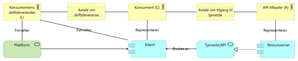

:lang: no
:author: Rolf Rander Næss
:email: rolf.rander.ness@acando.no
:doctitle: e-oppslag, modell for autorisering og delegering
:keywords: eOppslag sikkerhet autentisering

include::../plattform_felles/includes/commonincludes.adoc[]

== Innledning

=== Om dette dokumentet

Dette dokumentet er et saksfremlegg til arbeidet med referansearkitektur for «e-oppslag», tatt frem av en arbeidsgruppe bestående av:

•	Jørgen Binningsbø, Difi
•	Rolf Rander Næss, Acando AS, for BRREG
•	Øyvind Syrstad, Systek AS, for Skattedirektoratet

=== Mål og rammer

Dette dokumentet definerer en modell for å diskutere autentisering og autorisasjon i forbindelse med synkrone tjenestekall som implementerer system-til-system-kommunikasjon. Videre foreslås en rekke modeller for å implementere dette i en token-basert tjeneste som er tenkt å være felles på tvers av offentlig sektor. Det er antatt at dette vil implementeres som en utvidelse av dagens «maskin-porten» som tilbys av Difi, men modellen forutsetter ikke dette.
Modellen som diskuteres i dette dokumentet er ment å løse et felles behov hos offentlige virksomheter som skal utveksle informasjon med offentlige og private virksomheter gjennom tekniske grensesnitt, det er antatt at minst en av aktørene er en offentlig virksomhet.

==	Generell modell for tilgangsstyring

=== Overordnet modell
Figuren under er i «archimate»-notasjon og oppsummerer de aktører og komponenter som er relevante i diskusjonen av tilgangsstyring.

===	Aktører

En aktør er notert i archimate som en gul boks med en strekfigur. Vi diskuterte 4 ulike typer aktører, bokstavene i parentes er de vi brukte i figurene på tavla:

•	API-tilbyder (A): den part som tilbyr en tjeneste gjennom et API
•	Konsument (C): den part som skal bruke tjenesten og juridisk sett er mottaker
•	Konsumentens driftsleverandør (L): en separat organisasjon som konsumenten bruker til å forvalte deler av eller hele sin tekniske infrastruktur, samt som i større eller mindre grad er integrert i konsumentens forretningsprosesser.

Modellen sier ikke direkte noe om databehandler eller behandlingsansvarlig, men typisk vil konsument (C) være behandlingsansvarlig for data den henter gjennom API-et. Dersom konsumenten bruker en driftsleverandør (L) vil denne være databehandler. API-tilbyder vil være en databehandler, og kan også være behandlingsansvarlig.

=== Avtaler

En avtale i archimate-notasjon er en gul boks med to vannrette striper. Det er to avtaler involvert som er relevant:

•	Driftsavtale: Avtale mellom konsument (C) og driftsleverandør (L). Dersom L skal opptre på vegne av C (scenario 3 over) er det denne avtalen som delegerer myndighet fra C til L.
•	API-avtale: Avtale mellom tjenesteeier (A) og konsument (C). Dette er den avtalen som regulerer C sin tilgang på opplysninger/tjenester fra A. I vår sammenheng hvor C og/eller A er offentlige virksomheter vil denne avtalen typisk være strengt regulert i lov og forskrift.

===	Applikasjonstjenester og -komponenter

Alle begrep på applikasjonslaget er turkis i archimate-notasjonen. Bokser med runde hjørner er tjenester/API, bokser med to «kontakter» til venstre er komponenter.

•	Klient: dette er omtrent det samme som «client» i OAuth, altså den komponenten som ønsker tilgang til en ressurs
•	Ressursserver: Applikasjon som implementerer tjeneste, det samme som «resource server» i OAuth.
•	Tjeneste/API: grensesnittet som realiseres av «resource server» og som brukes/konsummeres av «client»

Pilene betyr:

•	Åpen pil: «brukes av»
•	Trekant med stiplet linje: «realiserer»

===	Definisjoner og føringer for tilgangsstyringsmodellen

Noen generelle føringer og antagelser som ligger til grunn:

•	Ressursserver trenger vite hvem konsumenten (C) er
•	Konsument (C) kan velge å delegere myndighet til å kalle en eller flere spesifikke tjenester til driftsleverandør (L). Klienten vil autentiseres som enten C eller L. Kapittel 4.1 har konkrete eksempler på når klienten typisk vil velge det ene eller det andre.
•	Enten klienten autentiserer seg som konsument (C) eller driftsleverandør (L) er det C som er ansvarlig for bruken av tjenesten
•	Det er API-tilbyder (A) som bestemmer hvilke konsumenter (C) som får kalle tjenesten. Den juridiske delen av dette er avtalen mellom A og C, men den tekniske er en tilgangspolicy som sjekker at klienten opptrer som C.
•	I praksis vil vi ikke styre tilgang til en konkret tjeneste, men til «scope» (S). Hvilke «scope» som er relevante for et gitt API er en egenskap ved dette API-et, og dette er opp til API-tilbyder.

Avgrensninger, hva vi ikke dekker i denne modellen:

•	Krav til ulike sikkerhetsnivåer på autentiseringen.
•	Involvering av personer, verken system som opptrer på vegne av en person, eller en tjeneste som trenger et samtykke fra en person.

=== Modell

==== tilgangsstyring:

•	en API-tilbyder (A) gir en klient (C) rett til å kalle tjenester med et gitt scope (S)
•	tilgangsregelen er tupelet : (C, A, S)
•	dette reguleres av API-avtalen

==== delegering

•	en klient (C) gir en leverandør (L) rett til å kalle tjenester fra en gitt API-tilbyder (A) med et gitt scope (S)
•	delegeringen er tupelet: (C, A, S, L)
•	alternativt kan vi formulere delegering som ((C, A, S)  L), hvor strukturen til venstre for pilen er den som brukes som tilgangsstyring
•	dette reguleres av driftsavtalen

== Implementering

Tilgangsstyringen (C, A, S) skal styres av A via et API. Merk at A ikke er et orgno, så for at dette skal virke må vi også ha en mapping (orgno, A) som definerer hvilke A et gitt orgno får lov å styre
Delegeringen (C, A, S, L) skal kunne styres av:

•	C, via et GUI (Altinn er eneste realistiske alternativ for et slikt GUI)
•	Alternativt: L, via et API (for enkelte utvalgte L vi stoler på, som Eika, Sparebank1, Evry)

Disse attributtene kodes ned i et jwt-token som dette:

[options="header"]
|===============
|JWT-claim	|Attributt
|client_orgno|	C
|(ikke avklart)|	L
|Scope	|S (alternativt at scope er “A:S”)
|Aud	|A
|===============

For at dette skal henge sammen kreves også:

•	Kodeverk for A, knyttet sammen med organisasjonsnummer for hvem som får lov å forvalte hvilke A
•	Tilgjengelige S må være en del av den tekniske API-beskrivelsen

Punkter som ikke er endelig avklart:

•	hvordan skal tilgangsstyrings-tuplet og delegerings-tuplet implementeres?
  o	skal delegering referere til tilgangsstyring (altså ((C, A, S)  L): dette gir en mer normalisert og konsistent modell
  o	eller skal det være uavhengige tupler (altså (L, C, A, S)): dette gir bedre "separation of concerns", mulighet til å sette opp delegering før tilgangsstyring og mulighet til å implementere delegering og tilgangsstyring i forskjellige tjenester. Med denne modellen kan vi også implementere «wildcard-delegering», altså at (C, *, S, L) betyr «L kan kalle dette scope på vegne av C uavhengig av API-leverandør» og (C, A, *, L) betyr «L kan kalle alle scope hos API-leverandør på vegne av C».
•	og gitt at vi setter opp disse to som uavhengige tupler, skal vi:
  o	implementere begge deler i id-porten: dette får oss raskere til MVP, blir kanskje enklere å forvalte og sørger for at id-porten ikke har runtime-avhengigheter til andre komponenter
  o	implementere tilgangsstyringen i id-porten og delegeringen i altinn: dette er en "renere" løsning ved at delegering ligner på funksjonalitet altinn allerede har, GUI for delegering må uansett ligge i altinn og det legger til rette for en fremtidig "token exchange"-modell

Disse valgene er sannsynligvis ikke vesentlige for API-et som skal tilbys, og det vil være mulig å endre dette senere. Så for en MVP bør vi velge det som er enklest å implementere.

== Eksempler og scenarier

=== Eksempel på forhold mellom «L» og «C»

1.	Et selskap har kjøpt regnskapssystem av Visma og installerer dette på egen HW. Regnskapssystemet gjør et oppslag i BR på vegne av selskapet. I denne sammenhengen er «selskap=C» og det finnes ingen L. Regnskapssystemet autentiseres som C.
2.	Et selskap har kjøpt regnskapssystem av Visma og installerer dette i Azure. Her er «Selskap=C» og «Microsoft=L». Jeg tror dette innebærer at Microsoft er databehandler og må ha en databehandleravtale med Selskap. Men regnskapssystemet autentiseres fortsatt som C.
3.	Selskapet har ikke kjøpt en egen lisens på Visma, men kjører «visma-as-a-service», altså at regnskapssystemet er installert på Visma sin hardware i en delt løsning (samme installasjon betjener mange andre visma-kunder), men selskapet fører regnskapet sitt selv, Visma leverer bare software (as-a-service). Her er «selskap=C» og «visma=L». I denne sammenhengen er det et valg om regnskapssystemet autentiseres som Visma (L), eller om det har egne nøkler/sertifikat for hvert selskap og autentiserer som C, men jeg mener det riktige her er at regnskapssystemet autentiserer som Visma (L)
4.	Selskapet har ikke kjøpt programvare i det hele tatt, men leier Visma til å føre regnskapet for seg. Her er fortsatt «selskap=C» og «visma=L» men jeg mener det er helt åpenbart at her må regnskapssystemet autentiseres som Visma (L). Selskapet (C) har ingen befatning med programvaren.

=== Eksempel på tilgangsmatrise

Tilgangsmatrisen ser slik ut (med et par eksempler fylt ut):

[options="header"]
|===============
|Konsument C	|Driftsleverandør L	|Tjeneste| API	API-tilbyder
|Valle sparebank|	Eikagruppen|	Hente ligningsopplysninger	|Skattedirektoratet
|DNB		||Hente ligningsopplysninger	|Skattedirektoratet
|Bisnode||		Løsøreregisteret|	Brreg
|Skattedirektoratet	||	Kontoopplysninger|	BITS (for lille leikanger sparebank)
|Skattedirektoratet||		Kontoopplysninger	|Storbanken AS
|Leikanger kommune	|Visma Flyt barnehagesystem	|Ledige barnehageplasser|	Private barnehagers landsforbund (for Hermansverk barnehage AS)
|===============

I eksempelet er det formelt sett slik at:

•	Det er skattedirektoratet som kan bestemme at systemer hos hhv «valle sparebank» og «dnb» kan kalle «hente ligningsopplysninger»
•	Det er valle sparebank som kan bestemme at eikagruppen skal kunne kalle tjeneste-X på vegne av valle sparebank, men når eika sitt system autentiserer seg mot difi-maskinporten, blir systemet autentisert som «eikagruppen» (ikke «valle sparebank»)

Merk at dette gjelder bare hvem som har myndighet til å ta hvilke beslutninger, ikke hvor dette lagres, vedlikeholdes eller håndheves. Merk også at det kan være mer finkornede regler for tilgangsstyring internt i serveren enn hva som fremkommer i tabellen
