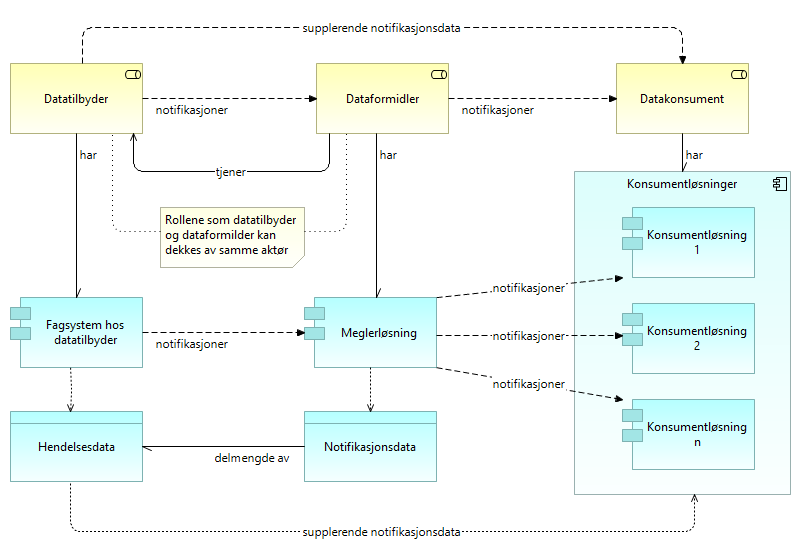
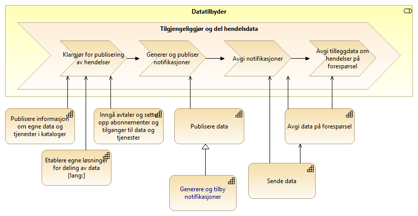
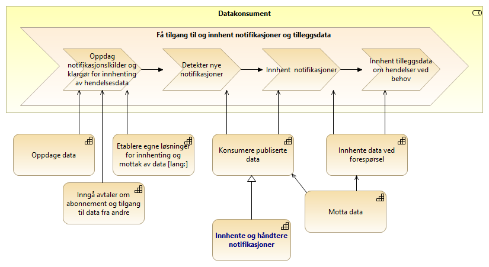
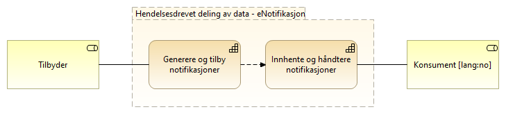
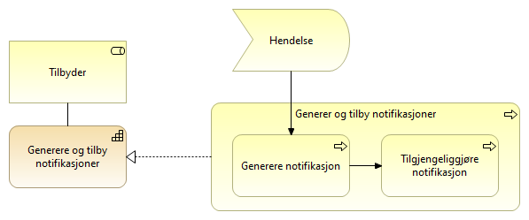
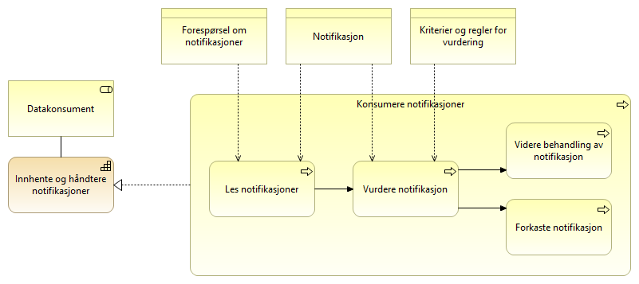
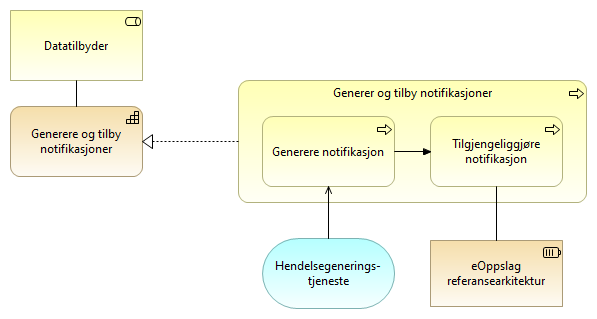
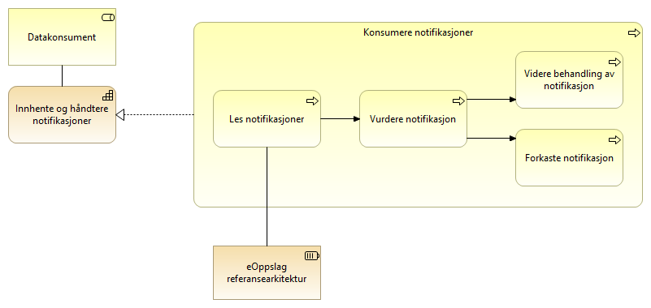

:lang: no
:doctitle: Referansearkitektur eNotifikasjon
:keywords: eNotifikasjon

include::../plattform_felles/includes/commonincludes.adoc[]

//[.lead]
//eNotifikasjon er en referansearkitektur for asynkron publisering av informasjon med løs kopling mellom tilbyder og konsument. 

//image:../plattform_felles/media/i-arbeid.png[width=45, height=45] _I arbeid (høst 2019)_

//== Introduksjon
//include::../nab_referanse_arkitekturer_enotifikasjon/ra-enotifikasjon-intro.adoc[]

== Om dette mønsteret

eNotifikasjon er en referansearkitektur som adresserer området _deling av data ved publisering_, og inneholder arkitektur- og løsningsmønstre som spesialiser det generiske mønsteret for publisering.

eNotifikasjon dreier seg om publisering av hendelsesdata, eller notifikasjoner, via hendelseslister som kan aksesseres av datakonsumenter via spørring og oppslag i API-er. Konsumentene kan også innhente tilleggsdata om hendelser fra datatilbydere via spørring og oppslag i API-er, ved behov.

Se under link:../nab_referanse_arkitekturer_datautveksling_publisering[Generisk mønster for publisering] om grunnleggende konsepter.

////
== Grunnleggende konsepter

Figuren nedenfor illustrerer grunnleggende konsepter.

Legg spesielt merke til:

* Figuren viser den logiske flyten av notifikasjoner. I en ren push-basert løsning vil dette tilsvare meldingsflyt, men i en pull-basert løsning er det datakonsumentene som tar initiativ til innhenting. 

* Rollen som _dataformidler_ kan være ivaretatt av datatilbyder selv, uten et eksternt mellomledd. 

* _Meglerløsning_ er her en konseptuell arkitekturbyggekloss, og kan være integrert i _fagsystem hos datatilbyder_.   

.Konsept for eNotifikasjon

////

== Verdistrømmer

=== eNotifikasjon - oversikt over verdistrømmer

Følgende figur viser en oversikt over verdistrømmene på tvers av datatilbyder og datakonsument for eNotifikasjon. 

.eNotifikasjon - oversikt over verdistrømmer
image::../nab_referanse_arkitekturer_epublisering/media/eNotifikasjon - oversikt over verdistrømmer.png[alt=eNotifikasjon - oversikt over verdistrømmer image]

//Dette er en spesialisert utgave av tilsvarende #_felles referansemodell for datautveksling_#. 

Stegene i verdistrømmen er nærmere forklart under egne avsnitt om verdistrømmene for hver rolle.  

=== eNotifikasjon - verdistrøm for datatilbyder
Her vises verdistrømmen for eNotifikasjon sett fra datatilbyder, med angivelse av kapabiliteter.

Det som er spesielt for eNotifikasjon er vist med uthevet skrift, dvs. _Generere og tilby notifikasjoner_. Øvrige kapabiliteter er beskrevet andre steder, blant annet i tilknytning til referansearkitekturer for eMelding (Sende data)og  eOppslag (Avgi data på forespørsel).  

.eNotifikasjon - tilbyders verdistrøm

=== eNotifikasjon - verdistrøm for datakonsumenter
Her vises verdistrømmen for eNotifikasjon sett fra datakonsumenter, med angivelse av kapabiliteter.

Det som er spesielt for eNotifikasjon er vist med uthevet skrift, dvs. _Innhente og håndtere notifikasjoner_. Øvrige kapabiliteter er beskrevet andre steder, blant annet i tilknytning til referansearkitekturer for eMelding (Motta data)og  eOppslag (Innhente data ved forespørsel).  

.eNotifikasjon - konsumenters verdistrøm

== Kapabilitetskart for eNotifikasjon

Modellen under viser kapabiliteter som er spesifikke for eNotifikasjon. Øvrige kapabiliteter er beskrevet i samhandlingsmønsteret for _deling av data på forespørsel_.

[cols ="1,3", options="header"]
.Elementer i view for Kapabiliteter eNotifikasjon
|===

| Element
| Beskrivelse

| Tilbyder
| En aktør som tilbyr data til eksterne parter, enten på vegne av andre, som forvalter av data eller som dataansvarlig.

| Konsument
| Den som konsumerer data.

| Innhente og håndtere notifikasjoner
| Evene til å innhente og håndtere notifikasjoner om endringer i et datasett.

| Generere og tilby notifikasjoner
| Evnen til å tilby hendelseslister med notifikasjoner om endringer i ett eller flere datasett.

|===

//image:../nab_referanse_arkitekturer_enotifikasjon/media/Kapabiliteter eNotifikasjon.png[alt="Bilde mangler", width=750]

== Arkitekturmønstre

=== Generere og tilby notifikasjoner
Generere og tilby notifikasjoner er den prosessen datatilbyder må gjøre for å tilby hendelseslister med notifikasjoner. Hendelselister tilbys på samme måte som beskrevet i eOppslag, men det er spesielle krav til hendelseslister med tanke på søk og nedlasting.

[cols ="1,3", options="header"]
.Elementer i view for Genere notifikasjoner
|===

| Element
| Beskrivelse

| Generere og tilby notifikasjoner
| Evnen til å dele informasjon om hendelser gjennom notifikasjoner som tilgjengeliggjøres for konsumenter gjennom hendelseslister. 
En hendelse som fører til en notfikasjon vil typisk være en endring i et datasett av relevans for konsumentene av hendelseslisten.

| Datatilbyder
| Tilbyder av data til andre aktører.

| Generer og tilby notifikasjoner
| Prosessen med å dele informasjon om hendelser.

| Generere notifikasjon
| Prosessen med å generere en notifikasjon på bakgrunn av en hendelse.

| Tilgjengeliggjøre notifikasjon
| Prosessen med å legge notifikasjoner i en hendelsesliste og gjøre den tilgjengelig for konsumenter av listen.

| Notifikasjon
| Dataobjekt som peker til en hendelse og gjøres tilgjengelig på en hendelseskø så konsumenten får vite om hendelsen.

En notifikasjoner kan inneholde lite eller mye informasjon om selve hendelsen, men det må være nok informasjon til at konsumenten kan vurdere om hendelsen er relevant seg. 

| Hendelsesliste
| Liste med notifikasjoner tilgjengelig for konsumenter. 

|===

=== Innhente og håndtere notifikasjoner
Innhente og håndtere notifikasjoner beskriver konsumering av notifikasjoner. Notifikasjonen leses ved samme mekanismer som i eOppslag, men konsumenten må holde orden på spesielle forhold som rekkefølge og hvilke notifikasjoner som er lest.
Konsumenten må også være i stand til å vurdere relevansen av hendelsene før videre behandling av notifikasjonene.

[cols ="1,3", options="header"]
.Elementer i view for Innhente notifikasjoner
|===

| Element
| Beskrivelse

| Innhente og håndtere notifikasjoner
| Evnen til å konsumere hendelseslister

| Datakonsument
| Den som innhenter eller mottar data fra andre aktører.

| Konsumere notifikasjoner
| Prosessen med å lese og håndtere notifikasjoner.

| Les notifikasjoner
| Prosess for å hente en eller flere notifikasjoner fra en hendelsesliste.

| Vurdere notifikasjon
| Prosess med å vurdere om en hendelsen knyttet til lest notifikasjon er relevant for egen virksomhet.

| Forkaste notifikasjon
| Prosess med å forkaste notifikasjon som ikke er relevant for virksomheten. Avhengig av krav til personvern og informasjonssikkerhet kan det være særskilte krav til hva som er lov å beholde. 

| Videre behandling av notifikasjon
| Prosess med videre behandling av en notifikasjon. Vil normalt være å innhente mer informasjon om hendelsen knyttet til notifikasjonen og eventuelt agere ut i fra denne.

| Forespørsel om notifikasjoner
| Dataobjekt med eventuelle parametere for spørring på notifikasjoner fra tilgjengelig hendelsesliste. Kan inneholde referanse til hvor i hendelselisten (tid eller nummer) man ønsker å lese, avgrensning til temaer og liknende. 

| Kriterier og regler for vurdering
| Informasjon om hva som legges til grunn for å vurdere relevansen av en hendelse basert på tilgjengelig notifikasjon.

| Notifikasjon
| Dataobjekt som peker til (eller representerer) en hendelse og gjøres tilgjengelig på en hendelsesliste så konsumenten får vite om hendelsen.

En notifikasjoner kan inneholde lite eller mye informasjon om selve hendelsen, men det må være nok informasjon til at konsumenten kan vurdere om hendelsen er relevant for seg. 

En notifikasjon inneholder også en referanse til hendelsen den representerer.

|===

== Løsningsmønstere

=== Generere og tilby notifikasjoner
Datatilbyder må etablere en tjeneste som genererer notifikasjoner basert på hendelser. Notifikasjonene tilbys gjennom APIer på samme måte som beskrevet i eOppslag.

[cols ="1,3", options="header"]
.Elementer i view for Generere notifikasjoner løsningsmønster
|===

| Element
| Beskrivelse

| Generere og tilby notifikasjoner
| Evnen til å dele informasjon om hendelser gjennom notifikasjoner som tilgjengeliggjøres for konsumenter gjennom hendelseslister. 
En hendelse som fører til en notfikasjon vil typisk være en endring i et datasett av relevans for konsumentene av hendelseslisten.

| Datatilbyder
| Tilbyder av data til andre aktører.

| Generer og tilby notifikasjoner
| Prosessen med å dele informasjon om hendelser.

| Generere notifikasjon
| Prosessen med å generere en notifikasjon på bakgrunn av en hendelse.

| Tilgjengeliggjøre notifikasjon
| Prosessen med å legge notifikasjoner i en hendelsesliste og gjøre den tilgjengelig for konsumenter av listen.

| Hendelsegenererings-tjeneste
| Tjeneste som genererer notifikasjoner basert på hendelser (endringer i datasett).

| eOppslag referansearkitektur
| Samhandlingsmønster for synkront oppslag av data.

|===

=== Innhente og håndtere notifikasjoner
Datakonsument leser notifikasjoner som beskrevet i eOppslag før vurdering og videre behandling av notifikasjonene.

[cols ="1,3", options="header"]
.Elementer i view for Innhente notifikasjoner løsningsmønster
|===

| Element
| Beskrivelse

| Innhente og håndtere notifikasjoner
| Evnen til å konsumere hendelseslister

| Datakonsument
| Den som innhenter eller mottar data fra andre aktører.

| Konsumere notifikasjoner
| Prosessen med å lese og konsumere notifikasjoner.

| Les notifikasjoner
| Prosess for å hente en eller flere notifikasjoner fra en hendelsesliste.

| Vurdere notifikasjon
| Prosess med å vurdere om en hendelsen knyttet til lest notifikasjon er relevant for egen virksomhet.

| Forkaste notifikasjon
| Prosess med å forkaste notifikasjon som ikke er relevant for virksomheten. Avhengig av krav til personvern og informasjonssikkerhet kan det være særskilte krav til hva som er lov å beholde. 

| Videre behandling av notifikasjon
| Prosess med videre behandling av en notifikasjon. Vil normalt være å innhente mer informasjon om hendelsen knyttet til notifikasjonen og eventuelt agere ut i fra denne.

| eOppslag referansearkitektur
| Samhandlingsmønster for synkront oppslag av data.

|===
== Krav og  prinsipper for eNotifikasjon
Hendelsesbasert deling av data 

* Hendelser er uforanderlige (immutable)
* En hendelse representeres ved en notifikasjon
* Hendelseslister må pagineres og kunne traverseres 
* Det benyttes et pull-mønster for utveksling av hendelser

== Begreper og temaer
* Hendelsestype
* Topics
* Segmentere
* Avgrensning i "populasjon"? Kan det løses med å forkaste og ikke lagre noen spor.
* Hendelseslisten i DSF inneholder så lite, men nok til at de som er interessert kan forkaste og hente inn.

"Begreper":

* Hendelser = Den faktiske hendelsen.
* Datastrøm = En strøm av notifikasjoner
* Notifikasjon = det som utveksles/legges på kø om en hendelse
* Tynne og tykke hendelser

