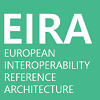

:lang: no
:doctitle: Introduksjon til EIRA
:keywords: EIRA

include::../plattform_felles/includes/commonincludes.adoc[]

European Interoperability Reference Architecture (EIRA) er en innholdsmodell som definerer metamodeller med de mest sentrale arkitekturbyggeklossene som behøves for å  bygge interoperable systemer i offentlig sektor. Modellene er dokumentert i Archimate.

Se https://joinup.ec.europa.eu/solution/eira for mer generell informasjon om EIRA.

I arbeidet med Nasjonal arkitektur i Norge ønsker en å benytte begrepsapparat og arkitekturbyggeklosser fra EIRA så langt som mulig.