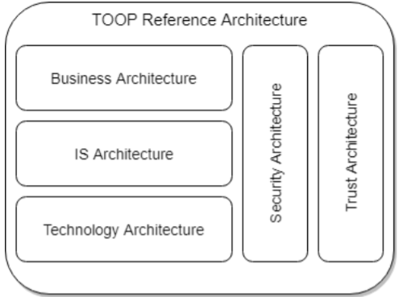

:lang: no
:doctitle: Introduksjon til _TOOP Reference Architecture_ (TOOPRA) 
:keywords: TOOP

include::../plattform_felles/includes/commonincludes.adoc[]

_Generic Federated OOP Architecture_ er en generisk referansearkitektur fra EU som er tatt fram for å støtte offentlige virksomheter i å realisere "the once only principle" (OOP) på tvers av landegrensene. OOP-arkitekturen kan også benyttes internt i hvert land.

Andre betgnelser på denne referansearkitekturen er _OOP-arkitekturen_ er TOOPRA 

_OOP-arkitekturen_ samsvarer med EIF og EIRA.Dette er overordnede,  eksisterende rammeverk og referansearktektur.

_OOP-arkitekturen_  er beskrevet på samtlige arkitekturlag i TOGAF, dvs. forretning, data. applikasjon og teknologi, med ulike visninger (_views_) med utgangspunkt i TOGAf og Archimate som modelleringsspråk.

NOTE: TOOP adresserer også sikkerhetsarkitektur og tillitsarkitektur. 

Lenker til mer informasjon om TOOPRA:

1. link:http://www.toop.eu/sites/default/files/D23_Generic_Federated_OOP_Architecture_3rd_version.pdf[Generic Federated OOP Architecture 3rd version (pdf)]

2. link:http://wiki.ds.unipi.gr/display/TOOPRA[wiki for TOOPRA]

3. link:https://github.com/TOOP4EU/toop-goopra-models[TOOPRA Archimate-modeller som kan lastes ned via _Archi collaboration plugin_]

Lenker til mer om TOOPog SDGR:

a. link:http://toop.eu/[Hjemmeside for TOOP]

b. link:http://toop.eu/node/280[Informasjon om TOOP i sammenheng med Single Digital Gateway Regulation (SDGR]

    