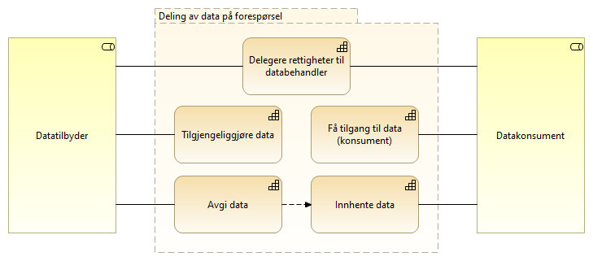
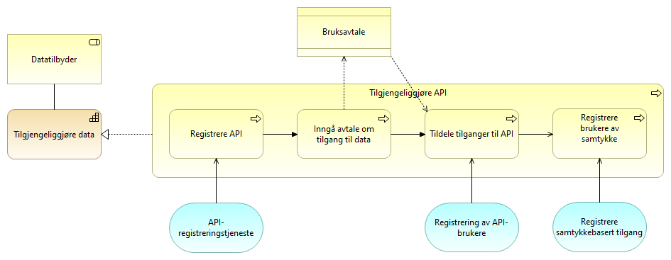
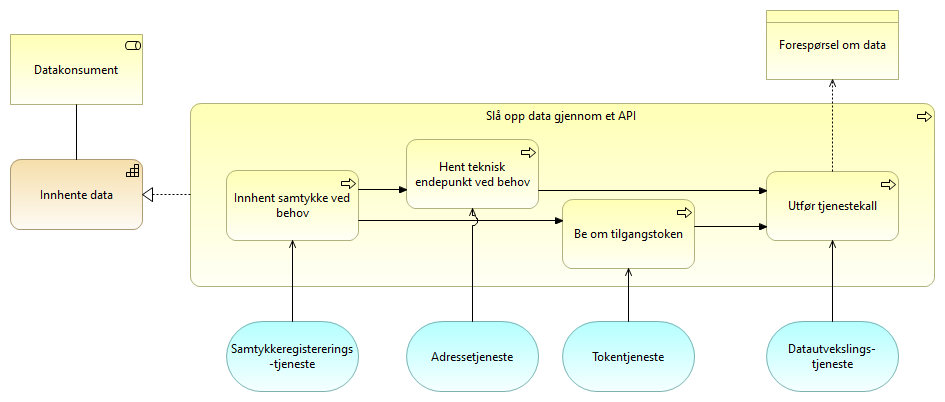

:lang: no
:doctitle: Generisk mønster for spørring og oppslag
:keywords: Referansearkitekturer

include::../plattform_felles/includes/commonincludes.adoc[]

//:erik2:

== Om dette mønsteret

_Generisk mønster for spørring og oppslag_ adresserer området _Deling av data på forespørsel_ og omhandler tilgjengeliggjøring av data og oppslag i data, som sett fra henholdvis datatilbyder og datakonsument.

Mønsteret dekker både asynkrone og synkrone oppslag, og det tas ikke stilling til kommunikasjonsprotokoll. 

Referansearkitekturen dekker både sikrede API-er og API-er som tilbyr åpent tilgjengelige data uten tilgangsbegrensninger. Begrepet API benyttes her i betydningen av et maskingrensesnitt som gir tilgang til data og funksjoner fra et system uavhengig av teknologi.

Dette mønsteret gir videre ingen begrensninger i hva slags informasjon det gjelder, om det er strukturerte eller ustrukturerte data, eller hva data skal brukes til. Tilbyder og konsument av data kan være på tvers av virksomheter eller innenfor samme virksomhet.

Eksempler på bruk:

* Oppslag i et felles dataregister, f.eks. Folkeregisteret.
* Oppslag av data hos en annen virksomhet .
* Oppslag av data i egen virksomhet.

== Kapabilitetskart - relevante kapabiliteter
Modellen under viser hovedinndelingen i kapabiliteter en tilbyder og en konsument må ha for å dele data gjennom tilgangsstyrte API-er. Dette er en delmengde av det større området som omhandler _Deling av data på forespørsel_. 

.Kapabiliteter, deling av data på forespørsel

Tilbyder må kunne tilgjengeliggjøre data og dette er delt i to kapabiliteter:

* _Tilgjengeliggjøre data_ omhandler hvordan man registerer API og setter opp tilganger. 
* _Avgi data_ omhandler den operative delingen av data fra tilbyder.

Tilsvarende er det to detaljerte kapabiliteter tilknyttet konsument og det å innhente data: 

* _Få tilgang til data_ består av prosesser for oppsett av tilgang.
* _Innhente data_ er det konsumenten må gjøre hver gang det gjøres et oppslag.

I tillegg kan begge parter ha kapabiliteten:

* _Delegering av rettigheter til databehandler_ må gjøres dersom en av partene benytter seg av en databehandler.

[cols ="1,3", options="header"]
.Elementer i view for Kapabiliteter, forespørsel-svar
|===

| Element
| Beskrivelse

| Tilgjengeliggjøre data
| Evnen til å gjøre data tilgjengelig for aktører utenfor egen virksomhet.

| Innhente data
| Evnen til å innhente data fra en annen aktør.

| Avgi data
| Evne til å avgi data på forespørsel. Kan omfatte tilgangsstyring.

| Delegering av rettigheter til databehandler
| Evnen til å delegere rettigheter til databehandler som utfører oppgaver på vegne av behandlingsansvarlig.

| Få tilgang til data (konsument)
| Evnen til å skaffe seg tilgang til tilbudte data fra annen aktør. 

| Konsument
| Den som konsumerer data.

| Tilbyder
| En aktør som tilbyr data til eksterne parter, enten på vegne av andre, som forvalter av data eller som dataansvarlig.

|===

NOTE: Mer informasjon om kapabilitetskart og nedbrytingen av overordnede temaområder og kapabiliteter finnes under link:../nab_arkitekturlandskap[Nasjonalt arkitekturlandskap]. Her finnes _Deling av data på forespørsel_ som et eget område under området _Datautveksling_. 

== Arkitekturmønstre (konseptuelle beskrivelser, kun arkitekturbyggeklosser)

Her beskrives realiseringen av de aktuelle kapabilitetene.

Beskrivelsene er forsøkt å holde helt generisk uten å peke til noen løsning og det vil dermed kunne være flere måter å realisere de ulike elementene på.

=== Klargjøring for _deling av data på forespørsel_

==== Tilgjengeliggjøre data

Tilgjengeliggjøring av API gjøres av tilbyder av data og er det tilbyder må gjennomføre for å gjøre et API synlig og tilgjengelig gjennom kataloger og søkeløsninger. Registrering av konsumenters rettigheter og tilganger inngår også som et prosessteg. 

Dersom det er registrering av et åpent API, er det kun relevante prossessteg som utføres.

[cols ="1,3", options="header"]
.Elementer i view for Tilgjengeliggjøre data
|===

| Element
| Beskrivelse

| Bruksavtale
| Avtale om tilgang til og bruk av data. Dette kan for eksempel være en bilateralt utformet avtale, aksept av generelle bruksvilkår eller lisens for bruk av åpne data.

| Tilbyder
| En aktør som tilbyr data til eksterne parter, enten på vegne av andre, som forvalter av data eller som dataansvarlig.

| Tilgjengeliggjøre data
| Evnen til å gjøre data tilgjengelig for aktører utenfor egen virksomhet.

| Tilgjengeliggjøre API
| Prosessen med å tilby data gjennom et API til aktører utenfor egen virksomhet.

| Inngå avtale om tilgang til data
| Prosess for å inngå avtale om tilgang og bruk av data.

| Tildele tilganger til API
| Prosessen med å registrere hvilke databrukere som skal få tilgang til et API.

| Registrere API
| Prosessen med å registere et API i relevante tjenester, API-katalogen, Maskinporten, Kapabilitetsoversikt.

| API-registreringstjeneste
| Tjeneste for å registerer de API-ene man ønsker å tilby til konsumenter og egenskaper ved disse.

| Regisstrering av API-brukere
| Tjeneste for gjennom selvbetjening å registrere og vedlikeholde tilgangene konsumenter skal ha til API-er og scopes.

|===

==== Få tilgang til data
_Få tilgang til API_ er det en konsument av data må gjøre for å få tilgang til data gjennom et API. Det omfatter å få kjennskap til aktuelt API, inngå avtale om bruk av data, samt å registrere den tekniske komponenten som skal utføre tjenestekallet. Dersom det dreier seg om tilgang til et _åpent tilgjengelig_ API, kan enkelte delaktiviteter i prosessene hoppes over.

image:../nab_referanse_arkitekturer_forespørsel-svar-generisk/media/ABB_Tilgang.png[alt="Bilde mangler", width=750,link=https://nasjonal-arkitektur.github.io/nab_modeller_html-hovedbibliotek/e7e6c527-26f4-461c-b4dd-651fcbe85c8d/views/6c5a004d-da35-4fce-b38d-4b09d1167201.html]

[cols ="1,3", options="header"]
.Elementer i view for Få tilgang til data
|===

| Element
| Beskrivelse

| Få tilgang til data (konsument)
| Evnen til å skaffe seg tilgang til tilbudte data fra annen aktør. 

| Konsument
| Den som konsumerer data.

| Bruksavtale
| Avtale om tilgang til og bruk av data. Dette kan for eksempel være en bilateralt utformet avtale, aksept av generelle bruksvilkår eller lisens for bruk av åpne data.

| Få tilgang til API
| Prosessen med å skaffe seg tilgang til tilbudte data fra annen aktør. Omfatte å finne API-er, inngå nødvendige avtaler og få tilganger.

| Inngå avtale om tilgang til data
| Prosess hvor konsumenten inngår eventuell avtale med tilbyder om tilgang til data.

| Registrer klient med tildelt tilgang
| Prosess for konsument å registerere (provisjonering av) den klienten som skal ha tilgang til API-et ved bruk av sikkerhetsbillett. Dette forutsetter at konsumenten har avtale om bruk av sikkerhetsbillettjenesten og at tilbyder har gitt konsumenten tilgang.

Dersom det er en leverandør som har blitt delegert rettigheter som databehandler på vegne av konsument er det leverandøren som registrer sin klient.

| Finne/få kjennskap til API
| Prosessen med å finne eller få kjennskap til tilgjengelige API-er gjennom relevante kataloger og søkeløsninger.

| API-søk
| Tjeneste for å søke etter og finne tilgjengelige API-er

| Registreringstjeneste for API-brukere
| Tjeneste for å registrere klienter som skal ha tilgang til et gitt API.

|===

==== Delegere rettigheter til databehandler
Delegering av rettigheter til databehandler er det en konsument må gjøre for at en leverandør kan identifisere seg med sitt eget virksomhetssertifikat og opptre på vegne av konsumenten som er den som innehar behandlingsgrunnlaget for å innhente data.

image:../nab_referanse_arkitekturer_forespørsel-svar-generisk/media/ABB_Delegering.png[alt="Bilde mangler", width=500,link=https://nasjonal-arkitektur.github.io/nab_modeller_html-hovedbibliotek/e7e6c527-26f4-461c-b4dd-651fcbe85c8d/views/7ad70658-c174-4da3-95e1-b0628688bcc1.html]

[cols ="1,3", options="header"]
.Elementer i view for Delegere rettigheter til databehandler (copy)
|===

| Element
| Beskrivelse

| Delegering av rettigheter til databehandler
| Evnen til å delegere rettigheter til databehandler som utfører oppgaver på vegne av behandlingsansvarlig.

| Samhandlingsaktør
| Den som inngår i en samhandlingsprosess og samhandler med en annen samhandlingsaktør. Kan være en tilbyder, konsument, avsender, mottaker, leverandør etc.

| Tjenesteavtale
| Avtale mellom leverandør og konsument som er grunnlaget for å kunne delegere rettigheter fra konsument til en leverandør

| Delegering av rettigheter til databehandler (leverandør)
| Prosessen med å delegere rettigheter til databehandler/leverandør.

| Inngå avtale med leverandør
| Prosessen med å inngå en avtale med leverandør. En slik avtale vil normalt være inngått tidligere og uavhengig av om man skal ta i bruk et nytt API. En tjenesteavtale med leverandør er en forutsetning forutsetning for å kunne delegere en tilgang.

| Registrere delegert tilgang
| Prosessen med å delegere tilganger. I tilknytning til eOppslag vil formålet være å gi leverandør tilgang til å representere konsument overfor et API, men registreringen vil potensielt også kunne gjelde for andre områder.

| Registering av representasjonsforhold
| Tjeneste for å registrere et representasjonsforhold som gir leverandør mulighet til å opptre på vegne av konsument

|===

=== Utveksling av data

==== Innhente data
Slå opp data gjennom et API er det en konsument må gjøre når det utføres et tjenestekall for å innhente data gjennom et API. Dersom det er et åpent API er det kun relevante prossessteg som utføres.

[cols ="1,3", options="header"]
.Elementer i view for Innhente data
|===

| Element
| Beskrivelse

| Adressetjeneste
| Tjeneste som gir mulighet til å slå opp teknisk endepunkt

| Tokentjeneste
| Tjeneste som utsteder sikkerhetsbilletter. Sikkerhetsbillett utstedes basert på tildelte rettigheter og eventuelle representasjonsforhold.

| Innhente data
| Evnen til å innhente data fra en annen aktør.

| Forespørsel om data
| Forespørsel om data med parametetere i forespørselen, sikkerhetsbillett mv.

| Datautvekslings-tjeneste
| Tjeneste for utveksling av data. Samme som data exchange service. Benyttes av avsender og mottaker for transport av meldinger.

| Slå opp data gjennom et API 
| Prosessen med lå opp og hente data gjennom et API.

| Be om tilgangstoken
| Prosessen med å benytte en sikkerhetsbillettjeneste for hente en sikkerhetsbillett som gir tilgang til et API. Dette forutsetter at alt er registert og satt opp riktig mot de aktuelle tjenestene.

| Utfør tjenestekall
| Prosessen med å benytte (gjøre et oppslag mot) et eksternt API.

| Hent teknisk endepunkt ved behov
| Prosessen å slå opp den tekniske adressen til et API før spørring mot API-et. Gjøres kun dersom det er nødvendig.

| Innhent samtykke ved behov
| Prosess for å innhente samtykke fra person eller virksomhet som grunnlag for å innhente data. Dette gjøres kun ved behov.

| Datakonsument
| Den som innhenter eller mottar data fra andre aktører.

| Samtykkeregistererings-tjeneste
| Tjeneste for å innhente samtykke fra den registrert som dataene gjelder. Dette kan være en person eller en virksomhet.

|===

==== Avgi data
Avgi forespurte data er det tilbyder av data må gjøre for å svare på en forespørsel. Prosessen kontrollere tilgang gjøres kun dersom det er enakk om å avgi data gjennom et sikret API.

image:../nab_referanse_arkitekturer_forespørsel-svar-generisk/media/ABB_Avgi.png[alt="Bilde mangler", width=500,link=https://nasjonal-arkitektur.github.io/nab_modeller_html-hovedbibliotek/e7e6c527-26f4-461c-b4dd-651fcbe85c8d/views/c993199e-3879-4f72-967d-4339159f6641.html]

[cols ="1,3", options="header"]
.Elementer i view for Avgi data
|===

| Element
| Beskrivelse

| Avgi data
| Evne til å avgi data på forespørsel. Kan omfatte tilgangsstyring.

| Tilbyder
| En aktør som tilbyr data til eksterne parter, enten på vegne av andre, som forvalter av data eller som dataansvarlig.

| Svar på forespørsel
| Informasjonen som avgis til konsument som svar på en forespørsel.

| Avgi forespurte data gjennom API
| Prosessen med å avgi data på forespørsel gjennom et egnet API.

| Motta  forespørsel om oppslag
| Prosessen med å motta forespørsler fra API-konsument om å avgi data.

| Kontroller tilgang
| Prosessen med kontroll og håndheving av konsumentens rettigheter til å få forespurte data. I tillegg til "validering av sikkerhetsbillet", kan det være behov for kontroll mot virksomhetsinterne policies.

| Avgi data
| Prosessen med å gi svar på forespørselen.

| Autentisere konsument
| Prosessen med å autentisere en konsument.

| Tilgangskontroll-tjeneste
| Tjeneste for å sjekke rettigheter til data. Kan være eksterne eller interne tjenester.
Eksempler på rettigheter kan komme av samtykker fra person eller virksomhet, eller rollebasert fra vergemål, familierelasjon el.

| Autentiseringstjeneste
| Tjeneste som benyttes av tilbyder for å validere og kontrollere autentisiteten til et OAUTH2 token fra Maskinporten

| Datautvekslings-tjeneste
| Tjeneste for utveksling av data. Benyttes av avsender/tilbyder og mottaker/konsument for transport av data.

| Datautvekslings-tjeneste
| Tjeneste for utveksling av data. Benyttes av avsender/tilbyder og mottaker/konsument for transport av data.

| Forespørsel
| Informasjon om det som forespørres.

| Autentiseringsdata
| Data som autentiserer konsument, f.eks. digitalt sertifikat eller sikkerhetsbillett.

| Autorisasjonsdata
| Data som autoriserer konsument, f.eks. påstander i en sikkerhetsbillett.

|===

//// 
erik, andre notater: 

Bør vi ikke ha noe om logging?

Bør vi ikke peker på en fellesløsning (burde vært Altinn autorisasjon) også uten at det dreier seg om delegering? Kreveren oppdatering av kapabilitetskartet med en kapabilitete for autirsasjon

Begrepskapittel? Erik!!!!!

+ VI BØR HA SEPARAT BESKRIVELSE AV hvordan  referansearkitekturene inngår i samhandlingsprosesser  

1. Få på plass Eriks "gamle" figurer av overordnede beskrivelser i riktig Archi-bibliotek (påbegynt)

2. Fikse symboler og størrelsen på bokser og  "transiente farger"(påbegynt). OK

3. Fikse navn vs. label med linebreak osv.OK

4. Publisere Archi-html  (gjort) OK
5. Legge til lenker fra asciidoc-figurene til de publiserte archi-figurene OK

6.Fixe opp i diverse layout-grums i modellene ??????

7. Introduser egne service realization viewpoints per business service der detaljer om input/output og mapping til løsninger vises!!

småtteri  huskelap:
5. Rett opp fra default height 67 tli 70 i https://doc.difi.no/nasjonal-arkitektur/plattform_praktiske-tips/#_installer_og_konfigurer_archi 

////