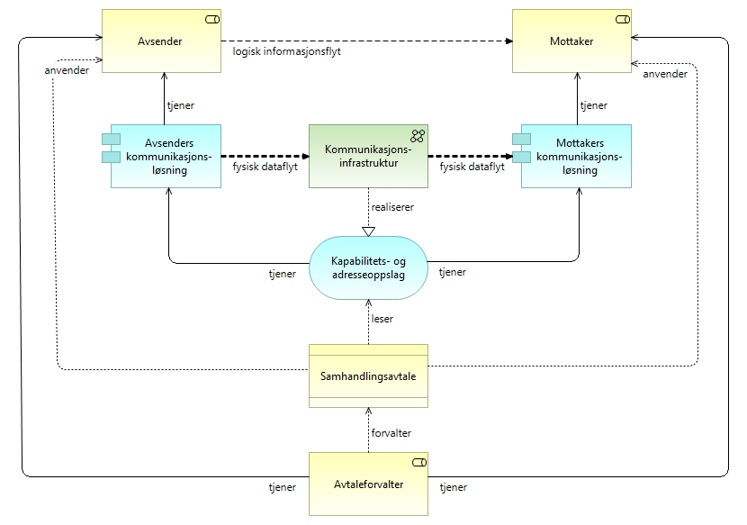
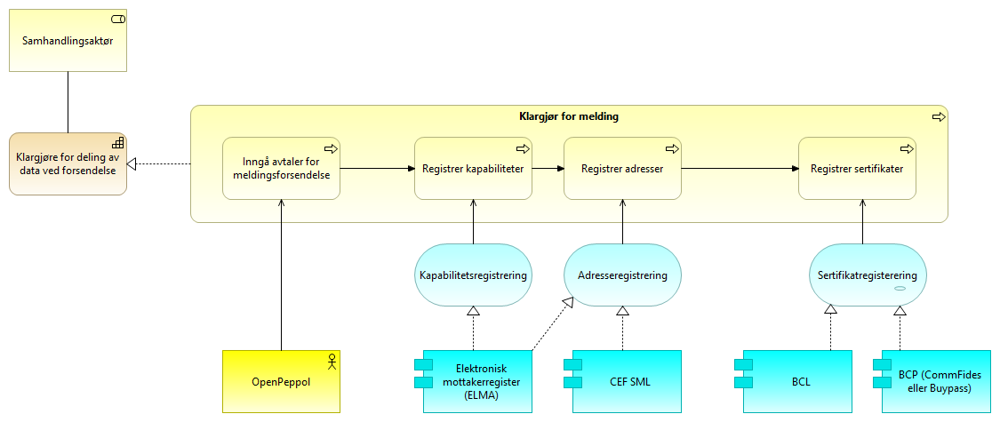
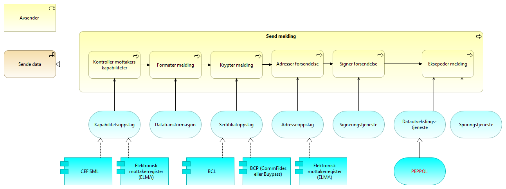
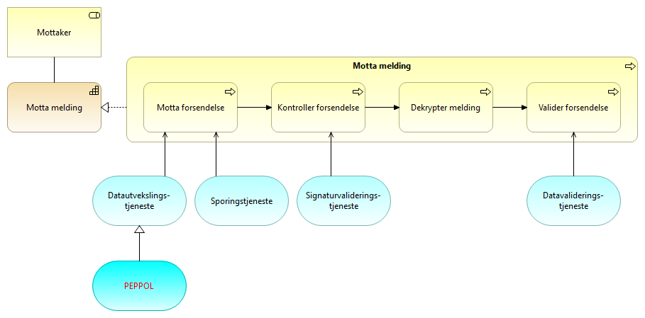

:lang: no
:doctitle: Generisk meldingsforsendelse
:keywords: 
:toclevels: 4

include::../plattform_felles/includes/commonincludes.adoc[]

[.lead]
Det mest grunnleggende mønsteret for meldingsutveksling omhandler enkeltvise meldinger fra en avsender til en kjent mottaker

== Introduksjon

//I sin enkleste form handler dette om realisering av informasjonsflyt nellom avsender og mottaker som dataflyt mellom kommunikasjonsløsningene på hver side, i form av meldingsflyt gjennom underliggende infrastruktur for meldingssutveksling. Dette er illustrert i følgende figur.  
__Generisk mønster for meldingsforsendelse til kjent mottaker__ beskriver meldingsutveksling i form av enkeltvise meldinger fra en avsender til en kjent mottaker. De konseptuelle beskrivelsene som gis her danner grunnlag for beskrivelser av mer avanserte og spesialiserte mønstre; men kan også stå på egne ben, med egne løsningsmønstre.

Beskrivelsene skiller mellom 

1. Det konseptuelle arkitekturmønsteret
2. Praktisk anvendelser i form av løsningsmønstre med mer konkret veiledning, f.eks. til bruk av nasjonale fellesløsninger.

== Brukstilfeller
Aktuelle brukstilfeller for __Generisk mønster for meldingsforsendelse til kjent mottaker__:

* melding om hendelser og data mellom to kjente parter i tverrgående forretningsprosesser, f.eks. saksbehandlingsprosesser.

// * melding om hendelser og data  til mellomliggende løsninger for dataformidling

* melding om  hendelser og data til datalagringsløsninger

////
=== Krav til eMelding
include::../nab_referanse_arkitekturer_emelding/krav_eMelding.adoc[]
////

== Grunnleggende konsepter og forutsetninger

=== Logisk og fysisk dataflyt
Følgende arkitekturtegning illustrerer helt grunnleggende konsepter.

.Generisk meldingsforsendelse

Her skilles det mellom forretningsmessig informasjonsflyt mellom partene og den fysiske dataflyten mellom IT-løsningene på hver side.

Det forutsettes altså at det finnes en kommunikasjonsinfrastruktur som det kan sendes meldinger over. I sin enkleste form er dette internett. Det kan også finnes krav til bestemte formater og protokoller i en mer spesialisert meldingsinfrastruktur. 

NOTE: __Et eksempel på dette er beskrevet i referansearkitekturen for eMelding (og anvendelser som i  PEPPOL-infrastrukturen), der det stilles krav til støtte for en standardisert meldingsprotokoll på tvers av alle samhandlingsaktører innenfor et avtalefelleskap (i PEPPOL er det AS4).__   

Selv om avsender kjenner mottaker på forhånd, kan det være aktuelt å slå opp detaljer om mottakers kommunikasjonsløsning i tilknytning til selve forsendelsen. Dette gjøres typisk gjennom run-time oppslagstjenester; her vist som en (konseptuell) tjeneste for __Kapabilitets-og adresseoppslag__.   

=== Aktører og roller
Se under link:../nasjonal_arkitektur\nab_arkitekturlandskap_segmentarkitektur_datadeling_roller[rollebeskrivelser for området datadeling.]

=== Avtaleforvaltning

Det forutsettes at det finnes avtaler mellom avsender og mottaker som ivaretar hensyn til interoperabilitet og informasjonssikkerhet.

Følgende figur illustrerer det generelle konseptet.

.Generisk meldingsforsendelse inkl. avtaleforvaltning

Begrepene Avtaleforvalter og Samhandlingsavtale kan her forstås på ulike måter, avhengig av sammehengen (slik dette også framkommer av mer spesialiserte arkitekturmønstre).

Følgende figur illustrerer dette.

.Former for avtaleforvaltning

Avtaler kan altså gjøres på flere måter:

a. Bilateral avtale, der avtalen registreres direkte hos hver av partene.  

b. Bilateral avtale, der avtalen registreres hos tiltrodd tredjepart (avtaleforvalter).

c. Avtalefellesskap, der avtalen registreres hos tiltrodd tredjepart (avtaleforvalter/fellesskapsforvalter) og der andre aktører eventuelt kan registrere tilsvarende kapabiliteter for sending og mottak.

NOTE: __De konseptuelle beskrivelsene tar høyde for at det kan finnes et avtalefellesskap, men dette er ikke en forutsetning for dette, generiske, arkitekturmønsteret.__

=== Samhandlingsspesifikasjoner
Samhandlingsspesifikasjoner ligger til grunn for samhandlingsavtaler (se foregående avsnitt). For __Generisk mønster for meldingsforsendelse til kjent mottaker_  omfatter dette: 

// Fra Anne Lise - de to første punktene er relevante for mer enn eMelding.

* Tekniske spesifikasjoner: Muliggjør datautveksling mellom systemer. Omfatter transportprotokoller,  meldingsformater, teknisk feilhåndtering, eventuell orkestreringsløsninger, m.m..
* Semantisk spesifikasjoner: Muliggjør utveksling av meningsfull informasjon. Omfatter metadata og datamodeller for aktuelle meldingsformater.
* Organisatorisk: Muliggjør forretningsprosesser på tvers av organsiasjonsenheter og systemer. Omfatter spesifikasjon av meldingsflyt på tvers av delproseser eller prosessteg (koreografi).

I dette (generiske) arkitekturmønsteret, gjøres et minimum av  konkrete spesifikasjoner.

// #TBD: Parametre for kvalitetsegenskaper.#

// #TBD: Referansemodell som viser tekniske protokollag (applikasjon/forretning/transport/...).#

Følgende presiseres spesielt:

WARNING: Dersom det skal utveksles meldinger i noen form for sammenhengende prosess, kreves en løsning for korrelering av meldinger. Det forutsettes her at det avtales en meldingsprotokoll på applikasjonslaget for dette med en parameter kalt "ConversationId" eller tilsvarende.

== Kapabilitetskart - relevante kapabiliteter

Modellen under viser hovedinndelingen i kapabiliteter for meldingsforsendelse mellom  en avsender og en mottaker.

.Kapabiliteter - meldingsforsendelse

[cols ="1,3", options="header"]
.Elementer i view, Kapabiliteter for generisk meldingsforsendelse

|===

| Element
| Beskrivelse

| Avsender 
| Den som sender en elektronisk melding eller tilsvarende.

| Mottaker
| Den som mottar en elektronisk melding eller tilsvarende.

| Klargjøre for deling av data ved forsendelse
| Evne til å klargjøre for meldingsutveksling med eksterne parter.

| Sende data
| Evnen til å sende data til en mottaker.

| Motta data
| Evnen til å motta en en forsendelse fra en avsender.

|===

Realiseringen av disse kapabilitetene er beskrevet i det følgende; først konseptuelt, så med løsningsspefikke eksempler eller anbefalinger. 

== Konseptuelle beskrivelser (arkitekturbyggeklosser)

=== Klargjøring for meldingsforsendelse

Modellen under detaljerer hvordan en samhandlingsaktør, som i dette tilfellet normalt vil være en avsender eller mottaker, blir klar for å sende data som en melding. Dette gjøres ved å inngå nødvendige avtaler for meldngsforsendelse og registrere nødvendige data i registre som er tilgjengelig for de andre samhandlingsaktørene i fellesskapet. Det vil kunne være forskjeller på hva som er nødvendig å gjøre avhengig av om samhandlingsaktøren er en avsender eller mottaker, men normalt vil man inneha begge roller i fellesskapet.

.Klargjør for melding (arkitekturmønster)

Forklaring til figur:

[cols ="1,3", options="header"]
.Elementer i view for Klargjør for melding (arkitekturmønster)
|===

| Element
| Beskrivelse

| Samhandlingsaktør
| Samlebetegnelse på roller som inngår i en samhandlingsprosess og samhandler med en annen samhandlingsaktør. Kan være en tilbyder, konsument, avsender, mottaker, leverandør etc.

| Klargjøre for deling av data ved forsendelse
| Evne til å klargjøre for meldingsutveksling med eksterne parter.

| Interoperability specification
| Spesifikasjoner for hvordan man samhandler i et fellesskap. Dette kan være meldingsformater, krav til tekniske komponenter etc.

| Samhandlingsavtale 
| Avtale som regulerer forhold tilknyttet samhandlingen mellom to parter, eller deltakerne ie et fellesskap for meldingsutveksling.

| Kapabilitetsbeskrivelse
| Strukturert beskrivelse av evner og kapabiliteter relevante for samhandling i fellesskapet

| Mottakeradresse
| Teknisk adresse for hvor meldinger skal sendes. Dette kan være adressen til mottaker direkte eller mottakers integrasjonspunkt.

| Mottakersertifikat
| Offentlig nøkkel benyttes for kryptering og validering av signatur.

Privat nøkkel benyttes til dekryptering og signering av meldinger.

| Avsendersertifikat
| Offentlig nøkkel benyttes for kryptering og validering av signatur.

Privat nøkkel benyttes til dekryptering og signering av meldinger.

| Klargjør for melding
| Prosessen med å klargjøre for melding ved å  inngå nødvendige avtaler og tilgjengeliggjøre nødvendig informasjon til andre samhandlingsaktører.

| Inngå avtaler for meldingsforsendelse
| Prosessen med å inngå bilaterale avtaler med sammhandlingsparter eller innmelding i et fellesskap. F.eks. gjennom å akseptere spesifikke avtaler, vilkår eller kontrakter og innrette seg etter reglene og forpliktelsene som gjelder i et fellesskap (community), eller det som er avtalt mellom samhanslingsaktørene.

| Registrer kapabiliteter
| Registering av kapabiliteter vil si å tilgjengeligjøre for avsendere og konsumenter hvilke meldinger og formater man kan motta og hvilke ressurser og tjenester man tilbyr.

| Registrer adresser
| Med adresse menes nødvendig informasjon for å få tilgang til tjenester fra tilbyder eller for å sende melding til mottaker av meldinger. 

| Registrer sertifikater
| Tilgjengeliggjøre for samhandlende parter sertifikater for bruk ved forsendelser. Dette kan være generelle eller domenespesifikke sertifikater. Eventuelt spesifikt for enkelet forretningsområder. 

Sertifikater må forvaltes og fornyes etter gjeldende regler for å være gyldige og egnet for bruk. 

| Kapabilitetsregistrering
| Tjeneste for å registrere kapabiliteter

| Adresseregistrering
| Tjeneste for å registrere adresse for å sende melding til mottaker.

| Sertifikatregisterering
| Tjeneste for å registrere serifikater i felles katalogtjeneste.

|===

=== Operativ meldingsforsendelse

==== Send melding
Her beskrives en referansemodell for operativ meldingsforsendelse. Merk: Enkelte prosessteg kan være uaktuelle, avhengig av dataene som utveksles og spesifikasjonene for samhandling innen et eventuelt _avtalefellesskap_.

.Send melding (arkitekturmønster)
image::../nab_referanse_arkitekturer_meldingsutveksling_generisk/media/Send melding (arkitekturmønster).png[alt=Send eMelding (arkitekturmønster) image]

Forklaring til figur:

[cols ="1,3", options="header"]
.Elementer i view for Send melding (arkitekturmønster)
|===

| Element
| Beskrivelse

| Avsender 
| Den som sender et brev, en pakke, en e-post, en elektronisk melding, en SMS eller lignende.

| Sende data
| Evnen til å sende data til en mottaker.

| Meldingsinnhold
| Meldingsinnholdet eller informasjonen som skal sendes til ekstern part. 

| Mottakersertifikat
| Offentlig nøkkel benyttes for kryptering og validering av signatur.

Privat nøkkel benyttes til dekryptering og signering av meldinger.

| Mottakeradresse
| Teknsik adresse til hvor meldinger skal sendes.

| Avsendersertifikat
| Offentlig nøkkel benyttes for kryptering og validering av signatur.

Privat nøkkel benyttes til dekryptering og signering av meldinger.

| Forsendelse
| Den pakken som sendes til mottaker. Inkluderer forretningsmelding, metadata, adresse etc.

| Send melding
| Prosessen med å sende en eMelding til en mottaker ved hjelp av fellestjenester.

| Kontroller mottakers kapabiliteter
| Prosess for å slå opp og kontrollere mottakers evner til samhandling innenfor fellesskapet.

| Formater melding
| Prosess for å tilpasse informasjonspakken til mottakers kapabiliteter og fellesskapets standarder.

| Krypter melding
| Prosess med å sikre forsendelsen. Inkluderer konfidensialitets- og integritetssikring der dette er nødvendig. Normalt gjøres dette ved hjelp av kryptografi og sertifikater.

| Adresser forsendelse
| Prosess med å adressere forsendelsen. Dette kan være til mottaker direkte eller til dennes representant eller aksesspunkt.

| Signer forsendelse
| Prosessen med å signere meldingen som sendes til mottaker. Til dette benyttes eget sertifikats private nøkkel.

| Eksepeder melding
| Prosessen med å sende melding til mottaker.

| Kapabilitetsoppslag
| Tjeneste for å slå opp kapabilitetene til en samhandlingspart

| Datatransformasjon
| Tjeneste for  transformere data og meldinger til andre formater.

| Sertifikatoppslag
| Tjeneste for å hente krypteringssertifkat til mottaker.

| Adresseoppslag
| Tjeneste for å slå opp adressen til en mottaker.

| Signeringstjeneste
| Tjeneste for å signere en elektronisk melding. For eMelding er det signatur i form av elektronisk segl som er mest relevant.

| Datautvekslings-tjeneste
| Tjeneste for utveksling av data. Samme som data exchange service. Benyttes av avsender og mottaker for transport av meldinger.

| Sporingstjeneste
| Tjeneste for sporing (audit) av meldinger.

|===

==== Motta melding
Motta melding detaljerer prosessen med å motta en melding etter klargjøring for forsendelse. Alle stegene i prosessen vil ikke alltid være nødvendig avhengig av dataene som utveksles og spesifikasjonene for samhandling innen fellesskapet.

.Motta melding (arkitekturmønster)
image::../nab_referanse_arkitekturer_meldingsutveksling_generisk/media/Motta melding (arkitekturmønster).png[alt=Motta melding (arkitekturmønster) image]

Forklaring til figur:

[cols ="1,3", options="header"]
.Elementer i view for Motta melding (arkitekturmønster)
|===

| Element
| Beskrivelse

| Mottaker
| Den som mottar en melding.

| Motta melding
| Evnen til å motta, validere og kvittere for mottatte meldinger.

| Forsendelse
| Den pakken som sendes til mottaker. Inkluderer forretningsmelding, metadata, adresse etc.
| Avsendersertifikat
| Offentlig nøkkel benyttes for kryptering og validering av signatur.

Privat nøkkel benyttes til dekryptering og signering av meldinger.

| Mottakersertifikat
| Offentlig nøkkel benyttes for kryptering og validering av signatur.

Privat nøkkel benyttes til dekryptering og signering av meldinger.

| Motta melding
| Prosessen med å motta melding. Består av flere delprosesser.

Etter mottak må mottaker følge opp og håndtere innholdet i meldingen.

| Motta forsendelse
| Prosessen med å motta en melding fra avsender

| Kontroller forsendelse
| Prosessen med å kontrollere om forsendelsen er autentisk og fra en legitim avsender.

| Dekrypter melding
| Prosessen med å dekryptere mottatt melding. 

| Valider forsendelse
| Prosessen med å kontrollere om innholdet i en forsendelse er i henhold til avtale og avtalte formater.

| Datautvekslings-tjeneste
| Tjeneste for utveksling av data. Samme som data exchange service. Benyttes av avsender og mottaker for transport av meldinger.

| Sporingstjeneste
| Tjeneste for sporing (audit) av meldinger.

| Signaturvaliderings-tjeneste
| Tjeneste for å validere og verifisere elektronsike signaturer. I forbindelse med eMelding er det kontroll av elektronisk segl som er mest relevant.

| Datavaliderings-tjeneste
| Tjeneste for å validere meldinger mot format og forventet innhold.

|===

////
:leveloffset: +1

=== Klargjør for deling av data ved forsendelse (eMelding)

.Klargjør for eMelding (løsningsmønster)

Forklaring til figur:

[cols ="1,3", options="header"]
.Elementer i view for Klargjør for forsendelse SBB
|===

| Element
| Beskrivelse

| Klargjøre for deling av data ved forsendelse
| Evne til å klargjøre for meldingsutveksling med eksterne parter.

| Samhandlingsaktør
| Samlebetegnelse på roller som inngår i en samhandlingsprosess og samhandler med en annen samhandlingsaktør. Kan være en tilbyder, konsument, avsender, mottaker, leverandør etc.

| Klargjøre for meldingsutveksling
| Prosessen med å klargjøre for eMelding ved å akseptere felles avtaler og tilgjengeliggjøre nødvendig informasjon til andre samhandlingsaktører.

| Foreta innmelding i fellesskap
| Akseptere vilkår for og innrette seg etter reglene og forpliktelsene som gjelder i et fellesskap (community) gjennom å f.eks. signere en avtale eller kontrakt. Dette kan omfatte merkantile forhold.

| Registrer kapabiliteter
| Registering av kapabiliteter vil si å tilgjengeligjøre for avsendere og konsumenter hvilke meldinger og formater man kan motta og hvilke ressurser og tjenester man tilbyr.

| Registrer adresser
| Med adresse menes nødvendig informasjon for å få tilgang til tjenester fra tilbyder eller for å sende melding til mottaker av meldinger. 

| Registrer sertifikater
| Tilgjengeliggjøre for samhandlende parter sertifikater for bruk ved forsendelser. Dette kan være generelle eller domenespesifikke sertifikater. Eventuelt spesifikt for enkelet forretningsområder. 

Sertifikater må forvaltes og fornyes etter gjeldende regler for å være gyldige og egnet for bruk. 

| CEF SML
| Service Metadata Locator

| BCP
| Business Certificate Publisher

| Sertifikatregisterering
| Tjeneste for å registrere serifikater i felles katalogtjeneste.

| Adresseregistrering
| Tjeneste for å registrere adresse for å sende melding til mottaker.

| Kapabilitetsregistrering
| Tjeneste for å registrere kapabiliteter

| Elektronisk mottakerregister (ELMA)
| Med ELMA får brukerne dine oversikt over alle virksomheter i Norge som kan motta elektroniske fakturaer i henhold til EHF-standarden. 

| BCL
| Business Certificate Locater

|===

=== Operativ deling av data ved forsendelse (eMelding)

==== Send eMelding

.Send eMelding  (løsningsmønster)

Forklaring til figur:

[cols ="1,3", options="header"]
.Elementer i view for Send melding SBB
|===

| Element
| Beskrivelse

| Avsender 
| Den som sender et brev, en pakke, en e-post, en elektronisk melding, en SMS eller lignende.

| Send melding
| Prosessen med å sende en eMelding til en mottaker ved hjelp av fellestjenester.

| Kontroller mottakers kapabiliteter
| Prosess for å slå opp og kontrollere mottakers evner til samhandling innenfor fellesskapet.

| Eksepeder melding
| Prosessen med å sende melding til mottaker.

| Formater melding
| Prosess for å tilpasse informasjonspakken til mottakers kapabiliteter og fellesskapets standarder.

| Krypter melding
| Prosess med å sikre forsendelsen. Inkluderer konfidensialitets- og integritetssikring der dette er nødvendig. Normalt gjøres dette ved hjelp av kryptografi og sertifikater.

| Adresser forsendelse
| Prosess med å adressere forsendelsen. Dette kan være til mottaker direkte eller til dennes representant eller aksesspunkt,

| Signer forsendelse
| Prosessen med å signere meldingen som sendes til mottaker. Til dette benyttes eget sertifikats private nøkkel.

| Kapabilitetsoppslag
| Tjeneste for å slå opp kapabilitetene til en samhandlingspart

| Adresseoppslag
| Tjeneste for å slå opp adressen til en mottaker.

| Sending av data
| Evnen til å sende data til en mottaker.

| Sertifikatoppslag
| Tjeneste for å hente krypteringssertifkat til mottaker.

| Datautvekslings-tjeneste
| Tjeneste for utveksling av data. Samme som data exchange service. Benyttes av avsender og mottaker for transport av meldinger.

| Signeringstjeneste
| Tjeneste for å signere en elektronisk melding. For eMelding er det signatur i form av elektronisk segl som er mest relevant.

| Sporingstjeneste
| Tjeneste for sporing (audit) av meldinger.

| Datatransformasjon
| Tjeneste for  transformere data og meldinger til andre formater.

| CEF SML
| Service Metadata Locator

| BCP
| Business Certificate Publisher

| ELMA
| Elektronisk mottakeradresseregister

| BCL
| Business Certificate Locater

| PEPPOL
| 

|===

==== Motta eMelding

.Motta eMelding (løsningsmønster)

Forklaring til figur:

[cols ="1,3", options="header"]
.Elementer i view for Motta melding SBB
|===

| Element
| Beskrivelse

| Motta melding
| Evnen til å motta, validere og kvittere for mottatte meldinger.

| Mottaker
| Den som mottar en melding.

| Motta melding
| Prosessen med å motta melding. Består av flere delprosesser.

Etter mottak må mottaker følge opp og håndtere innholdet i meldingen.

| Valider forsendelse
| Prosessen med å kontrollere om innholdet i en forsendelse er i henhold til avtale og avtalte formater.

| Motta forsendelse
| Prosessen med å motta en melding fra avsender

| Kontroller forsendelse
| Prosessen med å kontrollere om forsendelsen er autentisk og fra en legitim avsender.s

| Dekrypter melding
| Prosessen med å dekryptere mottatt melding. 

| Datautvekslings-tjeneste
| Tjeneste for utveksling av data. Samme som data exchange service. Benyttes av avsender og mottaker for transport av meldinger.

| Sporingstjeneste
| Tjeneste for sporing (audit) av meldinger.

| Signaturvaliderings-tjeneste
| Tjeneste for å validere og verifisere elektronsike signaturer. I forbindelse med eMelding er det kontroll av elektronisk segl som er mest relevant.

| Datavaliderings-tjeneste
| Tjeneste for å validere meldinger mot format og forventet innhold.

| PEPPOL
| 

|===

:leveloffset: -1
////