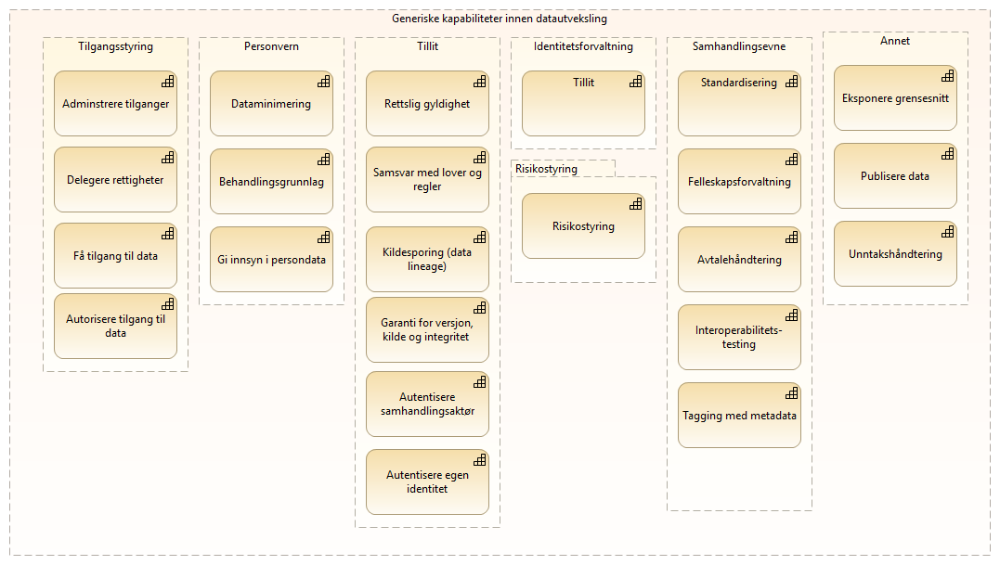

:lang: no
:doctitle: Sammensatte mønstre for datadeling og samhandling
:keywords: 

include::../plattform_felles/includes/commonincludes.adoc[]

image:../plattform_felles/media/i-arbeid.png[width=45, height=45] _I arbeid._

== Introduksjon
TBD.

== Innhenting av tilleggsdata for hendelser
TBD.

== Meldingsutveksling i  tverrgående prosesser
TBD.

////

Tverrgående temaer adresseres her i form av generiske kapabiliteter, dvs. kapabiliterer som er relevante i flere av de spesfikke referansearkitekturene.

Figuren....

.Tverrgående kapabiliteter

[cols ="1,1,3", options="header"]
.Elementer i view for Tverrgåede kapabiliteter
|===

| Element
| Type
| Beskrivelse

| Tverrgående temaer innen datautveksling (utvalg)
| grouping
| 

| Tilgangsstyring
| grouping
| 

| Delegere rettigheter
| capability
| Evne til å delegere en rettighet til en annen aktør feks. en driftslevereandør på en slik måte at dette kan etterprøves.
Registrering og kontroll av representasjonsforhold. Trenger ikke være begrenset til virksomheter men også omfatter f.eks. foreldre-barn relasjon, vergemål, bobestyrer osv.

| Adminstrere tilganger
| capability
| 

| Få tilgang til data
| capability
| Evnen til å skaffe seg tilgang til tilbudte data fra annen aktør. 

| Autorisere tilgang til data
| capability
| 

| Samhandlingsevne
| grouping
| 

| Interoperabilitets-testing
| capability
| 

| Felleskapsforvaltning
| capability
| 

| Avtalehåndtering
| capability
| Evne til å inngå og håndtere avtaler om tilganger, tjenestekvalitet mv. inkludert behandlingsgrunnlag, merkantile forhold og bruksvilkår.

| Tagging med metadata
| capability
| Semantisk interoperabilitet krever 

| Standardisering
| capability
| 

| Risikostyring
| grouping
| 

| Risikostyring
| capability
| 

| Annet
| grouping
| 

| Eksponere grensesnitt
| capability
| 

| Publisere data
| capability
| 

| Unntakshåndtering
| capability
| 

| Personvern
| grouping
| Privacy Service shares the functionalities of storing, securing, anonymising, pseudonymising, rectifying and erasing personal data.

| Dataminimering
| capability
| 

| Behandlingsgrunnlag
| capability
| Evne til å legge frem behandlingsgrunnlag for tilgang til og behandling av data.
Dataminimering

| Gi innsyn i persondata
| capability
| 

| Tillit
| grouping
| 

| Garanti for versjon, kilde og integritet 
| capability
| Garanti for versjon, kilde og integritet

| Samsvar med lover og regler
| capability
| 

| Kildesporing (data lineage)
| capability
| Evnen til å spore opphavet til data og senere håndtering og hendelser.
I arkvisammenheng benyttes ofte begrepet proveniens.

| Rettslig gyldighet
| capability
| https://amagno.co.uk/digitalfilesandrecords/20713/ : 

Legal admissibility refers to whether a court of law would accept a a digital file as a valid piece of evidence in case of a dispute. Even though records can be admissible (i.e. accepted as evidence) the opposing party and their legal counsel may call the evidential weight into question if there are any doubts as to the record’s veracity or integrity.

. Digital files must be accurate, i.e. unaltered representations of the information;

. Digital files must be authentic, i.e. what it purports to be;

. Digital files must not have been tampered with;

. Digital files must be stored in a system that has been secure throughout the file’s lifetime.

| Autentisere samhandlingsaktør
| capability
| 

| Autentisere egen identitet
| capability
| 

| Identitetsforvaltning
| grouping
| 

| Tillit
| capability
| Ref EU Trust services:

* eSignature: Electronic signatures deliver a way to sign documents in the online world, much like one signs a document with a pen in the offline world.

* Time stamping: The date and time on an electronic document which proves that the document existed at a point-in-time and that it has not changed since then

* Electronic seal: The electronic equivalent of a seal or stamp which is applied on a document to guarantee its origin and integrity

* Electronic delivery: A service that, to a certain extent, is the equivalent in the digital world of registered mail in the physical world

* Legal admissibility of electronic documents to ensure their authenticity and integrity

* Website authentication: Trusted information on a website (e.g. a certificate) which allows users to verify the authenticity of the website and its link to the entity/person owning the website

|===

////