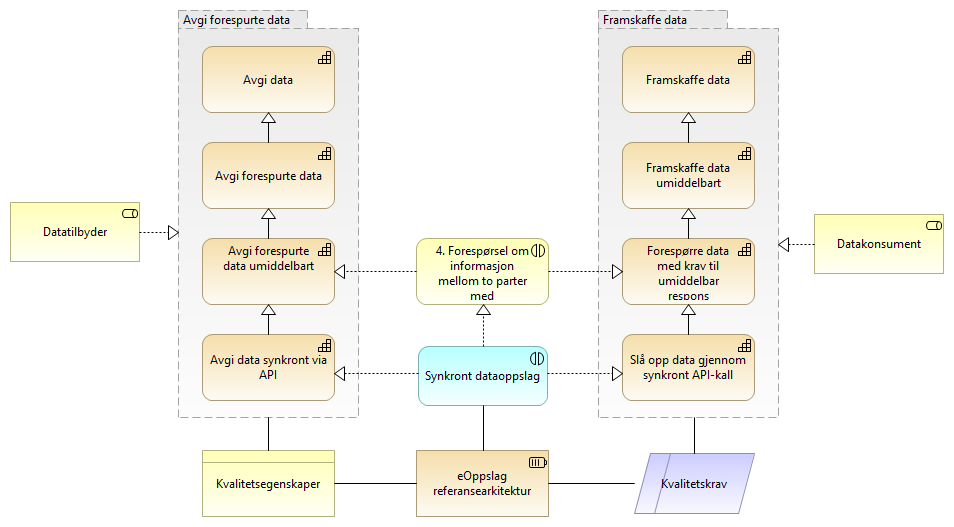
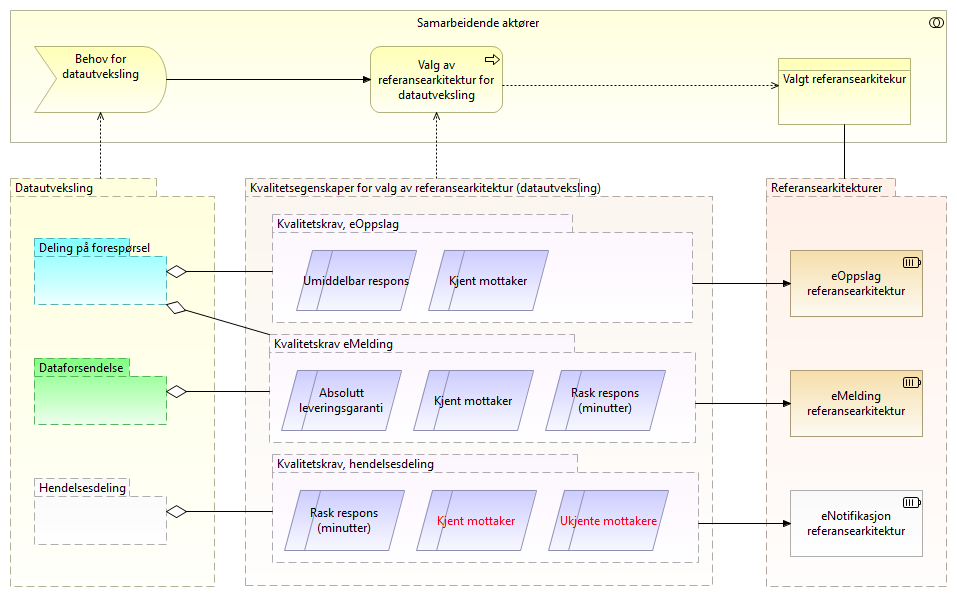

:lang: no
:doctitle: Veiledning til valg av referansearkitekturer 
:keywords: Norsk, arkitekturbibliotek, offenlig sektor, virksomhetsarkitektur, NIF, samhandlingsarkitektur, rammeverk, GitHub

include::../plattform_felles/includes/commonincludes.adoc[]

== Generelt
Referansearkitekturer velges ut fra  behov. Behov uttrykkes i denne sammenhengen i form av krav til kapabiliter og kvalitetsegenskaper. 

For kapabiliteer som krever samhandling med andre parter, benyttes konseptet  _business interaction_ (ref. modelleringsstandarden Archimate) for å knytte sammen samhandlende parter og kapabiliteter på forretninsgmessig nivå. Tilsvarende brukes _application interaction_ eller _technology interaction_ på teknisk nivå.

NOTE: _Business interaction_ tilsvarer begrepet samhandlingsmønster, slik dette tidligere er brukt i tilknytning tli arbeid med referansearkitekturer.

Nedbryting i kapabilitetsområder og videre til mer detaljerte kapabiliteter er gitt i kapittel om [red]#strategi for referansearkitekturer#. 

Oversikt over aktuelle kvalitetsegenskaper finnes i påfølgende kapittel her.

.Figur: Eksempel på sammeheng mellom kapabiliteter, "samhandlingsmønstre" (business interaction og application interaction); her for kapabilitetsområdet __Deling på forespørsel__.

image:../plattform_felles/media/i-arbeid.png[width=75, height=75]Vurder å tilpasse og flytte ovenstpende figur (gjør eksempel til konkret veiledning) 

== Kvalitetsegenskaper - oversikt
Følgende figur viser en oversikt over kvalitetsegenskaper som det kan være aktuelt å vurdere ved evaluering av alternative referansearkitekturer.

.Figur: Kvalitetsegenskaper for referansearkitekturer
image:../nab_referanse_arkitekturer/media/kvalitetsegenskaper-for-valg-av-referansearkitektur-datautveksling.png[]

  

== Valg av referansearkitekturer for datautveksling 

=== Vurdering av kvalitetsegenskaper

.Figur: Vurdering av kvalitetsegenskaper

:leveloffset: +2
= Metode for valg av referansearkitekturer i tverrgående samhandlingsløsninger
image:../plattform_felles/media/i-arbeid.png[width=75, height=75] [red]#Til redigering (begrepet samhandlingsmønster)#

include::./metode-eif-forretningsdrevet.adoc[]

:leveloffset: -2

